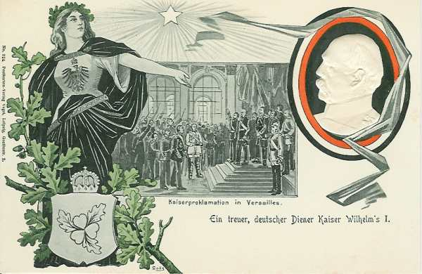
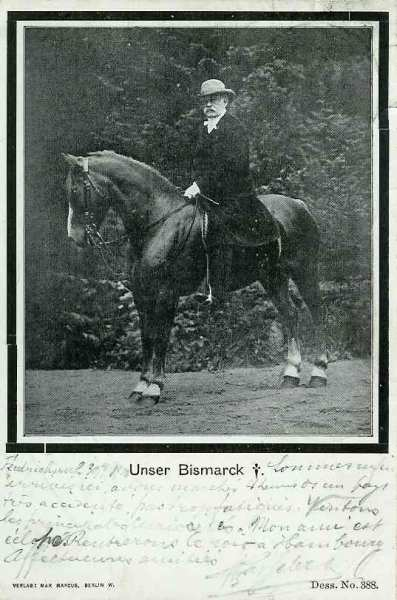
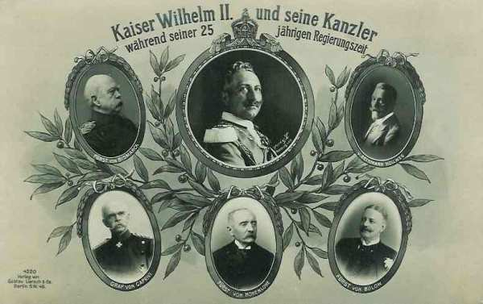
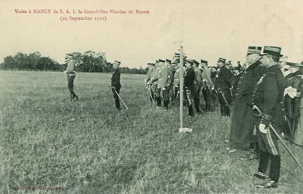
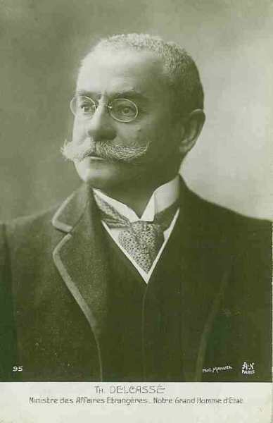
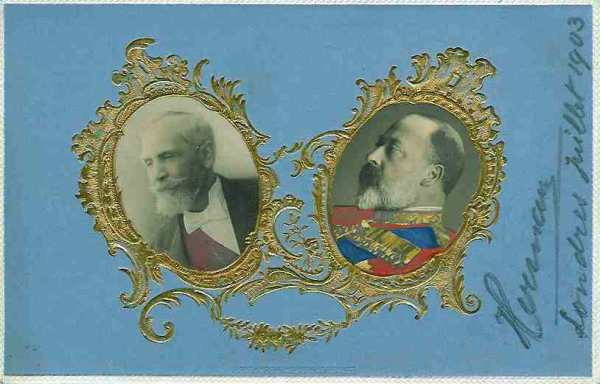
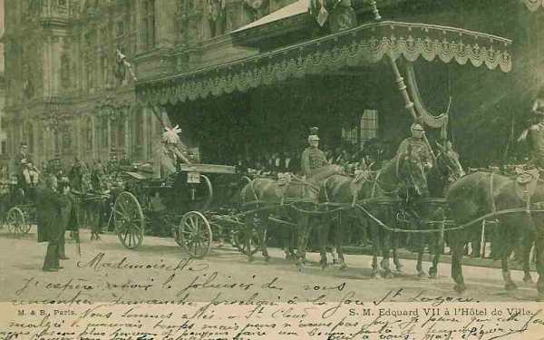
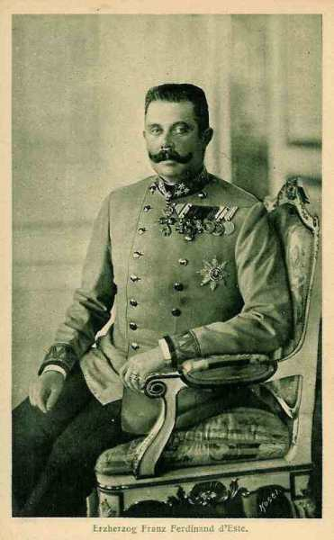

# Evénements précédant la guerre

Les rivalités entre pays européens remontent au 19e siècle : ambitions coloniales, concurrence économique, désir d’étendre son influence. Les grandes puissances s’étaient regroupées en deux blocs antagonistes : la triple alliance et la triple entente.

Les causes de la première guerre mondiale remontent à la fin du 19e siècle.

Le gouvernement de Napoléon III s’est lancé imprudemment dans une guerre contre l’Allemagne, qui a rapidement tourné au désavantage de la France. L’empire allemand est proclamé dans la galerie des glaces de Versailles et la France doit céder l’Alsace (conquise par Louis XIV) et une partie de la Lorraine (obtenue par Louis XV).

_Proclamation de l’empire allemand à Versailles_
_Collection privée_

Cette perte territoriale cause un désir de revanche permanent, mais la France se trouve isolée diplomatiquement pendant plusieurs décennies.

### La politique de Bismarck

Toute la politique diplomatique de Bismarck vise à maintenir la France dans une situation d’isolement diplomatique.

_Bismarck_
_Collection privée_

Il disait lui-même :

« Il est de toute nécessité que la France nous laisse tranquille et que nous l’empêchions - au cas où elle voudrait troubler la paix - de trouver des alliés. Tant qu’elle n’en aura pas, elle ne sera pas dangereuse pour nous. Et tant que les grandes monarchies européennes se donneront la main, aucune république ne sera dangereuse pour elles. Une république Française trouverait difficilement des alliés contre nous ».

Le chancelier allemand base sa politique depuis 1872 sur une alliance avec la Russie et lui laisse le champ libre vers Constantinople. La Russie veut s’étendre vers les Balkans mais se heurte aux désirs d’expansion de l’Autriche-Hongrie.

### Rivalité entre l’Autriche-Hongrie et la Russie

Les empereurs d’Autriche et de Russie se rencontrent à Reichstadt en 1876 pour délimiter leur sphère d’influence : la Serbie pour l’Autriche et l’est pour la Russie (future Bulgarie, Roumanie).

En 1877-1878, la Russie entame une guerre victorieuse contre la Turquie, réussit presque à s’emparer de Constantinople et fait signer à la Turquie le traité de San Stefano, consacrant le démantèlement de l’empire ottoman d’Europe au seul profit de l’empire russe. La création de la Grande Bulgarie n’est pas du goût de la Grande- Bretagne, toujours inquiète d’une menace sur les Détroits, ni du goût de l’Autriche-Hongrie, frustrée de ne pas avoir obtenu la Bosnie-Herzégovine. Disraeli (premier ministre anglais) brandit la menace d’une guerre si le traité n’est pas abrogé. Or, les Anglais ont déjà mené une guerre victorieuse pour mettre un terme à l’expansion russe (guerre de Crimée). Cette menace est donc prise au sérieux par le Tsar.

Une conférence est convoquée à Berlin sous la présidence de Bismarck. Le traité de Berlin en 1879 est signé par l’Angleterre, l’Allemagne, l’Autriche, la France, l’Italie, la Russie et la Turquie et modifie profondément le traité de San Stefano.

La Russie obtient la Bessarabie. La Roumanie, la Serbie et le Monténégro sont reconnus indépendants. La Bulgarie devient une principauté autonome mais perd deux tiers de son territoire et l’accès à la mer Egée. Dans le but d’arrêter l’expansion russe dans les Balkans, la Bosnie-Herzégovine est placée sous administration autrichienne. Les résultats du congrès de Berlin provoquent le ressentiment des Russes.

En 1879, Bismarck ouvre des négociations avec l’Autriche-Hongrie, qui aboutissent à la « double alliance ».

La politique allemande rompt avec la Russie puisque ce pays est visé par l’article 1e du traité (un des deux empires devrait porter secours à l’autre si celui-ci vient à être attaqué par la Russie).

Ce traité sera étendu en 1882 à l’Italie, donnant naissance à la « triple alliance ». Un bloc est constitué : la triplice.

Voici les  clauses essentielles de l’accord : si la France attaque, l’Italie et l’Allemagne uniraient leurs forces ; l’Autriche et l’Allemagne agiraient de même en cas d’agression par la Russie. Si la France et la Russie marchaient contre elles, les trois puissances feraient bloc. Ce traité est conclu pour cinq ans et sera constamment renouvelé.

Toutefois, pour s’assurer de n’avoir aucun conflit avec la Russie (et une guerre sur deux fronts), Bismarck obtient la signature en 1884, et à l’insu de l’Autriche et de l’Italie, d’un traité germano-russe de réassurance, valable pour trois ans, en vertu duquel chacune des puissances s’engage à ne pas se joindre à un éventuel agresseur de l’autre puissance.

Après l’accession au trône de Guillaume II en 1888, Bismarck est forcé de démissionner et est remplacé à la chancellerie par le général von Caprivi. Celui-ci ne renouvelle pas le traité de réassurance à son échéance en 1890.

_Les chanceliers de Guillaume II_
_Collection privée_

Le tsar Alexandre III, qui se méfie de Guillaume II, se tourne vers la France et signe avec elle une convention militaire en 1892. La France a un allié, elle qui avait été isolée pendant 20 ans. Aux termes de ce traité, la Russie promet d’attaquer l’Allemagne si la France est attaquée et réciproquement. Si une des forces de la triple alliance mobilise, la France et la Russie feraient de même sans qu’une concertation soit nécessaire.

_Visite du Grand-Duc Nicolas de Russie à Nancy_
_Collection privée_

L’Allemagne se sent encerclée par deux puissances potentiellement hostiles et est maintenant tributaire de ses deux alliés, l’Autriche-Hongrie et l’Italie.

### La politique de l’Angleterre

L’Angleterre, sous le règne de la Reine Victoria, considère la France et la Russie comme ses adversaires potentiels. Les choses vont changer avec l’avènement d’Edouard VII. Le roi se méfie de l’empereur Guillaume II et l’Angleterre se sent menacée par la vigueur économique de l’Allemagne. Le commerce de l’Allemagne avec les colonies anglaises, par exemple, est en forte expansion, celui de l’Angleterre en régression. En outre, Guillaume II inquiète l’Angleterre en faisant construire des navires de guerre qui menacent sa suprématie navale et donc sa sécurité et celle de ses colonies.

L’Allemagne éprouve le besoin d’acquérir un empire colonial, ce qui ne peut se faire qu’au détriment de l’Angleterre ou de la France.

L’Allemagne et l’Angleterre ont d’ailleurs quelques disputes à propos de Samoa, du Congo, du Soudan, du Maroc et des colonies africaines du Portugal. La presse allemande prend le parti des colons hollandais lors de la guerre des Boers, ce qui mécontente les Anglais.

L’Angleterre se tourne alors vers la France et la Russie. En 1904, France et Angleterre enterrent leurs rivalités coloniales (notamment l’incident de Fachoda). Le grand artisan français de ce rapprochement est Théophile Delcassé, mais les bonnes relations que Edouard VII a su tisser avec les dirigeants français ont grandement facilité les choses.

_Delcassé_
_Collection privée_

_Le président Loubet et le roi Edouard VII_
_Collection privée_

_Visite d’ Edouard VII à Paris en 1903_
_Collection privée_

En 1905, les puissances européennes se disputent à propos du Maroc. La France veut y étendre son contrôle mais Guillaume II débarque à Tanger et confirme le Sultan comme chef d’un pays indépendant. La conférence d’Algésiras en 1906 met fin à cette tension et l’Allemagne subit une défaite diplomatique, due en grande partie au soutien que l’Angleterre a accordé à la France.

En 1907, l’Angleterre signe une convention avec la Russie concernant la Perse, l’Afghanistan et le Tibet. La France consolide son alliance avec la Russie et lui apporte un soutien financier (les emprunts russes). Ces capitaux servent notamment au réarmement russe après la désastreuse guerre de 1904-1905 contre le Japon.

En 1908, Edouard VII et Nicolas II se rencontrent et les politiques française, anglaise et russe deviennent étroitement unies. Un second bloc est constitué : la triple entente.

### L’annexion de la Bosnie-Herzégovine

Cette même année, l’Autriche-Hongrie annexe la Bosnie-Herzégovine, ce qui irrite la Serbie. L’attitude de la Serbie envers l’Autriche a évolué depuis le début du 20e siècle. La dynastie des Obrénovitch était favorable à l’Autriche. En 1903, le roi Alexandre et la reine Draga sont assassinés, Pierre Ie Karageorgévitch monte sur le trône et se tourne vers la Russie. L’annexion de la Bosnie-Herzégovine crée un ressentiment dans la population serbe, d’autant plus que les Serbes rêvent de créer la grande Serbie.

### La seconde crise marocaine

En 1911 éclate la 2e crise marocaine. L’Allemagne envoie le navire de guerre « Panther » qui s’ancre à Agadir. Elle demande à la France des compensations territoriales et obtient une partie du Congo français. Lors des discussions diplomatiques, l’Angleterre appuie la France et l’alliance entre les deux pays s’en trouve renforcée.

### La poudrière balkanique

Les guerres balkaniques de 1912 et 1913 ne font qu’envenimer les relations entre les grandes puissances. La Russie a failli intervenir militairement dans le conflit et l’Autriche-Hongrie a envoyé un ultimatum demandant le retrait des troupes serbes de territoires assignés à l’Albanie.

Au début de 1914, Pachich, premier ministre de Serbie, est reçu en audience privée par Nicolas II, qui lui assure que la Russie fera tout ce qui est en son pouvoir pour aider la Serbie en cas d’agression.

### L’assassinat de l’héritier du trône d’Autriche

Une étincelle peut donc mettre le feu aux poudres dans ce contexte : ce sera l’assassinat de l’héritier du trône d’Autriche-Hongrie, François-Ferdinand à Sarajevo et de son épouse par Gavrilo Prinzip le 28 juin 1914. François- Ferdinand avait décidé d’opérer une tournée d’inspection des armées en Bosnie Herzégovine près de la frontière serbe, ce qui était considéré par les Serbes comme une provocation.

_François-Ferdinand_
_Collection privée_

En fait, l’assassinat n’est que l’occasion de déclencher la guerre. Trop de rivalités divisent les pays européens, constituant autant de causes de conflit.

- L’Angleterre risque de perdre son hégémonie au profit de l’Allemagne. Elle voit son commerce menacé d’une part et la sécurité de son empire compromise suite à l’extension de la flotte de guerre allemande d’autre part.

- La France veut récupérer l’Alsace-Lorraine et laver l’humiliation subie en 1870.

- L’Allemagne se sent encerclée par un jeu d’alliances et veut se mesurer à ses adversaires avant qu’il soit trop tard (la Russie réarme). La France et l’Angleterre sont potentiellement en conflit avec elle à propos des colonies.

- L’Autriche, qui a subi des pertes territoriales au cours du 19e siècle (Vénétie...), veut étendre son influence dans les Balkans mais croise le chemin de la Serbie et de la Russie.

- La Serbie nourrit un ressentiment à l’égard de l’Autriche qui a annexé la Bosnie-Herzégovine et contrarie ses plans d’expansion.

- La Russie veut s’assurer une zone d’influence auprès des peuples slaves dans les Balkans et soutient les Serbes.

Nous avons peine à nous imaginer, à l’époque de l’Union Européenne et de la monnaie unique, un tel antagonisme entre pays européens, mais telle est la situation en 1914.

Les pays européens, groupés en deux blocs, vont glisser sur la pente qui les amènera à la guerre, à tel point qu’elle sera considérée comme « inévitable ».