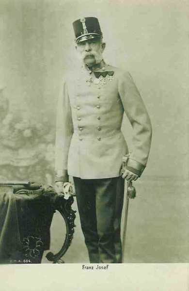
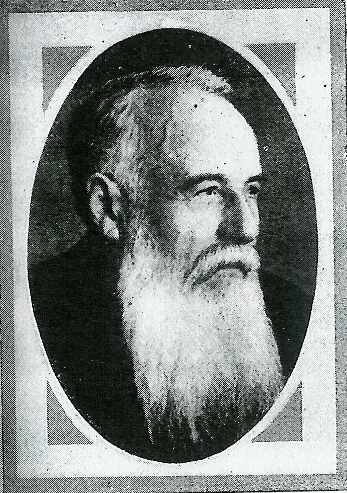
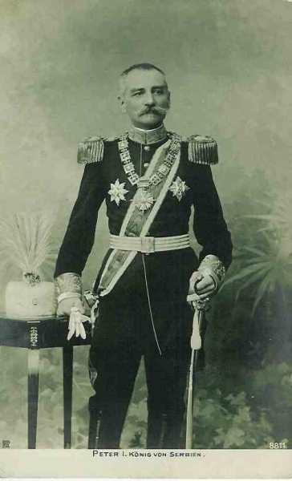
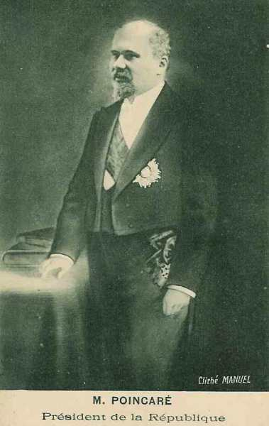
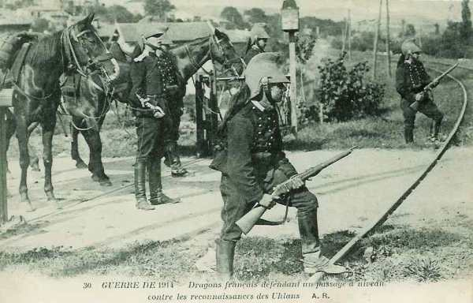
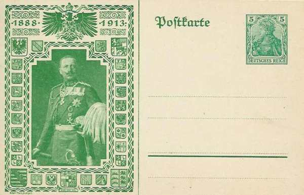
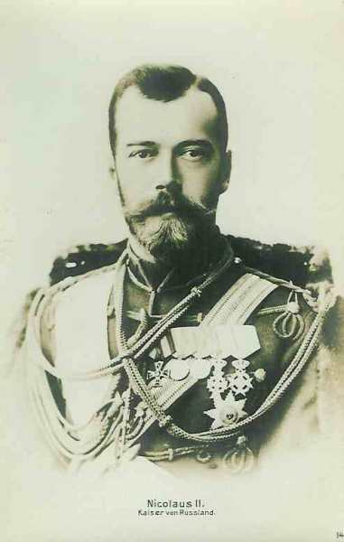
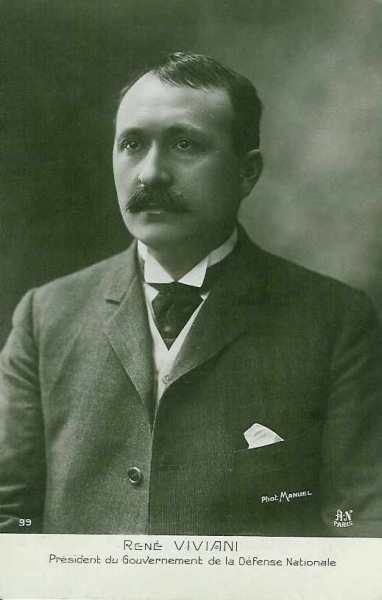
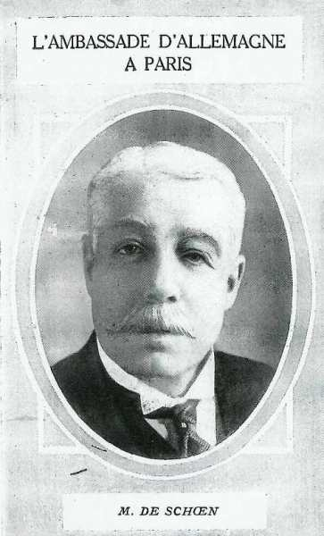

# Enchaînement des événements

L’assassinat de François-Ferdinand déclenche la colère dans les milieux officiels autrichiens. Le cabinet décide que l’affront ne peut rester impuni même si l’Etat serbe ne peut être considéré comme responsable. Le texte d’un ultimatum est soigneusement élaboré pour être inacceptable et remis à la Serbie.

### La pente fatale

- Du 4 au 7 juillet, le ministre autrichien des affaires étrangères, Berchtold, envoie en mission le comte Hoyos à Berlin pour demander l’appui allemand lors de la campagne prévue contre la Serbie. L’Allemagne ne veut pas risquer de perdre son seul allié fiable et donne son accord. C’est le « chèque en blanc ».

- Le 7 juillet a lieu en Autriche un conseil ministériel pour planifier l’ultimatum à remettre à la Serbie.

- Le 19 juillet, les derniers détails sont réglés concernant la note à la Serbie.

- Le 20 juillet à 13h15, le cuirassé France salue de son artillerie la terre russe. Une heure plus tard, le président accompagné de René Viviani et Maurice Paléologue (ambassadeur de France en Russie), monte à bord du yacht impérial Alexandria, où le Tsar l’accueille, lui-même accompagné de son ministre des affaires étrangères Sazonof et du ministre de la Marine, l’amiral Grégovitch. Le vaisseau vogue vers Peterhof.

- Le 23 juillet, la note est remise à la Serbie.

- Le 25 juillet, la réponse serbe est rejetée.

- Le 28 juillet, François-Joseph signe la déclaration de guerre.

_François-Joseph_
_Collection privée_

On pourrait se demander pourquoi près d’un mois s’est écoulé entre l’assassinat de François Ferdinand et la remise de l’ultimatum à la Serbie. Trois raisons peuvent être avancées :

- Le ministre hongrois, Tisza, souhaite qu’un effort soit fait pour établir le rôle de Belgrade dans l’assassinat et ainsi légitimer la réponse autrichienne.

- Les troupes de la monarchie ne sont pas immédiatement disponibles, car les soldats ont reçu un congé pour aider à rentrer la moisson.

- Les responsables de Vienne attendent que Raymond Poincarré et Viviani, en visite en Russie, aient embarqué et quitté le pays, rendant ainsi une réponse concertée par les deux partenaires de l’entente impossible.

Le jeu des alliances va mettre aux prises les deux clans antagonistes.

### 23 juillet 1914

L’Autriche- Hongrie envoie au gouvernement serbe un ultimatum comportant un point inacceptable pour un Etat souverain : la participation des autorités autrichiennes à l’enquête judiciaire sur le territoire serbe.

_Pachitch, président du conseil des ministres de Serbie_

Voici les exigences libellées dans l’ultimatum.

- Supprimer toute publication qui excite à la haine et au mépris de la Monarchie (austro-hongroise)...

- Eliminer sans délai de l’instruction publique en Serbie tout ce qui sert à fomenter la propagande contre l’Autriche-Hongrie.

- Eloigner du service militaire et de l’administration tous les officiers et fonctionnaires coupables de la propagande contre la monarchie austro-hongroise.

- Accepter la collaboration en Serbie des organes du gouvernement impérial et royal dans la suppression du mouvement subversif dirigé contre l’intégrité territoriale de la Monarchie (austro-hongroise).

- Ouvrir une enquête judiciaire contre les partisans du complot du 28 juin se trouvant sur territoire serbe. Des organes délégués par le gouvernement impérial et royal prendront part aux recherches y relatives.

Le gouvernement impérial et royal attend la réponse du gouvernement royal au plus tard jusqu’au samedi 25 de ce mois à cinq heures du soir."

Les diplomates européens sont effrayés par la brutalité de ce texte et malgré cela, la Serbie accepte tous les points sauf le dernier qui constitue une entrave à sa souveraineté. Elle demande qu’il soit soumis à la cour d’arbitrage de La Haye.

_Pierre Ie de Serbie_
_Collection privée_

### 24 juillet 1914

Messimy, ministre de la guerre, convoque Joffre. Il lui fait part d’une note dans laquelle le gouvernement allemand approuve entièrement l’ultimatum remis par les Autrichiens à la Serbie. Cette note marque la volonté nette de l’Allemagne d’appuyer l’Autriche. Le ministre fait part à Joffre des craintes que la France soit entraînée dans une guerre. Joffre répond au ministre « eh bien, Monsieur le Ministre, nous la ferons s’il le faut ». L’absence du gouvernement rend la situation délicate. Le Président de la République, le Président du Conseil et le ministre des affaires étrangères sont en Russie.

L’ambassadeur d’Allemagne, mr de Schoen, donne lecture au ministre intérimaire des affaires étrangères, d’une lettre disant que le débat doit rester localisé entre Vienne et Belgrade et ne pas devenir une question d’alliances ; que s’il en était autrement, on pourrait redouter les conséquences les plus graves (conflit entre la Triple-Entente et la Triple-Alliance).

### 25 juillet 1914

La Serbie rompt ses relations diplomatiques avec l’Autriche et commence sa mobilisation. Des mesures préparatoires sont prises en Allemagne : rappel des officiers permissionnaires, mise en place de la garde de certains ouvrages d’art, travaux et mouvements de troupes pour la mise en état des places de la frontière. Messimy, ministre français de la guerre, prescrit par télégramme dans la soirée le rappel des officiers généraux et des chefs de corps absents de leur garnison.

### 26 juillet 1914

L’armée du Monténégro est mobilisée.

Un télégramme lancé par l’état-major français prescrit les mesures suivantes :

- Sursis de déplacements prévus de troupes.

- Suspension des autorisations d’absence pour les officiers et la troupe.

- Convocation à l’état-major de l’armée des officiers de liaison des armées.

- Rappel des officiers permissionnaires.

- Premier avis préalable aux compagnies de chemin de fer.

- Rapatriement dans leurs garnisons des troupes de couverture (1e, 6e, 7e, 20e et 21e corps d’armée).

- Ordre au général commandant du 19e C.A. d’étudier d’urgence la constitution du plus grand nombre possible d’unités de réservistes des tirailleurs en Algérie et en Tunisie.

- Instructions à la presse pour obtenir le silence et la discrétion.

Joffre apprend que les officiers allemands en permission en Suisse ont été rappelés et que la garde des ouvrages d’art a été mise en place sur tout le territoire de l’Empire.

### 27 juillet 1914

- **France**
  Application intégrale du dispositif restreint de sécurité aux C.A. de couverture sur la frontière allemande et au gouverneur de Paris.

- Rappel des permissionnaires à partir de 18 heures.

- Distribution des dotations de guerre dans les garnisons d’Alsace-Lorraine.

- Décision par le Conseil des Ministres de prélever des troupes au Maroc.

- **Allemagne**
  Le ministère des affaires étrangères rejette la proposition pour une conférence des quatre grandes puissances proposée par l’Angleterre. Guillaume II retourne à Berlin et le secrétaire d’Etat aux affaires étrangères, von Jagow, presse Vienne de ne pas différer l’action contre la Serbie

- Il est procédé à des réquisitions et à la mise en place des troupes de couverture.

### 28 juillet 1914

L’Autriche-Hongrie déclare la guerre à la Serbie et au Monténégro. Les 7 C.A. les plus voisins de la Serbie sont mobilisés. Au total, 23 divisions d’infanterie sont prêtes à la guerre.

- L’ordre de mobilisation général est lancé en Autriche-Hongrie.

- le comte Berchtold, au nom de l’Autriche, notifie aux puissances "l’état de guerre" avec la Serbie.

- **France**
  Ordre est donné aux généraux commandant les troupes de couverture d’effectuer les mesures prévues pour la surveillance des frontières.

- Un service permanent de télégraphe jour et nuit doit fonctionner dans les bureaux des Ardennes, Meuse, Meurthe-et-Moselle, Vosges, Haute Saône, Doubs, territoire de Belfort.

- Ordre est donné de rapatrier les troupes des C.A. de l’intérieur, absentes de leur garnison.

- Joffre fait valoir au ministre que la sécurité du pays nécessite de prendre des mesures de couverture. Messimy attend, pour prendre la décision, le retour de Russie des deux présidents.

- **Allemagne**
  Les réservistes sont rappelés individuellement. C’est une mesure précédant une mobilisation, prise en cas de tension politique.

- La protection des voies ferrées est ordonnée dans les "Kreis" frontières et dans la zone (Bezirk) de Berlin.
Les unités ayant une mission de couverture et se trouvant hors de leurs garnisons, y sont ramnées par chemin de fer.

- Les forts de Metz-Thionville sont approvisionnés, l’on étend les réseaux de fil de fer et installe des batteries extérieures.

- Le chancelier Bethmann propose un marché à Londres : la neutralité britannique contre une promesse allemande de ne pas annexer de territoire français. La proposition sera rejetée le 30.

- Moltke presse pour la mobilisation et demande à Vienne d’agir rapidement.

### 29 juillet 1914

Pour répondre aux menaces autrichiennes contre la Serbie, la Russie mobilise les 4 arrondissements militaires voisins de la frontière autrichienne (quatorze C.A.). Le comte de Pourtalès, ambassadeur allemand à Saint-Pétersbourg, informe mr Sazonof (ministre russe des affaires étrangères) que la mobilisation russe, même partielle, amènera la mobilisation allemande. Cette démarche est notifiée à Londres et à Paris.

Dans la nuit du 29 au 30, les Serbes font sauter une partie du pont entre Semlin et Belgrade. L’autriche commence le bombardement de Belgrade.

**France**
Poincarré et Viviani débarquent à 13h30 après leur voyage officiel en Russie. Un Conseil des Ministres est tenu à l’Elysée à 17 h30. Le gouvernement décide d’attendre quelques heures avant de décider la couverture des frontières.

_Poincaré_
_Collection privée_

L’ambassadeur de Russie, Isvolsky, vient annoncer à Viviani la décision allemande de mobiliser les forces armées si la Russie ne cesse pas ses préparatifs militaires.

Joffre apprend que les transports de concentration autrichiens commenceront le 30 juillet.

L’armée applique les mesures de protection concernant la garde des ouvrages fortifiés, des établissements militaires et des postes de T.S.F.

- Dans le secteur du 7e C.A. pour Belfort et les forts de Haute Moselle.

- Dans le secteur du 2e C.A. pour Longwy, Charlemont, Montmédy, les Ayvelles.

- Dans le secteur des 20e et 6e C.A. pour les places fortes et forts isolés à l’exception de Reims.

- Dans le secteur du 1e C.A. pour Maubeuge

- Dans le secteur du 21e C.A. pour Epinal.

Ordre est donné aux corps de couverture commencer les travaux de défense prévus dans les places.

**Allemagne**
A 17h30 s’ouvre à Potsdam, sous la présidence de l’empereur, le conseil où l’entrée en guerre est décidée. Participent à cette séance le chancelier von Bethmann-Hollweg, le secrétaire d’Etat von Jagow, le ministre de la guerre von Falkenhayn, le ministre de la marine von Tirpitz, le chef d’Etat-Major général von Moltke, le chef d’Etat-Major de la marine von Pohl, le quartier-maître général von Plessen et deux membres du cabinet de l’empereur.

- Les réservistes des 3 dernières classes ont reçu leur feuille de mobilisation.

- L’armée procède à la réquisition des chevaux et des automobiles.

- Des dispositions de couverture sont prises sur toute la frontière d’Alsace-Lorraine.

- Les voies ferrées sont gardées militairement aux abords des gares.

- Des réquisitions importantes de farine sont effectuées à Metz et à Strasbourg.

**Belgique**
Rappel des permissionnaires. L’armée belge est mise sur pied de paix renforcé. Cela implique le rappel de trois classes de milice.

### 30 juillet 1914

La Russie mobilise. Elle se considère comme garante des peuples slaves des Balkans et a d’ailleurs promis assistance aux Serbes.

- **France**
  La couverture est partiellement mise en place. Aucun mouvement par chemin de fer n’est autorisé au-delà de la frontière. L’ordre est signé par Messimy vers 17h et concerne les 2e, 6e, 7e, 20e et 21e C.A.

- Aucun rappel des réservistes n’est ordonné.

- Pour éviter tout incident, aucune patrouille ne pourra dépasser une ligne située à 10 km. en deçà de la frontière.

- Les présidents de commissions de réquisition sont convoqués.

- Ordre est donné aux maires d’aviser discrètement les propriétaires d’animaux et de voitures de conduire ceux-ci dans les centres désignés.

- Le ministre de la guerre prescrit au commissaire résident au Maroc de diriger des troupes vers les ports d’embarquement.

Allemands et autrichiens quittent Paris en masse.

Joffre constitue le noyau de son futur quartier général. Il commence à fonctionner à partir du 31 juillet.

**Allemagne**

- Les réservistes allemands habitant le Grand-Duché reçoivent l’ordre de rejoindre leurs régiments respectifs.

- La frontière luxembourgeoise est garnie de troupes.

- Des travaux de défense sont effectués à Fontoy, Moyeuvre,  Saint-Privat, Verneville et Gorze, Novéant et Delme,  Château-Salins et Dieuze, au sud de Sarrebourg et dans les vallées de la Bruche et de l’Oderen : installation de pièces de gros calibre, creusement de tranchées. Les troupes françaises vont se heurter à ces positions préparées lors des offensives en Alsace et  en Lorraine.

- Les routes conduisant vers la France sont barrées.

- L’on procède au transport des troupes d’active chargées de l’occupation et de la défense des îles de la mer du nord.

**Belgique**
Le Roi Albert prend effectivement le commandement en chef de l’armée. Le chef d’Etat-Major, le Général de Selliers de Moranville propose au Roi de réunir les 6 divisions belges aux environs de la Gette, soit autour de Landen, soit autour de Tirlemont, en position d’attente.

### 31 juillet 1914

- L’Autriche-Hongrie mobilise de même que la Russie.

- A 13h30, l’Allemagne envoie un ultimatum à la Russie. Elle menace de mobiliser si celle-ci n’arrête pas sa mobilisation.

- Par le jeu des alliances (triplice et  triple entente), les autres pays européens même neutres doivent emboîter le pas. C’est ainsi que la Belgique mobilise (la Belgique avait un statut de neutralité reconnu en 1839 par les différentes puissances).

- Les communications télégraphiques traversant la frontière sont interrompues du côté allemand.

- La voie ferrée est coupée entre Longwy et Novéant.

- **France**
  Joffre signale au Gouvernement l’avance prise en Allemagne en matière de mobilisation. Un retard de 24 heures apporté à la convocation des réservistes se traduira par l’abandon initial de 15 à  20 km de territoire français par jour de retard.

- A 17h, le conseil des ministres prend la décision de lancer le télégramme de couverture.

- L’ambassadeur d’Allemagne, von Schoen annonce à Viviani que l’empereur a décidé de déclarer l’état de danger de guerre. Il annonce la mobilisation de la Russie et demande quelle serait l’attitude de la France en cas de conflit entre l’Allemagne et la Russie.

- A 17h, les services de chemin de fer reçoivent l’avis que l’ordre de mise en route des troupes de couverture va être donné. Ils procèdent immédiatement aux formations de trains et à leur envoi aux points d’embarquement.

- A 17h40, le télégramme est lancé à tous les C.A. de la frontière nord-est « faites partir les troupes de couverture ». La ligne de 10 km. à partir de la frontière ne peut être franchie.

- Le tribun socialiste Jaurès est assassiné par un nationaliste. Il était connu pour ses options pacifistes.

- Les mesures de protection relatives à la garde des ouvrages, des établissements militaires et des postes de T.S.F. sont mises en place.

_Dragons gardant un passage à niveau_
_Collection privée_

- A 23h30 les lignes électriques internationales sont coupées.

**Allemagne**

_Guillaume II_
_Collection privée_

- A 11h, l’ambassadeur d’Allemagne à Saint-Pétersbourg (comte de Pourtalès) confirme officiellement la mobilisation générale de l’armée et de la flotte russes.

- Le chancelier allemand invite les ambassadeurs à Saint-Pétersbourg et à Paris à remettre un ultimatum.

- Le « Zustand der drohende Kriegsgefahr » ou « état de danger de guerre » est proclamé à 13h et notifié au gouvernement français. Cette décision a pour effet de fermer la frontière et de mettre à la disposition de l’autorité militaire le réseau ferré, le service télégraphique et le service téléphonique. Le trafic de marchandises est donc interrompu à l’ouest du Rhin et sur la frontière orientale.

- Les haras sont évacués de Prusse orientale ainsi que tout le matériel roulant se trouvant dans les installations ferroviaires proches de la frontière. C’est ainsi que le réseau d’Alsace-Lorraine évacue en quelques jours 4.900 wagons représentant 98 trains.

- Comme c’est une période de villégiature, la proclamation de l’état de danger de guerre pousse les familles à rentrer chez elles. 235 trains spéciaux seront mis à leur disposition.

- Le gouvernement exige que la Russie démobilise. Sans réponse satisfaisante dans un délai de 12h, l’Allemagne mobilisera à son tour.

- Dans la nuit (1 heure du matin), les commandants de C.A. sont avisés que l’ordre de mobilisation sera lancé le 1e août.

- Les éléments de couverture sont constitués des 8e, 16e, 21e, 15e et 14e C.A.

- Les automobiles passant de France en Allemagne sont arrêtées et saisies. Les communications téléphoniques à travers la frontière sont supprimées.

- Les locomotives françaises sont saisies.

**Autriche**
A la première heure, le gouvernement austro-hongrois décrète la mobilisation générale.

**Russie**
L’ordre de mobilisation générale est signé par le tsar Nicolas II pour l’ensemble de l’armée et de la flotte.

_Nicolas II_
_Collection privée_

**Belgique : l’armée mobilise**
A 19 heures, la mobilisation est décrétée. Elle commence à minuit et doit se dérouler dans les journées des 1e, 2 et 3 août. Les divisions sont dans leur garnison normale, sauf la D.C. qui est portée à Gembloux, de sorte que l’armée reste prête à faire face avec une égale facilité à l’est ou au sud.

### 1e août 1914

- **France : l’armée mobilise**
  Dans la matinée, Joffre, par une lettre à Messimy, ministre de la guerre, signale le danger de l’avance prise par l’Allemagne dans le processus de mobilisation.

- Le gouvernement décide la mobilisation (rappel des réservistes). Le décret de mobilisation générale est soumis à la signature du président de la république (Raymond Poincarré).

- L’ordre de mobilisation est signé par Messimy à 15h30. Premier jour de mobilisation : le 2 août. Cet ordre est affiché sur tout le territoire.

- Les places et C.A. des frontières nord et nord-est  reçoivent l’autorisation d’ouvrir le feu sur tout aéronef ennemi ou suspect.

- L’état de siège est proclamé sur le territoire de France et d’Algérie.

- Le G.Q.G. est installé dans le collège sur la place Royer-Collard en face de l’église Notre-Dame. Il compte une cinquantaine d’officiers et commence à fonctionner. Il y a deux rapports par jour : le matin vers 7 heures et le soir vers 20 heures. Au rapport du matin, Joffre prend connaissance des comptes rendus envoyés par les armées et relatifs aux événements qui se sont déroulés dans les douze heures précédentes. Le rapport de situation générale est établi le matin puis Joffre fixe ses décisions.

- **Allemagne**
  L’Allemagne déclare la guerre à la Russie et mobilise. L’ordre de mobilisation est lancé à 17h, mais la mobilisation était déjà bien avancée dans les faits. Le chef de la section chemins de fer de l’O.H.L. a la mainmise absolue sur l’entièreté des chemins de fer allemands.

- L’ambassadeur d’Angleterre à Berlin demande que l’Allemagne donne une assurance du respect de la neutralité belge. Le gouvernement impérial dit qu’il ne peut répondre à cette question.

- L’armée allemande organise plusieurs incursions en territoire français dans le but de créer des incidents de frontière afin de soutenir la thèse que l’Allemagne est attaquée.

- L’ambassadeur d’Allemagne à Londres, le prince Lichnowski, fait part d’une conversation avec le ministre des affaires étrangères et dit qu’il serait possible de limiter la guerre uniquement à l’Est si l’Allemagne ne s’attaque pas à la France. En fait, l’Angleterre garantirait la neutralité de la France. L’empereur demande à Moltke de modifier le plan de concentration pour attaquer uniquement vers l’Est. Moltke explique au Kaiser irrité qu’une modification de la marche des armées n’est plus possible à ce point et engendrerait le chaos. L’empereur lui répond vertement. Le soir même, un démenti arrive à Berlin et Moltke reçoit l’autorisation de faire envahir le Luxembourg.

**Angleterre**
La flotte britannique est mobilisée.

**Belgique**
L’ambassadeur de France à Bruxelles informe le Ministre des Affaires Etrangères qu’en cas de conflit, le gouvernement de la République respectera la neutralité belge.

Avec l’approbation du Roi, il est prescrit que les 1e et 5e divisions seront transportées à Tirlemont et à Perwez le 3 août, que les 2e et 6e divisions se rendront à Louvain et à Wavre et que la D.C. se rendra à Waremme. La 3e division est à Liège, la 4e est à Namur pour renforcer les garnisons des places.

**Italie**

L’ambassadeur d’Allemagne notifie au gouvernement italien l’état de guerre de l’Allemagne avec la Russie. Le marquis de San Guiliano en prend acte et déclare que l’Italie gardera sa neutralité.

Le soir, l’ambassadeur de France à Rome avise son Gouvernement que l’Italie restera neutre, l’attitude de l’Autriche-Hongrie et de l’Allemagne « ne cadrant pas avec le caractère purement défensif de la triple alliance ». Cette déclaration apporte au commandement français un soulagement important : il peut se consacrer exclusivement à la frontière nord-est.

### 2 août 1914

**France**
Des reconnaissances allemandes pénètrent en territoire français (Boron, Joncherey, Petit-Croix, Suarce, Col de Sainte-Marie-aux- Mines, Longlaville, Bertrambois). Un soldat français, Jules André Peugeot, est tué d’un coup de pistolet par un officier allemand. C’est la première victime d’une longue série.

Messimy, pour éviter toute apparence d’agression, ordonne sur la frontière belge les mêmes précautions que sur la frontière allemande. Le retrait des troupes par rapport à la frontière est limité à 2 km. La ligne à respecter est Villers-la-Montagne - Haucourt - Herserange, Longlaville - Mont-Saint-Martin - Signy-le-Petit.

Joffre adresse une note au ministre de la guerre afin que l’armée puisse prendre position le long de la frontière. A 14h, le gouvernement rend la liberté de mouvement au commandant en chef mais pour rejeter sur l’Allemagne l’entière responsabilité des hostilités, la couverture se borne à repousser au-delà de la frontière toute troupe assaillante sans pénétrer en territoire adverse.

La violation des frontières du Luxembourg entraîne la nécessité de reporter vers le nord le centre de gravité des forces de l’aile gauche. Joffre envisage d’appliquer la variante du plan XVII : préparer l’entrée en ligne de la IVe armée entre les IIIe et Ve. Le soir, il donne l’ordre d’exécuter cette variante.

- **Allemagne**
  Les troupes allemandes pénètrent en territoire luxembourgeois par les ponts de Wasserbillig et Remich (16e division). Le réseau luxembourgeois, très utile à l’armée allemande, tombe intact entre ses mains.

Le premier train militaire arrive à 8h30 en gare de Luxembourg. Le baron von Schoen informe le quai d’Orsay que « les mesures militaires prises dans le Grand Duché ne constituent pas un acte d’hostilité ».

- L’Allemagne adresse un ultimatum à la Belgique afin de pouvoir passer à travers son territoire.

**Angleterre**
Le conseil de Cabinet de Londres décide que si la flotte allemande pénètre dans le Pas-de-Calais ou dans la mer du Nord pour entreprendre des hostilités contre les côtes ou les bateaux français, la flotte anglaise donnera toute la protection en son pouvoir.

**Belgique**
A 7 heures du soir, l’ambassadeur d’Allemagne à Bruxelles remet au gouvernement belge une note à laquelle celui-ci a douze heures pour répondre.

En voici la teneur :

« Le Gouvernement allemand aurait reçu des informations sûres d’après lesquelles des forces françaises avaient l’intention de marcher sur la Meuse par Givet et Namur.

En vue de prévenir cette attaque présumée menaçant la sécurité du territoire belge, le Gouvernement allemand compte envoyer ses troupes à travers le territoire belge et demande à la Belgique de ne pas s’opposer à leur passage, notamment de ne pas organiser de résistance sur les fortifications de la Meuse, ni de détruire des routes, chemins de fer, tunnels ou autre ouvrages d’art ».

### 3 août 1914

L’Allemagne déclare  la guerre à la France.

**17h** :
Viviani, président du Conseil, reçoit la visite de l’ambassadeur d’Allemagne, de Schoen, qui lui remet le texte de la déclaration de guerre :

_René Viviani_

"Les autorités administratives et militaires d’Allemagne ont constaté un certain nombre d’actes d’hostilité caractérisés commis sur le territoire allemand par des aviateurs militaires français. Plusieurs de ces derniers ont manifestement violé la neutralité de la Belgique, survolant le territoire de ce pays. L’un a essayé de détruire des contructions près de Wesel, d’autres ont été aperçus dans la région de l’Eifel, un autre a jeté des bombes sur le chemin de fer près de Karlsruhe et de Nurenberg.

Je suis chargé et j’ai l’honneur de faire connaître à Votre Excellence, qu’en présence de ces agressions, l’Empire allemand se considère en état de guerre avec la France du fait de cette dernière puissance.

J’ai en même temps l’honneur de porter à la connaissance de Votre Excellence que les autorités allemandes retiendront les navires marchands français dans les ports allemands, mais qu’elles les relâcheront si dans les 48 (quarante-huit) heures la réciprocité complète est assurée.

Ma mission diplomatique ayant pris fin, il ne me reste plus qu’à prier Votre Excellence de bien vouloir me munir de mes passeports et de prendre les mesures qu’elle jugerait utiles pour assurer mon retour en Allemagne avec le personnel de l’ambassade, ainsi qu’avec le personnel de la légation de Bavière et du consulat général d’Allemagne à Paris.
Veuillez agréer, Monsieur le Président, l’expression de ma très haute considération."

Signé de Schoen

_de Schoen, ambassadeur d’Allemagne à Paris_

**En Allemagne**
Les trains sont amenés dans les gares préalablement déterminées et y sont déchargés. Les wagons fermés sont équipés en vue du transport des hommes et des chevaux. Malgré les difficultés, le service des trains de voyageurs est maintenu dans son entièreté les 2 et 3 août.

Le transport de mobilisation débute :
20.800 transports = 90.000 wagons = 1.800 trains.
Les six brigades chargées du coup de main sur Liège se rendent dans la région d’Aix-la-Chapelle, Eupen et Malmédy.

Sept brigades mixtes et l’ensemble des D.C. sont transportées, ce qui représente 1.440 transports, dans 340 trains spéciaux.

**Grande Bretagne**

- Sir Edward Grey fait une déclaration à la chambre des Communes :
  La flotte anglaise garantira les côtes de France contre la flotte allemande.

- l’Angleterre, saisie d’un appel du roi des belges, affirme sa volonté de maintenir la neutralité de la Belgique. Le parlement vote un budget de 100 millions de livres pour les dépenses de guerre.