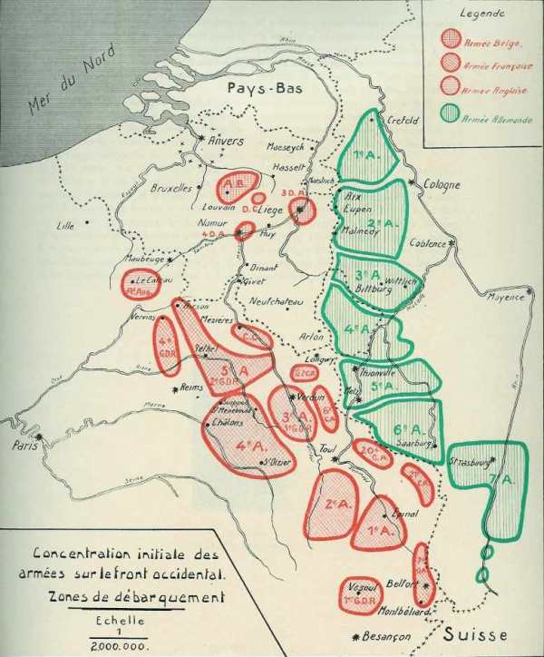

# Plan Schlieffen

Suite à l’alliance entre la France et la Russie, l’Allemagne doit, en cas de guerre, combattre sur deux fronts. Pour l’éviter, le grand Etat-Major (OHL) a prévu de mettre la France hors cause avant de se retourner contre la Russie. C’est le plan Schlieffen qui prévoit d’attaquer la France par sa frontière nord, de déborder ses armées et de les acculer à la frontière est.

L’Allemagne, suite à l’alliance franco-russe de 1892, se trouverait en cas de guerre dans la nécessité de se battre sur deux fronts, situation très désavantageuse. C’est ainsi que l’Etat-Major allemand avait mis au point un plan de campagne visant à détruire l’armée française avant que l’armée russe puisse peser de tout son poids. L’Etat-Major allemand estimait le délai de mobilisation russe à 6 semaines, vu que le réseau ferroviaire de ce pays était peu développé.

D’autre part, les Français avaient fortifié leur frontière Est. Séré de Rivières s’était chargé de cette tâche gigantesque.

Du nord au sud de la frontière avec l’Allemagne, plusieurs places fortes avaient été créées :

- Montmédy

- Longwy

- Verdun

- Toul

- Epinal

- Belfort

Entre ces places fortes, un rideau de forts avait été tendu.

Une attaque frontale de ces places et de ces forts nécessiterait beaucoup de temps et certainement entraînerait beaucoup de pertes. Pendant ce temps, l’armée russe aurait le temps de se rassembler et de passer à l’offensive.

Faire passer  la masse de manœuvre entre Verdun et la frontière belge ne serait pas susceptible de produire des effets suffisants, ce couloir étant trop étroit pour pouvoir déployer les armées. Il faudrait donc élargir le théâtre d’opérations vers le nord.

Comme la frontière du nord de la France n’est garnie que d’ouvrages dépassés (Sedan, Givet, Maubeuge, Lille, fort de Curgies), il semble plus logique de contourner la ligne de fortifications par le nord. Cette manœuvre implique toutefois la violation de la neutralité de 2 pays : la Belgique et le Luxembourg et  pose plusieurs problèmes :

- La Grande-Bretagne risque d’intervenir dès l’annonce de la violation de la neutralité belge : les Anglais n’ont jamais admis qu’une grande puissance se trouve face à eux de l’autre côté de la Manche (voir les guerres contre Napoléon).

- Pour ne pas traverser le Limbourg hollandais, il faut passer entre Liège et la frontière hollandaise. Cet espace peut être interdit de passage par l’artillerie des forts de Liège, d’où la nécessité de neutraliser cette place forte avant tout mouvement d’une armée.

- L’aile marchante de l’armée (Ie armée) doit parcourir 450 km de la frontière allemande jusqu’à Paris en passant par Bruxelles. Les armées de l’époque se déplacent à pied : une épreuve d’endurance pour les troupes, mais qui ne semble pas soulever de problème pour l’Etat-Major allemand.

Schlieffen  (chef d’Etat-Major de l’armée allemande entre 1891 et 1906) se doute que les Français lanceront une offensive pour tenter de récupérer l’Alsace-Lorraine qui leur ont été ravies après la guerre de 1870. Ce sera tout bénéfice pour l’exécution de son plan car les Français dégarniront leur aile gauche, là où portera précisément le poids de leur attaque.

**[Lien vers croquis](../img/olan_schlieffen2.jpg)**

Il met au point son plan définitif en 1905 :

- Un groupe au nord, aussi puissant que possible, progressera rapidement vers le front Bruxelles - Namur. A ce groupe seront affectés neuf C.A. et cinq D.C. en première ligne et en seconde ligne sept C.A. pour la protection de l’aile droite et l’investissement d’Anvers.

- Un groupe du centre, composé de six C.A. et d’une D.C., se dirigera vers la Meuse, de Mézières à Verdun.

- Cinq C.A., s’appuyant sur Metz (position fortifiée allemande), couvriront le flanc gauche contre une attaque venant de la ligne Verdun - Toul. C’est l’aile défensive.

Le groupe nord aura la charge d’envelopper la gauche française, en se dirigeant vers la gauche de la position de l’Aisne (Reims - La Fère), si les Français réussissent  à se retirer sur cette ligne. S’ils parviennent à former un flanc défensif derrière l’Oise, sur la ligne La Fère - Paris, ce flanc sera attaqué en progressant de positions en positions et en encerclant Paris par l’ouest et par le sud.

L’aile défensive a la mission suivante :

Si les Français prennent l’offensive avec des forces supérieures entre Metz et les Vosges, la VIe armée cédera du terrain et laissera l’adversaire s’avancer en l’attirant le plus possible en direction du nord. Sa droite se repliera derrière la position de la Nied et la gauche reculera jusqu’au sud de Phalsbourg, sur le canal de la Marne au Rhin. La VIIe armée tiendra la vallée de la Bruche à l’ouest de Molsheim.

Le but ultime est de refouler les armées françaises d’une manière continue vers la Moselle et la Suisse et Schlieffen constitue une aile droite assez puissante pour gagner irrésistiblement la bataille contre des forces qu’on pourrait lui opposer, exécuter la poursuite et forcer l’adversaire à se comprimer de plus en plus sur sa droite jusqu’à complète destruction.

Si le plan avait été appliqué par son créateur, l’armée française aurait été rapidement mise hors de cause et l’Allemagne aurait envahi la France.

En 1906, Schlieffen prend sa retraite et est remplacé par Moltke le jeune (neveu du Moltke qui a gagné la guerre de 1870).

Moltke maintient ce plan tout en modifiant les forces affectées aux deux ailes de l’armée. Outre l’enveloppement simple prévu par Schlieffen, il vaut se ménager la possibilité d’un enveloppement double. A cette fin, il augmente les forces d’Alsace et de Lorraine.

Au lieu de quatre C.A. prévus par Schlieffen, celles-ci se voient dotées de huit C.A. + les garnisons de Metz et de Strasbourg.

Les forces du front occidental sont réparties en 7 armées.

- La masse de manœuvre se trouvant au nord de la Moselstellung (région fortifiée de la Moselle, soit Metz - Thionville), comprend 5 armées, soit 26 C.A. ou 52 divisions + 7 D.C.

- Au sud de la Moselstellung, il y a 18 divisions + 3 D.C.

Dans le plan Schlieffen, la proportion entre le front mobile et le front statique était de 7 à 1. Avec le plan Moltke, cette proportion n’est plus que de 3 à 1.

Voici les objectifs des différentes armées :

La masse principale :

- La Ie armée de 320.000 hommes doit franchir la Meuse au nord de Liège.

- La II armée de 260.000 hommes doit franchir ce fleuve entre Liège et Namur. Ces deux armées doivent marcher sur Bruxelles et Charleroi.

Le centre :

- La IIIe armée de 180.000 hommes est orientée vers Dinant.

- La IVe armée de 200.000 hommes est orientée vers Saint-Hubert.

- La Ve armée de 200.000 hommes a Longwy pour objectif.

L’aile gauche :

Les autres armées massées à la frontière franco-allemande (Lorraine et Alsace) ont un rôle défensif : elles doivent reculer lors de l’assaut français et constituer un piège où les armées françaises s’enfonceront.

- La VIe armée compte 220.000 hommes.

- La VIIe armée compte 120.000 hommes.

Le total des forces mises en œuvre sur le front occidental représente 1.500.000 hommes, réserves comprises.

La position de Liège doit être réduite. Les forces d’attaque contre Liège doivent franchir la frontière belge dès le troisième jour de la mobilisation et tenter un coup de main contre Liège dès le cinquième jour. En cas d’échec, l’artillerie de gros calibre doit entrer en action dès le onzième jour. Ce n’est que lorsque Liège sera prise et dès que les Ie et IIe armées auront franchi la Meuse que l’O.H.L. enverra l’ordre de mise en route de la masse tournante.

·       La route de Liège doit être forcée le 12e jour de la mobilisation.

- Bruxelles doit tomber le 19e jour.

- La frontière française doit être atteinte le 22e jour.

- La ligne Thionville - Saint-Quentin doit être franchie le 31e jour.

- Paris tomberait le 39e jour.

Voici la concentration  initiale des armées en août 14

_Concentration initiale des armées_
_La Belgique et la guerre_

L’Etat-Major allemand décide de mettre en première ligne les corps de réserve qui portent le même numéro que les corps actifs. Ce sera la mauvaise surprise pour Joffre qui ne s’y attend pas et ne pense pas que les Allemands mettront en œuvre des moyens aussi importants. Se basant sur cette supposition, l’E.M. français ne peut deviner l’ampleur que prendra le mouvement tournant de la masse de manœuvre (jusqu’à Bruxelles).