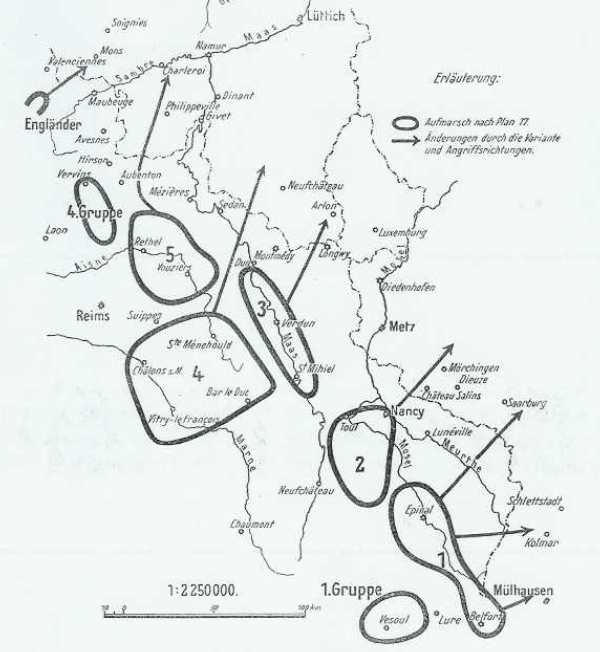

# Plan XVII

L’objectif des Français est de récupérer l’Alsace et le Lorraine qui leur ont été enlevées après la guerre de 1870. C’est tout logiquement que les forces françaises sont majoritairement massées à la frontière est, dans le but de prendre l’offensive. La frontière nord de la France est beaucoup moins garnie de troupes.

Suite à la guerre de 1870 et au traité de Francfort, la France a été amputée de l’Alsace et d’une partie de la Lorraine (Moselle, Bas-Rhin et Haut-Rhin). La priorité pour la France est de récupérer ces provinces et de déclencher une offensive stratégique immédiate de manière à éloigner la guerre du sol national.

Joffre et son Etat-Major mettent au point un plan de répartition des forces, le plan XVII, qui entre en vigueur le 15 avril 1914.

**[Lien vers croquis](../img/concentration_francaise.jpg)**

- Un détachement d’armée puis une armée d’Alsace a pour objectif de marcher sur Mulhouse.

- La Ie armée (280.000 hommes) est concentrée entre Belfort et Lunéville. Elle doit pénétrer en Alsace et au nord, marcher vers Sarrebourg, son aile droite vers Colmar.

- La IIe armée (180.000 hommes) est située entre Lunéville et Toul. Elle a pour mission, en se couvrant vers Metz (position fortifiée allemande), de déboucher par Morhange - Château-Salins vers Saarbrücken.

- La IIIe armée (200.000 hommes) est concentrée entre la Moselle et Verdun. Elle assure la liaison entre les forces de droite et les forces de gauche.

- la Ve armée (240.000 hommes) est rassemblée entre Verdun et la frontière belge avec à sa gauche un corps de cavalerie. Elle a pour but d’attaquer ce qui déboucherait entre Mézières et Mouzon.

- La IVe armée (160.000 hommes) est placée en réserve derrière la IIe dans la région de Bar-le-Duc. Elle doit soit déboucher entre les IIe et IIIe armées, soit, en cas de violation de la neutralité belge, obliquer vers le nord en s’insérant entre la IVe et la Ve armée. (c’est cette variante qui sera appliquée).

- Quant à la Ve armée, si les Allemands respectent la neutralité de la Belgique et du Luxembourg, elle doit attaquer vers l’est avec la IIIe armée, au nord de la ligne Verdun - Metz. En cas d’invasion de la Belgique, il est prévu  que le Corps de cavalerie et la Ve armée glissent vers le nord dans la région de Mézières. C’est la variante du plan qui sera mise en œuvre.

- L’extrême gauche du dispositif est formé par un groupe de divisions de réserve. Il a pour objectif de surveiller la trouée de l’Oise.

Le rôle principal incombe aux deux premières armées, qui doivent entrer de vive force dans la Lorraine annexée et envahir les pays rhénans du Palatinat, de Mayence et de Cologne et couper la retraite aux forces allemandes qui s’aventureraient en Belgique.

_Plan XVII_
_Der Marnefeldzug_

Joffre ne méconnaît nullement la probabilité d’une invasion de la Belgique mais n’admet pas qu’elle puisse s’étendre au nord de la Meuse et la Sambre. Il sait que l’Allemagne dispose de quarante-cinq divisions, mais il n’attribue aux divisions de réserve, qu’un rôle secondaire (par exemple, la surveillance de lignes de communications). Il estime donc ne pouvoir être attaqué que par quarante-quatre ou quarante-six divisions alors que l’Allemagne en met en ligne soixante-huit.

Le défaut du plan est de méconnaître l’importance de la voie classique des invasions : Cologne - Bruxelles - Paris.