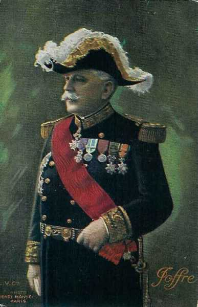
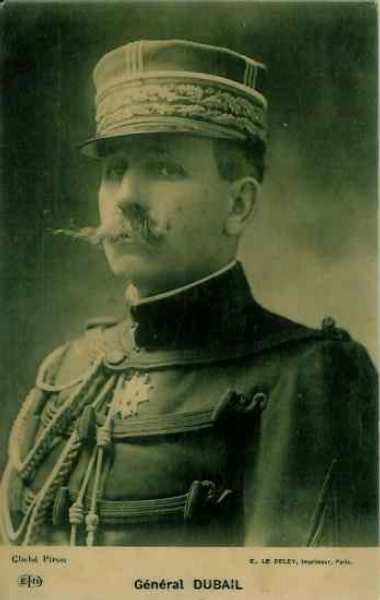
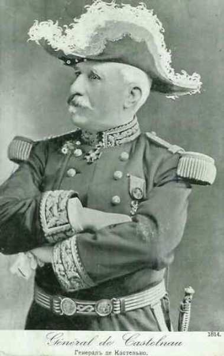
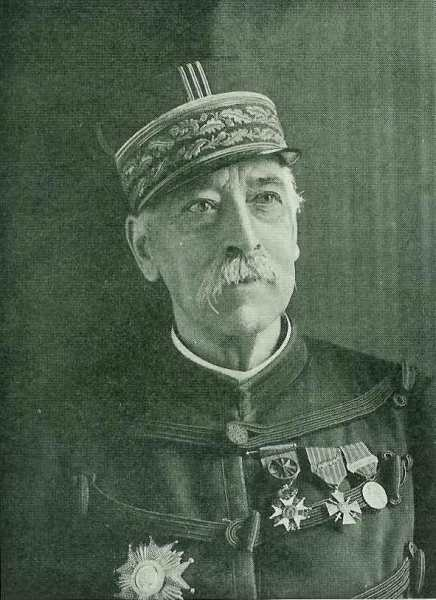
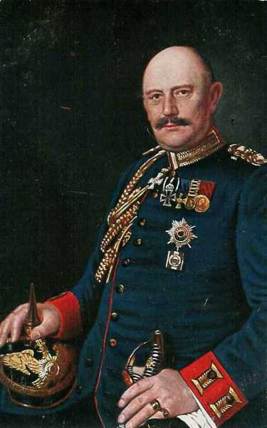
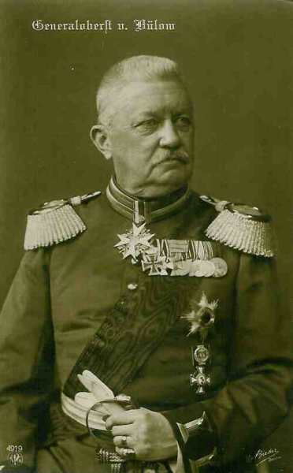
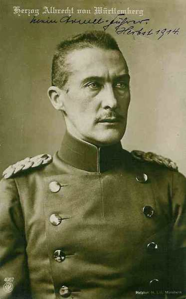
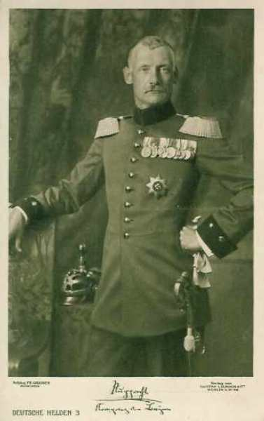
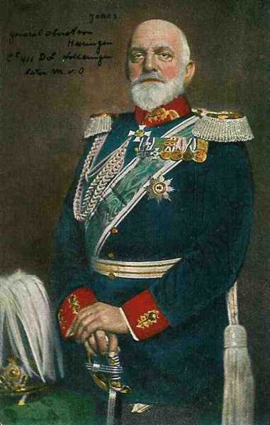
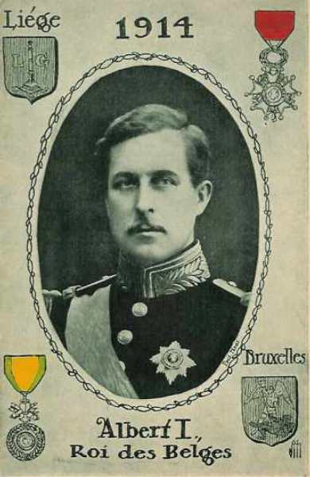

# Forces en présence

Les grandes puissances européennes peuvent mettre en ligne des armées considérables : 1.200.000 hommes pour les Français, 1.500.000 hommes pour les Allemands. La Grande Bretagne ne dispose en août 1914 que d’un corps expéditionnaire de 80.000 hommes.

### Les armées françaises

Bien que la population française soit moins nombreuse que la population allemande (39 millions d’habitants contre 65 millions), la France réussit à mobiliser autant de personnes que l’Allemagne. Le nombre d’exemptions est nettement plus réduit dans l’armée française : 82% des jeunes hommes sont appelés sous les armes contre 50% en Allemagne.

Les troupes françaises sont subdivisées en 5 armées, 22 C.A., 74 divisions dont un tiers de divisions de réserve. Chaque division compte 16.000 soldats et 4.500 chevaux. Il existe 10 divisions de cavalerie.

Q.G. de Joffre, général en chef des armées françaises : Vitry-le-François.

_Joffre, généralissime des armées françaises_
_Collection privée_

Une division d’infanterie (16.000 hommes) est composée de 2 brigades, chacune composée de 2 régiments d’infanterie, d’un régiment d’artillerie, d’un escadron de cavalerie et d’une compagnie du génie.

Un régiment d’infanterie (3400 hommes) est composé de 3 bataillons (1120 h). Chacun est composé de 4 compagnies (280 h). Une compagnie est composée de 4 sections (70 h).
Une section est composée de 2 demi-sections, dirigées par un sergent. Un caporal dirige une escouade, soit 15 hommes.

**Ie armée française**

_Général Dubail (Ie armée)_
_Collection privée_

Ie armée : Dubail, massée entre Belfort et Mirecourt - Lunéville  Q.G. à Epinal. Effectif : 280.000 hommes.

| Unité | Lieu | Commandant |
| --- | --- | --- |
| 8e corps | Bourges | de Castelli |
| 13e corps | Clermont-Ferrand | Alix |
| 14e corps | Lyon | Pouradier-Duteil |
| 21e corps | Epinal | Legrand |
| 6e division de cavalerie | Lyon | Le Villain |

**IIe armée française**

_Général de Castelnau (IIe armée)_
_Collection privée_

IIe armée : de Castelnau, massée entre Nomény et Nancy.
Q.G. à  Neufchâteau. Effectif : 180.000 hommes

| Unité | Lieu | Commandant |
| --- | --- | --- |
| 9e corps | Tours | Dubois |
| 15e corps | Marseille | Espinasse |
| 16e corps | Montpellier | Taverna |
| 18e corps | Bordeaux | de Mas-Latrie |
| 20e corps | Nancy | Foch |
| 2e G.D.R.(59e, 68e, 70e) | Montpellier | Durand |
| 2e division de cavalerie | Lunéville | Lescot |
| 10e division de cavalerie | Tours | Conneau |

**IIIe armée française**

_Général Ruffey (IIIe armée)_

IIIe armée : Ruffey, massée entre Audun-le-Roman et Verdun, Q.G. à  Verdun. Effectif : 200.000 hommes

Ruffey sera remplacé par Sarrail la veille de la bataille de la Marne.

| Unité | Lieu | Commandant |
| --- | --- | --- |
| 4e corps | Le Mans | Boelle |
| 5e corps | Orléans | Brochin |
| 6e corps | Châlons-sur-Marne | Sarrail |
| 7e division de cavalerie | Melun | Gillain |
| 54e division de réserve | Le Mans | Chailley |
| 55e division de réserve | Orléans | Leguay |
| 56e division de réserve | Châlons-sur-Marne | Micheler |

**IVe armée française**

_Général de Langle de Cary (IVe armée)_
_Collection privée_

IVe armée : de Langle de Cary, en réserve dans la région de Commercy, Q.G. à Saint-Dizier. Effectif : 160.000 hommes

| Unité | Lieu | Commandant |
| --- | --- | --- |
| 12e corps | Limoges | Roques |
| 17e corps | Toulouse | Poline |
| Corps d’armée colonial | Paris | Lefebvre |
| 9e division de cavalerie | Tours | de l’Espée |

**Ve armée française**

_Général Lanrezac (Ve armée)_
_Collection privée_

Ve armée : Lanrezac, massée de Verdun à la frontière belge, Q.G. à Rethel. Effectif : 240.000 hommes

Lanrezac sera remplacé par Franchet d’Esperey avant la bataille de la Marne.

| Unité | Lieu | Commandant |
| --- | --- | --- |
| 1e corps | Lille | Franchet d’Espérey |
| 2e corps | Amiens | Gérard |
| 3e corps | Rouen | Sauret |
| 10e corps | Rennes | Defforges |
| 11e corps | Nantes | Eydoux |
| 4e G.D.R. | Valabrègue |  |
| 4e division de cavalerie | Sedan | Abonneau |

**Corps de cavalerie Sordet**

_Les généraux  Castelnau, Sordet et Joffre_
_Collection privée_

| Unité | Commandant |
| --- | --- |
| 1e division de cavalerie | Buisson |
| 3e division de cavalerie | Dor de Lastours |
| 5e division de cavalerie | Bridoux |

**Groupe de divisions de réserve**
dans la région de Vesoul.

| Unité | Commandant |
| --- | --- |
| 58e division de réserve | Besset |
| 63e division de réserve | Lombard |
| 66e division de réserve | Woirhaye |

**Détachement puis armée d’Alsace**

Ce détachement deviendra l’armée d’Alsace sous le commandement de Pau, région de Belfort.

| Unité | Commandant |
| --- | --- |
| 7e corps d’armée | Bonneau |
| 8e division de cavalerie | Aubier |

**Réserves générales**

Réserves à la disposition du commandant en chef.

- 4 divisions
  3 divisions de réserve dans la région de Vesoul
  3 divisions de réserve dans la région de Sissonne
  Une artillerie lourde mobile

En outre

- 4 divisions de réserve rattachées aux places de l’Est
  4 divisions de réserve à la frontière des Alpes (l’Italie est supposée alliée aux empires centraux)
  12 divisions territoriales pour la défense des côtes
  4 divisions territoriales pour la défense des places
  3 divisions de réserve dont 2 dans le camp retranché de Paris

Total de l’armée française : **1.200.000 hommes**

### Les armées allemandes

Après 20 jours de mobilisation, l’armée comporte 43 corps d’armée, 81 divisions d’active, 44 Brigades de la Landwehr. Le tout représente 110 divisions d’infanterie comprenant chacune :

- 4 régiments d’infanterie à 3 bataillons et une compagnie de mitrailleuses.
  2 régiments d’artillerie à 6 batteries.
  1 régiment de cavalerie.
  1 régiment de pionniers.

Avec ses deux divisions d’infanterie, son bataillon d’obusiers lourds de 150, sa compagnie d’aérostiers et son escadrille d’avions, chaque C.A. représente une force de 40.000 hommes dont 30.000 combattants et 160 bouches à feu.

Grâce à son organisation et à l’utilisation de C.A.R. en première ligne, l’Allemagne va pouvoir jeter trente-six C.A. contre la France au lieu des vingt-cinq sur lesquels tablait l’état-major français. De ces forces, vingt-sept C.A. constituent la masse principale d’invasion, concentrée entre Aix-la-Chapelle et Thionville.

Le Q.G. de Moltke est à Coblence.

_Generaloberst von Moltke_
_Collection privée_

**Ie armée allemande**

_Général von Kluck (Ie armée)_
_Collection privée_

La première armée allemande constitue l’aile marchante de l’ensemble du dispositif. C’est elle qui devra parcourir la plus longue distance.

Ie armée : von Kluck, dans la région de Krefeld. Effectif : 320.000 hommes

| Unité | Lieu | Commandant |
| --- | --- | --- |
| 2e corps | Stettin | von Linsingen |
| 3e corps | Berlin | von Lochow |
| 3e corps de réserve | Berlin | von Beseler |
| 4e corps | Magdeburg | Sixt von Arnim |
| 4e corps de réserve | Magdeburg | von Gronau |
| 9e corps (partie) | Altona | von Quast |
| 9e corps de réserve | Altona | von Böhm |
| 10e, 11e et 27e brigade de la Landwehr |  |  |
| 2e corps de cavalerie |  | von der Marwitz |

**IIe armée allemande**

_Général von Bülow (IIe armée)_
_Collection privée_

IIe armée : von Bülow, dans la région de Aachen - Malmédy.
Effectif : 260.000 hommes

| Unité | Lieu | Commandant |
| --- | --- | --- |
| Corps Garde prussienne | Berlin | von Plettenberg |
| Corps de réserve garde prussienne | Berlin | von Gallwitz |
| 7e corps | Münster | von Einem |
| 7e corps de réserve | Münster | von Zwehl |
| 9e corps (partie) | Altona |  |
| 10e corps | Hanovre | von Emmich |
| 10e corps de réserve | Hanovre | von Kirchbach |
| 25e et 29e brigades de la Landwehr |  |  |
| 1e corps de cavalerie |  | von Richthofen |

**IIIe armée allemande**

_Général von Hausen (IIIe armée)_
_Collection privée_

IIIe armée : von Hausen, dans la région de Bitburg. Effectif : 180.000 hommes

| Unité | Lieu | Commandant |
| --- | --- | --- |
| 11e corps | Cassel | von Plüskow |
| 12e corps(1e saxon) | Dresde | von Elsa |
| 12e corps de réserve | Dresde | von Kirchbach |
| 19e corps (2e saxon) | Leipzig | von Laffert |
| 47e brigade de la Landwehr |  |  |
| 5e division de cavalerie |  | von Ilsemann |

**IVe armée allemande**

_duc de Wurtemberg (IVe armée)_
_Collection privée_

IVe armée : duc de Wurtemberg, dans le Luxembourg. Effectif : 200.000 hommes

| Unité | Lieu | Commandant |
| --- | --- | --- |
| 6e corps actif | Breslau | von Pritzelwitz |
| 8e corps actif | Coblence | Tülff von Tschepe und Weidenbach |
| 8e corps de réserve | Coblence | von und zu Egloffstein |
| 18e corps actif | Frankfurt am Main | von Schenk |
| 18e corps de réserve | Frankfurt am Main | von Steuben |
| 10e division de cavalerie |  |  |
| 49e brigade de la Landwehr |  |  |

**Ve armée allemande**

_Kronprinz de Prusse (Ve armée)_
_Collection privée_

Ve armée : Kronprinz de Prusse (fils aîné de Guillaume II), dans la région de Metz - Thionville. Effectif : 200.000 hommes

| Unité | Lieu | Commandant |
| --- | --- | --- |
| 5e corps | Königsberg | von Strantz |
| 5e corps de réserve | Königsberg | von Gündell |
| 6e corps de réserve | Breslau | von Gossler |
| 13e corps | Stuttgart | von Fabeck |
| 16e corps | Metz | von Mudra |
| 9e 13e 43e 45e 53e Br. de la Landwehr |  |  |
| 4e corps de cavalerie |  | von Hollen |

**VIe armée allemande**

_Kronprinz de Bavière (VIe armée)_
_Collection privée_

VIe armée : Rupprecht de Bavière, dans la région de Saarburg. Effectif : 220.000 hommes

| Unité | Lieu | Commandant |
| --- | --- | --- |
| 21e corps | Saarbrücken | von Below |
| 1e corps royal bavarois | Munich | von Xylander |
| 2e corps royal bavarois | Würzburg | von Martini |
| 3e corps royal bavarois | Nürnberg | von Gebsattel |
| Corps de réserve bavarois |  | von Fasbender |
| 6 brigades de la Landwehr |  |  |
| 3e corps de cavalerie |  | von Frommel |

**VIIe armée allemande**

_Général von Heeringen (VIIe armée)_
_Collection privée_

VIIe armée : von Heeringen, dans la région de Strasbourg. Effectif : 120.000 hommes

| Unité | Lieu | Commandant |
| --- | --- | --- |
| 14e corps | Karlsruhe | Von Hoiningen-Hüne |
| 15e corps | Strasbourg | Von Deimling |
| 14e corps de réserve | Karlsruhe | Von Schubert |
| 3 brigades de la Landwehr |  |  |

Le total de l’armée allemande est de **1.500.000 hommes**, en incluant les réserves.

6 divisions d’Ersatz constituent la réserve du commandement suprême (O.H.L.)

Au total, les armées des empires centraux et des alliés, s’équivalent en nombre de soldats, mais l’aile droite des Allemands est beaucoup plus puissante que l’aile gauche française :

Les 3 premières armées allemandes comportent 19 corps qui vont affronter les 9 C.A. des 4e et 5e armées + les 2 C.A. du corps expéditionnaire britannique et l’armée belge, soit presque deux contre un.

Les deux dernières armées, appuyées aux puissantes régions fortifiées de Metz - Thionville et Strasbourg - Molsheim ont pour rôle de faire face à l’offensive française en Alsace-Lorraine.

Les 5 premières armées composent l’aile d’attaque. Comprenant 26 C.A., elles pivotent autour de Metz sur le front Bruxelles - Thionville.

### L’armée anglaise

La Grande Bretagne compte en 1914 une population de 46 millions d’habitants. La flotte est la plus puissante au point qu’elle surpasse en importance les deuxième et troisième flottes mondiales réunies (c’est une constante de la politique britannique). L’armée de métier est en revanche relativement réduite : 182.000 hommes. Elle est renforcée de réservistes.

En temps de paix, l’armée anglaise est dispersée dans les colonies. Dans un premier temps, l’Angleterre peut débarquer sur le continent un corps expéditionnaire. Dès la nouvelle de la violation de la neutralité belge, les Anglais déclarent la guerre à l’Allemagne. Leurs effectifs se montent à :

- 6 divisions d’infanterie. (seules 4 divisions seront embarquées pour le continent sur décision de Lord Kitchener, ministre de la guerre).
  1 division de cavalerie.

Le chef du corps expéditionnaire est Lord French.

_Maréchal French (armée anglaise)_
_Collection privée_

**1e corps d’armée**

_Général Haig (1e C.A.)_
_Collection privée_

Ie corps d’armée : Douglas Haig (qui deviendra par la suite le commandant en chef de l’armée anglaise)

| Unité | Commandant |
| --- | --- |
| 1e division | Lomax |
| 2e division | Monro |

**2e corps d’armée**

_Général Smith Dorrien (2e C.A)._
_Collection privée_

2e corps d’armée : Smith Dorrien

| Unité | Commandant |
| --- | --- |
| 3e division | Hamilton |
| 5e division | Fergusson |

19e brigade d’infanterie (Royal Welsh Fusilliers, Scottish Rifles, Middlesex, Argyll and Sutherland highlanders).

Une division compte
18.000 hommes dont
12.000 fantassins
4.000 artilleurs
76 canons, soit 54 18 pounders - 18 obusiers de 4.5 inch - 4 60 pounders.

- Un régiment d’artillerie comporte trois branches :
  Royal Horse Artillery (RHA, en soutien à la cavalerie.
  Royal Field Artillery (RFA), desservant les canons de campagne et les obusiers.
  Royal Garrison Artillery (RGA), desservant les canons lourds.

- Un régiment de cavalerie comporte
  30 officiers.
  523 hommes.
  528 chevaux de troupe.
  74 chevaux de trait, pour les mitrailleuses et les 18 charettes du transport régimentaire.

- Une brigade dans l’armée anglaise compte
  127 officiers.
  3.958 hommes.
  258 chevaux.
  74 véhicules.

**Corps de cavalerie**

_Général Allenby (C.C.)_
_Collection privée_

Division de cavalerie, commandant Allenby

L’armée anglaise compte au total **80.000 hommes**.

### L’armée belge de campagne

_Albert Ie (armée belge)_
_Collection privée_

La Belgique compte 7.638.000 habitants. En 1913, le service militaire généralisé est introduit et l’armée dispose en théorie d’une force de 200.000 hommes. Dans les semaines qui suivent, 18.000 volontaires se présentent. L’armée comporte six divisions, composées de 25.000 à 30.000 hommes (alors que les divisions des autres armées  ont un effectif de plus ou moins 15.000 hommes). Une division de cavalerie comprend 4.500 hommes.

| Unité | Commandant | Régiments |
| --- | --- | --- |
| 1e division Gand | Guiette | 2e,3e,4e brigades mixtes |
| 2e division Anvers | Heimburger | 5e,6e,7e brigades mixtes |
| 3e division Liège | Leman | 9e,11e,12e,14e brigades mixtes |
| 4e division Namur | Michel | 8e,10e,13e,15e brigades mixtes |
| 5e division Mons | Ruwet | 1e,16e,17e brigades mixtes |
| 6e division Bruxelles | de Bonhome | 18e,19e,20e brigades mixtes |
| D.C. Bruxelles | de Witte | 1e,2e brigades de cavalerie |

Soit **120.000 hommes** pour l’armée de campagne

Le système défensif de la Belgique comporte en outre trois places fortes : Anvers constitue le camp retranché, Liège et Namur servent de places d’arrêt. L’armée est répartie en troupes de forteresse et en troupes de campagne : sur les 15 classes de milice appelées sous les armes, les 7 dernières sont réservées au service des forteresses et les 8 autres sont affectées à l’armée de campagne.

Conformément à la constitution, le Roi Albert commande les troupes. Son chef d’état-major est le général de gendarmerie de Selliers de Moranville.