# La cavalerie

La guerre de 14-18 est connue comme une guerre de tranchées. Pourtant, les deux armées alignaient en 1914 une importante cavalerie.

### La cavalerie française

La veille du conflit, la cavalerie française comprend nonante régiments dont septante-neuf stationnés dans la métropole, représentant 365 escadrons (64.000 hommes).

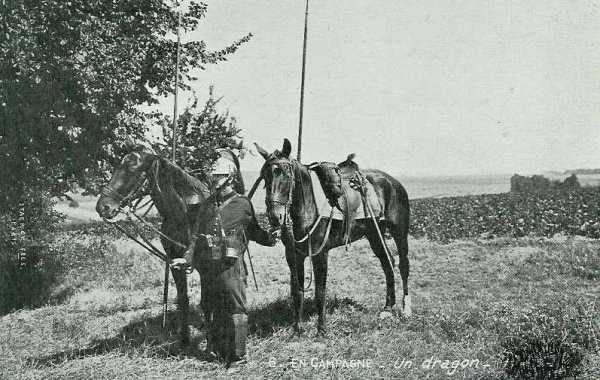
_Dragon avec son équipement_
_Collection privée_

**Race des chevaux**

- Anglo-normande pour la grosse cavalerie (cuirassiers et dragons)
  Anglo-arabe pour la cavalerie légère (chasseurs et hussards ainsi que dix régiments de dragons)

Ces chevaux proviennent en partie du dépôt de Mérignac.

- Un cheval de cuirassier pèse 500 kg à 7 ans
  Un cheval de dragons 450 kg.
  Un cheval de hussards ou de chasseurs 400 kg.

- **Armement**
  Carabine modèle 1890 de 8 mm, graduée jusqu’à 2000 m, avec un chargeur de trois cartouches tirant des balles d’infanterie.

- Sabre modèle 1896 de 95 à 90 cm

- Lance de 2,90 m de type 1890, remplacée progressivement par une lance entièrement métallique, attribuée dès 1912 à  tous les régiments endivisionnés sauf les cuirassiers.

- Cuirasse de 6 à 8 kg en tôle emboutie, pour les cuirassiers.

- Mitrailleuse Saint-Etienne, depuis 1908, à raison de deux pièces par régiment.

**Equipement**

- Selle modèle 1884
  Paquetage de campagne, pesant entre 125 et 110 kg.
  Matériel de franchissement de lignes d’eau : une voiture de pont de type Veyry, adoptée en 1901. Chaque régiment dispose d’un élément et l’ensemble doit permettre à la division de lancer un pont de 50 m.

**Organisation**

- Le peloton de 25 à 34 cavaliers
  L’escadron, composé de quatre pelotons (160 chevaux)
  Le régiment, composé de quatre escadrons (671 chevaux)

En 1913, tous les C.A. se voient attribuer un régiment de cavalerie légère à quatre escadrons en temps de pais, six en temps de guerre.

- Dès le 1e octobre 1913, l’armée française dispose de
  21 régiments de cavalerie de C.A. (hussards et chasseurs)
  58 régiments endivisionnés (cuirassiers, dragons, hussards ou chasseurs).
  11 régiments de cavalerie d’Algérie (chasseurs d’Afrique, spahis).

- Chacune des dix D.C. comprend organiquement
  Trois brigades de cavalerie.
  Un groupe d’artillerie à trois batteries de 75 mm.
  Un groupe de chasseurs cyclistes à trois pelotons.
  Un détachement de sapeurs du génie (cyclistes).

**Cuirassiers**

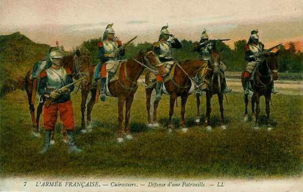
_Cuirassiers_
_Collection privée_

| Régiment | Casernement en 1914 | Corps d’armée / D.C. |
| --- | --- | --- |
| 1e régiment de cuirassiers | Paris | 1e D.C. |
| 2e régiment de cuirassiers | Paris | 1e D.C. |
| 3e régiment de cuirassiers | Reims, Vouziers | 4e D.C. |
| 4e régiment de cuirassiers | Cambrai | 3e D.C. |
| 5e régiment de cuirassiers | Tours | 9e D.C. |
| 6e régiment de cuirassiers | Sainte-Menehould, Châlons | 4e D.C. |
| 7e régiment de cuirassiers | Lyon | 6e D.C. |
| 8e régiment de cuirassiers | Tours | 9e D.C. |
| 9e régiment de cuirassiers | Douai | 3e D.C. |
| 10e régiment de cuirassiers | Lyon | 6e D.C. |
| 11e régiment de cuirassiers | Saint-Germain-en-Laye | 7e D.C. |
| 12e régiment de cuirassiers | Rambouillet | 7e D.C. |

**Dragons**

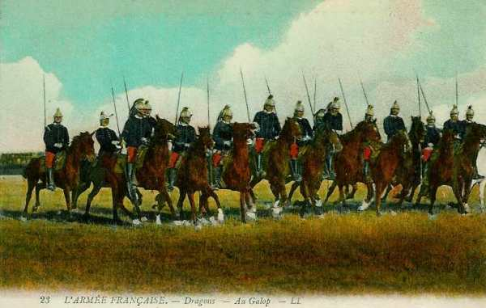
_Dragons_
_Collection privée_

| Régiment | Casernement en 1914 | Corps d’armée / D.C. |
| --- | --- | --- |
| 1e régiment de dragons | Luçon | 9e D.C. |
| 2e régiment de dragons | Lyon | 6e D.C. |
| 3e régiment de dragons | Nantes | 9e D.C. |
| 4e régiment de dragons | Commercy | 2e D.C. |
| 5e régiment de dragons | Compiègne | 3e D.C. |
| 6e régiment de dragons | Vincennes | 1e D.C. |
| 7e régiment de dragons | Fontainebleau | 7e D.C. |
| 8e régiment de dragons | Lunéville, Vitry-le-François | 2e D.C. |
| 9e régiment de dragons | Epernay | 5e D.C. |
| 10e régiment de dragons | Montauban | 10e D.C. |
| 11e régiment de dragons | Belfort | 8e D.C. |
| 12e régiment de dragons | Toul, Troyes | 2e D.C. |
| 13e régiment de dragons | Melun | 7e D.C. |
| 14e régiment de dragons | Saint-Etienne | 6e D.C. |
| 15e régiment de dragons | Libourne | 10e D.C. |
| 16e régiment de dragons | Reims | 5e D.C. |
| 17e régiment de dragons | Vienne, Auxonne | 8e D.C. |
| 18e régiment de dragons | Lure | 8e D.C. |
| 19e régiment de dragons | Carcassone | 10e D.C. |
| 20e régiment de dragons | Limoges | 10e D.C. |
| 21e régiment de dragons | Saint Omer | 3e D.C. |
| 22e régiment de dragons | Reims | 5e D.C. |
| 23e régiment de dragons | Vincennes | 1e D.C. |
| 24e régiment de dragons | Dinan | 9e D.C. |
| 25e régiment de dragons | Angers | 9e D.C. |
| 26e régiment de dragons | Dijon | 8e D.C. |
| 27e régiment de dragons | Versailles | 1e D.C. |
| 28e régiment de dragons | Sedan | 5e D.C. |
| 29e régiment de dragons | Provins | 5e D.C. |
| 30e régiment de dragons | Sedan | 4e D.C. |
| 31e régiment de dragons | Lunéville | 2e D.C. |
| 32e régiment de dragons | Chartres | 1e D.C. |

**Hussards**

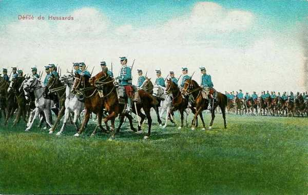
_Hussards_
_Collection privée_

| Régiment | Casernement en 1914 | Corps d’armée / D.C. |
| --- | --- | --- |
| 1e régiment de hussards | Béziers | 16e C.A. |
| 2e régiment de hussards | Verdun, Reims | 4e D.C. |
| 3e régiment de hussards | Senlis | 3e D.C. |
| 4e régiment de hussards | Verdun, Reims | 4e D.C. |
| 5e régiment de hussards | Nancy, Troyes | 20e C.A. |
| 6e régiment de hussards | Marseille | 15e C.A. |
| 7e régiment de hussards | Niort | 9e C.A. |
| 8e régiment de hussards | Meaux | 3e D.C. |
| 9e régiment de hussards | Chambéry | 14e C.A. |
| 10e régiment de hussards | Tarbes | 18e C.A. |
| 11e régiment de hussards | Tarascon | 6e D.C. |
| 12e régiment de hussards | Gray | 8e D.C. |
| 13e régiment de hussards | Dinan | 10e C.A. |
| 14e régiment de hussards | Alençon | 4e C.A. |

**Chasseurs à cheval**

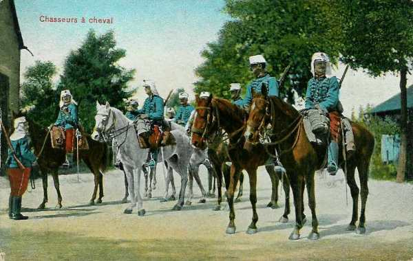
_Chasseurs à cheval_
_Collection privée_

| Régiment | Casernement en 1914 | Corps d’armée / D.C. |
| --- | --- | --- |
| 1e régiment de chasseurs à cheval | Châteaudun | 7e D.C. |
| 2e régiment de chasseurs à cheval | Pontivy | 13e C.A. |
| 3e régiment de chasseurs à cheval | Clermont-Ferrand | 13e C.A. |
| 4e régiment de chasseurs à cheval | Epinal | 21e C.A. |
| 5e régiment de chasseurs à cheval | Châlons-sur-Marne | 5e D.C. |
| 6e régiment de chasseurs à cheval | Lille | 1e C.A. |
| 7e régiment de chasseurs à cheval | Evreux | 3e C.A. |
| 8e régiment de chasseurs à cheval | Orléans | 15e C.A. |
| 9e régiment de chasseurs à cheval | Auch | 19e C.A. |
| 10e régiment de chasseurs à cheval | Sampigny, Sézanne | 7e D.C. |
| 11e régiment de chasseurs à cheval | Vesoul | 7e C.A. |
| 12e régiment de chasseurs à cheval | Saint-Mihiel, Sézanne | 6e C.A. |
| 13e régiment de chasseurs à cheval | Vienne | 6e D.C. |
| 14e régiment de chasseurs à cheval | Dôle | 8e D.C. |
| 15e régiment de chasseurs à cheval | Châlons-sur-Marne | 5e D.C. |
| 16e régiment de chasseurs à cheval | Beaune | 8e C.A. |
| 17e régiment de chasseurs à cheval | Lunéville, Vitry-le-François | 2e D.C. |
| 18e régiment de chasseurs à cheval | Lunéville | 2e D.C. |
| 19e régiment de chasseurs à cheval | La Fère | 2e C.A. |
| 20e régiment de chasseurs à cheval | Vendôme | 7e D.C. |
| 21e régiment de chasseurs à cheval | Limoges | 12e C.A. |

**Rôle de la cavalerie dans le plan XVII**

- Le plan XVII prévoit la mise sur pied de guerre de
  21 C.A., soit 43 divisions d’infanterie et trois divisions autonomes toutes actives
  10 divisions de cavalerie (58 régiments, dont 19 de C.A.).
  25 divisions de réserve
  12 divisions territoriales.

Sur le théâtre d’opérations du nord-est sont présents 545 escadrons, soit 4.193 officiers, 91.000 cavaliers et 100.200 chevaux.

Les 1e, 3e et 5e D.C. forment le corps de cavalerie Sordet, provisoirement rattaché à la Ve armée.

- Les autres D.C. sont attribuées comme suit :
  6e et 8e à la Ie armée
  2e et 10e à la IIe armée
  7e à la IIIe armée
  9e à la IVe armée
  4e à la Ve armée

**La période de couverture**

- 7e C.A. : 14e D.I. et 8e D.C. à l’est de Belfort, 41e D.I. au Tillot

- 21e C.A. : 6e D.C. le long de la Vezouse, 2e D.I. à Marainviller.

- 20e C.A. : ses deux divisions au nord de Nancy et la 2e D.C. entre Bezange et Avricourt.

- 6e C.A. : 40e D.I. à Domèvres, 12e D.I. vers Vigneulles, 42e D.I. à Fresnes-en-Woëvre, 7e D.C. vers Apremont, 4e D.I. à l’ouest de Longuyon, en liaison avec la place de Verdun, 4e D.C. à gauche de la 4e D.I.

### La cavalerie allemande

La cavalerie allemande comprend cent dix régiments, soit 83.000 hommes.

Elle a pour objet d’éclairer la marche des armées. A part à Haelen, elle a évité de s’engager dans un combat, l’attaque étant du ressort de l’artillerie, puis de l’infanterie.

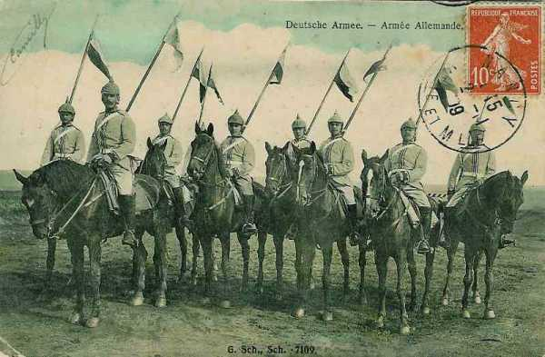
_Eclaireurs allemands_
_Collection privée_

**Armement**

- Une lance à tube d’acier (depuis 1889)
  Un sabre à lame droite de modèle 1852 pour la grosse cavalerie.
  Un sabre à lame droite de modèle 1889 pour les autres subdivisions d’armes.
  La carabine modèle 1898 avec un chargeur de cinq cartouches de système Mauser, tirant la balle "S".
  Un pistolet de modèle 1908 avec chargeur de huit cartouches pour les trompettes, téléphonistes, sous-officiers.

Le sabre est porté à droite de la selle et la carabine à gauche.

Le cavalier emporte 75 cartouches (60 sur l’homme, 15 sur le cheval).

La selle comporte deux sacoches en cuir et deux sacoches en toile imperméable.

**Organisation**

Un C.C. comprend trois divisions. Chaque division comprend trois brigades, constituées chacune de 2 régiments de cavaliers à quatre escadrons.

Chaque D.C. dispose d’une section de mitrailleuses, d’un groupe d’artillerie à cheval et d’une station légère de T.S.F.

Chaque D.C. est soutenue par un bataillon de chasseurs à pied, et chacun de ces bataillons comprend une compagnie cycliste.

A la mobilisation, l’armée allemande compte 110 régiments actifs à quatre escadrons actifs et un escadron de dépôt, avec six régiments à six escadrons. Cela représente en tout 452 escadrons.

66 de ces régiments entrent dans la composition de onze divisions de cavalerie.

Les 44 régiments restants dont les six à six escadrons fournissent la cavalerie des cinquante divisions actives.

- L’effectif d’un régiment mobilisé est de
  36 officiers, 688 sous-officiers et hommes.
  769 chevaux et 19 voitures.

- En incluant les réservistes, l’armée allemande mobilisée comporte
  452 escadrons actifs
  96 escadrons de réserve
  64 escadrons de la Landwehr
  6 escadrons d’Ersatz.

Une division

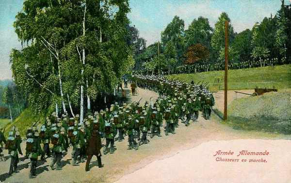
_Chasseurs allemands_
_Collection privée_

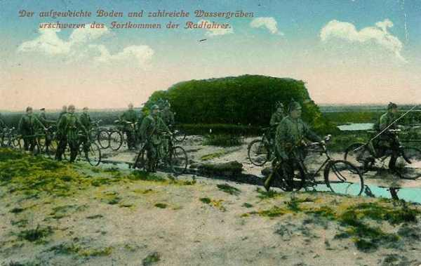
_compagnie cycliste allemande_
_Collection privée_

**Cuirassiers (Kürassiere)**

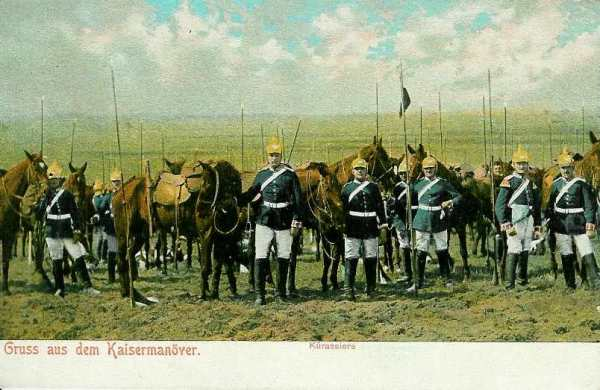
_Kürassiere_
_Collection privée_

| Régiment | Casernement en 1914 | Corps d’armée / C.C. |
| --- | --- | --- |
| Regt. der Gardes du Corps | Potsdam | C.C. von Richthofen |
| Garde-Kürassier-Regt. | Berlin | C.C. von Richthofen |
| Leib-Kürassier-Regt. Nr 1 | Breslau | C.C. von Richthofen |
| Kürassier-Regt. Nr. 2 | Pasewalk | C.C. von der Marwitz |
| Kürassier-Regt. Nr. 3 | Königsberg | 1e C.A. |
| Kürassier-Regt. Nr. 4 | Münster | C.C. von Schmettow |
| Kürassier-Regt. Nr. 5 | Riesenburg | 20e C.A. |
| Kürassier-Regt. Nr. 6 | Brandenburg a. H | 3e C.A. |
| Kürassier-Regt. Nr. 7 | Quedlimburg / Halberstadt | C.C. von der Marwitz |
| Kürassier-Regt. Nr. 8 | Deutz | 8e C.A. |
| Königlsch Sächsisch Garde-Reiter Regt. | Dresden | C.C. von Frommel |
| Königlich Sächsisch Karabinier Regt. | Borna | C.C. von Frommel |

**Dragons (Dragoner)**

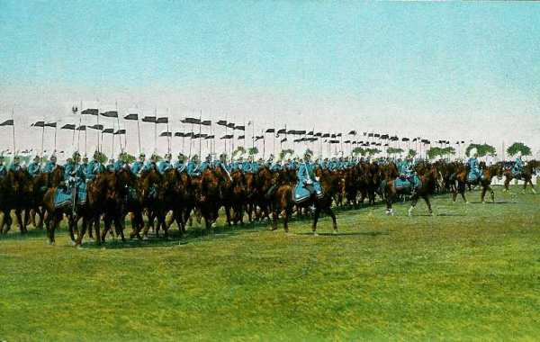
_Dragoner_
_Collection privée_

| Régiment | Casernement en 1914 | Corps d’armée |
| --- | --- | --- |
| 1. Garde-Dragoner-Regt. | Berlin | C.C. von Richthofen |
| 2. Garde-Dragoner-Regt. | Berlin | C.C. von Richthofen |
| Dragoner-Regt. Nr. 1 | Tilsit | 1e C.A. |
| Brandenburgisches Dragoner-Regt. Nr. 2 | Schwedt a. O | C.C. von der Marwitz |
| Grenadier-Regt. zu Pferde Nr. 3 | Bromberg | 2e C.A. |
| Dragoner-Regt. Nr. 4 | Lüben | C.C. von Richthofen |
| Dragoner-Regt. Nr. 5 | Hofgeismar | C.C. von Hollen |
| Dragoner-Regt. Nr. 6 | Mainz | 18e C.A. |
| Dragoner-Regt. Nr. 7 | Saarbrücken | 21e C.A. |
| Dragoner-Regt. Nr. 8 | Kreuzburg / Bernstadt | C.C. von Richthofen |
| Dragoner-Regt. Nr. 9 | Metz | C.C. von Hollen |
| Dragoner-Regt. Nr. 10 | Allenstein | 20e C.A. |
| Dragoner-Regt. Nr. 11 | Lyck | 20e C.A. |
| Dragoner-Regt. Nr. 12 | Gnesen | 2e C.A. |
| Dragoner-Regt. Nr. 13 | Metz | C.C. von Hollen |
| Dragoner-Regt. Nr. 14 | Colmar | 15e C.A. |
| Dragoner-Regt. Nr. 15 | Hagenau | C.C. von Frommel |
| Dragoner-Regt. Nr. 16 | Lüneburg | 10e C.A. |
| Dragoner-Regt. Nr. 17 | Ludwigslust | C.C. von der Marwitz |
| Dragoner-Regt. Nr. 18 | Parchim | C.C. von der Marwitz |
| Dragoner-Regt. Nr. 19 | Oldenburg | C.C. von Schmettow |
| Badisches Leib-Dragoner-Regt. Nr. 20 | Karlsruhe | C.C. von Hollen |
| Badisches Leib-Dragoner-Regt. Nr. 21 | Bruchsal-Schwetzingen | C.C. von Hollen |
| Badisches Dragoner-Regt. Nr. 22 | Mülhausen | 14e C.A. |
| Garde-Dragoner-Regt. Nr. 23 | Darmstadt | C.C. von Hollen |
| Leib-Dragoner-Regt. Nr. 24 | Darmstadt | C.C. von Hollen |
| Dragoner-Regt. Nr. 25 | Ludwigsburg | C.C. von Frommel |
| Dragoner-Regt. Nr. 26 | Stuttgart | C.C. von Frommel |

**Hussards (Husaren)**

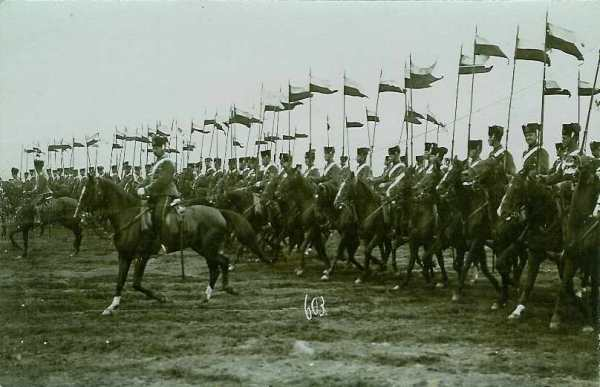
_Husaren_
_Collection privée_

| Régiment | Casernement en 1914 | Corps d’armée |
| --- | --- | --- |
| Leib-Garde-Husaren-Regt | Potsdam | Garde |
| 1. Leib-Husaren-Regt. Nr. 1 | Danzig-Langfuhr | C.C. von der Marwitz |
| 2. Leib-Husaren-Regt. Nr. 2 | Danzig-Langfuhr | C.C. von der Marwitz |
| Husaren-Regt. Nr. 3 | Rathenow | 3e C.A. |
| Husaren-Regt. Nr. 4 | Ohlau | C.C. von Ricthofen |
| Husaren-Regt. Nr. 5 | Stolp | 17e C.A. |
| Husaren-Regt. Nr. 6 | Leobschütz-Ratibor | C.C. von Richthofen |
| Husaren-Regt. Nr. 7 | Bonn | 8e C.A. |
| Husaren-Regt. Nr. 8 | Paderborn | C.C. von Schmettow |
| Husaren-Regt. Nr. 9 | Strassburg | C.C. von Frommel |
| Husaren-Regt. Nr. 10 | Stendal | 4e C.A. |
| Husaren-Regt. Nr. 11 | Crefeld | C.C. von Schmettow |
| Husaren-Regt. Nr. 12 | Torgau | C.C. von der Marwitz |
| Husaren-Regt. Nr. 13 | Diedenhofen | C.C. von Hollen |
| Husaren-Regt. Nr. 14 | Cassel | C.C. von Hollen |
| Husaren-Regt. Nr. 15 | Wandsbek | C.C. von der Marwitz |
| Husaren-Regt. Nr. 16 | Schleswig | C.C. von der Marwitz |
| Husaren-Regt. Nr. 17 | Braunschweig | 10e C.A. |
| Königl. Sächs. Husaren-Regt. Nr. 18 | Grossenhain | 12e C.A. |
| Königl. Sächs. Husaren-Regt. Nr. 19 | Grimma | 19e C.A. |
| Königl. Sächs. Husaren-Regt. Nr. 20 | Bautzen | 12e C.A. |

**Uhlans (Ulanen)**

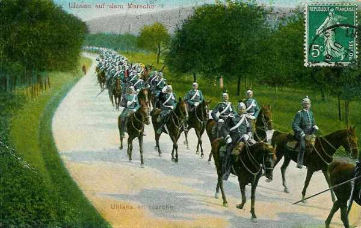
_Uhlans_
_Collection privée_

| Régiment | Casernement en 1914 | Corps d’armée |
| --- | --- | --- |
| 1. Garde-Ulanen-Regt. | Potsdam | C.C. von Richthofen |
| 2. Garde-Ulanen-Regt. | Berlin | C.C. von Richthofen |
| 3. Garde-Ulanen-Regt | Potsdam | Garde |
| Ulanen-Regt. Nr. 1 | Militsch-Ostrowo | 5e C.A. |
| Ulanen-Regt. Nr. 2 | Gleiwitz-Pless | 6e C.A. |
| Ulanen-Regt. Nr. 3 | Fürstenwalde | C.C. von der Marwitz |
| Ulanen-Regt. Nr. 4 | Thorn | 20e C.A. |
| Ulanen-Regt. Nr. 5 | Düsseldorf | C.C. von Schmettow |
| Ulanen-Regt. Nr. 6 | Hanau | 18e C.A. |
| Ulanen-Regt. Nr. 7 | Saarbrücken | 21e C.A. |
| Ulanen-Regt. Nr. 8 | Gumbinnen-Stallupönen | 1e C.A. |
| Ulanen-Regt. Nr. 9 | Demmin | C.C. von der Marwitz |
| Ulanen-Regt. Nr. 10 | Züllichau | C.C. von Richthofen |
| Ulanen-Regt. Nr. 11 | Saarburg | C.C. von Frommel |
| Ulanen-Regt. Nr. 12 | Insterburg | 1e C.A. |
| Ulanen-Regt. Nr. 13 | Hannover | C.C. von Schmettow |
| Ulanen-Regt. Nr. 14 | Avolde-Mörchingen | 16e C.A. |
| Ulanen-Regt. Nr. 15 | Saarburg | C.C. von Frommel |
| Ulanen-Regt. Nr. 16 | Salzwedel | 4e C.A. |
| Königl. Sächs. 1.Ulanen-Regt. Nr. 17 | Oschatz | C.C. von Frommel |
| Königl. Sächs. 2. Ulanen-Regt. Nr. 18 | Leipzig | 19e C.A. |
| Ulanen-Regt. Nr. 19 (Wurtemberg) | Ulm-Wiblingen | 13e C.A. |
| Ulanen-Regt. Nr. 20 (Wurtemberg) | Ludwigsburg | 13e C.A. |
| Königl. Sächs. 3. Ulanen-Regt. Nr. 21 | Chemnitz | C.C. von Frommel |

**Chasseurs à cheval (Jäger zu Pferde)**

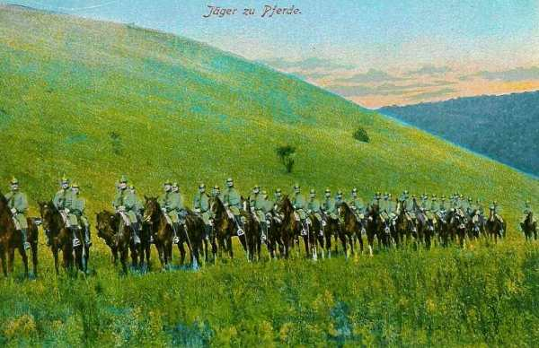
_Jäger zu Pferde_
_Collection privée_

| Régiment | Casernement en 1914 | Corps d’armée |
| --- | --- | --- |
| Regt. Königs-Jäger zu Pferde Nr. 1 | Posen | 5e C.A. |
| Jäger-Regt. zu Pferde Nr. 2 | Langensalza | C.C. von Frommel |
| Jäger-Regt. zu Pferde Nr. 3 | Colmar | 15e C.A. |
| Jäger-Regt. zu Pferde Nr. 4 | Graudenz | 17e C.A. |
| Jäger-Regt. zu Pferde Nr. 5 | Mülhausen | 14e C.A. |
| Jäger-Regt. zu Pferde Nr. 6 | Erfurt | C.C. von Frommel |
| Jäger-Regt. zu Pferde Nr. 7 | Trier | C.C. von Hollen |
| Jäger-Regt. zu Pferde Nr. 8 | Trier | C.C. von Hollen |
| Jäger-Regt. zu Pferde Nr. 9 | Insterburg | 1e C.A. |
| Jäger-Regt. zu Pferde Nr. 10 | Angerburg-Goldap | 1e C.A. |
| Jäger-Regt. zu Pferde Nr. 11 | Tarnowitz-Lüblinitz | 6e C.A. |
| Jäger-Regt. zu Pferde Nr. 12 | Avold | 16e C.A. |
| Jäger-Regt. zu Pferde Nr. 13 | Saarlouis | C.C. von Hollen |

**Armée bavaroise**

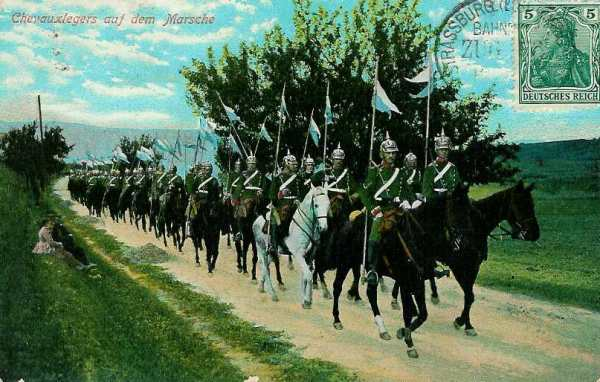
_Chevau-légers_
_Collection privée_

| Régiment | Casernement en 1914 | Corps d’armée |
| --- | --- | --- |
| 1. Schweres Reiter-Regt. | München | D.C. bavaroise |
| 2. Schweres Reiter-Regt. | Landshut | D.C. bavaroise |
| 1. Ulanen-Regt. | Bamberg | D.C. bavaroise |
| 2. Ulanen-Regt. | Ansbach | D.C. bavaroise |
| 1. Chevaulégers-Regt. | Nürnberg | D.C. bavaroise |
| 2. Chevaulégers-Regt. | Regensburg | 3e C.A. bavarois |
| 3. Chevaulégers-Regt. | Dieuze | 2e C.A. bavarois |
| 4. Chevaulégers-Regt. | Augsburg | 1e C.A. bavarois |
| 5. Chevaulégers-Regt. | Saargemünd | 2e C.A. bavarois |
| 6. Chevaulégers-Regt. | Bayreuth | D.C. bavaroise |
| 7. Chevaulégers-Regt. | Straubing | 3e C.A. bavarois |
| 8. Chevaulégers-Regt. | Dillingen | 1e C.A. bavarois |

.

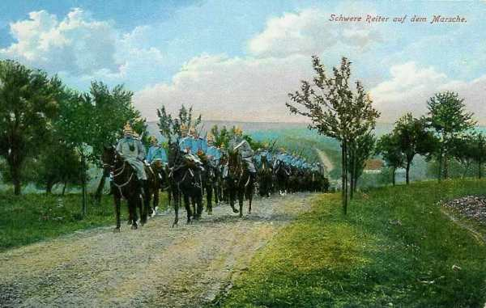
_Schwere Reiter bavarois_
_Collection privée_

### Rôle de la cavalerie dans le plan Schlieffen

Quatre corps de cavalerie sont constitués avec comme objectif de précéder les armées.

**1e C.C. von Richthofen**
Comprend la D.C. de la Garde et la 5e D.C.
Il doit précéder le IIIe armée (von Hausen). Il se heurtera aux forces françaises à Dinant.

**2e C.C. von der Marwitz**
Comprend les 2e, 4e et 9e D.C.
Il doit éclairer les Ie (von Kluck) et IIe armées (von Bülow) et opérera en territoire belge. Il se heurtera aux forces belges à Halen.

**3e C.A. von Frommel**
Comprend les 7e et 8e D.C., ainsi que la D.C. bavaroise.
Il éclaire la VIe armée (kronprinz rupprecht de Bavière). Il opérera en Lorraine.

**4e C.C. von Hollen**
Comprend les 3e et 6e D.C.
Il précède les IVe (duc de Wurtemberg) et Ve armées(kronprinz de Prusse).
Il opérera dans les ardennes belges et en Argonne et livrera la combat de Mangiennes.