# La mobilisation et la concentration

Dès que l’ordre de mobilisation est affiché, les réservistes se rendent à l’appel et sont dirigés vers les centres mobilisateurs. Equipés, ils sont ensuite dirigés en chemin de fer vers le lieu de concentration des armées, prévu de longue date dans les plans des Etats-Majors. Les Anglais mobilisent dès qu’est connue la violation du territoire belge.

### La mobilisation française

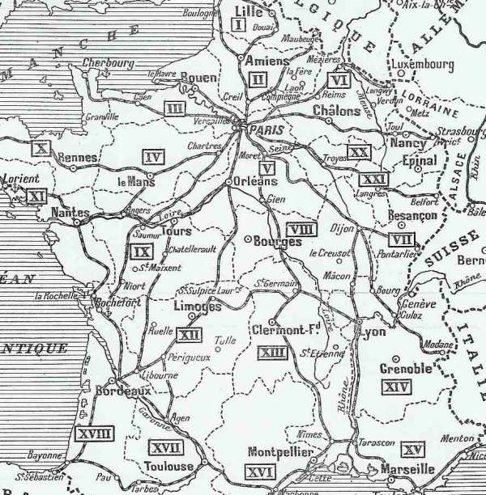
_Circonscriptions françaises_
_BBSM_

- Le 31 juillet à 17h40, est transmis l’ordre de mise en marche des troupes de couverture par voie ferrée (sur l’insistance de Joffre). Les transports doivent débuter le 31 juillet à 21 heures et se poursuivre jusqu’au 3 août à 12 heures. Sur le seul réseau de l’Est circulent 538 trains spéciaux.

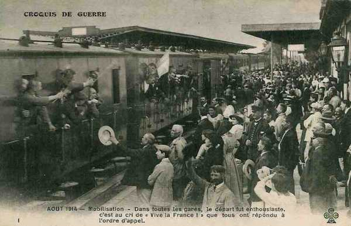
_Mobilisation française_
_Collection privée_

- Le 1e août l’ordre de mobilisation est adressé à 16h50 aux commissions de réseau. Les transports doivent commencer le 2 août. Sur le seul réseau de l’Est, 546 trains spéciaux circuleront.

- A partir du 2 août, les opérations de mobilisation se déroulent méthodiquement conformément aux prévisions du plan XVII. Les réservistes répondent à l’ordre de mobilisation avec élan. Les déficits demeurent très au-dessous des prévisions.

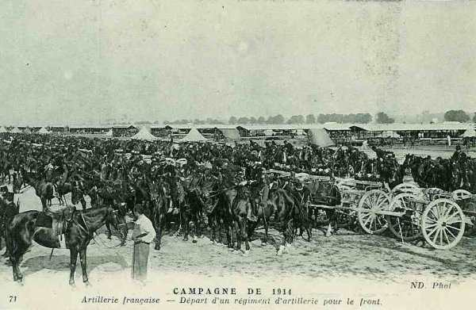
_Départ d’un régiment d’artillerie_
_Collection privée_

- Du 1 au 15 août, l’on rappelle 2.810.000 hommes dont 1.710.000 réservistes et 1.100.000 territoriaux. Les réservistes sont convoyés durant les quatre premiers jours vers les centres mobilisateurs. A partir du cinquième jour débutent les transports de concentration.

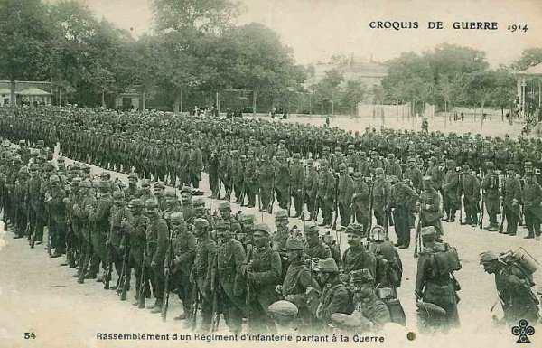
_Régiment partant pour la guerre_
_Collection privée_

- La mobilisation met sur pied, tant dans la métropole que dans l’Afrique du Nord 3.780.000 hommes dont 1.300.000 dans l’armée de campagne et 1.400.000 dans les forteresses.

### La mobilisation allemande

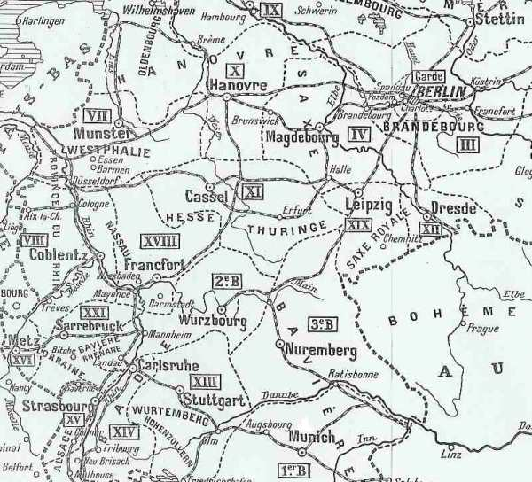
_Circonscriptions allemandes_
_BBSM_

- Le succès de la campagne dépend d’une attaque rapide -contre la France pour pouvoir mettre les armées françaises hors de cause avant que les Russes puissent intervenir.

- Le grand Etat-Major allemand a prévu une mobilisation par étapes permettant un effet de surprise en cas d’attaque.

- L’armée permanente comprend 800.000 hommes. Elle peut rapidement être mise en état d’alerte.

- Treize lignes de chemin de fer conduisent des centres de mobilisation des C.A. vers leur zone de déploiement ; quatre lignes de rocade permettent d’effectuer en trois jours le déplacement de quatre C.A. de la région de Strasbourg vers celle à l’ouest de Cologne et inversément.
En 1913, l’O.H.L. s’est opposé à l’électrification des lignes ustilisées pour le déploiement des armées, ou se trouvant près de la frontière. La grosse masse des transports de mobilisation se fait les troisième, quatrième et cinquième jours de mobilisation.

La déploiement de l’armée commence le sixième jour. Les vingt-quatre C.A. doivent se répartir les treize lignes, à raison de deux ou trois C.A. par ligne.

La densité du trafic est de 50 trains en 24h, avec une pause journalière de 4h. Le transport d’un C.A. se fait à raison de vingt trains par jour et dans l’ordre suivant : personnel d’installation, formations de pionniers et de boulangers, cavalerie, infanterie, artillerie des divisions puis artillerie lourde et enfin les trains. Un C.A. utilise cent quarante trains, une D.C., trente et un.

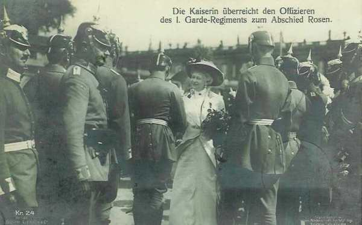
_L’impératrice d’Allemagne prenant congé des officiers du 1. Garde-Regiment_
_Collection privée_

- Une phase préparatoire, le « Zustand der drohende Kriegsgefahr », permet de rappeler des réservistes alors que la mobilisation n’est pas encore proclamée.

- Quand la mobilisation est officiellement proclamée, elle est déjà en route depuis plusieurs jours, prenant les Français de court.

- Le 20 août, la mobilisation terminée, le nombre total de rationnaires s’élève à 3.840.000 hommes et 880.000 chevaux dont pour les troupes de campagne 2.100.000 hommes, et 730.000 chevaux. Les corps d’armée actifs sont dans leur zone de concentration dès le 12 août.

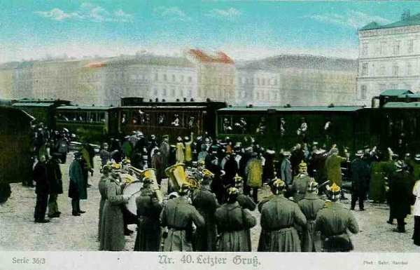
_Mobilisation en Allemagne_
_Collection privée_

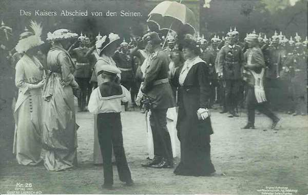
_Guillaume II prenant congé des siens_
_Collection privée_

### La mobilisation britannique

**Les accords avec la France**

Dès la conclusion de l’entente cordiale en 1904, l’Angleterre et la France entament des conversations en vue d’une coopération militaire en cas de guerre avec l’Allemagne.

Les accords entre France et Grande-Bretagne ne sont toutefois pas contraignants. Une lettre signée en 1906 par Edward Grey et l’ambassadeur Cambon prévoit que les deux pays sont libres de se prêter assistance en cas de guerre. En 1909, il est décidé que la question de l’envoi d’un corps expéditionnaire britannique sera du ressort du « government of the day ».

Cette attitude va changer avec l’arrivée de Henry Wilson au War Office. Il constate que malgré des conversations entre états-majors français et anglais, il n’existe aucun plan de transport de troupes anglaises vers la France. Son but sera alors d’organiser le corps expéditionnaire pour une mobilisation et un déploiement rapides en France en cas de guerre.

- Les divisions d’infanterie dès le 4e jour après la mobilisation (M4).

- Les divisions de cavalerie dès le 7e jour (M7).

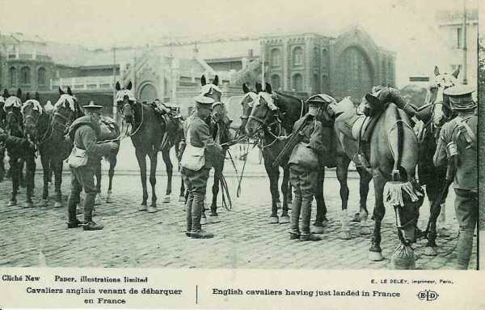
_Cavaliers anglais débarqués_
_Collection privée_

- L’artillerie le 9 jour (M9).

Le 20 juillet 1911, Wilson et Dubail, chef de l’état-major général français, établissent et signent un mémorandum concernant l’envoi de 6 divisions d’infanterie et d’une division de cavalerie en France. (150.000 hommes et 67.000 chevaux) qui seront débarqués à Boulogne, Le Havre ou Rouen entre le 4e et le 12e jour de mobilisation. La mobilisation anglaise doit avoir lieu le même jour que la mobilisation française. Le corps expéditionnaire doit  protéger l’aile gauche de l’armée française et dans ce but, il devra se concentrer à Maubeuge. Cet accord est conclu sous la seule responsabilité de Wilson en ce qui concerne l’Angleterre, le cabinet britannique n’en ayant pas été informé.

**Les décisions en août 1914**

La France déclare la guerre à l’Allemagne le 1e août. Le « government of the day » doit prendre la décision d’envoyer ou non un corps expéditionnaire. Le cabinet est divisé, la chambre des communes aussi.

Edward Grey, ministre des affaires étrangères et Winston Churchill, favorables à une intervention, se trouvent en minorité et donc fort embarrassés vis-à-vis de la France.

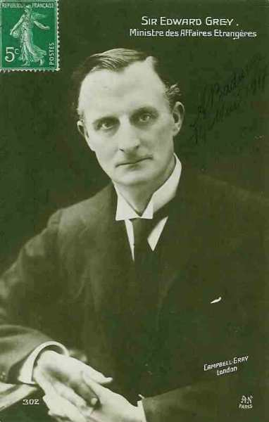
_Edward  Grey_
_Collection privée_

Il faut une raison pour décider le cabinet. Ce sera le traité de 1839 garantissant la neutralité de la Belgique. La Grande-Bretagne demande à Berlin si la neutralité de la Belgique sera respectée. L’Allemagne n’envoie aucune réponse.

L’après-midi du 3, Edward Grey se rend au Parlement et expose la position du gouvernement. La Chambre des Communes donne son appui pour l’entrée en guerre de l’Angleterre si l’armée allemande ne se retire pas de Belgique dans les 24 heures. Un ultimatum est envoyé à Berlin et le 4 août à 11 heures, l’Angleterre est en guerre avec l’Allemagne.

**Déroulement**

Le système anglais prévoit un engagement pour une période de 12 ans, dont 7 dans l’armée active et 5 dans la réserve. En 1914, sur un total de 160.000 soldats, 60% sont des réservistes rappelés.

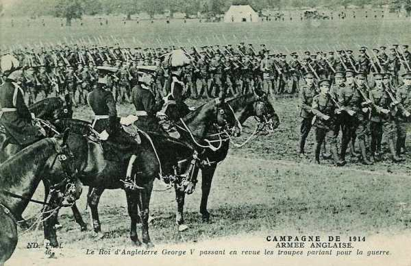
_Georges V passant en revue ses troupes mobilisées_
_Collection privée_

Les télégrammes sont envoyés aux réservistes, des ordres de réquisition sont envoyés pour les trains, bateaux et chevaux.

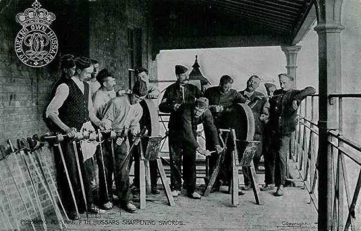
_Hussards anglais aiguisant leur sabre_
_Collection privée_

Kitchener accepte le poste de ministre de la guerre le 6 août. Il décide de conserver en Angleterre 2 divisions sur les 6 prévues. L’embarquement débutera le 9 août.

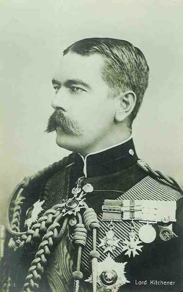
_Kitchener_
_Collection privée_

### La mobilisation belge

L’armée en temps de paix compte 58.000 hommes. L’effectif de l’armée de campagne doit se monter à 175.000 hommes en temps de guerre, soit six divisions. En fait, on ne dépassera pas 118.000 hommes.

Le 27 juillet, trois classes de milice sont rappelées : l’armée est mise sur pied de paix renforcé.
Le 31 juillet à 19h a lieu la mobilisation générale.

### Concentration de l’armée française

Dès le 2 août, Joffre apprend que le Grand-Duché de Luxembourg est envahi et que l’Allemagne a adressé un ultimatum à la Belgique, confirmant l’hypothèse d’un passage des armées allemandes à travers la Belgique.

La variante du plan XVII est donc mise en œuvre. La Ve armée doit se concentrer à Mézières.

Les commissions de régulation entrent en fonction et les transports de concentration commencent. Ils s’échelonneront sur deux périodes

- Du 5/8 à 12h jusqu’au 12/8 à 12h. : mouvement des éléments combattants des C.A. : 534 trains.

- Du 12/8 à 12h jusqu’au 18/8 à 12h. : reste des éléments combattants des divisions de réserve plus les parcs de convois : 1.744 trains.

L’approvisionnement des places fortes (Verdun, Belfort etc....) requiert 243 trains.

Dix lignes de chemin de fer sont utilisées :

- Ligne A : Lyon, Bourg - Besançon - Lure pour transporter la Ie armée (Dubail).

- Ligne B : Saint-Etienne vers Vesoul pour cette même armée.

- Ligne C : Mâcon - Dijon - Langres - Mirecourt pour transporter la IIe armée (de Castelnau).

- Ligne D : Angoulême - Tours - Orléans - Troyes -  Chaumont - Nancy pour la même armée.

- Ligne E : Limoges - Auxerre - Commercy pour la IV armée (de Langle de Cary).

- Ligne F : Melun - Vitry-le-François pour la IIIe armée (Ruffey).

- Ligne G : Le Mans - Chartres - Reims - Verdun pour la même armée.

- Ligne H : Rennes - Nantes - Pontoise - Compiègne - Soissons - Rethel - Vouziers pour la Ve armée (Lanrezac).

- Ligne I : Mézières - Montmédy pour la même armée.

- Ligne K : Lille - Mézières pour la même armée.

L’opération doit permettre d’acheminer les éléments combattants d’armée, de C.A. et une partie des divisions de réserve. Le reste, parcs et convois est transporté entre le 11e et le 17e jour. Toutes les unités d’un même C.A. sont convoyées via la même ligne.

### Concentration de l’armée anglaise

La tâche de planification du transport du B.E.F. sur le continent demanda des années et fut l’œuvre de Henry Wilson et de son staff d’une dizaine d’officiers, qui agit sans appui officiel et dans le secret. Certains membres du cabinet britannique étaient partisans du « splendide isolement » et auraient entravé ces efforts.

Chaque division d’infanterie comprend 3 brigades, chacune de 4 bataillons, soit 18.000 hommes, dont 12.000 sont dans l’infanterie, 4.000 dans l’artillerie, responsables de 76 canons. Il y a 24 mitrailleuses par division.

Pour transporter les troupes vers les ports, il faut faire circuler 1.800 trains

Le transport des troupes par mer nécessite un arrangement avec l’Amirauté. Les ports d’embarquement sont :

Southampton pour les troupes en Grande Bretagne

- Cork, Dublin et Belfast pour les troupes en Irlande.

- Avonmouth pour les véhicules automobiles.

- Newhaven pour le matériel.

- Liverpool pour la nourriture.

Chaque jour, une moyenne de 13 navires quitte les ports anglais.

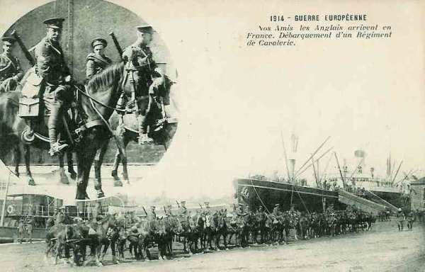
_Débarquement d’un régiment de cavalerie anglais_
_Collection privée_

La capacité de débarquement dans les ports français est de 30 navires par jour au Havre, 20 à Rouen, 11 à Boulogne.

La capacité ferroviaire de desservir les ports français est de 25 trains par jour à partir du Havre, 15 à partir de Rouen, 20 à partir de Boulogne. Tous ces trains passent par la jonction d’Amiens d’où risque d’embouteillage.

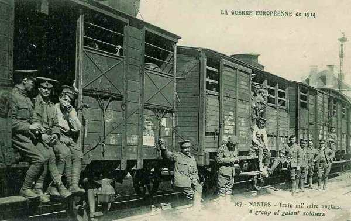
_Train militaire anglais_
_Collection privée_

Du 12 au 25 août 1914, 345 trains venant de Rouen et de Boulogne ont transporté 119.410 hommes, 28.000 chevaux, 7.000 canons et voitures.

Les bateaux traversent le Channel sous escorte de la Royal Navy. Pas un homme, pas un canon ne sont perdus. Le plan de Wilson fonctionne parfaitement.

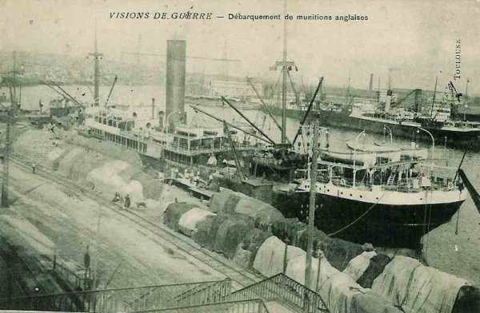
_Débarquement de munitions anglaises_
_Collection privée_

### Concentration de l’armée allemande

Les transports de concentration commencent le 6 août au soir et se terminent pour les corps de bataille le 17 au soir. Ces transports utilisent 13 lignes distinctes. Le débit quotidien est de 660 trains à la frontière occidentale.

Les itinéraires principaux sont :

- Vert : Stettin - Berlin - Hanovre - Aix-la-Chapelle.

- Bleu : Schneidemühl - Berlin - Cassel - Cologne.

- Brun : Posen - Francfort sur le Main - Thionville.

- Rouge : Lissa - Dresde - Strasbourg.

Les trains roulent à une vitesse de 34 km/h.

Un seul C.A. (il y en a 40 dans l’armée allemande) nécessite 170 trains. Il faut 170 wagons pour les officiers, 965 pour l’infanterie, 2.960 pour la cavalerie, 1.915 pour l’artillerie et les munitions, soit au total 6.010 wagons et le même nombre pour l’intendance. Tout doit rouler à heure fixe, d’après un plan précisant jusqu’au nombre de moyeux passant sur un pont donné dans un temps donné.

- La Belgique ayant signifié sa neutralité, les trains doivent s’arrêter aux gares frontalières :
  2e C.A. : Herzogenrath
  9e C.A. : Aachen
  10e C.A. : Eupen
  11e C.A. : Malmédy

### Concentration de l’armée belge

Comme la Belgique est un pays neutre en vertu du traité de 1839, elle se doit de placer les divisions vers ses différentes frontières.

4 divisions sont placées aux frontières (1e, 3e, 4e et 5e divisions)

- La 1e division face à l’Angleterre

- La 3e division face à l’Allemagne

- Les 4e et 5e divisions face à la France

- 2 divisions et la division de cavalerie forment le gros dans la zone Anvers- Bruxelles.