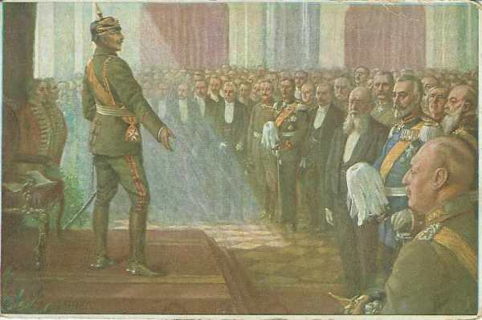
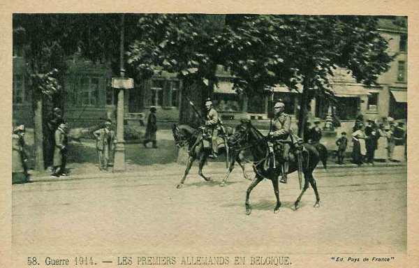
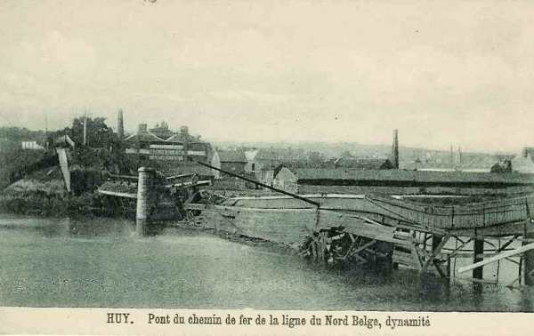

# Le 4 août 1914

Les actions préparatoires à la mise en oeuvre du plan Schlieffen sont entreprises par l’armée allemande : elle pénètre en territoire belge pour s’emparer des ponts sur la Meuse. L’Angleterre adresse un ultimatum à l’Allemagne puis décide la mobilisation dans la nuit du 4 au 5 août.

### France

- A 8h45, le ministre de la guerre adresse un télégramme au général en chef, aux généraux commandant les corps de couverture et au général Sordet, stipulant l’interdiction de pénétrer en territoire belge.

- Joffre prescrit au 7e C.A. d’occuper le ballon d’Alsace, sans descendre dans la plaine.

- La chambre des députés se réunit. Viviani dément qu’aucun aviateur français n’ait commis un acte d’hostilité. Les lois nécessaires à la défense nationale sont votées à l’unanimité.

- Un détachement de cavalerie allemande entre à Blâmont et Frémonville, une compagnie d’infanterie franchit la frontière française à Homécourt.

- Comme l’intervention des Anglais est probable, Messimy envoie des instructions aux commandants de Boulogne, Rouen et Le Havre, en prévision de débarquements dans ces ports.

- Dubail, commandant de la Ie armée, reçoit l’ordre de préparer une offensive en Haute-Alsace, à exécuter par le 7e C.A. et la 8e D.C., sur le front de Thann -Mulhouse.

### Allemagne

Sir Edward Goschen, ambassadeur d’Angleterre, remet à von Jagow le texte de l’ultimatum, qui est repoussé.

Une séance du Reichstag a lieu exceptionnellement dans la salle blanche du château de Berlin. L’empereur Guillaume II lit un discours que tous les députés écoutent debout, dans un respectueux et impressionnant silence, dont voici un l’ extrait le plus connu :

"Vous avez lu, messieurs, ce que j’ai dit à mon peuple du haut du balcon du château. Je le répète : je ne connais plus de partis, je ne connais que des Allemands. Et, comme signe de votre résolution que vous êtes vraiment décidés à vous unir avec moi à travers tout, sans distinction de qualité ni de partis, je prie les membres des comités des partis de s’approcher et d’en faire serment."

_Discours de Guillaume II  devant le Reichstag_
_Collection privée_

### Angleterre

L’Angleterre adresse une mise en demeure à l’Allemagne en ce qui concerne la neutralité belge. Le secrétaire d’état aux affaires étrangères von Jagow répond que la violation du territoire belge est un fait accompli.

En conséquence, la mobilisation des forces métropolitaines est ordonnée dans la nuit du 4 au 5 août (deux jours après la France).

### Russie

Le commandement supérieur des armées russes est confié au grand-duc Nicolas Nicolaiévitch.

**France**
à 04h, Bône (Algérie) est bombardée par le Breslau, de même que Philippeville à 05h par le Goeben.

### Belgique

Du 4 au 20 août, l’armée belge est isolée contre les Ie et IIe armées allemandes. Trop faible pour les combattre, elle tente de les retarder le plus longtemps possible en évitant de se faire écraser.

- Vers 8 h, deux D.C. allemandes (2e et 4e divisions) et la 34e brigade d’infanterie franchissent la frontière belge. Elles évitent la position fortifiée de Liège, poussent vers la Meuse à Visé. Elles trouvent le pont détruit et les passages de la Meuse gardés par le 2e bataillon du 12e régiment de ligne, qui tient tête aux attaques. Ces divisions sont l’avant-garde d’une armée prélevée sur les C.A. d’Aix-la-Chapelle et du camp d’Eupen, sous le commandement du général von Emmich.

_Premiers Allemands en Belgique_
_Collection privée_

- A 9h, la chambre des Représentants acclame le Roi Albert.

- Vers 10h30, le premier soldat belge est tué à Thimister, sur la route de Liège à Aix-la-Chapelle : c’est le cavalier Fonck.

- Le ministre de la guerre belge demande à l’attaché militaire français de préparer immédiatement la collaboration et le contact des troupes françaises avec l’armée belge.

- Les 3e et 4e divisions reçoivent l’ordre de détruire tous les ponts, tunnels et ouvrages d’art de la Meuse et au-delà.

_Destruction du pont de Huy_
_Collection privée_

- Le 9e bataillon de chasseurs allemands menace de franchir la Meuse au gué de Lixhe, situé à 600 m au sud de la frontière hollandaise, et gardé par des compagnies du 25e R.I.

- A Visé, les fantassins allemands munis de mitrailleuses ouvrent un feu intense sur les défenseurs du débouché ouest du pont. Le fort de Pontisse tire sur le côté est du pont de Visé et plus au nord vers Navagne où de grands rassemblements sont signalés. Les forces belges sont menacées d’être tournées sur leur gauche à Lixhe et doivent se replier vers 17h sur Milmort, derrière la ligne des forts de Liège. Les Allemands, contrariés par le feu du fort de Pontisse, restent la nuit sur la rive droite, les deux D.C. près de Mouland et la 34e brigade à Berneau.

- Les autres brigades allemandes atteignent plus au sud le front de Berneau - Herve - Louveigné - Stoumont. La 9e D.C. s’arrête à Poulseur.

A 18h, le 12e de ligne s’est replié du pont de Visé et deux régiments de uhlans passent la Meuse, suivis par deux régiments de hussards. Une colonne allemande pénètre par Gemmenich sur le territoire belge.

Suite à ces violations du territoire, Albert Ie lance un appel aux puissances garantes du traité de 1839, la France, l’Angleterre et la Russie :

"Le gouvernement belge a le regret de devoir annoncer à Votre Excellence que ce matin, les forces armées de l’Allemagne ont pénétré sur le territoire belge en violation des engagements qui ont été pris par traité."

"Le Gouvernement du Roi est fermement décidé à résister par tous les moyens en son pouvoir."

"La Belgique fait appel à l’Angleterre, à la France et à la Russie pour coopérer, comme garantes, à la défense de son territoire."

"Il y aurait une action concertée et commune ayant pour but de résister aux mesures de force employées par l’Allemagne contre la Belgique et, en même temps, de garantir le maintien de l’indépendance et de l’intégrité de la Belgique dans l’avenir."

"La Belgique est heureuse de pouvoir déclarer qu’elle assurera la défense de ses places fortes."

Le même jour, l’Angleterre fait savoir qu’elle aidera la Belgique de toutes ses forces.

La France et la Russie font connaître à leur tour leur volonté de répondre à l’appel et de coopérer avec l’Angleterre à la défense du territoire belge.

[Lien vers la journée suivante](article_04_08.md)