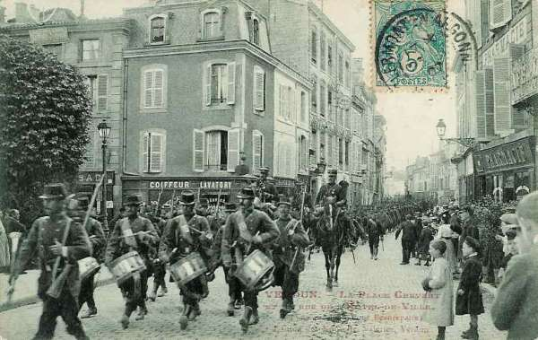
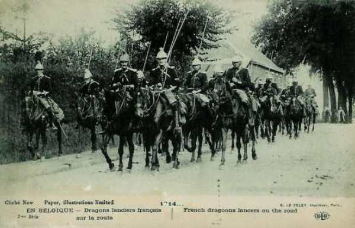
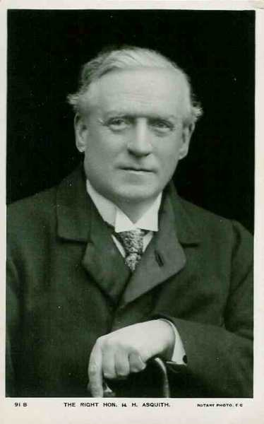
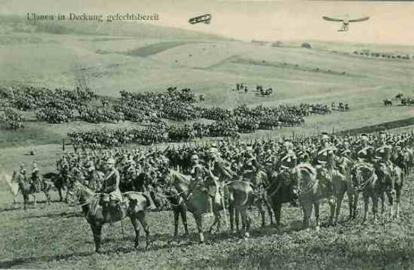

# Le 5 août 1914

Les armées des futurs belligérants commencent leur concentration sous la protection des troupes de couverture.
Les français, qui avaient respecté un retrait de 10 km, font mouvement vers la frontière et le C.C. Sordet pénètre en Belgique.
Pendant que les armées allemandes se concentrent, un détachement cherche à s’emparer de la position fortifiée de Liège pour leur livrer le passage à travers la Belgique.

### G.Q.G. français

Quatre armées sont regroupées sur la frontière entre Belfort et Mézières : celles de Dubail, de Castelnau, Ruffey et Lanrezac. L’armée de Langle de Cary se tient en réserve. A l’extrême gauche du dispositif, le groupe Valabrègue comprend trois divisions de réserve en position retranchée, surveillant la trouée de l’Oise, chemin traditionnel d’invasions, et la région du nord.

_Garnison de Verdun_
_Collection privée_

L’aile droite doit prendre l’offensive en Alsace et en Lorraine mais l’action de l’aile gauche des armées dépend de la violation de la neutralité belge.

Dans ce cas, la Ve armée remonterait sur le front Mézières - Mouzon, la IIIe armée serrerait un peu plus à droite et la IVe prendrait place entre la Ve et la IIIe armée. Ces trois armées réunies devraient prendre l’offensive dans les Ardennes.

C’est ainsi que les armées se concentrent :

- La Ie armée (Dubail) entre Epinal et Belfort.
- La IIe armée (Castelnau), vers Nancy, sa gauche près de Toul.
- La IIIe armée (Ruffey), dans les environs de Verdun.
- La Ve armée (Lanrezac), derrière la Meuse entre Verdun et Mézières. C’est l’armée la plus puissante.
- La IVe armée (de Langle de Cary), dans la région Sainte-Menehould - Commercy.
- Le groupement de divisions de réserve (Valabrègue), dans la région de Hirson - Vervins.

Comme nous l’avons vu, les troupes allemandes ont violé la frontière belge le 4 août et la Belgique a fait appel à aux garants de sa neutralité. En conséquence, Lanrezac reçoit l’ordre de faire serrer son armée sur la gauche (front Mouzon - Mézières) pour permettre à la IVe armée de s’intercaler entre la Ve et la IIIe.

Joffre installe le G.Q.G. à Vitry-le-François. Les commandants d’armée se rendent aux endroits prévus pour leur Q.G. et prennent le commandement des troupes de couverture. Joffre autorise les avions et dirigeables français à survoler le territoire belge et des reconnaissances de cavalerie y pénètrent.

Le C.C. Sordet, doit explorer la région à l’est de la Meuse et renseigner les mouvements de troupes qui s’y dérouleraient. Un officier de liaison français est envoyé à Bruxelles.

Joffre télégraphie aux généraux commandants des 2e, 6e, 7e et 21e C.A. :
"La guerre étant déclarée, il n’est plus apporté aucune restriction aux opérations de couverture qui peuvent s’exécuter telles qu’elles résultent des missions attribuées aux différents secteurs."

En conséquence, le 21e C.A. est autorisé à occuper les passages des Vosges, du col du Bonhomme à la trouée de Saales. L’armée avait, nous l’avons vu, dû respecter un retrait de 10 km par rapport à la frontière, et laisser les cols des Vosges inoccupés. Les troupes allemandes en avaient profité pour s’y installer.

Le général en chef demande au ministre de commencer le transport des chasseurs des Alpes vers les Vosges (l’Italie étant neutre, leur présence n’est plus requise dans les Alpes).

Joffre fixe au 7 au matin le début de l’offensive en Haute-Alsace. En effet, la région Mulhouse - Altkirch - Dannemarie semble vide de troupes et les trains militaires signalés sur la rive droite du Rhin se dirigent tous vers le nord.

### Ie armée française

Elle doit s’emparer les cols des Vosges, laissés libres par le retrait de 10 km et occupés par les Allemands. Le col de Bussang est le premier enlevé par les chasseurs, suivi par le col du Hohneck et celui de la Schlucht.

### IIe armée française

Le 20e C.A. (Foch) constitue la couverture de l’armée. Tout en maintenant ses gros à l’est de Nancy, il pousse ses éléments avancés sur la Seille, la Loutre Noire et la forêt de Parroy.
Des rencontres se produisent avec le 21e C.A. Allemand à Blâmont, Moncel et vers Nomény.

### IIIe armée française

A Noroy-le-Sec, près de Briey (Meurthe et Moselle), quelques dragons allemands sont surpris par des cavaliers français.

### Ve armée française

Sa concentration est couverte par le 45e R.I. de Sedan à Joigny, par le 148e R.I. de Vireux à Givet dans un premier temps, puis jusqu’à Dinant.
Le 1e C.A. occupe les points de passage entre Fumay et Mézières.
Le 3e C.A. est entre Mézières et Sedan.
La 10e C.A. est entre Sedan et Pouilly.
Le 45e R.I. vient occuper les points de passage de la Semois entre Bouillon et Vresse.

### C.C. Sordet

Sordet reçoit comme instruction de porter ses divisions sur la rive droite de la Meuse afin de fournir des renseignements sur les troupes allemandes qui se trouveraient dans cette région. Il se trouve dans la région de Sedan et doit faire route vers Neufchâteau.

_Dragons du corps Sordet en Belgique_
_Les chevaux sont des demi-sang anglo-normand.
Collection privée_

### Angleterre

L’Angleterre signifie à l’Allemagne qu’elle se considère en guerre à partir du 5 août à 11h. Un conseil de guerre se tient sous la présidence de Asquith, premier ministre, et John French est désigné comme chef du corps expéditionnaire.

_Asquith, premier ministre anglais_
_Collection privée_

### Position fortifiée de Liège : attaque de vive force

La position fortifiée de Liège est sous le commandement du général Leman. Pour que le plan Schlieffen puisse se dérouler comme prévu, elle doit être neutralisée en un minimum de temps. La garnison, complétée par la 3e division, compte 30.000 hommes. Les Allemands vont assaillir la ville avec 59.000 hommes.

_Général Leman (P.F. Liège)_
_Collection privée_

### Armée belge de campagne

Le roi Albert quitte Bruxelles à 14h pour rejoindre son armée.
Les forces belges sont constituées d’une division à Liège, une à Namur et quatre sur le front Waremme - Sint-Truiden. La D.C. couvre l’aile droite, soit :

- 1e division à Tirlemont et environs.
- 2e division à Leuven.
- 5e division à Perwez.
- 6e division à Wavre.

La longueur du front est de 18 km.

La 15e brigade est envoyée vers Huy, Hermalle et Andenne pour garder les ponts sur la Meuse.

La D.C. recule de +- 12 km et va occuper les cantonnements aux environs de Hannut.

### O.H.L.

Moltke donne les instructions de concentration des sept armées allemandes, groupées en

- Armées d’Alsace et de Lorraine : VIe armée (Kronprinz de Bavière) et VIIe armée (von Heeringen).
- Armées du centre : Ve armée (Kronprinz de Prusse) et IVe armée (duc de Wurtemberg).
- Armées de l’aile droite ou masse de manoeuvre : IIIe armée (von Hausen), IIe armée (von Bülow) et Ie armée (von Kluck).

Sur 1.400.000 hommes, seuls 360.000 se trouvant en Alsace et en Lorraine.

### Ie armée allemande

L’armée se concentre vers Crefeld - Erkelenz - Jülich - Bergheim.
Des fractions de la 2e D.C. ont ordre de traverser la Meuse à l’aube au nord de Visé. Le passage commence dès 9h15.
A 17h, trois escadrons ont franchi la Meuse avec pour mission d’explorer le secteur Maastricht - Diest - ligne de la Meuse et de la Sambre.
Les 2e et 4e D.C. bivouaquent vers Mouland. Des éléments avancés de la 9e D.C. se trouvent dans la région d’Havelange.
L’objectif de la Ve armée est Bruxelles.

_Uhlans en position d’attaque_
_Collection privée_

### IIe armée allemande

La zone de concentration de l’armée est Düren - Aachen - Eupen - Malmedy - Blankenheim.

Elle doit se diriger entre Wavre (aile droite) et Namur (aile gauche).

### IIe armée allemande

L’armée se concentre dans l’Eifel : Prüm - Saint-Vith - Neuerburg - Wittlich.

Son objectif est la ligne Namur - Givet. Elle doit en outre s’emparer de Charlemont (citadelle de Givet).

### IVe armée allemande

Elle commence sa concentration dans la région de Trier - Diekirch - Luxembourg - Sierck.

Elle doit faire mouvement entre Fumay (aile droite) et Neufchâteau (aile gauche).

### Ve armée allemande

L’armée se concentre dans la zone Thionville - Metz - Saarbrücken - Ottweiler - Merzig.

Elle constitue la charnière de l’aile marchante autour de Metz - Thionville : l’aile gauche doit rester à Thionville et l’aile droite doit faire mouvement vers Florenville. L’armée est en outre chargée de réduire les places frontières de Longwy et Montmédy.

### VIe armée allemande

Elle se concentre vers Sarreguemines - Château-Salins - Saarburg. Son objectif est de retenir un maximum de troupes françaises. Elle doit opérer une retraite en cas d’attaque afin d’attirer les Français dans un piège.

### VIIe armée allemande

Sa zone est Strasbourg - Mulhouse - Freiburg in Brisgau. Elle a les mêmes objectifs que la VIe armée.

[Lien vers la journée suivante](article_04_09.md)
