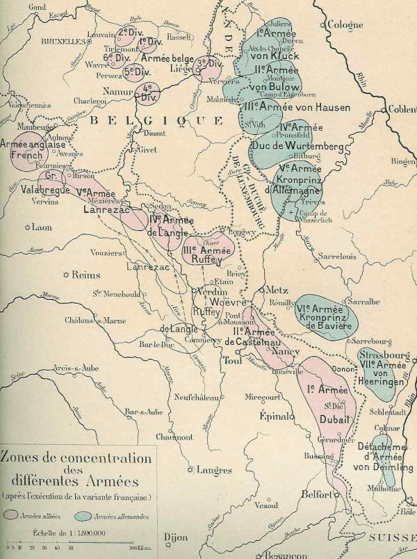
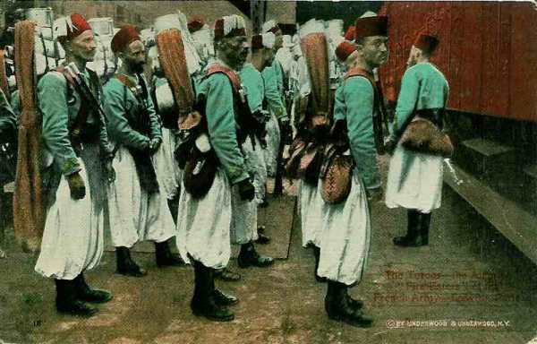
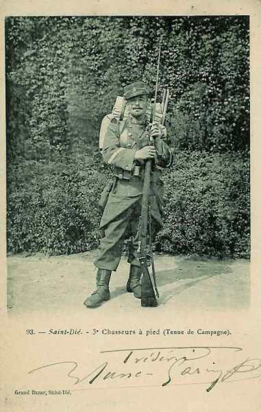
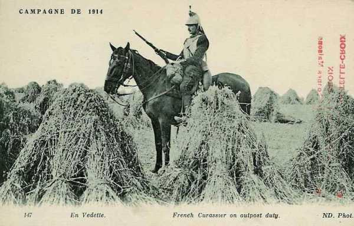
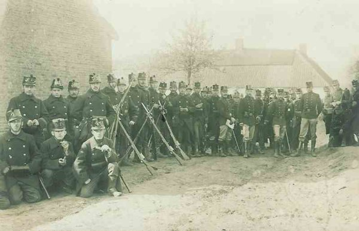
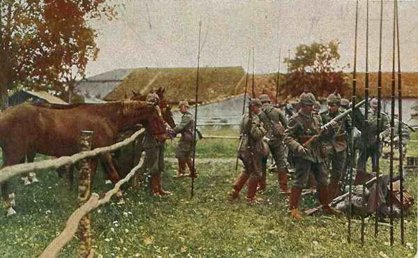

# Le 6 août 1914

L’Autriche-Hongrie déclare la guerre à la Russie.
Les Français s’emparent de crêtes des Vosges et la variante du plan XVII est appliquée compte tenu de la violation de la frontière belge.
Comme la ville de Longwy est située près de la frontière, elle est la première à subir un siège par la Ve armée allemande.
Un détachement allemand pénètre dans Liège, mais les forts continuent de résister, empêchant les armées allemandes de commencer leur mouvement à  travers la Belgique.

### G.Q.G. français

- Joffre arrive à Vitry-le-François

- En raison de l’attaque de Liège, le haut commandement français met en oeuvre la variante du plan XVII : la IVe armée devra s’intercaler entre la IIIe et la Ve, vers la Belgique et le Luxembourg.

_Variante du plan XVII ordonnée par Joffre_
_La grande guerre racontée par les généraux_

- Ordre est donné de diriger les trois divisions d’Afrique vers la gare régulatrice de Laon.

_Troupes coloniales à l’embarquement_
_Collection privée_

- Joffre reçoit de Paléologue, ambassadeur en Russie, un télégramme précisant que la Russie compte attaquer sans attendre la concentration de tous ses corps d’armée dès le 14 août. Joffre souhaite lancer une offensive le même jour.

- Comme les Anglais ne seraient en mesure d’intervenir qu’à partir du 21 août,  Joffre n’envisage une offensive qu’avec ses armées de droite et du centre. Elle devra avoir lieu en Haute-Alsace.

### IIe armée française

- Le général de Castelnau prend le commandement de la IIe armée et établit son Q.G. à Neufchâteau (France).

- En Lorraine, la IIe armée fait savoir que les Allemands ont fortifié les hauteurs entre Delme et Socourt, entre Morhange et Château-Salins.

- Le 6e bataillon de chasseurs s’assure les débouchés de la Seille en culbutant les avant-postes bavarois installés sur les crêtes de Moncel et de Chambrey.

- Un engagement a lieu à Nomény, à 25 km de Nancy. La localité se trouve sur un coteau dominant la vallée de la Seille.

_Chasseur à pied français_
_Collection privée_

### IIIe armée française

- Le 6e C.A. se rend compte que Briey est occupé par les troupes du 16e C.A. allemand.

- La 16e brigade de chasseurs à pied est attaquée dans la région de Conflans par des forces supérieures et se retire.

### Ve armée française

- Le 45e R.I. vient occuper les passages de la Semois entre Bouillon et Vresse.

- Le 148e R.I. (2e C.A.) garde les ponts de Vireux à Dinant. Il remonte jusqu’à Yvoir où il entre en contact avec des troupes belges de la position fortifiée de Namur.

### C.C. Sordet

Sordet reçoit l’ordre de faire occuper les points de passage sur la Meuse jusqu’au pont de chemin de fer de Houx. La 4e D.C. se porte dans la région d’Etalle - Paliseul - Bertrix - Bouillon.

_Cuirassier français en vedette_
_Collection privée_

### Armée belge de campagne

Le refuge national est la position fortifiée d’Anvers. L’armée, pour ne pas risquer l’encerclement ou la destruction, doit pouvoir, si nécessaire, opérer une retraite vers cette ville. C’est pour cela que la concentration s’opère non pas le long de la frontière, mais entre le centre et l’est du pays, dans le quadrilatère Tienen - Leuven - Wavre - Perwez. La Gette est la première ligne de défense que l’armée belge puisse utiliser, prolongée au sud par le cours de la Meuse entre Namur et Givet.

_Infanterie belge_
_Collection privée_

- La gauche de l’armée se trouve au nord-ouest de Tienen, la droite à Jodoigne. En première ligne sont placées les 1e et 5e divisions. La 2e division est placée en 2e ligne à Louvain et la 6e division à Hamme-Mille. Quand la 3e division arrive de Liège, elle s’intercale entre la 1e et 5e division. La D.C. se replie sur Sint-Truiden, puis vers la gauche de l’armée dont elle prolonge la ligne du nord de Tienen vers Diest.

- Le QG du roi Albert se trouve à Leuven.

- Le ministre de la guerre, de Brocqueville demande à Joffre l’appui aussi rapide que possible de l’armée française.

- Albert Ie repousse le conseil de Joffre de se retirer vers Namur et de joindre les forces françaises. La ligne de retraite de l’armée belge sera bien vers Anvers.

La D.C. se porte sur Hollogne-sur-Geer. Elle y passe la nuit du 6 au 7.

### En Allemagne

Le déploiement de l’armée bat son plein : sur les treize lignes vers la frontière ouest (Aufmarschlinien) circulent journellement 660 trains de troupes dont 550 franchissent le Rhin. La plupart des C.A. sont débarqués à raison de vingt trains par jour.

Voici les ponts empruntés par les C.A. pour franchir le Rhin.

| Corps d’armée | Pont |
| --- | --- |
| 9e | Wesel |
| 2e | Hamborn |
| 7e, 3e | Duisburg |
| 10e | nord de Dusseldorf |
| 3e, 4e | sud de Dusseldorf |
| Garde | nord de Cologne |
| 12e, 19e | Coblence |
| 18e | nord de Mayence |
| 5e | sud de Mayence |
| 6e | Worms |
| 2e bavarois | Ludwischafen |
| 13e | Gemersheim |
| 1e bavarois | Strasbourg |

Rien que sur le pont Hohenzollern à Cologne passent 2.150 trains militaires entre le 2 et le 18 août, soit un train toutes les dix minutes.

### Ie armée allemande

La 2e D.C. effectue des patrouilles sur la ligne Hasselt - Sint-Truiden. Les escadrons d’exploration trouvent le terrain libre en deçà de la grande Gette, de Diest à Sint-Truiden.

_Patrouille de cavalerie allemande_
_Collection privée_

### IIe armée allemande

Le Q.G. de l’armée est à Hanovre.

### Ve armée allemande

L’armée commence le siège de Longwy, ville frontière garnie de remparts datant de l’époque de Vauban, mais dotée de solides casemates. Ce siège va durer jusqu’au 28 août.

### Angleterre

Le contre-torpilleur Lance détruit un poseur de mines, le Königin Luise".

[Lien vers la journée suivante](article_04_25.md)