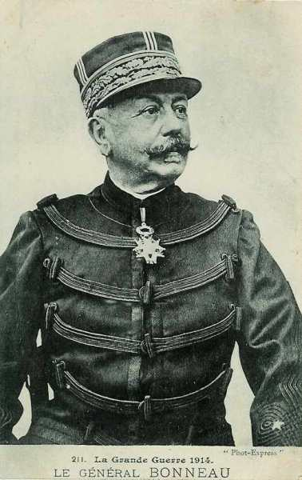
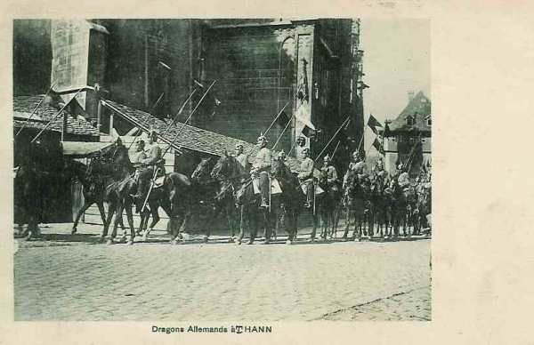
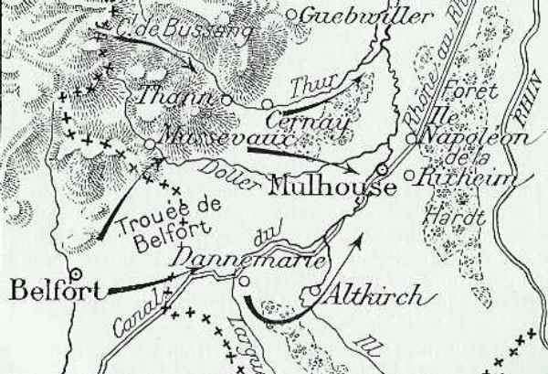
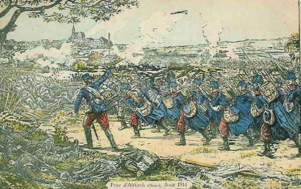
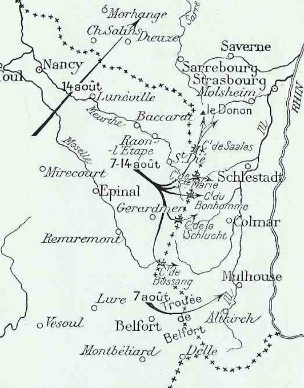
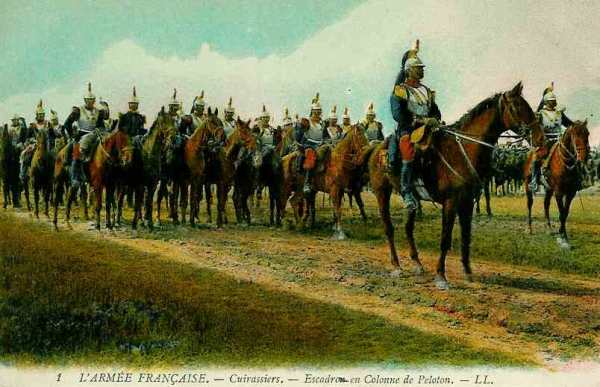
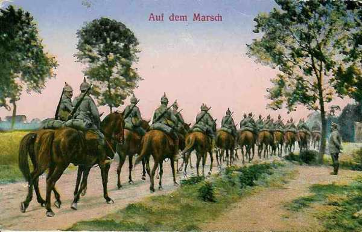
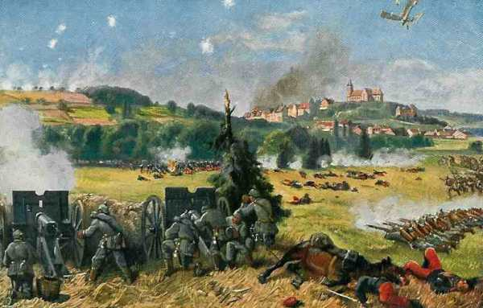

# Le 7 août 1914

Le 7e C.A. (Détachement de Haute-Alsace) s’empare de Thann et Altkirch sans grande difficulté.
Le C.C. Sordet atteint la L’Homme et la Lesse. Il doit faire mouvement vers Liège pour venir en aide aux Belges.
Les premiers anglais arrivent en France pour préparer le débarquement.
Les armées allemandes se concentrent et attendent la chute de Liège.

### G.Q.G. français

Conformément au plan de Joffre de reconquérir l’Alsace et la Lorraine, une première offensive doit s’opérer en direction de Mulhouse, par le détachement de Haute-Alsace et la Ie armée : ces unités sont chargées d’atteindre rapidement Colmar et Sélestat, de détruire les ponts du Rhin et de masquer la place de Neuf-Brisach, pour éviter que les Allemands attaquent le flanc de l’armée.

En conséquence, les troupes franchissent la frontière allemande.

### Détachement de Haute-Alsace

Le général Bonneau reçoit pour mission de s’emparer du front Thann - Mulhouse, d’atteindre le Rhin et de couper les ponts pour se porter ensuite vers Colmar.

_Général Bonneau_
_Collection privée_

Il décide d’opérer en trois colonnes :

- A droite, une brigade d’infanterie et une D.C. doivent partir de Belfort vers Dannemarie et Altkirch.
  Au centre, une division d’infanterie fait mouvement vers Cernay.
  A gauche, une division se porte vers Thann par le col de l’Oderen et le ballon d’Alsace.

Le 7e C.A. doit décrire un mouvement de conversion autour de Thann pour se redresser le long du Rhin. C’est sa droite qui est la plus exposée et c’est précisément la droite qui est la plus faible.

_Dragons allemands à Thann_
_Collection privée_

Le détachement pénètre en Alsace (allemande) par la trouée de Belfort vers Dannemarie, Altkirch, Cernay et Thann, soit un front de 24 km. La trouée de Belfort sépare les Vosges du Jura. C’est un couloir d’invasion utilisable par une armée.

_Attaque vers Mulhouse_
_C Michelin, d’après guide édition 1919 - Autorisation n° 06-B-05_

Vers 16h, les troupes françaises pénètrent à Thann. Des pointes d’avant-garde sont lancées vers Cernay.

Le 44e R.I. exécute une charge contre une brigade allemande qui défend la ville d’Altkirch.
Le soir, les troupes pénètrent dans la ville et les Français sont accueillis avec enthousiasme par les habitants. Un détachement de dragons français poursuit les Allemands jusqu’à Illfurth.

_Prise d’Altkirch_
_Collection privée_

En fait, le détachement s’est trouvé en présence de faibles éléments de couverture allemands, qui doivent progressivement reculer conformément au plan Schlieffen. L’opinion publique française se réjouit de commencer à récupérer les provinces perdues en 1870.

### Ie armée française : première offensive en Alsace

Joffre avait demandé que l’armée accélère sa concentration et puisse, dès le 14 août, entamer un mouvement offensif vers Sarrebourg. L’axe de cette attaque est parallèle à la ligne des Vosges. Pour qu’elle réussisse, il faut que l’armée soit couverte sur son flanc droit, c’est-à-dire soit maître des cols débouchant d’Alsace vers sa zone d’opérations.

Dubail a sous ses ordres cinq C.A. et une D.C. Il doit chercher la bataille sur le front Sarrebourg - Donon - Vallée de la Bruche, tout en s’emparant des crêtes des Vosges.

Il divise par conséquent son armée en 3 secteurs :

- Haute Alsace.
  Vosges du nord.
  Nord de Blamont - Cirey.

La 27e brigade franchit la frontière de l’Alsace et s’empare d’Altkirch.

Les 21e et 14e C.A. enlèvent les cols des Vosges, du Bonhomme à Saales (Bonhomme, Sainte Marie, Saales, la Chipotte, Hans, d’Urbeis et Donon). Profitant du retrait de 10 km ordonné par le gouvernement français, les troupes allemandes avaient occupé ces cols qui délimitaient la frontière. Ils sont repris après de durs combats.

_Première offensive en Alsace_
_C Michelin, d’après guide 1919 - Autorisation 06-B-05_

### IIe armée française

Le 9e C.A. débarque autour de Pont-Saint-Vincent et le 15e C.A. vers Rosières-aux-Salines.

Trois zones de couverture sont constituées :

- 1e zone : Pont-sur-Seille - Erbéviller - Moncel, par le 20e C.A. (Foch).
  2e zone : Jusqu’au Sanon, par la 2e D.C.
  3e zone du Sanon jusqu’à la basse Meurthe, par la 10e D.C.

Des inondations de la Seille, provoquées par l’armée allemande, sont constatées.

### IIIe armée française

Le 18e bataillon de chasseurs à pied (2e C.A.) est contraint de se replier devant une attaque de cavalerie.

### Ve armée française

Le G.Q.G. prescrit que le 148e R.I. occupera les ponts de la Meuse au nord de Dinant jusqu’à la jonction avec les forces belges.

### C.C. Sordet

- Sordet remonte vers Lomprez à la recherche de la cavalerie allemande. Il atteint le soir les coupures de l’Homme et de la Lesse, dont il tient les passages de Jemelle à Wanlin. Joffre lui prescrit une offensive vers Liège pour soulager les troupes belges. Pour obtenir un effet se surprise, il doit agir vite et fait trotter les chevaux à une allure de 10 km à l’heure, par un temps caniculaire. Les Allemands sont sur leurs gardes : la 9e D.C. couvre le corps de siège sur la ligne de l’Ourthe. Sordet est surpris de trouver les passages de la rivière barricadés et tenus par des éléments à pied.

_Cuirassiers français_
_Collection privée_

- La 4e D.C. a un engagement vers Stockem (à 4 km. d’Arlon).

### Armée anglaise

Des avant-gardes de l’armée débarquent en France pour préparer l’arrivée du corps expéditionnaire.

### Armée belge

- Voici la position des divisions :
  1e division à Tienen - Sint-Margriete-Hautem.
  2e division à Sint-Remy-Geest.
  3e division à Dongelberg (provenant de Liège)
  2e division à Leuven.
  6e division à Hamme-Mille.
  D.C. à Leau - Wilderen.

Les 2e et 6e divisions sont placées à des noeuds routiers situés derrière le front, ce qui leur permet de manoeuvrer pour couvrir les ailes du dispositif soit au nord soit au sud, selon la direction des attaques allemandes.

La D.C. reçoit l’ordre de couvrir l’armée ; la direction la plus dangereuse semble être la direction Maastricht - Visé - Liège.

### O.H.L.

Comme prévu par le plan, les transports stratégiques commencent, le 6e jour de la mobilisation.

### Ie armée allemande

Du 7 août au 15 août, l’armée se concentre sur les bords du Rhin au nord-est d’Aix-la-Chapelle.

- Les 2e et 4e D.C. passent la journée sur la rive droite de la Meuse dans la région de Fouron-le-Comte - Visé. A 5h30 du matin, la 4e D.C. reçoit l’ordre de pousser jusqu’à la ligne Argenteau - Herve.

- La 9e D.C., chargée d’explorer devant le gros de l’armée,  est à Havelange et pousse des reconnaissances vers la Meuse.

_Cavalerie allemande en marche_
_Collection privée_

### IIe armée allemande

Le commandant de l’armée, von Bülow,  arrive à Montjoie.

Voici la position initiale de l’armée.

- Le 7e C.A. est sur Pépinster (ouest de Verviers).
  10e C.A. est à Poulseur (sud de Liège).
  Le 9e C.A. est à Warsage (est de Visé).

### VIe armée allemande

De la frontière suisse à la Fecht, voici le dispositif de l’armée, valable jusqu’au 20 août.

- 14e C.A. : de la frontière suisse à la Fecht.
  15e C.A. : de la Fecht au Donon.
  13e C.A. : dans la région de Ste-Marie-aux-Mines.
  1e C.A. bavarois : dans la région de Cirey - Donon.
  D.C. bavaroise : vers Réchicourt.
  21e C.A. à l’ouest de Sarrebourg.

### VIIe armée allemande

La brigade mixte de couverture est prise à partie par des forces françaises débouchant de Belfort et elle se replie sur Mulhouse. Dans la nuit du 7 au 8, elle continue sur Neuenbourg et passe sur la rive droite du Rhin.

_Forces bavaroises à Altkirch_
_Collection privée_

[Lien vers la journée suivante](article_04_26.md)