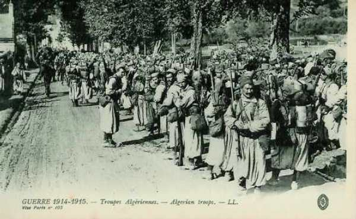
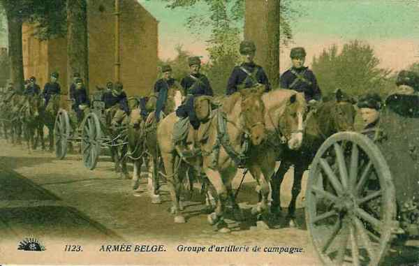
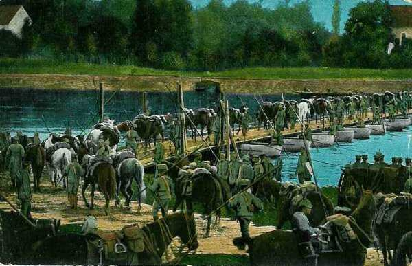

# Le 8 août 1914

Joffre émet l’instruction générale n° 1 définissant ses intentions pour l’opération d’ensemble, soit une offensive en Lorraine et au Luxembourg.
La Ve armée allemande s’empare de la région de Briey, non fortifiée.
Le général Bonneau campe autour de Mulhouse avec le 7e C.A. et la 27e division mais la contre-offensive allemande se prépare.

### G.Q.G. français

Première instruction d’ensemble de Joffre. (Instruction générale n° 1)

En résumé : il faut rechercher la bataille, toutes forces réunies, en appuyant au Rhin la droite du dispositif général. Il faut pouvoir porter l’aile gauche en avant si la droite allemande se  rabat vers le sud. Voici les directions d’attaque des armées :

- Ie armée : attaquera vers Sarrebourg, le Donon, la vallée de la Bruche (affluent du Rhin et chemin vers Strasbourg), le 7e C.A. couvrant la droite, en marchant sur Colmar et détruisant les ponts du Rhin. Le but est de rejeter l’armée allemande sur Strasbourg.

- IIe armée : en se couvrant face à Metz, doit attaquer vers Saarbrücken en se reliant à la Ie armée par la région des étangs. Le front  suit la ligne de Dieuze - Château-Salins - Delme.

- IIIe armée : doit constituer le front Flabas - Ornes - Vigneulles - Saint-Baussant, être prête à agir dans la région du nord ou contre-attaquer les forces débouchant de Metz.

- IVe armée : doit attaquer entre Meuse et Argonne les forces qui auraient franchi la Meuse.

- Ve armée : doit resserrer son dispositif entre Vouziers et Aubenton pour monter une attaque en force sur tout ce qui déboucherait entre Mouzon et Mézières.

- C.C. Sordet : doit couvrir le front de la Ve armée. S’il doit repasser la Meuse, il se placera à gauche de celle-ci pour protéger la réunion de l’armée anglaise et du 4e groupement de divisions de réserve, qui se trouve dans la région de Vervins.

La Ve armée est sur la Meuse, en amont de Mézières, prolongeant la ligne des IVe et IIIe armées, qui s’étend jusqu’à la Woëvre septentrionale.

Le général Hély d’Oissel, chef d’Etat-Major de la Ve armée, vient exposer à Joffre la crainte de voir les Allemands exécuter un mouvement débordant à l’ouest de la Meuse. Joffre lui répond que ses craintes lui paraissent prématurées et que cette manœuvre prêtée aux Allemands semble excéder leurs moyens.

### Détachement de Haute-Alsace

Vu le premier succès, Joffre donne l’ordre de pousser vigoureusement sur Mulhouse. Vers 16h, la 14e division converge en deux colonnes vers cette ville. Les Allemands se retirent conformément au plan Schlieffen, en direction de Neuf-Brisach. Les Français ne rencontrent pas d’avant-postes et la 14e D.I. fait son entrée dans Mulhouse, musique en tête et drapeaux déployés. La prise de Mulhouse suscite l’enthousiasme en France. La 41e D.I. entre en même temps dans Thann et Cernay.

La facilité de la conquête a éveillé une confiance prématurée, car certains Alsaciens sont hostiles à la France et peuvent renseigner l’armée allemande.

Le 21e C.A.enlève les cols du Bonhomme et de Sainte-Marie.
Le col de Sainte-Marie fait communiquer Saint-Dié avec Sainte-Marie-aux-Mines ; le col du Bonhomme, Saint-Dié avec Colmar.
Des reconnaissances signalent la forêt de la Hardt comme sérieusement organisée.

Dès la soirée, de gros détachements allemands apparaissent en direction de Mülheim et de Neuf-Brisach. Ce sont les avant-gardes de l’armée de von Heeringen (VIIe armée).

### Ie armée française

Elle reçoit comme objectif de pousser sur Mulhouse et de détruire les ponts de Huningue et Chalampé.

Après un combat assez violent, le col du Bonhomme et le sommet de Sainte-Marie sont pris par le 21e C.A. La 41e division débouche dans la plaine d’Alsace. Elle porte ensuite son gros au nord-ouest de Mulhouse à 17h.

### IIIe armée française

Le 2e C.A. passe aux ordres du commandant de la IVe armée.

### IVe armée française

Comme le Luxembourg a été envahi, pour faire face à une attaque possible venant des Ardennes, la IVe armée vient s’intercaler entre la IIIe et la Ve armée (c’est la variante du plan XVII prescrite le 2 août).

### Ve armée française

- La Ve armée entre en jonction avec les forces belges à Yvoir.
  Le 1e C.A. est en position de Mézières à Givet.
  Le 3e C.A. est entre Mézières et Sedan.
  Le 10e C.A. est entre Sedan et Remilly.
  La 11e C.A. est entre Remilly et Mouzon (à la gauche de la IVe armée).

Ce dispositif est maintenu jusqu’au 13 août.

- Le 1e C.A. doit faire mouvement vers le nord avec pour mission de s’opposer à toute tentative de franchir la Meuse entre Givet et Namur.

- Deux divisions d’Afrique, les 37e et 38e, sont dirigées sur le 5e armée pour renforcer l’aile gauche. Elles s’illustreront lors de la bataille de Charleroi.

_Tirailleurs algériens_
_Collection privée_

A ce stade, le G.Q.G. pense qu’un mouvement enveloppant allemand se produirait au pire au sud du sillon Sambre et Meuse.

### C.C. Sordet

Dans la matinée, le C.C. pousse au nord de la Lesse. Il se porte, via Ciney, vers Ouffet. La cavalerie allemande se dérobe et Sordet, frustré d’un combat, ramène ses divisions dans la zone Modave - Durbuy. Le raid de 170 km en 48 heures, par une chaleur extrême, a ruiné le quart des chevaux.

### Armée belge de campagne

La D.C., commandée par le Lieutenant général de Witte se porte à Sint-Truiden et environs, poussant ses éléments de découverte vers Waremme, Oreye, Tongeren et Maaseik. Elle comprend

- La 1e brigade de cavalerie : 1e et 2e régiments de guides.
  La 2e brigade de cavalerie : 4e et 5e régiments de lanciers.
  Le bataillon de carabiniers cyclistes.
  La compagnie de pionniers pontonniers.
  Le groupe d’artillerie à cheval.

Le rôle de la D.C. est d’empêcher l’armée allemande d’isoler l’armée belge d’Anvers.
Un mouvement de l’armée allemande sur la gauche de l’armée belge met celle-ci en danger, tandis que son aile droite est couverte par la position fortifiée de Namur et le C.C. Sordet.

Dans la soirée, le commandant de la D.C. (de Witte) signale la présence de 1500 cavaliers allemands vers Zichem et demande à pouvoir les combattre. Albert Ie s’y oppose, estimant que la cavalerie allemande est très supérieure en effectif.

_Artillerie à cheval belge_
_Collection privée_

### O.H.L.

Moltke décide que les têtes de la IIe armée, en attendant la chute des forts de Liège, doivent occuper le front Julémont - Fraipont - Esneux - Hamoir.

### Ie armée allemande

Les 2e et 4e D.C. avec les 7e et 9e bataillon de chasseurs, sous les ordres du général von der Marwitz, ont franchi la Meuse sur un pont de bateaux à Lixhe.

_Cavalerie allemande sur un pont de bateaux_
_Collection privée_

- Von Kluck donne les objectifs à sa cavalerie :
  Le 2e C.C. : vers Bruxelles.
  La 2e D.C. : vers Hasselt
  La 4e D.C. : vers Saint-Trond et Waremme.

Le débarquement des unités de combat commence. Les prévisions sont établies comme suit :

- Le 11 août pour les 3e et 4e C.A.
  Le 12 août pour le 2e C.A.
  Le 13 août pour le 3e C.A.R.
  Le 14 août pour le 14e C.A.R.

L’offensive à partir d’Aix-la-Chapelle doit commencer le 14 août.

### IIe armée allemande

Bülow donne l’ordre à son armée et au 1e C.C (général von Einem) de marcher entre Eupen et Basse Bodeux.

### IIIe armée allemande

L’armée se concentre dans la région de l’Eiffel (Saint-Vith - Waxweiler - Prüm - Wittlich).

- Le 11e C.A. constitue l’aile droite
  Le 12e C.A. est au centre
  Le 19e C.A. constitue l’aile gauche.
  Le 12e C.A.R. est en deuxième ligne.

La concentration est couverte par le 1e C.C. (von Richthofen).

### Ve armée allemande

L’armée s’empare de la région de Briey. Celle-ci n’est pas protégée par la ligne fortifiée de Séré de rivières. Elle mène un combat victorieux à La Garde contre des éléments de la IIe armée française.

Des travaux de fortification de campagne sont entrepris à Marville, Saint-Laurent, Spincourt et Gouraincourt.

### VIIe armée allemande

Les premières indications recueillies annoncent l’invasion de la Haute-Alsace par deux divisions d’infanterie et une de cavalerie. Le général von Heeringen est invité à marcher contre elles avec le 15e C.A. transporté par chemin de fer de Strasbourg à Colmar et le 14e débouchant de Neuf-Brisach et de Chalempé à travers la forêt de Harth.

[Lien vers la journée suivante](article_04_27.md)