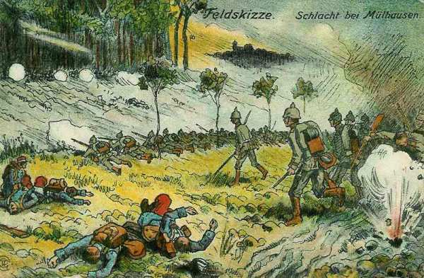
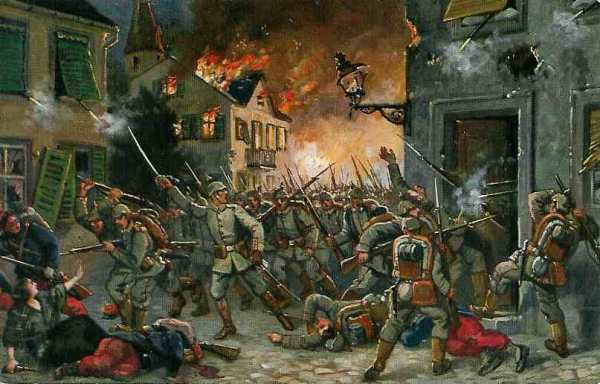
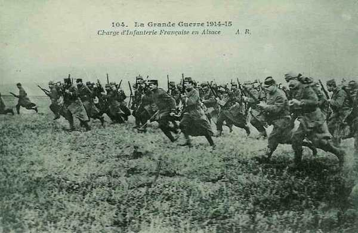
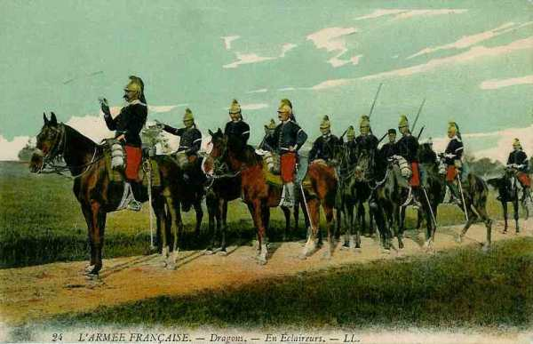
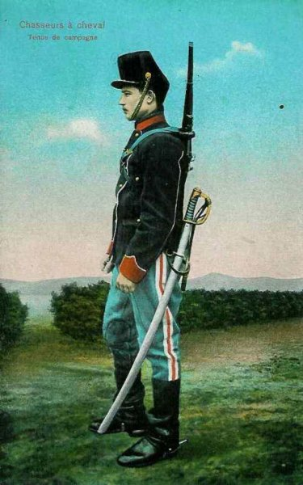
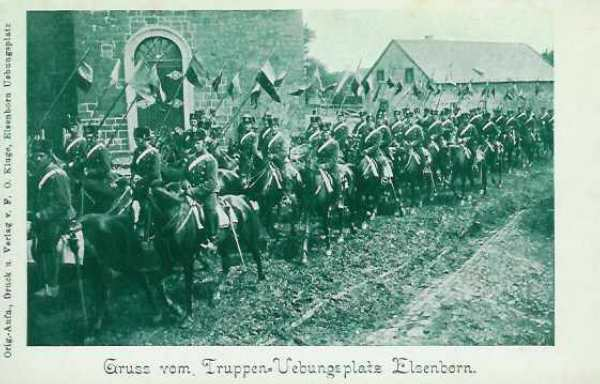

# Le 9 août 1914

L’offensive française en Alsace tourne court : deux C.A. allemands, le 14e et le 15e, contre-attaquent vers Cernay et Mulhouse, forçant les Français à abandonner cette ville.
La Ie armée française tente de s’emparer du col du Bonhomme et des hauteurs de Sainte-Marie. C’est le premier jour de mobilisation en Angleterre.
Les Allemands construisent des ponts pour franchir la Meuse.

### G.Q.G. français

Joffre reçoit des précisions sur la mobilisation anglaise.

Dans la nuit du 9 au 10 août, il apprend la perte de Mulhouse. Il décide de reprendre l’offensive avec des effectifs plus nombreux et sous un nouveau commandement : le général Pau, héros de la guerre de 1870. L’armée d’Alsace comprendra outre le 7e C.A. et la 8e D.C., le 1e groupe de divisions de réserve, cinq groupes alpins (rendus libres suite à la déclaration de neutralité de l’Italie) et la 44e division.

### Détachement de Haute-Alsace : contre-attaque allemande

Au cours de l’après-midi, une importante colonne est signalée au nord de Mulhouse. Vers 5 h du soir, les 14e et 15e C.A., provenant de la forêt de la Hardt, de Neuf-Brisach, de Colmar et de Soultz, attaquent Mulhouse et Cernay. Ces deux villes doivent être évacuées.

Durant la nuit du 9 au 10, Bonneau replie la 7e C.A. sur toute la ligne.

_Combats de Mulhouse_
_Collection privée_

_Combats dans Mulhouse_
_Collection privée_

### Ie armée française

Dubail prescrit au 7e C.A. de reprendre les attaques du 11 au 13 août dans la zone de Remiremont, établissant un barrage sur les Vosges entre le col de la Schlucht et le ballon d’Alsace.

_Charge d’infanterie en Alsace_
_Collection privée_

Il poursuit le combat pour le col du Bonhomme et les hauteurs de Sainte-Marie.

### IIe armée française

Devant le front de la IIe armée, la Seille a grossi sans déborder. Un engagement se produit dans le couloir de Blâmont entre la 6e D.C. française et une D.C. allemande. L’armée française est soutenue par l’artillerie du fort de Manonviller qui tire sur les batteries allemandes.

### IIIe armée française

Carte de l’évolution des IIIe et IVe armées

Un engagement assez vif se produit dans la région de Billy-sous-Mangiennes entre trois des bataillons du 4e C.A. et 2 bataillons du 2e C.A. (IVe armée) d’une part, et avec des forces allemandes évaluées à une division d’autre part. Les Français sont victorieux.

### Ve armée française

La 4e D.C. est rattachée à cette armée. Elle explore vers Neufchâteau, Bastogne, Witry et Arlon.

### C.C. Sordet

Sordet n’a pas encore reçu l’ordre de couvrir le front de la Ve armée. Il explore par conséquent en direction de Marche et revient le soir au sud de la Lesse et de la L’Homme, établissant son Q.G. à Rochefort.

Joffre donne l’ordre de reconnaître ce qui se passe sur la rive droite de l’Ourthe entre sa source et La Roche. Les escadrons ont déjà parcouru 200 km par de fortes chaleurs (notamment lors de l’équipée vers Liège) et les chevaux sont en mauvais état. Sordet décide de donner du repos à ses divisions le 10 août.

_Dragons français_
_Collection privée_

### Armée anglaise

Premier jour de la mobilisation britannique. De ce fait, l’armée ne pourra se porter en avant qu’à partir du 26 août.

### Armée belge de campagne

L’Etat-Major belge est avisé que des forces de cavalerie allemandes marchent de Tongeren et de Waremme sur Sint-Truiden. Il demande si une partie de la cavalerie française pourrait agir au nord de la Meuse en liaison avec la cavalerie belge. Comme le C.C. Sordet a reçu pour mission de couvrir le front de la Ve armée, cette demande n’est pas acceptée par Joffre. Ce refus aura pour conséquence que l’armée belge, isolée, préférera se retirer vers le réduit national, Anvers.

La D.C. a pris position aux lisières de Sint-Truiden et est avertie de l’approche de la 2e et 4e D.C. allemande. Ne pouvant engager l’unique D.C. contre des forces supérieures, le général de Witte se replie vers le nord-ouest pour prendre position derrière la coupure de la Gette et ainsi protéger le flanc gauche de l’armée et la direction d’Anvers.

Le front occupé par la D.C. s’étend de Budingen à Halen. La D.C. va y rester jusqu’au 18 août, en soutenant le 12 le combat de Halen. Elle exécutera ensuite sa retraite vers Anvers à la gauche de l’armée.

Le Roi Albert Ie se voit conférer la médaille militaire française "la plus haute distinction que puisse recevoir, en France, un officier général".

_Chasseur à cheval belge_
_Collection privée_

### O.H.L.

Moltke ordonne que la Ie armée commence immédiatement à s’échelonner jusqu’à hauteur de Liège sur les routes qui lui sont assignées par l’ordre de concentration. Le 9e C.A. appartient toujours à la IIe armée.

### Ie armée allemande

- Le Q.G. de l’armée s’installe à Grevenbroich.

- Les 2e et 4e D.C. s’avancent en 2 colonnes parallèles sur Saint-Trond, l’une par Tongeren et Looz, l’autre par Glons et Oreye : ce sont deux colonnes de 2.500 chevaux chacune avec de l’artillerie et 2 ou 3.000 fantassins. Ces divisions sont harcelées par de petits détachements cyclistes. Elles n’atteignent Houppertingen et Brustem qu’en fin d’après-midi. La brigade des « Leib Husaren » ne peut pénétrer dans Sint-Truiden.

_Hussards allemands_
_Collection privée_

### IIe armée allemande

La 10e C.A. commence la construction d’un pont près de Lixhe. Il est impossible de construire un pont à Visé car cette localité est sous le feu du fort de Pontisse. Le pont d’Argenteau est détruit mais celui de Herstal est en possession de l’armée allemande.

La 9e D.C. atteint Ouffet.

Les positions que doit atteindre l’armée sont Julémont - Fraipont - Esneux - Hamoir. L’armée attend sur ces positions que la chute des forts de Liège permette le passage.

### VIIe armée allemande

Von Heeringen décide d’attaquer pour enfoncer l’aile gauche française qui s’appuie aux Vosges et de l’acculer à la frontière suisse en la coupant de Belfort.

La contre-attaque contre le 7e C.A. français qui se trouve à Mulhouse commence à midi et dégénère en un combat frontal.

[Lien vers la journée suivante](article_04_28.md)