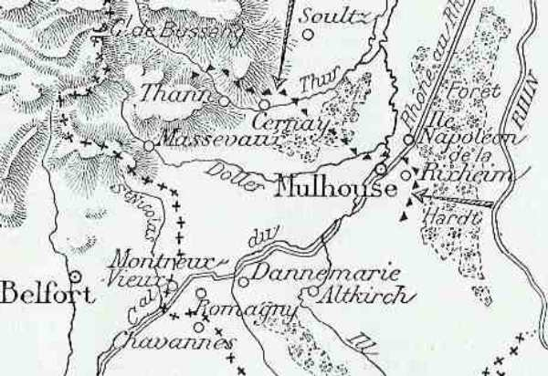
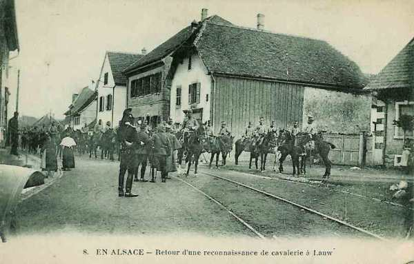
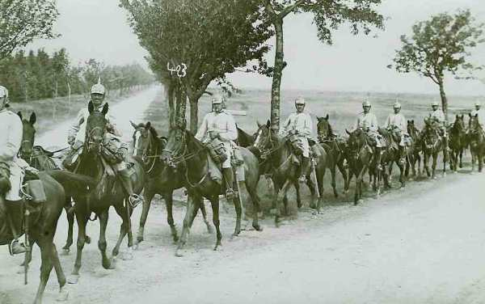

# Le 10 août 1914

Mulhouse est perdue suite à une contre-attaque allemande.
La cavalerie allemande poursuit son exploration en Belgique et se heurte aux positions de l’armée belge.
Le premier train transportant les troupes anglaises se met en route.

### Armée d’Alsace

- La gauche de l’armée se trouve à Thann. Comme le détachement est violemment attaqué, le repli de 5 km sur les Hautes-Vosges doit être ordonné.

_Contre-attaque allemande vers Mulhouse_
_C Michelin, d’après guide édition 1919 - Autorisation 06-B-05_

- Le centre et la droite occupent la ligne Remingen - Altkirch.

- Les chasseurs alpins débarquent du 11 au 13 dans la région de Remiremont et établissent un barrage sur les Vosges entre le col de la Schlucht et le ballon d’Alsace.
Le 3e chasseurs s’élance de Provenchères sur la route de Saales et bouscule quatre bataillons allemands.

### Ie armée française

Dubail pousse le 13e C.A. sur la rive droite de la Moselle. Le Q.G. s’établit à Thaon.

_Reconnaissance de cavalerie en Alsace_
_Collection privée_

Dans la soirée, les Allemands portent tous leurs efforts sur la gauche du C.A. qui est contraint à un nouveau recul, après la perte de Mulhouse. En fin de journée, les Français occupent la région de Lauw, la vallée du Speebach, le canal du Rhône au Rhin et l’Ill dans la région d’Altkirch. Dubail insiste pour l’envoi de renforts. Joffre expédie l’ordre de préparer une prompte reprise de l’offensive.

### IIe armée française

Dans la matinée, les Allemands attaquent les éléments de couverture sur le front boisé du Haut-de-la-Croix - Moncourt et contraignent la première ligne à se retirer.

Le 20e C.A. (Foch) signale sur sa gauche des forces de cavalerie allemandes évaluées à plusieurs brigades renforcées de canons qui se portent sur Nomény et lancent quelques projectiles sur Pont-à-Mousson.

Deux bataillons du 15e C.A. enlèvent à la baïonnette le village de La Garde, au nord du canal de la Marne au Rhin.

Vers Moncel, un bataillon et une batterie allemande venant de Vic attaquent les avant-postes français qui les repoussent avec des pertes sérieuses.

### C.C. Sordet

Dans la soirée, Sordet apprend que des forces allemandes se portent sur Neufchâteau.

### Armée anglaise

Le premier train transportant des troupes arrive à Southampton.

### Armée belge de campagne

Les avant-postes de cavalerie de la 1e division sont attaqués à Orsmaal-Gussenoven. La cavalerie allemande est en contact avec l’armée belge entre Halen et Eghezée.

### O.H.L.

Ordre est donné la Ve armée de s’articuler de manière à pouvoir prendre l’offensive soit vers le nord-ouest, soit vers le sud-est pour se porter contre le flanc gauche des forces françaises qui pourraient s’aventurer dans la poche de la Sarre.

### Ie armée allemande

- Le 1e C.C. (von der Marwitz) continue son mouvement vers l’ouest.

_Cuirassiers allemands_
_Collection privée_

- La 2e D.C. entre vers 10h à Sint-Truiden, découvre que le pont de Wilderen a sauté et se heurte à Orsmael-Gussenhoven à l’avant-garde du 3e régiment de lanciers. Le 12e régiment de hussards et le 7e cuirassiers  attaquent mais ne s’emparent de ce village qu’après plusieurs heures en le débordant. Comme la route est défendue par une compagnie du 24e de ligne, la D.C. s’arrête à Wilderen.

- La 4e D.C. marche sur Landen, escarmouche avec l’armée belge à Opheylissem et à Jauche, et retourne bivouaquer à Velm.

- La 9e D.C. n’a pas réussi à franchir la Meuse entre Liège et Huy.

- Comme le pont de Visé est détruit, le 10e C.A. va construire un pont à Lixhe (à 6 km de la frontière hollandaise).

### IIe armée allemande

Elle est en position d’attente.

IIIe armée allemande
Elle poursuit sa concentration.

- Le 11e C.A. est entre Gerolstein et la frontière.
  Le 12e C.A. est entre Oberkeil et la frontière.
  Le 19e C.A. est entre Herzogenrath et la frontière.

### IVe armée allemande

Le Q.G. est à Trêves.

### Ve armée allemande

Des éléments de la 6e D.C. passent l’Othain à Pillon, forçant la ligne des avant-postes français.

Le gros de l’armée ne peut dépasser jusqu’à nouvel ordre la ligne Bettembourg - Thionville - Metz. L’armée doit relier son aile à Thionville, pivot de la Moselstellung (position fortifiée de la Moselle) en liaison étroite avec la IVe armée, déboucher par son aile droite de Bettembourg, puis par Mamer - Arlon frapper en direction de Florenville. Elle doit se rendre maître des places de Montmédy et de Longwy.

### VIe armée allemande

Le 1e C.A. bavarois s’avance de Blâmont et Cirey vers Badonviller et Raon-l’Etape.

### VIIe armée allemande

L’armée arrête sa poursuite à midi après avoir refoulé les troupes françaises

[Lien vers la journée suivante](article_04_29.md)