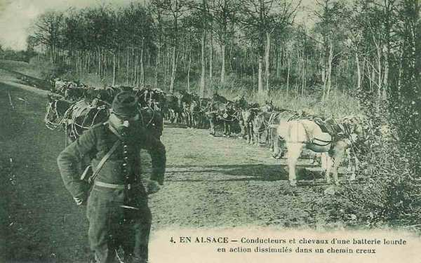
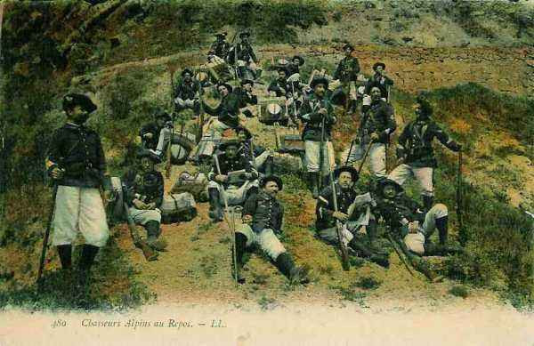
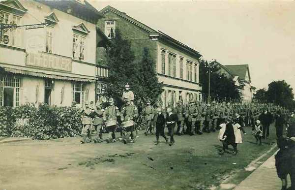

# Le 11 août 1914

Thann est évacué par les Français. Suite à cet échec, l’armée d’Alsace est constituée sous le commandement du général Pau.
Joffre prépare son offensive avec son aile droite
La première armée allemande commence à traverser Aix-la-Chapelle.

### G.Q.G. français

Joffre décide de prendre l’offensive le 14 août (en même temps que l’armée russe) avec ses deux armées de droite. Il avise Dubail que l’offensive sera déclenchée le 14 août par la Ie armée aidée de 2 C.A. de la IIe armée.

- Les deux C.A. de gauche de la Ie armée (8e et 13e) franchiront la Meurthe et attaqueront vers Blâmont - Cirey.

- Les C.A. de droite de la IIe armée (15e et 16e) se porteront vers Avricourt.
  Le 21e C.A. doit s’emparer du Donon.
  Le 14e C.A. occupera les cols vers la Schlucht.

### Armée d’Alsace

Thann est évacué par les Français et les Allemands occupent Massevaux sur la Haute Doller.

L’armée d’Alsace est constituée (7e C.A., 8e D.C., 44e division, 1e groupement de divisions de réserve, soit 11.500 combattants) sous la direction du général Pau. Elle opérera à la droite de la Ie armée au sud de la ligne Remiremont - Gerardmer et la Schlucht.

Pau veut porter son effort de Thann à Dannemarie, la droite de son armée longeant le canal du Rhône au Rhin.

Le commandant du 7e C.A. donne à 3h30 l’ordre de préparer une prompte reprise de l’offensive.

_Batterie lourde en Alsace_
_Collection privée_

### Ie armée française

Le 21e C.A. est relevé par les troupes alpines aux cols de Bonhomme et de Sainte-Marie. Il se trouve impliqué dans des combats à Sainte-Marie-aux-Mines. Son commandant décide de conquérir les passages des Vosges entre le col d’Urbeis et le col de Prayé.

_Chasseurs alpins_
_Collection privée_

Dans le couloir de Blâmont (entre Nancy et Strasbourg), le commandant du 8e C.A. se prépare à soutenir la 25e brigade. Les Allemands ne font aucune tentative dans le couloir de Blâmont et les troupes se maintiennent sur la ligne Montigny - Badonviller.
Le 21e C.A. atteint Provenchères.

### IIe armée française

Le 9e C.A., destiné à être envoyé dans les Ardennes, est relevé par le 20e sur les emplacements du Grand Couronné de Nancy.

Les Français sont chassés de Lagarde avec de fortes pertes et les Allemands bombardent Pont-à-Mousson.

### IIIe armée française

A l’abri du dispositif de couverture, en arrière des 2e et 6e C.A., l’armée opère ses débarquements.

Deux bataillons français se trouvent le long de l’Othain (affluent de la Chiers, dont le cours s’étend de Longuyon à Montmédy). Ils sont attaqués par des troupes allemandes assez nombreuses et contraints de se replier, mais des renforts arrivent dans la soirée et reprennent l’offensive.

### C.C. Sordet

On signale à Sordet que des colonnes ennemies occupent le nord-est de Neufchâteau. Il décide de stationner vers Maissin - Paliseul.

### Armée belge de campagne

Ordre est donné aux divisions de première ligne d’organiser  des positions de résistance sur la Gette : les hauteurs sur la rive gauche entourant Tienen, à l’ouest d’Hoegaarden, au nord de Sint-Remy-Geest, à Mélin et Lathuy.
La ligne de garde sur la rive est de la Gette s’étend sur une profondeur de 3,5 km.

### Ie armée allemande

- Les 3e et 4e C.A. effectuent leur débarquement.

- von der Marwitz essaie de tenter un coup de force aux abords de Diest. Il ramène la 2e D.C. à Cortessem et la 4e  à Looz et laisse reposer hommes et chevaux.

- von Kluck donne à ses C.A. leurs instructions de marche. Pour le 12 août, les têtes de colonnes du 2e C.A. doivent atteindre Herzogenrath (lisière ouest d’Aix-la-Chapelle), celles du 4e C.A., Birk, celles du 3e C.A. Weiden. Les 3e et 4e C.A.R. suivront au fur et à mesure de leurs débarquements, soit un jour plus tard que les C.A. actifs.

_Marche d’une colonne allemande_
_Collection privée_

- La traversée d’Aix-la-Chapelle doit durer plusieurs jours. Les colonnes de l’armée s’étend sur 2 km (320.000 hommes et leurs bagages) et empruntent trois routes.

### IIe armée allemande

Elle attend de recevoir l’ordre d’avancer quand les forts de Liège se seront rendus.

### VIe armée allemande

Rupprecht souhaite attaquer le front Moselle-Meurthe de Pont-à-Mousson à Nancy avec la VIe armée et de Blâmont à Saint-Dié avec la VIIe armée et en réfère à Moltke.

L’armée bombarde Pont-à-Mousson et incendie une partie de Badonviller.

[Lien vers la journée suivante](article_04_30.md)