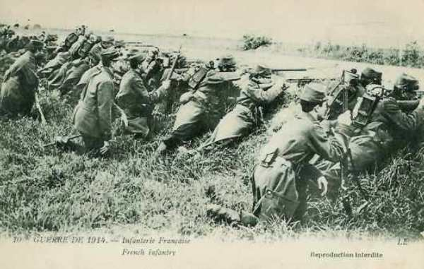
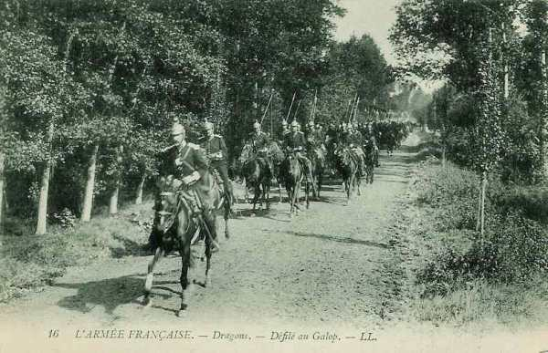

# Le 12 août 1914

Joffre prépare l’offensive en Alsace et en Lorraine qui était prévue dans le plan XVII.
Pour pallier le risque de débordement du dispositif français, la Ve armée remonte vers le nord, va prendre position le long de la Sambre et garde les passages de la Meuse.

### G.Q.G. français : préparation de l’offensive en Alsace et Lorraine

Joffre cède aux instances de Lanrezac et l’autorise à étendre son armée jusqu’à la Sambre et de placer le 1e C.A. devant Dinant.

### Armée d’Alsace

Situation au soir en vue de l’offensive :

- 81e brigade : le Valtin - la Schlucht - la Tête de Chien.
  7e C.A. : Massevaux - Reppe.
  8e D.C. entre Montreux et Granvillars.

Le 3e chasseurs entre dans Saales. Une compagnie du 29e s’empare du col du Hanz et repousse une contre-attaque du 99e prussien.

### Ie armée française

Dans la matinée, le 21e C.A. poursuit l’occupation des passages des Vosges. Il passe la frontière allemande et entre à Saales et à Bourg-Bruche sans résistance, en s’emparant du débouché nord de la trouée de Saales.

Dans le couloir de Blâmont, les Allemands ont repris leurs attaques. Les 8e et 13e C.A. franchissent la Meurthe. Le 8e C.A. (de Castelli) occupe les rives de la Meurthe sur le front Vathiménil - Azerailles, en liaison avec le 16e C.A. (IIe armée). Les troupes des deux C.A. creusent des tranchées.

_Infanterie française_
_Collection privée_

### IIe armée française

Castelnau fait connaître à ses subordonnés leur mission offensive.

- 16e C.A. : entre les lignes Fraimbois - Moussey.
  15e C.A. : au sud de la ligne Serres - Azoudange.
  20e C.A. : crête de Donnelay - Juvelize.
  2e D.C. : Hoéville.
  10e D.C. suivra derrière la droite du 16e C.A. pour une exploitation ultérieure.
9e C.A. couvrira l’attaque de Moncel à la Moselle (Amance, la Rochette).
2e groupement de division de réserve est à l’est de Nancy (Varangéville, Château-Salins)

### IIIe armée française

Au nord de Verdun, la IIIe armée (Ruffey) a terminé sa concentration.

Les Français se heurtent au 21e régiment de dragons allemands qui ont mis pied à terre. Les canons français les criblent de projectiles et ils sont à peu près anéantis. Les Français entrent à Pillon, au sud de Longuyon.

### Ve armée française

Pour assurer la continuité du front, en liant Namur à l’armée de gauche, le général Lanrezac reçoit l’autorisation de faire garder la Meuse entre Givet et Namur. Les deux divisions d’Afrique commenceront leur débarquement à Philippeville (Belgique).

### C.C. Sordet

Des troupes de toutes armes sont signalées dans la région de Recogne. Sordet se porte à leur rencontre mais les Allemands se dérobent. Après avoir stationné quelques heures vers Ochamps, le C.C. regagne le soir la région de Prondrôme - Beauraing - Lomprez, croyant discerner « une activité plus grande de l’ennemi » sur la Lesse.

_Dragons français au galop_
_Collection privée_

### Armée anglaise

Les troupes britanniques commencent à traverser la Manche. Ses mouvements dureront jusqu’au 17 août.

Kitchener donne les instructions à French : en aucun cas, il ne peut se considérer comme étant sous les ordres de Joffre. Il doit veiller à ne jamais mettre l’armée anglaise dans une position en flèche par rapport à l’armée française.

### Armée belge de campagne : bataille de Halen

La 3e division se porte vers Leuven. Elle remplace la 2e division qui vient de prendre position entre Leuven, Aarschot, Diest, Tienen.

Une reconnaissance annonce la marche de 2500 hommes et de 12 pièces d’artillerie, se portant d’Alken vers Stevoort, puis la marche de 2500 cavaliers traversant Hasselt.

Albert Ie est résolu à occuper la position de la Gette le plus longtemns possible pour donner aux franco-anglais le maximum de temps pour venir renforcer l’armée belge.

- Dès 8h15, les ordres préparatoires sont donnés en vue de la bataille de Halen :
  La 1e division doit envoyer une brigade mixte qui se trouve à Sint-Margriete-Hautem vers Kortenaken, où elle se mettra à disposition de la D.C.
  La D.C. doit interdire les débouchés de la Gette et du Demer.

L’Etat-Major belge ignore encore les intentions des Allemands : s’il s’agit de la marche en avant du gros des armées, cela se traduira par une attaque sur un front étendu, sinon seule une attaque localisée se produira.

### O.H.L.

Les transports de concentration de l’armée allemande sont terminés.

Rupprecht de Bavière a demandé à Moltke de pouvoir passer à l’offensive mais ce dernier lui répond que la marche en avant des VIe et VIIe armées n’est pas souhaitable.

Lors du combat de Lagarde, un ordre français est ramassé sur le champ de bataille et porté à l’O.H.L. Moltke en déduit que les Ie et IIe armées françaises comportent 9 C.A. et 4 D.C., soit une supériorité d’un C.A. et d’une D.C. par rapport à l’armée allemande dans le même secteur.

_Combat de Lagarde_
_Collection privée_

### Ie armée allemande

A 6h du matin, von der Marwitz se met en route vers Halen avec son C.C., la 2e division passant par Hasselt, la 4e division et les bataillons de chasseurs par Alken. La 18e brigade reste postée à Sint-Truiden. Il va rencontrer la cavalerie belge à Halen.

Après d’âpres combats, les D.C. doivent retraiter vers Hasselt.

Le gros de l’armée commence à faire mouvement à partir de sa zone de concentration (Jülich et Krefeld).

### IIe armée allemande

En position d’attente.

### IVe armée allemande

Arlon est envahi par un détachement du 18e C.A.

### VIe armée allemande

Les Allemands bombardent Pont-à-Mousson (à 6 km de la frontière) au moyen de mortiers de 21 cm, d’une portée de 10 km.

[Lien vers la journée suivante](article_04_31.md)