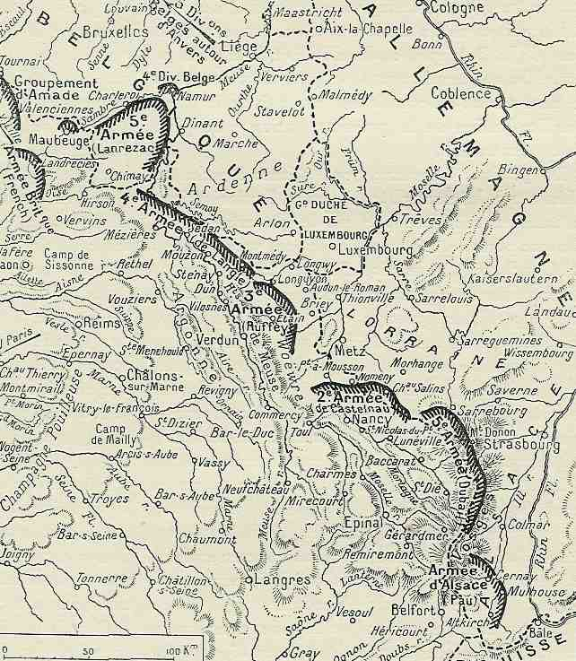
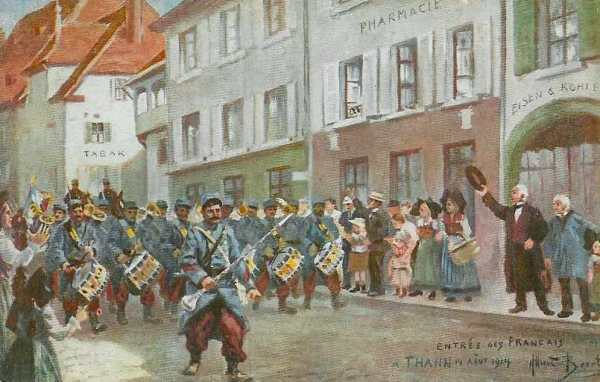
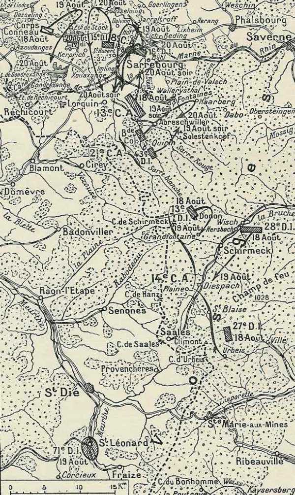
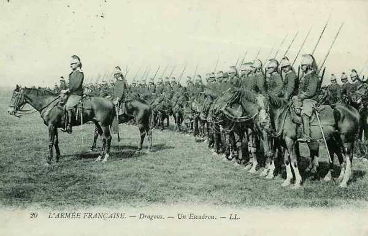
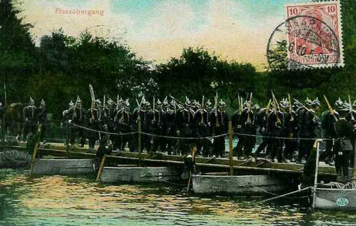

# Le 14 août 1914

Les armées allemandes sont en route pour effectuer l’encerclement de la gauche des armées françaises. Lanrezac, qui se trouve à l’extrême gauche, fait part de cette menace au G.Q.G., mais ses déclarations sont accueillies avec scepticisme.
L’armée d’Alsace se lance dans une seconde offensive.
Les Ie et IIe armées françaises entament l’offensive en Lorraine, qui , dans l’esprit de Joffre, doit être décisive.
Les anglais commencent à se concentrer à Maubeuge.

### G.Q.G. français : scepticisme

Le rôle dévolu à la Ve armée par le plan XVII,  une contre-offensive dans la direction de Neufchâteau, répond à l’éventualité où l’aile droite allemande serait orientée sur Sedan. Elle ne prévoit pas le cas où l’attaque serait orientée vers Givet ou en aval. L’attaque brusquée de Liège et l’apparition de forces de cavalerie en Hesbaye entre Ourthe et Meuse fortifient la crainte de Lanrezac (Ve armée) de se voir déborder par le nord. Il est en outre convaincu que le mouvement principal allemand se fera sur les deux rives de la Meuse.

Lanrezac décide de s’entretenir avec Joffre. Il expose les faits et les raisons logiques qui affermissent sa conviction que les Allemands vont se ruer sur l’aile gauche française en exécutant au nord de la Meuse un large mouvement débordant. Réponse de Joffre : « nous avons le sentiment que les Allemands n’ont rien de prêt par là ». Lanrezac rejoint son Q.G. de Rethel. Berthelot estime que la menace dont fait état Lanrezac est encore à échéance lointaine et sa certitude est loin d’être établie. Joffre lui rappelle que sa mission est de se porter à la rencontre des Allemands derrière l’Ourthe et la ligne Houffalize - Luxembourg.

Arrivé à son Q.G. de Rethel, Lanrezac écrit à Joffre pour lui demander de préparer le transport éventuel de son armée vers la région de Givet, Maubeuge, en laissant un C.A. et deux divisions de réserve sur la Meuse, en liaison avec la IVe armée. En effet, la 3e D.C., en reconnaissance vers Libramont, a signale des colonnes allemandes faisant mouvement de Marche vers Dinant.

Les observations tant par le C.C. Sordet que par l’aviation arrivent à la conclusion qu’il n’y aurait que 8 C.A. et 4 D.C. entre la pointe nord du Grand-Duché et la frontière du Limbourg hollandais. La situation ne semble pas inquiétante de ce côté puisque l’armée française peut aligner 10 divisions actives, 3 divisions de réserve, les 6 divisions belges et à bref délai 4 divisions d’infanterie et une D.C. britanniques L’impression qui prévaut est que la grosse masse de manœuvre allemande se réunit derrière l’Ourthe.

_Position des armées françaises le 14 août_
_La grande guerre racontée par les combattabts_

### Armée d’Alsace : seconde offensive d’Alsace

Pau donne des ordres pour attaquer Mulhouse. L’axe de marche est Dannemarie - Altkirch - Vallée de l’Ill.

Dans la matinée, le 28e bataillon de chasseurs occupe Lauw. Les Allemands se retirent.

Les 12e et 22e bataillons de chasseurs alpins pénètrent à Bischwiller et Thann. Descendant de la Schlucht, les alpins occupent Munster puis Guebwiller.

_Entrée des Français à Thann_
_Collection privée_

Pau compte pénétrer en Alsace par les cols des Vosges et la trouée de Belfort pour faire mouvement sur Mulhouse.

### Ie et IIe armées françaises : premier jour de l’offensive en Alsace et en Lorraine

Le plan d’offensive générale pour ces deux armées est d’attaquer vers le nord-est, dans la direction de la Sarre, puis de se redresser vers le nord, l’aile gauche marchant vers Morhange et l’aile droite marchant vers Sarrebourg. Cette offensive est couverte à droite par les 14e et 21e C.A. opérant autour du Donon (face à Strasbourg, ville allemande). Le 2e groupement de divisions de réserve monte la garde face au camp retranché de Metz. En effet, une forte garnison pourrait en déboucher et prendre les Français de flanc.

Les Allemands occupent des positions défensives avec de forts avant-postes soutenus par de l’artillerie lourde placée sur les collines

- Cirey - Blâmont en direction de Sarrebourg.
  Côte de Donnelay - Juvelize en direction de Morhange.
  Vic sur Seille vers Château-Salins.
  Crêtes de Jallaucourt - Malaucourt.

### Ie armée française

Les gros de l’armée se mettent en marche vers le couloir de Sarrebourg. Dubail prescrit aux 21e et 14e C.A. d’appuyer au plus tôt l’offensive entamée vers le nord.

_Offensive en Lorraine (Ie armée)_
_La grande duerre racontée par les combattants_

Le 14e C.A., tout en tenant les cols du Bonhomme et de Sainte-Marie attaquera le long de l’Altbach dans la direction de Schlestadt et le 21e C.A. tiendra la vallée de la Bruche. Ce dernier s’empare de la crête du Donon et les C.A. de gauche atteignent la Vezouse à Blâmont et Cirey.

La 16e division (de Maud’huy) se porte en avant avec ordre d’attaquer par brigades accolées sur les deux rives de la Vezouse, vers Domèvre. Dans le courant de l’après-midi, Domèvre est enlevé et une compagnie se porte en reconnaissance vers Blâmont et à 10h du soir, la division marche vers Blâmont.

Dans le courant de la journée, la gauche du 14e C.A. progresse vers Urbeis et établir la liaison avec le 21e C.A. à Steige.

### IIe armée française : début de l’offensive

La IIe armée se met en marche.

_Offensive en Lorraine (IIe armée)_
_La grande duerre racontée par les combattants_

- Le 16e C.A. vers Igney et Moussey, le centre vers Avricourt.
  Le 15e C.A. vers Mouacourt, Parroy et Serres.
  Le 20e C.A. vers Xanrey, la forêt de Bezange et Chambrey. -Le C.A. a dû engager un combat à Arraucourt, à la lisière de la forêt de Bezange.
  Le 9e vers la forêt de Grémecey.

Le soir, l’armée tient la ligne Gondrexon - Juvrecourt. La progression a été de 8 km.

Une résistance se produit à Moncourt : la 29e division doit gagner la ligne Moncourt - Bois du Haut de la Croix, à 800 m de la frontière. Moncourt domine la plaine. Vers 15h, la 29e division est accueillie par un feu déconcertant de pièces de 105 (obusiers), puis par le feu de pièces de 77 (canons de campagne). Les mitrailleuses entrent ensuite en action. A 17h, la division parvient quand même à s’emparer de Moncourt. Les Allemands profitent de la nuit pour se retirer derrière la Seille. De même, le 20e C.A. a dû engager le combat à Arraucourt.

### Ve armée française

- Le 1e C.A. se trouve dans la région de Dinant - Philippeville et les 3e et 10e C.A. remontent légèrement vers le nord-ouest.

- Le 1e C.A. repousse un détachement du C.C. von Richthofen qui cherche à franchir la Meuse à Dinant. L’avant-garde de l’armée atteint Charleroi.

### C.C. Sordet

Le C.C. surveille des unités de cavalerie allemande qui, appuyées par 2 bataillons d’infanterie, se dirigent vers Dinant. Sordet entreprend de déboucher offensivement sur la rive de la Lesse mais la fatigue des chevaux, la nature du pays et le feu des flancs-gardes allemandes l’en dissuadent. A 22h, il demande au G.Q.G. si la situation nécessite qu’il reste sur la rive droite de la Meuse. Il reçoit comme réponse d’agir à sa guise, mais de couvrir en tout état de cause la gauche de la Ve armée.

_Peloton de dragons français_
_Collection privée_

### Armée anglaise

Le G.Q.G. britannique fait la traversée de la Manche vers le Havre.

Sir John French quitte Londres, débarque à Boulogne et arrive à Amiens.

Les troupes britanniques  commencent leurs mouvements par chemin de fer vers une zone de concentration entre Maubeuge et Le Cateau (longueur 25 milles, largeur 10 milles). La cavalerie est à l’extrémité nord-est (Est de Maubeuge - Jeumont - Damousie - Cousolre)

Le Q.G. est à Aibes, le gros des troupes est dans la région de Landrecies, Maroilles, Bohain.

### Armée belge de campagne

L’armée de campagne est coupée de toute communication avec Liège.

La 8e brigade qui occupait Huy et risquerait d’être cernée, se rapproche de Namur.

### Ie armée allemande

Les 2e, 3e et 4e C.A. gagnent la Meuse. Les 2 C.A.R. sont en seconde ligne sur la frontière belge, à l’ouest d’Aix-la-Chapelle.

L’armée commence à passer la Meuse à Visé.

_Traversée d’un cours d’eau_
_Collection privée_

### IIe armée allemande

Le 1e C.C. (von Richthofen) émerge du Grand-Duché et se porte vers la Meuse entre Namur et Givet. Il atteint le fleuve à Anseremme et à Houx. La 9e D.C. est arrivé dans la région de Hannut.

### IIIe armée allemande

Une première tentative par la cavalerie de forcer le passage de Dinant échoue.
Le Q.G. de l’armée s’installe à Clervaux.

### Ve armée allemande

L’armée se porte avec ses trois C.A. actifs sur la ligne de la Moselle.

- Le 5e C.A. à Koenigsmacher.
  Le 13e C.A. à Thionville.
  Le 16e C.A. à Metz.
  Le 5e C.A.R. à Niedaltrof et Bouzonville.
  Le 6e C.A.R. à Hessdorf et Bettange.

Le Q.G. de l’armée se rend à Thionville.

La 3e D.C. allemande remonte vers le Grand-Duché. Elle atteint la zone d’Etalle où elle escarmouche contre la 4e D.C. à l’est d’Arlon.

### VIe armée allemande

Les transports de concentration sont terminés.

Rupprecht expédie des instructions détaillées organisant le repli progressif de la VIe armée jusqu’au front Sarreguemines - Pfalzburg, sous la protection d’arrière-gardes, en imposant aux Français des arrêts successifs.

Le 1e C.A. bavarois reçoit l’ordre de se replier sur Avricourt en cas d’attaque. La ligne de repli de la VIe armée est Phalsbourg - Bouzonville. La VIIe armée doit tenir la Bruche.

- Les 3e et 2e C.A. bavarois se trouvent vers Remilly et Morhange.
  Le 21e C.A. est vers Dieuze
  Le 1e C.A. est vers Sarreguemines.

Dès les premières heures du jour, les observateurs aériens annoncent le mouvement de fortes colonnes françaises vers le nord-est à hauteur de la Meurthe moyenne.

A 10h30, le 1e C.A. bavarois commence à se replier en menant des combats d’arrière garde vers Blâmont et Cirey. Le soir, le 3e C.C. se replie sur le canal de la Marne au Rhin, le 21e entre ce canal et la Seille vers Dieuze. Les Français n’avancent pas devant les 2e et 3e C.A. bavarois au nord-ouest de Château-Salins.

### VIIe armée allemande

La poursuite du détachement français de Haute-Alsace s’arrête au contact des défenses de Belfort. A ce moment, von Heeringen retire les 14e et 15e C.A. pour les ramener à gauche de la VIe armée. Il s’agit en effet de prendre de flanc les Français engagés vers Sarrebourg. Ces C.A. sont remplacés par des détachements de la Landwehr (détachement Gaede).

- Le 14e C.A. commence ses transports de l’est de Mulhouse vers Sarrebourg.
  Le 15e marche de Colmar vers le nord.

·       Le  14e C.A.R. fait mouvement de Sélestat vers Molsheim.

[Lien vers la journée suivante](article_04_33.md)