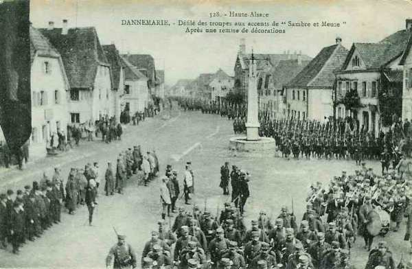
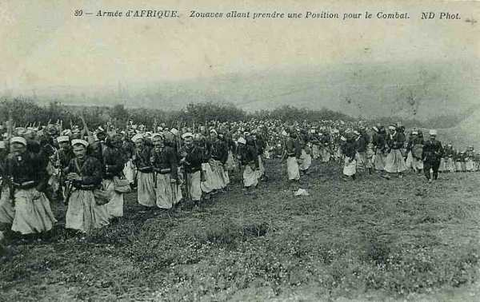
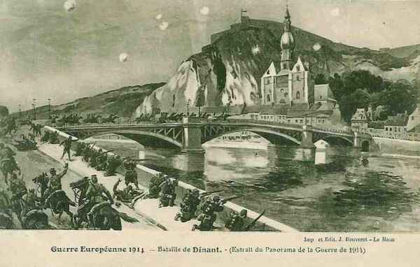
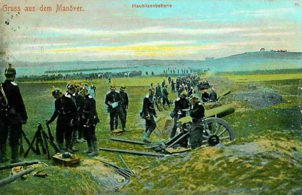

# Le 15 août 1914

Les forces allemandes au nord de Liège sont plus importantes que ce que Joffre a prévu. Il prescrit par conséquent de faire remonter la Ve armée vers la Sambre pour empêcher les armées allemandes de déborder la gauche française.
Les Ie et IIe armées françaises progressent en Lorraine devant des arrière-gardes allemandes qui se dérobent et attirent les Français vers des positions préparées.

### G.Q.G. français

Joffre reçoit des nouvelles sur les forces allemandes qui se trouvent au nord de Liège : elles semblent devoir être plus importantes qu’il l’avait cru.

Le G.Q.G. admet que l’adversaire va dessiner un mouvement enveloppant par la rive gauche de la Meuse. Attribuant toujours à l’armée allemande un nombre d’unités de première ligne très inférieur à celui dont il dispose en réalité, le commandement français conclut que si l’adversaire engage de grosses forces sur la rive droite de la Meuse, il ne lui restera que peu de monde dans les Ardennes belges. Il décide par conséquent de percer la ligne ennemie dans cette région en attaquant avec ses armées du centre, les IIIe et IVe, de manière à couper les communications de tout ce qui se sera aventurée de l’autre côté de la Meuse.

En même temps, la Ve armée prendra l’offensive sur la Sambre en liaison avec le B.E.F. qui prolongera sa gauche.
Le 21 août, l’armée anglaise se porterait au nord de la Sambre dans la région sud-est de Mons, en mesure de marcher dans la direction générale de Nivelles, à gauche de la Ve armée française.

Diverses instructions décident un regroupement des armées de gauche.

- La Ve armée se rendra dans la région de Mariembourg - Philippeville avec ses trois C.A. de gauche (1e, 3e  et 10e). L’armée sera renforcée par les 37e et 38e divisions d’Afrique, le 18e C.A. retiré de Lorraine, le C.C. Sordet et les divisions de réserve Valabrègue.

- La IVe armée reçoit les 2e et 11e C.A. et les 52e et 60e divisions, les 4e et 9e D.C. Elle s’établira de façon à pouvoir déboucher du front Sedan - Montmédy sur Neufchâteau.

_Général Gérard (2e C.A.)_
_Collection privée_

- Le IIIe armée s’établira sur le front Jametz - Etain, prête à déboucher sur Longwy. Pour la couvrir en direction de Metz, une armée nouvelle dite « de Lorraine » aux ordres du général Maunoury groupera huit divisions de réserve dans la région de Toul - Verdun.

- Joffre demande au ministre de constituer avec trois divisions un barrage depuis la mer jusqu’à Maubeuge. C’est l’origine du groupement d’Amade. Il s’établit entre Dunkerque et Valenciennes et couvre les lignes de communication contre les incursions possibles de cavalerie.

Le 2e bureau, ne tenant pas compte des C.A.R. allemands, commet une erreur d’appréciation du simple au double quant aux forces adverses : il ne tient en effet compte que des C.A. actifs. Présenté sous cette forme, le décompte est de nature à induire Joffre en erreur dans l’évaluation des forces de l’adversaire.

- Joffre écrit "les forces allemandes réunies autour de Thionville, dans le Luxembourg et en Belgique sont évaluées à **13 ou 15 C.A.**"
Il se trompe du simple au double : **26 C.A.** opèrent entre Hasselt et Thionville. A ces forces, le généralissime oppose
  La Ve armée française
  L’armée britannique
  L’armée belge
soit 9 C.A. et 5 D.C.

Comme les Allemands ont 18 C.A. au nord de Bastogne, le rapport des forces est de 1 à 2. C’est insuffisant, même pour livrer une bataille défensive.

### Armée d’Alsace

Les Allemands se retirent devant presque tout le front de l’armée : Cernay et Dannemarie, mais dans la vallée de la Fecht, ils semblent s’accrocher à Munster.

L’ordre général d’opérations pour la journée du 16 août prescrit la reprise de l’offensive sur tout le front pour s’emparer des débouchés des vallées de Guebwiller et de Munster pour atteindre le front Cernay - Dannemarie.

_Entrée de l’armée française à Dannemarie_
_Collection privée_

L’armée débouche dans la plaine d’Alsace.

### Ie armée française

L’armée se porte dans la région de Cirey - Blâmont - Avricourt, jusqu’à hauteur de Lorquin.

L’avant-garde du 8e C.A. enlève Blâmont ; le 13e C.A. s’avance vers Cirey, qui est enlevée dans la matinée. Les Allemands se replient sur Lorquin.

Ces derniers ont disparu, leur présence ne se révèle que par le tir à longue portée de leur artillerie lourde. La division Maud’huy occupe Blâmont mais se trouve en flèche par rapport au 16e C.A. Elle progresse au ralenti vers Sarrebourg, devant les Allemands qui se retirent systématiquement.

### IIe armée française

La progression de l’armée se ralentit.

- Le 16e C.A., qui n’a pas rencontré de résistance sérieuse, pousse la division de droite sur Aménoncourt en liaison avec le 8e C.A. Il atteint le signal de Xousse, Avricourt.

- Au 15e C.A., la brigade demeurée à Moncourt a épuisé ses cartouches et ses vivres et se trouve soumise à un feu d’artillerie lourde bien réglé. Le commandant propose à Castelnau de remettre au surlendemain l’attaque du bois de Haut-la-Croix.

- Le 20e C.A. atteint Bezange-la-petite et Xanrey. Les canons Rimailho bouleversent les tranchées allemandes et réduisent au silence une batterie lourde.

- Le 9e C.A. pousse un détachement à Nomény - Bénicourt -  Clémery.

Castelnau se rend compte que les Allemands ont réalisé une très sérieuse organisation défensive : infanterie retranchée et batteries de gros calibre enterrées. Il recommande par conséquent de conquérir successivement les points d’appui et de s’y fortifier solidement.

L’ordre pour le 16 août prescrit une attaque méthodique.

- Le 16e C.A. occupera la zone Avricourt, Réchicourt tout en poussant des détachements dans la région des Etangs, vers Gondrexange et Hellocourt. Avec le restant de ses forces, il coopérera avec le 15e C.A. en attaquant dans la direction de Maizières.

- Le 15e C.A. enlèvera le bois de Haut-de-la-Croix.

- Le 20e C.A. attaquera Donnelay.

- Le 9e C.A. avec la 70e D.R. continuera à tenir la tête de pont de Nancy en maintenant l’occupation de Nomény et Clémery.

Le repli de l’armée allemande est organisé de façon qu’elle soit établie derrière la Sarre le 18 août. Elle s’est opérée d’une manière précipitée, ce qui laisse pressentir un piège.

### IIIe armée française

Ruffey reçoit l’ordre (instruction particulière n° 10) de s’établir sur le front Jametz - Etain pour marcher vers Longwy et Arlon avec les 4e et 5e C.A.

### IVe armée française

L’armée est renforcée par les 2e et 11e C.A. et les 52e et 60e divisions, les 4e et 9e D.C.  Elle se trouve sur le front Sedan - Montmédy. Elle doit pouvoir déboucher dans la direction générale de Sedan - Neufchâteau.

### Ve armée française : remontée vers la Sambre

Le 1e C.A. devant Dinant est attaqué par un C.A. allemand qui semble couvrir les mouvements de plusieurs autres C.A. glissant vers le nord- ouest entre Namur et Liège. Ce jour, le lieutenant Charles de Gaulle est blessé. Une plaque commémorative est apposée sur le pont de Dinant.

Dans la soirée, Lanrezac obtient l’autorisation de remonter vers la Sambre pour porter le gros de son armée vers Namur et Charleroi. Il reçoit des renforts : les 37e et 38e divisions d’Afrique du Nord, le groupe des divisions de réserve du général Valabrègue et le 18e C.A., provenant de la IIe armée et qui débarque vers Hirson.

Les 3e, 10e C.A., les 37e et 38e divisions d’Afrique, les 51e, 53e et 69e divisions de réserve du groupe Valabrègue, puis le 18e C.A. se portent vers le nord.

_Zouaves_
_Collection privée_

### C.C. Sordet

A 9h, Sordet donne l’ordre de repasser par le pont d’Hastière et de gagner l’entre Sambre et Meuse. Dans la soirée, une instruction particulière place le C.C. sous les ordres du commandant de la Ve armée (Lanrezac).

### Armée anglaise

John French rencontre le président Poincarré à Paris. Le corps expéditionnaire commence à débarquer au sud de Maubeuge et doit se porter le 21 au sud de Mons, en mesure de marcher sur Nivelles. Les anglais devraient, pour opérer un vaste mouvement de conversion, effectuer trois fortes marches et ne pourraient être à pied d’oeuvre que le 23. Or, le 18 août, les Allemands seront maîtres de la Gette, de Diest à Tienen.

### Armée belge de campagne

Des forces de cavalerie allemandes sont signalées dans la région d’Hannut. Elles pourraient tenter une incursion vers Bruxelles en passant entre le flanc droit de l’armée (5e et 6e divisions) et la position fortifiée de Namur (4e division). Pour empêcher cette opération éventuelle, la 6e division reçoit l’ordre de porter dès le 16 une brigade mixte vers Wavre afin d’interdire les passages de la Dyle. La 4e division doit également envoyer un détachement vers le nord.

Pour éviter que le flanc gauche de l’armée soit débordé (2e division - position fortifiée d’Anvers), la 2e division reçoit l’ordre d’envoyer un second bataillon vers Aarschot pour défendre les abords de la ville vers le nord. Les troupes de la position fortifiée d’Anvers doivent tenir la ligne de la grande Nèthe, de Lier à Boisschot pour se relier à la gauche de l’armée.

### O.H.L.

Le plan de Moltke est que la VIIe armée se retire en cas d’offensive vers la position fortifiée Molsheim - Strasbourg. En Lorraine, la VIe armée doit se replier vers la Sarre devant une offensive française, de façon à ce que les poursuivants puissent être attaqués sur les deux flancs par les forces sortant de Metz d’une part et celles de la VIIe armée qui déboucherait des Vosges.

### Ie armée allemande

Le Génie réussit à réparer les voies ferrées entre Aix-la-Chapelle et Liège et la circulation peut y reprendre.

### IIe armée allemande

Bülow donne les ordres de marche à son armée :

- 7e C.A. : sur la route Liège - Liers.
  11e C.A. : sur la route Esneux - Neuville-en-Condroz - Hermalle.
  Garde : sur la route Hamoir - Modave.
  7e C.A.R. : sur l’Ourthe.
  C.A.R. de la Garde : jusqu’à Basse Bodeux.

L’armée commence le franchissement de la Meuse entre Liège et Huy.

### IIIe armée allemande

Le C.C. von Richthofen attaque Dinant et chasse de la citadelle un bataillon français, mais il est obligé de battre en retraite suite à l’intervention d’une division du 1e C.A. français. Il s’installe en couverture sur le front Andenne - Ciney.

_Combat de Dinant_
_Collection privée_

Le gros de l’armée atteint l’Ourthe et attend de nouveaux ordres.

### VIe armée allemande

Les ordres de Rupprecht de Bavière sont les suivants :

- Le 1e C.A. bavarois doit se retirer en direction de Sarrebourg sans dépasser le canal de la Marne au Rhin.

- Le 1e C.A.R. bavarois doit prendre position au nord-est de Sarrebourg.

- Le 3e C.A. doit se retirer dans lé région des Etangs.

- Le 21e C.A. doit se retirer sur la Seille sans la dépasser et se mettre en liaison vers Morhange avec la 2e C.A. bavarois.

_Obusiers allemands_
_Collection privée_

Rupprecht reçoit un télégramme de l’O.H.L. : les VIe et VIIe armées doivent se retirer sur la Sarre supérieure entre Sarrebourg et Sarrebrück.

### VIIe armée allemande

Au soir

- Le 15e C.A. est encore dans la région de Colmar.
  Le 14e C.A.R. est à Sélestat
  Le 14e C.A. commence à arriver par voie ferrée à Saverne.

Dans la vallée de la Bruche, les éléments de la garnison de Strasbourg se retirent vers Molsheim.

[Lien vers la journée suivante](article_04_34.md)