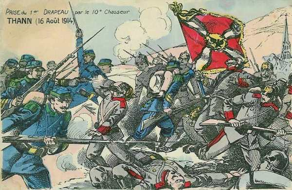
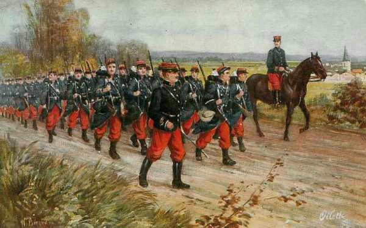
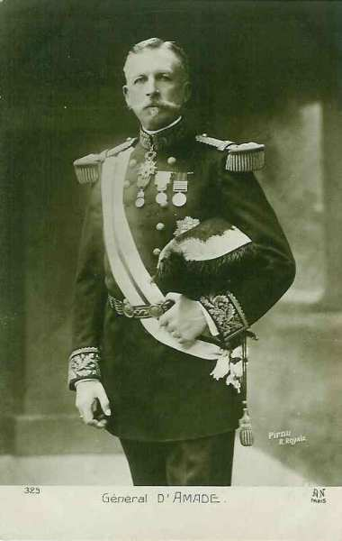
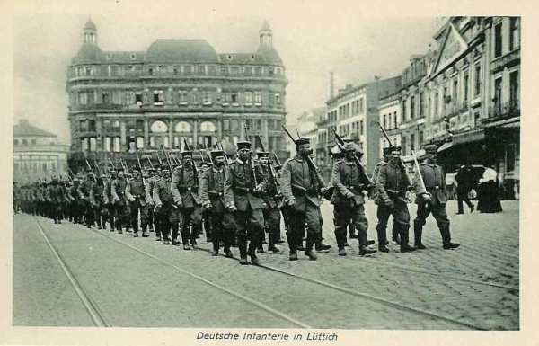
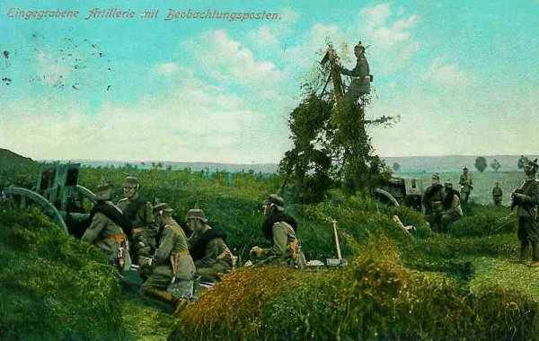

# Le 16 août 1914

Comme les ailes gauche et droite des armées allemandes sont très fortes, Joffre pense que le centre de leur dispositif (dans les Ardennes) est dégarni. Les reconnaissances de cavalerie ont constaté que les troupes faisaient mouvement d’est en ouest. Joffre estime opportun d’attaquer le flanc de l’adversaire dans la région des Ardennes (Neufchâteau - Longwy).
En Lorraine, les forces allemandes d’arrière-garde continuent à opérer une retraite, ce qui laisse pressentir un piège.
Le débarquement des troupes britanniques se termine.

### G.Q.G. français

Joffre adresse à French une note expliquant la situation des armées :

« L’ennemi semble devoir porter son effort principal sur son aile droite et au centre : d’une part, au nord de Givet ; d’autre part sur le front Sedan - Montmédy - Damvillers. Au sud de Metz, il paraît garder une attitude défensive.

Le général Lanrezac, commandant de la Ve armée, a pour mission d’agir contre le groupe des forces ennemies du nord, de concert avec l’armée anglaise et les forces belges. Dès le 21 au matin, l’armée anglaise se porterait au nord de la Sambre, en mesure de marcher vers Nivelles, soit à gauche de la Ve armée, si l’ensemble des forces est amené à se déplacer vers le nord, soit en échelon en arrière à gauche de cette Ve armée, si l’orientation de sa marche s’infléchit plus à l’est.

En ce qui concerne la coopération de l’armée belge, il conviendrait de lui demander, tout en couvrant Bruxelles et Anvers, d’agir en toutes circonstances sur le flanc extérieur des forces allemandes et à revers au besoin ».

Joffre décide d’enlever le 18e C.A. de la région de Toul pour le débarquer dans celle de Maubeuge, en suivant l’itinéraire Lérouville - Revigny - Sainte-Menehould - Amagne - Hirson. Ce transport comprend 110 trains.

Le 9e C.A. doit être également transporté de la région de Nancy vers celle de Charleville, une partie via Lérouville - Verdun - Sedan, l’autre partie via Gondrecourt - Joinville - Saint-Dizier - Vitry - Châlons - Reims - Amagne.

### Armée d’Alsace

Les mouvements prescrits par Pau s’exécutent sans rencontrer de résistance sauf dans la vallée de la Fecht. L’armée s’empare de Schirmeck et tient Thann - Cernay - Dannemarie. Les forces allemandes se retirent, abandonnant un nombreux matériel. Le 10e chasseurs réussit à s’emparer d’un drapeau bavarois, le premier pris par les Français.

_Prise d’un drapeau allemand à Thann_
_Collection privée_

### Ie armée française

L’armée se porte dans la région de Cirey - Blâmont - Avricourt, jusqu’à hauteur de Lorquin.

_Colonne française_
_Collection privée_

Les Allemands ont disparu, leur présence ne se révèle que par le tir à longue portée de leur artillerie lourde. Le 14e C.A. occupe Sainte-Marie-aux-Mines et le 16e C.A., sous une pluie battante, pousse jusqu’à Schirmeck. Quant au 13e C.A., il atteint le front Niderhoff - Saint-Quirin.

### IIe armée française

La marche en avant de la IIe armée se poursuit sans rencontrer de grande résistance face au nord-est : Azoudange, Gelucourt, Holzhof, Juvelize. Les Allemands continuent leur retraite planifiée.

- Le 14e C.A. s’empare de Sainte-Marie-aux-Mines.

- Le 16e C.A. occupe Azoudange, Réchicourt, Hellocourt et Maizières.

- Le 15e C.A. occupe sans combat les bois de Haut-de-la-croix d’où les Allemands se sont retirés, puis Marimont.

- Le 20e C.A. tient les hauteurs de Donnelay - Juvelize, Moyenvic et Vic. Marsal a été évacué par les Allemands. Le mouvement est toutefois entravé par les inondations de la Seille.

Les Français trouvent plusieurs tranchées abandonnées ainsi que des munitions.

Les ordres pour le 17 août sont les suivants :

- Le 16e C.A. doit pénétrer dans la région des Etangs pour porter le front de Mittersheim à Dieuze. Il doit se couvrir vers l’est sur le canal des Houillères.

- Le 15e C.A. doit border la Seille en amont de Marsal avec sa droite sur Zommange et se rendre maître des écluses qui commandent l’étang de Lindre afin de mettre fin aux inondations de la Seille.

- Le 20e C.A. s’établira face au nord, sa droite sur les hauteurs de Marsal.

- Le 9e C.A. reçoit un ordre d’embarquement. Il est distrait de la IIe armée pour être  transporté vers le nord.

### IIIe armée française

Les mouvements préparatoires à la marche vers Longwy sont en cours d’exécution. A la fin de l’après-midi, un peloton du 14e hussards, parti de Dombes, arrive à Longwy. Il franchit un avant-poste français à Villers-la-Chèvre.

### IVe armée française

En soirée, l’armée a réalisé le dispositif prescrit. Elle reçoit une partie du 9e C.A., prélevé sur la IIe armée en Lorraine.

De Langle de Cary donne ses ordres pour le 17.

« Les avant-gardes de deux divisions de réserve et du C.A. de gauche seront sur la Semois, tenant les débouchés de la forêt d’Ardenne dans la clairière de Neufchâteau. L’avant-garde du C.A. du centre occupera le fond de la clairière de Florenville, les avant-gardes des C.A. de droite occuperont la clairière de Virton ».

Cet ordre sera toutefois annulé, Joffre estimant la manœuvre prématurée.

### Ve armée française

La Ve armée entreprend une marche de flanc difficile de 120 km en direction de la Sambre. Toutefois, la remontée de la Ve armée vers la Sambre crée une solution de continuité entre la Ve et les IIIe et IVe armées, soit la Meuse entre Mézières et Namur.

La Ve armée cède à la IVe les 60e et 52e D.R. En remplacement de ces forces, Joffre lui affecte le 18e C.A. prélevé sur la IIe armée en Lorraine, les 37e et 38e D.I. et trois divisions de réserve.

Le général d’Amade est nommé au commandement de trois divisions territoriales. Leur objectif est de protéger les bases anglaises.

_Général d’Amade (Div. territoriales)_
_Collection privée_

### C.C. Sordet

Les premiers éléments du C.C. Sordet franchissent la Sambre. Joffre lui prescrit d’entrer en liaison avec l’armée belge de campagne et d’ arrêter la cavalerie allemande qui cherche à pousser dans le vide existant entre l’armée française et l’armée belge.

### Armée anglaise

Le débarquement des troupes britanniques se termine.
Le GQG britannique atteint Le Cateau dans la nuit.

French rend visite à Joffre à Vitry-le-François, accompagné de son chef d’Etat-Major le général Murray. Il fait part de ses instructions émanant de Kitchener : il doit se considérer comme indépendant, apporter son concours sans compromettre son armée. French dit que ses troupes ne pourront s’ébranler que le 24 août Joffre demande que l’armée britannique se porte au nord de la Sambre, prête à marcher vers Nivelles.

### Armée belge de campagne

Le commandant de la D.C. signale que les reconnaissances de cavalerie ne parviennent plus à percer la ligne avancée allemande. Albert Ie ne veut pas envoyer tout le C.C. en avant pour effectuer des reconnaissances. Joffre continue à croire que le déploiement allemand s’arrête à Havelange, soit 15 kmau sud de la Meuse.

### Position fortifiée de Liège

Les derniers forts ayant capitulé, la position fortifiée a cessé d’exister.

_Infanterie allemande à Liège_
_Collection privée_

### O.H.L.

Moltke et Guillaume II viennent s’installer dans leur quartier général à Coblence. Cette date marque également la fin de la concentration des armées allemandes.

### Ie armée allemande

La Ie armée a pour objectif d’attaquer l’armée belge sur la Gette et de la couper d’Anvers. Cette dernière mission revient à la 2e D.C.

_Artillerie allemande camouflée_
_Collection privée_

Elle atteint la ligne Bilzen - Tongres et s’empare des passages du Demer.

- Le 9e C.A. passe à la Ie armée et les brigades des 3e et 4e C.A., employées devant Liège, rentrent dans leurs corps respectifs.

- La 9e D.C. tente de se frayer un passage vers Chaumont-Gistoux et Roux-Miroir mais doit se replier vers Jauche - Hannut.

### IIe armée allemande

Le Q.G. de l’armée se transporte à Spa.

Le 1e C.C. (von Richthofen) est dans la région de Stavelot - Bastogne - Wiltz.

### IIIe armée allemande

L’armée reste en position sur la frontière belge en suivant la ligne Bra - Malempré - Houffalize.

### Ve armée allemande

L’armée se porte avec ses trois C.A. sur la ligne de la Moselle.

- 5e C.A. à Koenigsmacher.
  13e C.A. à Thionville.
  16e C.A. à Metz.

Le Q.G. de l’armée est à Thionville.

Le 4e C.C. est dans la région de Mézières - Saint-Mihiel - Carignan - Damvillers.

### VIe armée allemande

Rupprecht de Bavière entame nettement le repli vers la Sarre. Il fait organiser les positions de Reding (nord-ouest de Sarrebourg) à Sarrebrück. A Reding, l’armée est en liaison avec le 14e C.A. de la VIIe armée.

A midi,

- Les 3e et 2e C.A. bavarois sont repliés sur la Nied française.
  Le 21e C.A. est vers Dieuze.
  Le 1e C.A.R. est à Fenestrange
  Le 1e C.A. recule derrière Sarrebourg.

Moltke doute des intentions des Français : ils n’ont avancé que de 20 km en trois jours et tardent à attaquer. Est-ce une simple démonstration ?

[Lien vers la journée suivante](article_04_35.md)