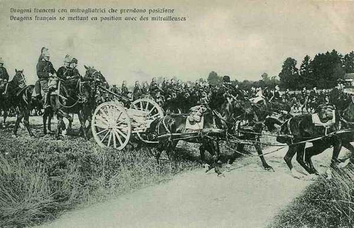
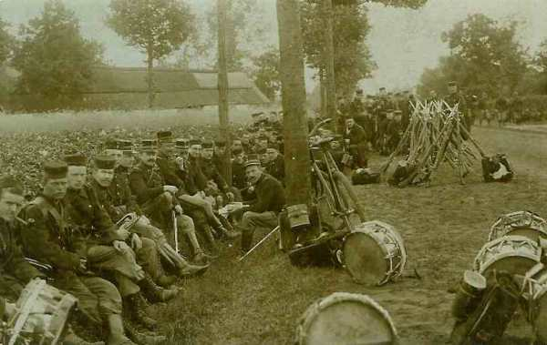
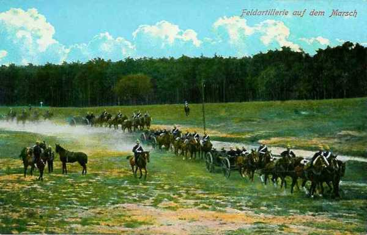

# Le 17 août 1914

Le gouvernement belge prend la décision de retirer les troupes vers Anvers.
En Alsace et en Lorraine, les troupes allemandes d’arrière garde terminent leur retraite et les armées françaises arrivent au contact de positions fortifiées garnies d’artillerie lourde et de mitrailleuses.
Moltke place von Kluck (Ie armée) sous le commandement de von Bülow (IIe armée).

### G.Q.G. français

Joffre apprend que les Russes pénètrent sur le territoire allemand en Prusse orientale.

Pour éviter que l’armée belge ne se retire sur Anvers, Joffre renouvelle à Lanrezac l’ordre de pousser le C.C. Sordet au contact des Belges au nord de Namur.

Des nouvelles tendent à éclaircir la situation : du côté de Metz, les avant-postes allemands, en majeure partie des troupes de réserve, et de la Landwehr, se retranchent. Une masse de cavalerie à l’est de Spincourt paraît suivie de forces importantes autour d’Arlon (Ve armée du Kronprinz). Dans les Ardennes persiste l’impression de vide. Joffre voudrait une certitude et il mande au général de Langle de Cary d’envoyer sa cavalerie en découverte vers Maissin - Bertrix - Tintigny - Virton et son aviation jusque Etalle - Libramont - Saint-Hubert.

Les Belges signalent que 200.000 allemands franchissent la Meuse aux abords de Visé, que le 2e C.A. est vers Tongres et que deux D.C. se concentrent vers Hannut, que des éléments du 10e C.A. passent ou se préparent à passer la Meuse à Huy. D’un aviateur allemand abattu et des documents trouvés sur lui, le G.Q.G. apprend  la composition exacte de la IIe armée (von Bülow) avec ses quatre C.A. et ses trois C.A.R. Le G.Q.G. hésite toutefois à admettre la probabilité d’un mouvement considérable au nord de la Meuse.

### Armée d’Alsace

Les renseignements sur le repli des forces allemandes se précisent. Mulhouse serait évacuée et même Munster, qui est enlevée par le 152e R.I.

Pau rend compte que les 14e et 15e C.A. bavarois ont brusquement disparu devant lui et se retirent en hâte vers le nord. Croyant à l’ouverture d’une brèche dans le dispositif de l’ennemi, Joffre prescrit d’élargir en poussant le C.C. vers Sarrebourg.

### Ie armée française

Le 21e C.A., laissant une division au Donon, se rassemble vers Saint-Quirin ; le 8e C.A. apprend que Sarrebourg est vide de troupes, la 13e division cerne adroitement un détachement qui occupe la vallée de la Bruche, prend possession du Donon et pousse jusqu’en aval de Schirmeck. Vers midi, des reconnaissances signalent que Gondrexange, Heming et Hertzing ont été évacués.

- Le 14e C.A. tient ses positions conquises à Sainte-Marie-aux-Mines et au col du Bonhomme et poursuit son offensive principale dans la direction de Villé et du Champ-de-Feu.

- Le 13e C.A. arrive sur la ligne Lorquin - Abreschviller.

- Le 21e C.A. progresse dans la vallée de la Bruche en partant de la région de Saint-Dié.

### IIe armée française

L’armée doit pivoter autour de sa gauche afin de se redresser en vue de la marche vers Saarbrücken et ainsi orienter le front vers le nord-est.

Les Allemands ne résistent pas sérieusement. Dans la région d’Avricourt, Réchicourt, les fractions qui occupaient Donnelay disparaissent. La crête de Donnelay - Juvelize peut pourtant constituer une solide ligne de résistance. Au nord de Marsal, les reconnaissances ont trouvé de nombreuses tranchées évacuées et des munitions d’artillerie.

Toutefois, les 15e et 16e C.A. arrivent au contact avec l’armée allemande.

- Le 16e C.A. est dans la région de Réchicourt - Avricourt, Gondrexange - Rorbach.
  Le 15e C.A. borde la Seille, occupe Marsal et s’assure le contrôle des vannes des étangs de Lindre qui commandent les inondations.
  Le 20e C.A. entre à Château-Salins évacué.

Dans la nuit, le 16e C.A. livre un vif combat à Rorbach.

Les ordres pour le 18 août sont :

- Le 16e C.A. doit faire mouvement vers Vého - Foulcrey.
  Le 15e C.A. doit se diriger vers Crion - Zommange.
  Le 20e C.A. doit atteindre Serres - Juvelize et Marsal.
  Le 9e C.A. doit se rendre au nord de la route Nancy - Château-Salins.

Les Allemands ont évacué Château-Salins et Sarrebourg.

### IIIe armée française

Vers 10h, un peloton de dragons arrive à Gorcy. Le soir, il regagne les lignes de la IIIe armée.

_Dragons français_
_Collection privée_

### IVe armée française

Des reconnaissances aériennes sont effectuées. Elle ne décèlent pas de forces importantes au-delà de la ligne Houffalize - Bastogne - Arlon, mais la clairière de Florenville est occupée par des forces de cavalerie importantes. Au sud, la clairière de Virton est libre.

### Ve armée française

French rend visite au général Lanrezac à Rethel. L’entrevue se passe mal car Lanrezac traite French cavalièrement.

La Ve armée se concentre au sud de Charleroi, le 1e C.A. entre Namur et Givet.

- La tête du 3e C.A. est à Philippeville.
  Le 10e corps est à Bohain.
  Le 18e corps est attendu dans la région entre Bohain et Avesnes pour le 18 ou 19.
  Les divisions du Général Valabrègue sont au sud d’Avesnes.
  Le C.C. Sordet est en avant-garde mais vu la grande fatigue des chevaux, na pas pu obtenir la liaison avec l’armée belge.

### Armée anglaise

French gagne son Q.G. au Cateau.

La ligne de démarcation entre la zone de concentration de l’armée anglaise et celle de la Ve armée est Hirson - Fourmies - Clairfayt - Erquelinnes.

### Armée belge de campagne

Les observateurs signalent que les troupes allemandes continuent à franchir la Meuse à Lixhe et le déploiement allemand atteint la ligne Assche - Beringen - Tessenderlo.

- Le Haut Commandement belge a de nombreux sujets d’inquiétude :
  La mobilisation allemande est avancée (17e jour), ce qui rend imminent un mouvement vers l’ouest.
  Les renforts promis par les alliés n’arrivent pas.
  Le G.Q.G. français ne croit toujours pas qu’il y ait des forces allemandes importantes sur la rive gauche de la Meuse.

Albert Ie décide d’attendre les renforts alliés jusqu’au dernier moment.

_Colonne de l’armée belge_
_Collection privée_

Le Gouvernement belge décide de se retirer dans le camp retranché d’Anvers.

### O.H.L.

**[Lien vers marche générale des armées allemandes](../img/marche_generale_armees_all.jpg)**
Le colonel-général von Moltke, avec le Grand Quartier Général, s’installe à l’hôtel Monopole à Coblence (Koblenz).

Tous les C.A. se trouvent dans leur zone de déploiement. Les chemins de fer ont transporté 3.120.000 hommes et 860.000 chevaux.

A 16h30, L’O.H.L. émet l’ordre général de mise en marche de toute la masse offensive pour le 18 août. Il décide que les Ie et IIe armées et le 2e C.C. (von der Marwitz) sont placés sous les ordres de von Bülow. Cette mesure sera par la suite fortement critiquée par von Kluck dans ses mémoires car les deux généraux se détestent mutuellement.

La ligne générale atteinte en soirée par les cinq premières armées allemandes est Hasselt - Saint-Trond - Huy - Durbuy - Ciney - Arlon - Longwy.

Les ordres pour le 18 sont de couper d’Anvers les forces belges, signalées dans la zone Diest, Tienen, Wavre.

- La Ie armée attaquera l’armée belge avec quatre C.A. Le C.A. de gauche doit se porter sur la ligne Diest - Tienen pour attaquer par enveloppement la gauche belge.
  La IIe armée doit atteindre la ligne Wamont - Hannut - Ambersin à midi.
  La IIIe armée doit border la Meuse de Namur à Givet.
  Les IVe et Ve armées doivent poster leurs dix C.A. entre Givet et Thionville.

A partir du 18 août, l’O.H.L. n’envoie plus d’ordres généraux à l’aile marchante, elle se borne à un échange de vues par téléphone avec les commandants d’armée.

### Ie armée allemande

L’armée marche franchement en direction du nord-ouest pour gagner l’espace nécessaire à son déploiement entre Anvers et la Meuse.

_Colonne d’artillerie allemande_
_Collection privée_

A la fin de la journée, elle occupe la ligne Hasselt - Saint-Trond. La 2e division de cavalerie explore vers Beringen et atteint les positions de l’armée belge, qui doit se replier sur Rillaer, Sint-Joris-Winghe, à l’ouest de Tienen.

Von Bülow donne l’ordre à von Kluck d’attaquer le 18 août l’armée belge pour envelopper son aile gauche et la couper d’Anvers.

### IIe armée allemande

Le Q.G. est à Liège. L’armée occupe la ligne Waremme - Huy.

Les 4e et 9e divisions de cavalerie sont le long de la Gette et à Hannut.

Le 1e C.A.R. de la Garde et le 11e C.A. reçoivent pour mission de s’emparer de la position fortifiée de Namur.

L’ensemble de l’armée devra se porter dans la région de Perwez - Gembloux

### IIIe armée allemande

Elle reste en position sur la frontière belge, suivant la ligne Vielsalm - Houffalize. Elle est précédée par la 5e D.C. et la D.C. de la Garde dans la région de Ciney - Natoye.

Elle reçoit comme objectif de se porter à hauteur de Rochefort.

### IVe armée allemande

Elle se trouve dans le Grand-Duché de Luxembourg et pénètre dans le Luxembourg belge. Elle reçoit à 21h30 l’ordre de l’O.H.L. de commencer la grande conversion vers la France.

### Ve armée allemande

Elle se situe sur la ligne Thionville - Metz. Elle reçoit à 21h30 (heure allemande) l’ordre de se mettre en marche.

### VIe armée allemande

Rupprecht suspend la retraite planifiée de l’armée et il arrête un projet de contre-offensive à lancer le 19. Les projets des Français ne sont pas plus discernables que précédemment car ceux-ci continuent à prendre contact avec circonspection. Dans la vallée de la Bruche, ils n’ont pas dépassé Schirmeck.

Rupprecht donne les ordres d’attaque :

- La VIe armée doit attaquer par Château-Salins et Blâmont.
  La VIIe (14e et 15e C.A.) de Blâmont à Cirey.
  Le reste de la VIIe armée doit mettre la main sur les cols des Vosges au sud du Donon.

Cette attaque n’entre pas dans les vues de von Moltke. Dans la nuit du 17 au 18, un officier de l’O.H.L. arrive à l’Etat-Major de la VIe armée : il faut continuer à attirer les Français par un recul vers la Sarre, dans une poche où on les battra d’une façon décisive. Rupprecht est fort perplexe et décide de ne rien changer à ses ordres : il reste sur place et se prépare à l’attaque pour le 19.

### VIIe armée allemande

- Le 14e C.A. se trouve derrière Sarrebourg.
  Le 15e C.A. est à  Wasselone.
  Le 14e C.A.R est au sud de Molsheim.

Rupprecht veut attaquer mais von Heeringen propose de fixer l’attaque pour le 19 seulement parce que le 15e C.A. est épuisé par les combats de Mulhouse. L’attaque est donc fixée le 19.

[Lien vers la journée suivante](article_04_36.md)