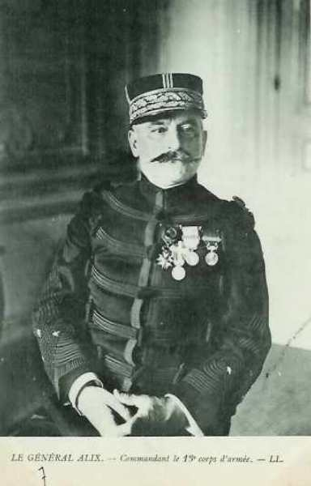
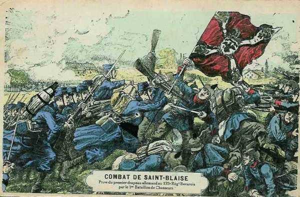
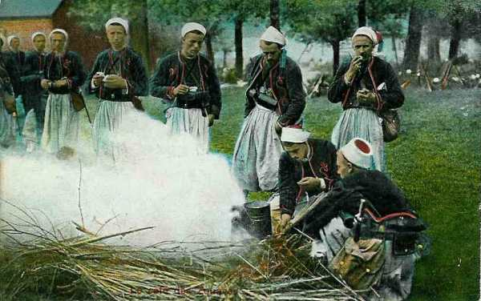
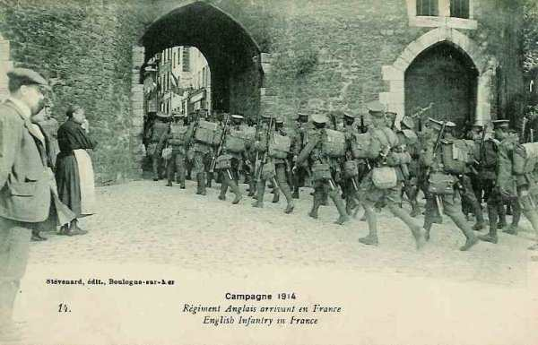
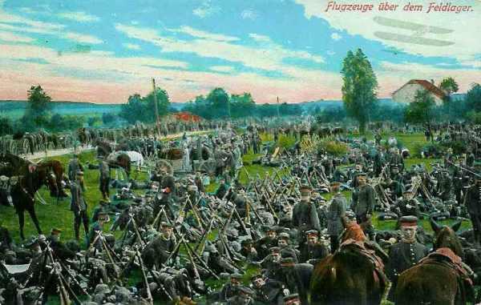
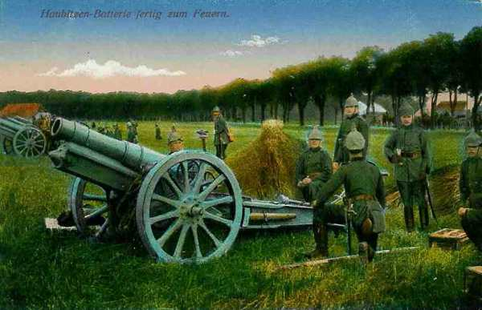

# Le 18 août 1914

La menace sur l’aile gauche française se précise. Joffre commence à prélever des troupes sur les armées d’Alsace-Lorraine pour la renforcer (9e C.A.). Il prépare l’offensive dans les Ardennes, espérant enfoncer le flanc des armées allemandes pendant leur déplacement vers l’ouest. Ce sera la tâche des IIIe, IVe et Ve armées.
En Lorraine, les Allemands, soigneusement retranchés, déclenchent un tir bien réglé d’artillerie lourde sur les troupes françaises qu’aucun obstacle naturel ne protège. Voyant les Français décimés, Rupprecht de Bavière lance une contre-attaque.
L’armée belge, en retraite vers Anvers, se fait accrocher à Sint-Margriete-Hautem et se dégage au prix du sacrifice d’un régiment.

### G.Q.G. français

Joffre apprend qu’un certain nombre d’éléments du groupe allemand réuni au sud de la Meuse sont passés sur la rive gauche. Quatre ponts ont été établis à Huy, Ampsin, Ombret et Seraing. Il admet qu’il y a de bonnes raisons de croire que cinq C.A. au moins et deux D.C. marcheraient contre la frontière sud-ouest de la Belgique sur la ligne générale Bruxelles - Givet.

A 8 h, il fait expédier aux 3e, 4e et 5e armées, aux armées anglaise et belge, l’instruction n° 13 qui dessine le cadre général de leur collaboration.

« Les 3e, 4e et 5e armées, agissant de concert avec les armées anglaise et belge, ont pour objectif les forces allemandes réunies autour de Thionville, dans le Luxembourg et en Belgique. Ces dernières paraissent comprendre un total de treize à quinze C.A.

Au nord, le groupement d’aile droite paraît comprendre sept ou huit C.A. et quatre D.C. Plus au sud, le groupement central entre Bastogne et Thionville, peut comprendre six ou sept C.A. et deux ou trois D.C.

Les IIIe et IVe armées ont déjà reçu leurs missions éventuelles et leurs directions initiales d’offensive.

En ce qui concerne la Ve armée, l’armée anglaise et l’armée belge, deux éventualités peuvent être envisagées.

Le groupement ennemi du nord, marchant sur les deux rives de la Meuse, peut chercher à passer entre Givet et Bruxelles. Les armées anglaise et belge s’opposeront à ce mouvement, en cherchant à déborder l’ennemi par le nord. Pendant ce temps, les IIIe et IVe armées attaqueraient tout d’abord le groupement central ennemi pour le mettre hors de cause.

L’ennemi peut n’engager au nord de la Meuse qu’une fraction de son groupement d’aile droite. Pendant que son groupement central s’engagerait de front contre nos IIIe et IVe armées, la partie de l’armée au sud de la Meuse pourrait chercher à attaquer le flanc gauche de la IVe armée. Dans cette dernière hypothèse, la Ve armée se rabattrait par Namur et Givet, vers Marche et Saint-Hubert. »

Il donne donc l’ordre aux IIIe, IVe et Ve armées de se préparer à une offensive contre le centre de l’armée allemande.

### Armée d’Alsace

Les intentions du général Pau sont d’occuper Mulhouse le 19 août et de préparer une marche offensive vers Colmar. La Q.G. de l’armée est à Thann. La défense de la région de Mulhouse, Altkirch, Belfort est confiée aux 57e et 66e divisions de réserve et à la brigade active de la place de Belfort. Pau demande à la Ie armée de l’appuyer pour l’attaque entre Neuf-Brisach et Colmar. La 8e division de cavalerie se porte dès le soir au nord d’Altkirch.

Les ordres pour le 19 sont d’atteindre Colmar pour tenir la ligne Ingersheim - la Thur.

- La 66e division se portera sur la rive droite de l’Ill, au sud de Mulhouse.
    La 63e division constituera la réserve d’armée.
    La 8e D.C. fera mouvement vers Wittenheim.

Pau apprend que de forts contingents se portent de Bade vers la Haute Alsace.

### Ie armée française

Le 8e C.A. (de Castelli) occupe les hauteurs dominant Sarrebourg et son avant-garde entre dans cette ville drapeaux déployés mais, au débouché, rencontre une sérieuse résistance. L’artillerie lourde allemande intervient avec précision. Des piquets avaient été placés avant la guerre et servent aux artilleurs comme repères. Ce C.A. est en contact à Diane-Capelle avec un détachement du 16e C.A. (IIe armée)

Le 13e C.A. (Alix) gagne les environs de Lorquin.

_Général Alix (13e C.A.)_
_Collection privée_

La droite (14e et 21e C.A.) franchit les cols, s’empare de Saint-Marie-aux-Mines et progresse dans la vallée de la Bruche. Un combat a lieu à Saint-Blaise, au cours duquel le 1e bataillon de chasseurs s’empare du drapeau du 137e régiment bavarois. Les Français entrent ensuite dans Schirmeck.

_Combat de Saint-Blaise_
_Collection privée_

Les accès vers Saverne paraissent couverts de retranchements. Sur la route de Phalsbourg, de chaque côté du canal de la Marne au Rhin, il y a un terrain hérissé de fortifications et de retranchements.

Dans la région de Lixheim, Arschwiller, Hommert, de gros rassemblements allemands sont signalés. Il s’agit des

- 14e C.A. allemand le long du canal de la Marne au Rhin.
    15e C.A. allemand dans la région de Dabo.

Ces C.A. ont été transportés de la Haute-Alsace et menacent le flanc droit de la Ie armée.

Les Allemands opèrent une violente poussée dans la vallée de la Bruche et y attaquent avec des forces importantes. Les 21e C.A. se maintient dans la vallée de la Bruche et le 14e C.A. opère vers le col de Sainte-Marie-aux-Mines et du Bonhomme.

L’offensive de Dubail n’avance pas considérablement en territoire annexé à cause des difficultés du terrain mais son armée tient les sommets des Vosges, est à cheval sur le Donon et tient la ligne Sarrebourg - Lorquin - Abreschviller - Schirmeck.

### IIe armée française

Castelnau prend ses dispositions en vue de l’offensive à poursuivre au-delà de la Seille et du canal des Salines mais des reconnaissances aériennes signalent l’organisation de positions défensives sur la côte de Delme, à Morhange, Rodalbe.

Il prescrit à son armée de se porter dans la direction générale de Faulquemont.

- Le 20e C.A. (Foch) attaquera vers Faulquemont.

- Le 15e C.A. (Espinasse) doit franchir la Seille au pont de Mulcey et atteindre les débouchés de Koeking.

- Le 16e C.A. (Taverna) doit franchir le canal des Salines pendant la journée.

- Le 9e C.A. (Dubois) reçoit l’ordre de transfert vers Charleville, à la gauche de la IVe armée (de Langle de Cary).

- Le 2e groupe de divisions de réserve (Durand) assure la couverture de l’armée : la 70e division (Fayolle) garde les passages de la Seille, la 59e division assure vers Sainte-Geneviève la protection de Nancy et la 68e division doit se placer à gauche du 20e C.A., en remplacement du 9e C.A.

Pendant la journée

- Le 16e C.A. est arrêté vers le canal des Salines. L’infanterie allemande résiste à Dolving et à Gosselming. La 31e division est rejetée sur Angviller, avec des pertes sérieuses.

- Le 15e C.A. dépasse la région des Etangs mais n’a pu franchir le canal des Salines ni la Seille. Son front s’étend de Zommange à Marsal. Les avant-gardes enlèvent Zommange et Vergaville au nord-est de Dieuze, mais ensuite se trouvent les forêts de Koeking et de Brides, fortement organisées. A 10 km au nord de Vergaville, les batteries allemandes ont été installées à Bassing et Dommon. Près de Dieuze, à Lindre-Basse, les digues des étangs ont été rompues et l’eau menace d’entourer les troupes qui s’avancent.

- Le 20e C.A. est le seul à gagner du terrain au nord de Morville-les-Vic et Château-Salins. Il tient le front Oron - Château-Brehain - Brehain - Conthil.
  Les Allemands se retirent au nord de la Seille. château-Salins et Dieuze tombent dans les mains françaises.

- Les 2e et 6e D.C. ont occupé rapidement toute la région au nord du canal de la Marne au Rhin.

Jusqu’à présent, les forces françaises ont rencontré des arrière-gardes, qui se replient vers les points de résistance de Sarrebourg et Morhange. A ces endroits, les troupes sont solidement retranchées et équipées d’artillerie lourde, qui intervient avec précision, d’autant plus que des pylônes avaient été placés avant la guerre pour le réglage des tirs d’artillerie.

Dans la soirée,

- Le 16e C.A. est en liaison avec la Ie armée vers Diane-Capelle et tient Angviller.

- Le 15e C.A. borde la Seille avec des détachements à Zommange et Vergaville mais n’a pas encore occupé Dieuze.

- Le 20e C.A. est entré le 17 août à Château-Salins et s’est assuré le passage de la Seille.

- Le 9e C.A. est à Attiloncourt - Bratte.

- La couverture vers Metz sera assurée par le 2e groupement de divisions de réserve.

Le 9e C.A. est embarqué vers les Ardennes et remplacé par le 2e groupement de divisions de réserve.

Considérant que son concours dans cette direction n’est plus utile et que les Allemands se dérobent sur tout le front, Castelnau redresse ses C.A. vers le nord et prescrit de « poursuivre avec toute la vigueur et toute la rapidité possible vers l’alignement Pont-à-Mousson - Saarbrücken ».

Or, ce jour, la résistance devient sérieuse vis-à-vis du 16e C.A. sur le Canal des Salines.

### IIIe armée française

L’armée se range sur le front prescrit Jametz - Etain, les divisions de réserve font face aux défenses de Metz. Dès que l’ordre lui en sera donné, l’armée sera en mesure de déboucher.

Elle fait part de ses observations : de forts mouvements de troupes en marche de la Moselle (Thionville - Remich) vers le nord-ouest.

### IVe armée française

Elle est renforcée du 9e C.A. et de la division du Maroc, qui débarquent à Mézières. Les 52e et 60e divisions assurent la garde de la Meuse entre Sedan et Revin, pour couvrir le flanc droit de la Ve armée.

_Campement de zouaves_
_Collection privée_

Au sud de la Meuse, l’aviation de la IVe armée reconnaît des forces importantes en marche de l’Ourthe vers Dinant. Il s’agit de trois armées précédées de cinq D.C. Elle signale au G.Q.G. que toute la masse allemande, partant de Luxembourg, est en mouvement dans la direction nord-ouest et que son front atteint la ligne Arlon - Bastogne - Houffalize en soirée.

### Ve armée française

Poursuivant son déplacement vers le nord, Lanrezac pousse les 3e et 10e C.A., renforcés chacun par une division d’Afrique, à hauteur de Nalinnes - Stave. Le 1e C.A. tient la Meuse de Givet à Yvoir.

La 51e division du groupe Valabrègue se porte sur Rocroi pour garder le fleuve entre Givet et Revin. La 18e C.A. (de Mas Latrie) commence ses débarquements au sud de Beaumont.

Le C.C. Sordet se porte par Perwez et Gembloux sur Ramillies. Il se heurte devant Geest - Géronpont et Ramillies - Offus à des positions organisées et défendues par des troupes de toutes armes mais contrait la 9e D.C. allemande à se replier. Il revient cantonner à l’est de Perwez.

### Armée anglaise

L’armée commence ses débarquements dans la zone Avesnes - Le Cateau. French fait connaître à Joffre qu’il peut compter sur son concours à partir du 21 avec quatre divisions et sa cavalerie, vers Lens - Mons - Binche à atteindre le 22.

_Régiment anglais en France_
_Collection privée_

### Armée belge de campagne : combat de Sint-Margriete-Hautem

Onze C.A. allemands s’avancent vers la position de résistance de l’armée belge le long de la Gette.

L’armée belge risque d’être enveloppée et coupée de sa base d’Anvers. Elle se trouve en fait face à la terrible menace du plan Schlieffen, selon lequel la masse de manoeuvre toute puissante doit déferler au nord du sillon Sambre et Meuse, se rabattre vers le sud, contourner l’aile gauche française et se rabattre vers Paris.

A 7h45, des coups de canon sont tirés par les Allemands sur Halen - Geet-Betz. Des tirailleurs s’avancent dans les prairies vers Léau.

A 11h35, la ligne de la Gette, tenue par la D.C., est attaquée de partout. La D.C. doit se retirer vers Hauwaert - Nieuwrode. Un quart d’heure plus tard, une colonne d’infanterie et de cavalerie s’avance de part et d’autre de la voie ferrée vers Orsmaal.

L’attaque de Diest, Halen, Geet-Betz, Léau et les préparatifs sur Tienen montrent que le déploiement allemand s’effectue sur un front de 30 km entre Landen et diest.

- L’armée belge doit opérer des retraites courtes et successives.
    Le centre (1e division) doit se retirer vers Boutersem.
    La droite (5e division) doit retraiter vers Beauvechain.
    La gauche (2e division) doit rester en place.

Dès midi, un officier d’E.M. va transmettre à la 1e division l’ordre de se retirer. Par un concours malheureux de circonstances, la transmission de cet ordre subit un important retard et de ce fait, la 2e brigade se trouve aux prises avec les Allemands à Sint-Margriete-Hautem et à Grunde.

La 8e brigade qui se trouvait à Andenne se replie sur la position fortifiée de Namur après avoir détruit les ponts et obstrué le tunnel de Seilles.

En fin de journée, le front belge est jalonné par Aarschot - Sint-Joris-Winge - Bautersem - Beauvechain et n’est distant de celui de l’armée allemande que de quelques kilomètres.

- Albert Ie veut profiter de la nuit pour retirer l’armée belge derrière la Dyle : à 19h, il ordonne l’évacuation de la Gette pour le lendemain et le commencement du repli de l’armée sur Anvers. L’armée est coupée de ses alliés anglais et français. Suite au retrait, le projet de débordement de l’aile droite allemande par le nord s’effondre.
    La 5e division doit atteindre Neerijse.
    La 1e Leuven.
    La 2e Rotselaar.
    Les 3e et 6e sont en 2e ligne à Boortmeerbeek et Kortenberg.
    La D.C. est à Putte.

### O.H.L. : les armées se mettent en mouvement vers l’ouest

**[Lien vers marche générale des armées allemandes](../img/marche_generale_armees_all.jpg)**

- Dès l’aube, les armées allemandes se mettent en marche vers l’ouest :
    Ie armée : 320.000 hommes traversent la Meuse aux environs de Liège et se dirigent vers Leuven, Bruxelles, Oudenaarde et Lille.

- IIe armée : 260.000 hommes franchissent la Meuse vers Huy pour contourner Namur par le nord et marcher sur Mons et Valenciennes.

- IIIe armée : 180.000 hommes font route vers Dinant pour traverser la Meuse entre Namur et Givet et viser la trouée de Chimay.

Moltke charge von Bülow d’organiser l’attaque contre Namur. Les armées traversent la Belgique selon le plan de l’O.H.L.

### Ie armée allemande

- Au soir, l’armée de von Kluck occupe la ligne Hersselt - Scherpenheuvel - Sint-Joris-Winghe - Glabbeek - Tienen.

_Campement allemand_
_Collection privée_

- Le Q.G. de von Kluck est à Sint-Joris-Winghe.

- Un nouveau pont est jeté près de Visé. La 10e brigade de la Landwehr occupe les passages de la Meuse entre Visé et Herstal.

- A 16h30, un ordre émane de l’O.H.L. : les Ie et IIe armées et le C.C. von der Marwitz sont placés sous le commandement de von Bülow.

- Von Kluck donne ses ordres de marche : entre Tildonk et Neerijsse. la D.C. se portera vers Bruxelles.

La 2e D.C., devant encercler l’armée belge, franchir la grande Gette à Diest, mais les Belges ont déjà entamé leur retraite vers Anvers et échappent ainsi à l’encerclement.

### IIe armée allemande

L’aile droite est à Grez-Doiceau. Bülow reçoit de l’O.H.L. l’ordre d’organiser l’attaque contre Namur. Le 11e C.A., un bataillon d’artillerie à pied et le 23e régiment de pionniers (retirés de la IIIe armée). Quatre batteries autrichiennes de 305 sont débarquées.

Les 4e et 9e D.C. se heurtent au C.C. Sordet aux environs de Perwez.

### IIIe armée allemande

Elle commence son avance sur la Meuse. L’armée doit porter son aile droite par Durbuy - Havelange contre le front sud-est de Namur.

### IVe armée allemande

L’armée reste pratiquement immobile, en attendant que les Ie et IIe armées soient arrivées à hauteur de Liège.

### Ve armée allemande

Les colonnes s’ébranlent. L’armée contourne Thionville entre Bettembourg et Hettange-la-Grande. Chaque C.A. emprunte une des trois routes disponibles dans la région.

Des reconnaissances aériennes annoncent la marche vers le nord de plusieurs colonnes françaises parties de Montmédy, Stenay, Dun.

### VIe armée allemande

Rupprecht de Bavière décide de son propre chef de lancer une contre-offensive en Lorraine, ce qui n’était pas prévu par le plan Schlieffen.

Il demande l’adhésion de l’O.H.L. à l’attaque du 19. Moltke est désarmé pour obtenir l’obéissance du prince héritier d’un des plus importantes dynasties d’Allemagne et donne son accord de guerre lasse. Sur la demande de von Heeringen, Rupprecht retarde l’attaque d’un jour, soit le 20 août.

_Obusier lourd allemand_
_Collection privée_

La victoire de Morhange-Sarrebourg est une victoire prématurée car les armées allemandes seront bloquées devant la Meurthe et la Grand Couronné de Nancy.

### VIIe armée allemande

Le 14e C.A. entre en liaison avec la VIe armée vers Reding, le 15e sur la Sarre rouge au nord du Donon, la 14e C.A.R vers les cols au sud du Donon.

[Lien vers la journée suivante](article_04_37.md)
