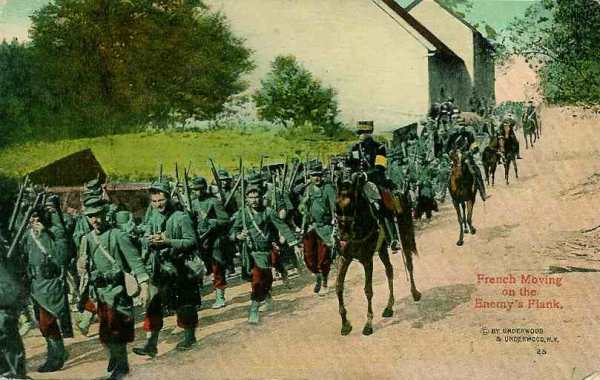
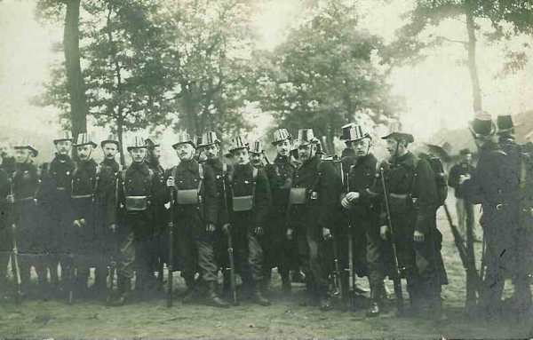
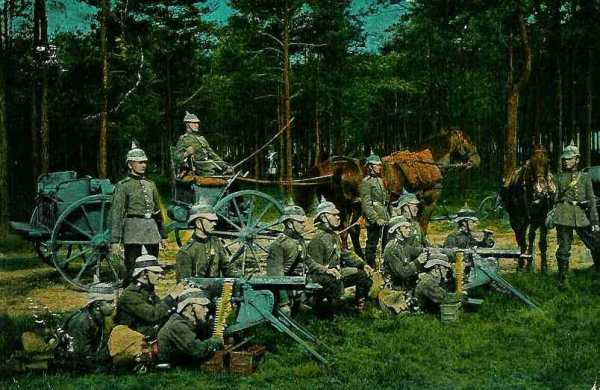
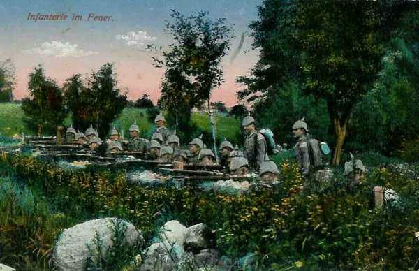
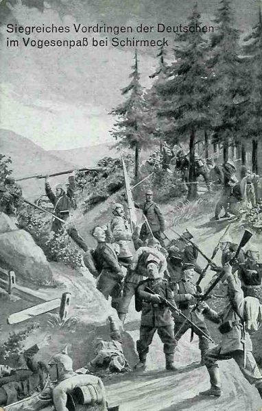

# Le 19 août 1914

L’armée d’Alsace pénètre dans Mulhouse.
Les Allemands ont entamé le siège de Namur, qui se trouve à la droite de la Ve armée.
Les Belges poursuivent leur repli vers les forts d’Anvers.
L’ensemble des armées allemandes poursuit sa progression à travers la Belgique. La Ie armée est aux portes de Bruxelles.

### G.Q.G. français

Joffre constitue l’armée de Lorraine sous le commandement du général Maunoury avec le 3e groupe de divisions de réserve qui faisait primitivement partie de la 3e armée, la 67e division et les 65e et 75e division de réserve venant des Alpes. Sa mission est de couvrir le flanc droit de la IIIe armée contre des forces pouvant déboucher du camp retranché de Metz. Elle s’intercale entre les IIe et IIe armées.

Ces deux dernières tiennent la ligne Delme - Morhange - nord de Sarrebourg - Schirmeck - Sainte-Marie - Guebwiller - Thann - Mulhouse, soit un gain de 10 à 20 km par rapport à la ligne frontière de 1871.

### Armée d’Alsace

L’armée d’Alsace, au complet, se porte en avant :

- Le7e C.A. suivi de la 63e division au centre sur Mulhouse.
  Les 66e et 44e divisions échelonnées en arrière à droite jusqu’à Altkirch.
  La 116e brigade vers Cernay.
  La 81e brigade et cinq bataillons de chasseurs par la Schlucht sur Colmar.
  La 115e à Sainte-Marie.

Pau espère aborder le 21 la ligne Colmar - Neuf-Brisach mais le groupement orienté sur Colmar est arrêté par une brigade retranchée. Aux lisières sud de Mulhouse et sur l’Ill, le centre et la droite se heurtent à un déploiement de trois brigades de la Landwehr qui ne cèdent le terrain qu’après un sanglant combat.

Les Français doivent prendre d’assaut chaque propriété et chaque maison est canonnée. Dornach est emportée vers 14h. Nivelle (futur commandant en chef de l’armée française) se distingue et reçoit la citation :

« Participe avec deux groupes à l’attaque d’un village puis à l’attaque d’une division. Un groupe entier d’artillerie allemande sur lequel il a tiré le 19 a été trouvé le 21 au matin, abandonné sur le champ de bataille ».

Les troupes allemandes doivent retraiter par la forêt de la Hardt.

### Ie armée française

- Le 8e C.A. occupe Sarrebourg.
  Le 21e C.A. s’étend des deux côtés du Donon.
  Le 14e C.A. prolonge le dispositif à droite sur les hautes vallées alsaciennes.
  Le 13e C.A. reste en réserve derrière la gauche.

Le général Dubail prescrit une nouvelle tentative en vue de forcer le  débouché de Sarrebourg. Le 8e C.A., renforcé par toutes les batteries lourdes de l’armée, attaquera vers Gosselming et Oberstinzel. (Localités près de Sarrebourg).

Le 8e C.A. et la 16e division se portent à l’attaque des hauteurs de la rive droite de la Sarre, de Reding à Sarraltroff. Elles sont arrêtées par un feu violent d’artillerie, subissent de sérieuses pertes et ne peuvent avancer plus loin. En conséquence, le commandant du 8e C.A. donne l’ordre à la 16e division d’arrêter l’attaque et d’occuper Dolving pour couvrir efficacement son flanc gauche. Une reconnaissance sur la Sarre rend compte que les hauteurs de la rive droite sont très fortifiées.

Le 14e C.A. tenant le front du Donon au Col du Bonhomme est aux prises avec de sérieuses difficultés. Les Allemands dessinent une attaque dans la vallée de la Bruche. La 13e division perd Schirmeck et doit se replier vers le Donon. Le soir, le 14e C.A. reçoit l’ordre d’assurer coûte que coûte le flanc droit : Donon - Schirmeck - Champ de Feu - Villé-Sainte-Marie.

Le flanc droit de la Ie armée est donc à découvert. Dubail doit confier au 21e C.A. la garde du secteur montagneux.

### IIe armée française

Voici le dispositif de l’armée :

- Le 2e groupe de divisions de réserve garde avec la 59e division de réserve les accès de Nancy entre Moselle et Seille, avec la 70e division de réserve le cours de la Seille jusqu’à Manhoué, tandis que la 68e division de réserve s’est portée à cheval sur la route de Metz à Château-Salins, face à Delme pour protéger le flanc gauche de l’armée.

- Le 20e C.A. est entre Oron et Conthil.

- Les 15e et 16e C.A. sont entre Vergaville et le plateau de Langatte, la liaison avec la Ie armée étant assurée par le C.C. Conneau.

Castelnau ordonne aux 15e et 16e C.A. d’assurer le débouché nord du canal des Salines et d’atteindre le chemin de fer de Bensdorf à Sarrebourg. Pendant ce temps, le 20e C.A. et le groupe des divisions de réserve s’organiseront face à Metz.

La IIe armée poursuit son offensive en vue d’atteindre le front Saarbrücken - Pont-à-Mousson. A 8h, l’armée se met en mouvement.

- Le 20e C.A. se porte au-delà de la Seille, précédé de détachements de cavalerie. Ses colonnes se trouvent soumises à des tirs d’artillerie de campagne, mais sans grand dommage. Le soir, il atteint la ligne Oron - Conthil.

- Pour aider la 16e C.A. dans son offensive dans la région des Etangs, le 15e C.A. attaque en direction de Benestroff, mais est cloué sur place par l’artillerie.

De grand matin, le bataillon d’avant-garde de la 29e division traverse le bois de Morsak et s’engage dans Dieuze. Tout y est tranquille. Ils pénètrent ensuite dans Vergaville vide d’ennemis à 7h.

Au-delà de ces localités s’étend un vaste espace découvert, limité au sud-est par le canal des Salines et au nord par la ligne des crêtes (de Marthil à Fénétrange par Baronviller, Morhange,  Benestroff et Guinzeling). Ces crêtes ont été organisées d’une manière formidable depuis le 1e août. Le terrain a été fouillé, mesuré, repéré et des plans quadrillés sont à la disposition de l’artillerie, de l’infanterie et des aviateurs.

Dès que la 29e division débouche vers Bidestroff et que la 30e division se dirige vers la forêt de Bride et de Koeking, elles sont prises sous un feu violent. Vers midi, elles sont clouées sur place.

_Colonne française_
_Collection privée_

Vers 15h, la 29e division se jette sur Bidestroff.  Elle se trouve aussitôt sous le feu des batteries en position au nord de Dommon (Dommenheim) et subit de grosses pertes. L’artillerie française au sud du canal des Salines et à l’ouest de Lindre-Haute essaie de lutter contre les pièces lourdes, mais elle est repérée par des avions et contrainte à des déplacements continuels. Une partie de la 29e division demeure au soir dans Bidestroff, le reste se porte sur Dieuze, occupant Zommange et Vergaville.

Le 16e C.A. reste tout le jour dans ses emplacements vers Angviller et Bisping, attendant l’appui du 15e C.A.

Le 20e C.A. a repris son offensive dès 4h du matin sous la protection de fortes reconnaissances de cavalerie. La 39e division, à gauche, progresse par Fonteny - Oron - Chicourt. A droite, la 11e avance vers Haboudange. Entre les 15e et 16e C.A. s’étend la forêt de Koeking.

Devant Pévange, la 22e brigade est accueillie par un feu vif d’artillerie et de mitrailleuses.

A 21h, le 20e C.A. est aligné sur le front Oron - Bréhain - Pévange - Conthil. Pendant la nuit, des projecteurs balaient les positions françaises : une mauvaise découverte pour les soldats français.

A la gauche de l’armée, la 68e division de réserve, qui a relevé le 9e C.A., couvre le dispositif en direction de Metz.

La 70e division de réserve est vers Manhoué et la 59e sur le Grand Couronné de Nancy. Cette dernière assure la protection de Nancy.

Les Français opèrent des reconnaissances par avion vers les positions défensives sur la ligne Marthil - sud de Baronville - Morhange - Rodalbe - Benestroff.

Castelnau prescrit à 17h aux 16e et 15e C.A. d’attaquer simultanément le front Cutting - Dommom - Bassing (nord-est de Dieuze) pour rejeter les Allemands au nord de ligne de Sarrebourg à Metz. Le 20e C.A. doit s’installer sur le terrain occupé et faire face à Metz. Il n’y a entre Château-Salins et Metz qu’une distance de 41 km.

Le Kronprinz Rupprecht donne l’ordre de passer à l’attaque le 20 août. Pendant la nuit, on entend des mouvements de trains dans la région de la Nied. C’est la réserve générale de Metz qui se met en place pour l’attaque.

### IIIe armée française

Elle attend l’ordre de se porter en avant. Des reconnaissances aériennes signalent la Ve armée allemande poursuivant son mouvement de la Moselle vers le nord-ouest.

### IVe armée française

Elle attend les ordres. De Langle de Cary ordonne à Abonneau, commandant de la cavalerie de l’armée, de pousser des reconnaissances vers Bastogne et Saint-Hubert, puis il demande à Joffre de pousser ses détachements de toutes armes aux débouchés de la forêt des Ardennes, dans les clairières de Neufchâteau, Florenville et Virton.

### Ve armée française

Les avant-gardes de la Ve armée commencent à border la Sambre.

Un conseil est tenu au G.Q.G. britannique. On y a constaté que les débarquements dans la zone de rassemblement se faisaient sans difficulté et French avait décidé que le mouvement en avant de son armée commencerait le vendredi 21.

Le C.C. Sordet a canonné la 9e D.C. pendant sa marche vers Perwez. Le soir, il cantonne au nord-est de Charleroi, 40 km à droite de l’armée belge.

### Position fortifiée de Namur

Le commandant de la place de Namur, le général Michel, signale qu’il ne dispose que de trois brigades et qu’il les concentre au nord-est et au sud-est de la place. Il demande que l’armée franco-anglaise assure la sécurité du nord-ouest et sud-ouest.

Un détachement  posté à Andenne, menacé par le nord, se replie après avoir détruit le pont.

### Armée belge de campagne : repli vers Anvers

Aux premières lueurs du jour, une vive action d’arrière-garde s’engage entre le 2e C.A. allemand et la brigade de la 3e Division, vers Aarschot. Il devient visible que la droite allemande déborde la gauche belge. Le mouvement de repli est aussitôt accentué vers la ligne des forts de la position d’Anvers.

La 1e division est prise à partie aux lisières de Louvain par le 4e C.A.

A 12h40, le Haut Commandement donne l’ordre de continuer le mouvement de retraite jusqu’à la ligne Keerbergen (2e division) - Haecht (1e division) - Steenokerzeel (5e division).

_Carabiniers belges_
_Collection privée_

Le Haut Commandement prend à 15h la décision de replier ses avant-postes sur la Dyle et de se transporter à Malines.

L’armée abandonne dans le courant de l’après-midi les positions de la Dyle : Werchter - Rotselaar - Leuven - Neerijsse.

Des troupes allemandes de toutes armes sont signalées dans le rayon de la place de Namur vers Faulx et vers Ramillies - Offus. Elles disposent de pièces de gros calibre.

A 16h20, l’ordre est donné de se replier dans le périmètre de la position fortifiée d’Anvers.

Le soir, l’armée occupe le front Rijmenam - Hasselt - Steenokkerzeel, qui sera abandonné le 20 au matin.

### O.H.L.

**[Lien vers marche générale des armées allemandes](../img/marche_generale_armees_all.jpg)**

**[Lien vers croquis](../img/progression_allemands.jpg)**

Dans le secteur lorrain, le commandement est pressé de voir les armées françaises présenter leurs flancs aux contre-offensives des VIe et VIIe armées et il a un sujet de souci : le mouvement français ne se limite pas à l’espace compris entre Metz et les Vosges mais déborde à droite le massif du Donon et englobe la vallée de la Bruche. Ce prolongement de front contrecarre l’attaque de flanc qu’il se propose de faire exécuter par la VIIe armée. Si les français agissent vigoureusement en Alsace, ils peuvent prendre à revers le noyau principal de la VIIe armée dans la vallée supérieure de la Bruche. Ces raisons incitent Moltke à lancer la contre-offensive plus tôt que prévu, soit le 20 août.

### Ie armée allemande

- Le Q.G. de l’armée s’installe à Leuven.

- Les C.A. s’échelonnent sur la ligne Werchter - Veltem - Bertem. (2e C.A. à Aarschot, 9e à Leuven, 10e à Jodoigne, 9e et 4e D.C. à Ottignies).

- Près de Werchter, la 2e D.C. est engagée dans un combat avec les 5e et 6e R.I. belges.

- La 2e D.C. arrive à Wolvertem.

- Pour le 20 août, le 2e C.A. doit atteindre le nord-ouest de Bruxelles ; le 4e doit arriver à Anderlecht, le 3e à Drogenbos, le 9e Waterloo.

- Le 19 et 20 août, 150 civils sont fusillés à Aarschot et des maisons sont incendiées.

### IIe armée allemande

Elle s’apprête à investir Namur.

- Le 10e C.A.R. fait mouvement vers Sart Risbart.
  Le 10e C.A. avance vers Perwez.
  La Garde se dirige sur la Mehaigne.
  La 9e D.C. est à Walhain-Saint-Paul
  La 4e D.C. est à Jauchelette.

Le Q.G. de l’armée est à Jodoigne.

Bülow charge le commandant du C.A.R. de la direction du siège de Namur : c’est le général von Gallwitz, ancien inspecteur général de l’artillerie allemande.

### IIIe armée allemande

Elle tient la ligne Spontin - Celles - Ciergnon.

### IVe armée allemande

Commence une lente progression à travers les Ardennes et atteint avec ses têtes de colonnes le front Attert - Bastogne, sa gauche marchant d’est en ouest au nord d’Arlon.

### Ve armée allemande

Les têtes des colonnes se trouvent sur la ligne Arlon - Clemency - Kayl - Ottange - Angevillers.

Les directions à suivre par les C.A. sont les suivantes :

- 5e C.A. : Vers Bettembourg - Mamer.
  13e C.A. : Vers Bergen - Dippach.
  16e C.A. : Vers Thionville et Hettange-la-Grande.
  5e C.A.R. : à Bettembourg.
  6e C.A.R. : à Kayl.

### VIe armée allemande : Rupprecht donne l’ordre d’attaquer

L’armée occupe une longue ligne orientée d’ouest en est, depuis les abords du camp retranché de Metz jusqu’au nord de Sarrebourg. Sur presque toute son étendue, cette ligne suit la voie ferrée de Metz à Saverne. Voici la disposition de ses C.A. : 3e C.A. bavarois, 21e C.A. et 2e C.A. bavarois : de Lucy à Lixheim, Garnison de Metz : Delme.

_Mitrailleuses allemandes_
_Collection privée_

Devant le front de l’armée, l’artillerie française a vivement canonné sur le canal des Salines et aux abords de Sarrebourg. Des attaques ont eu lieu le long des Vosges et devant Mulhouse.

D’après les ordres définitifs de Rupprecht, la VIe armée, complètement déployée, attaquera d’une pièce, par surprise, à 4h du matin, la garnison de Metz et le 3e C.A. bavarois face au sud, le reste au sud-ouest. La VIIe armée, qui ne sera prête qu’à 10h, enfoncera avec trois C.A. le front Sarrebourg - Walscheid. Le 14e C.A.R. débouchera à revers en descendant du Donon.

_Infanterie allemande faisant feu_
_Collection privée_

### VIIe armée allemande

Les 14e et 15e C.A. (ceux qui ont refoulé le détachement de Haute-Alsace) sont entre Lixheim et le massif du Dabo. Le 14e C.A.R., des unités de Landwehr et d’ersatz sont dans la vallée de la Bruche.

_Combats dans la vallée de la Bruche_
_Collection privée_

[Lien vers la journée suivante](article_04_38.md)