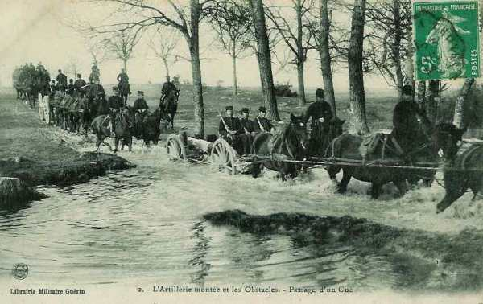
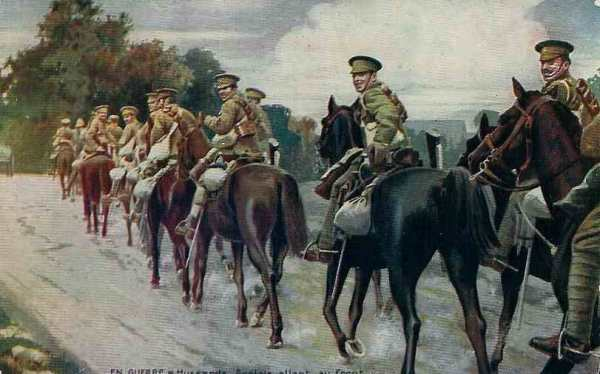
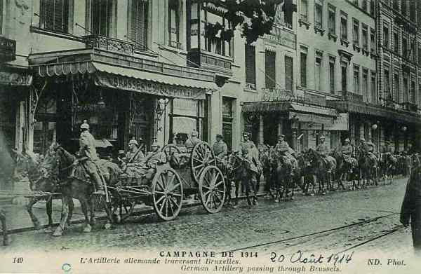
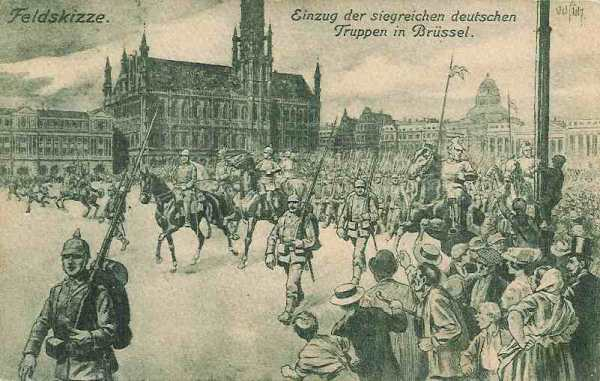
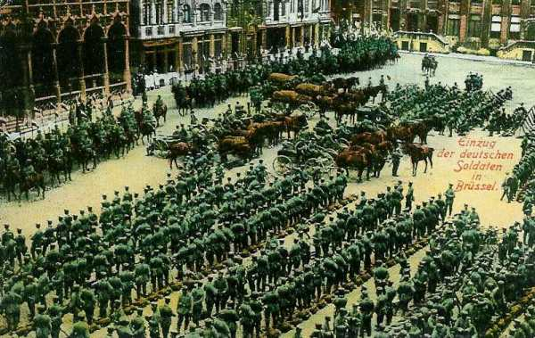
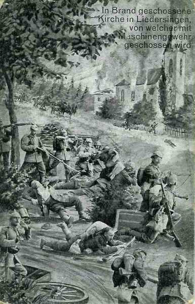
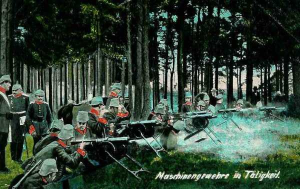

# Le 20 août 1914

Joffre donne l’ordre aux IIIe et IVe armées de prendre l’offensive dans les Ardennes.Les Ie et IIe armées françaises sont contre-attaquées par les VIe et VIIe armées allemandes.
L’armée de von Kluck atteint Bruxelles.

### G.Q.G. français : ordonne de prendre l’offensive dans les Ardennes

Le G.Q.G. a enfin une idée de ce qui se passe au nord de la Meuse. De nombreuses colonnes ont été vues au nord de la Meuse et se dirigent vers l’ouest. Leurs têtes atteignent la ligne Aarschot - Louvain - Jodoigne. Elles sont estimées à 4 C.A. au moins. Joffre se rend compte que cette masse est dirigée contre l’aile gauche de l’armée française.

La manoeuvre s’annonce plus importante que celle qui avait été envisagée puisqu’elle déborde largement Bruxelles par le nord. Une nouvelle confirmation a lieu dans la nuit du 20 au 21, signalant 5 C.A., 3 D.C. et 2 brigades de cavalerie au nord de la Meuse.

Comme les Allemands sont en force dans le nord de la Belgique et en Alsace-Lorraine, il suppose que leur point faible se situe au niveau des Ardennes belges. Il prescrit donc une offensive visant à couper en deux l’armée allemande.

A 20h 30, Joffre décide un premier pas en avant.

« La IIIe armée commencera son mouvement le 21 en direction générale d’Arlon. Elle portera ses têtes de corps sur Virton, Tellancourt et Beuveille. Sa mission sera de contre-attaquer toute force allemande qui chercherait à gagner le flanc droit de la IVe armée. Celle-ci portera de fortes avant-gardes sur la ligne Paliseul - Bertrix - Straimont - Tintigny.

- La IIIe armée doit commencer dès le 21 son mouvement offensif en direction d’Arlon.
    La IVe armée doit commencer sa marche sur Neufchâteau.
    La Ve armée doit se porter vers Gembloux - Nivelles.
    L’armée britannique doit porter son gros dans la région de Soignies. »

### Armée d’Alsace

L’armée d’Alsace n’a que deux batteries de 155 court prélevées sur la place de Belfort. En revanche, les Allemands disposent de batteries de 105 long à Istein, Chalampé et Neuf-Brisach, d’une portée efficace de 10 km.

L’idée de Pau est de s’établir solidement sur les contreforts des Vosges pour donner la sécurité absolue à la droite de la Ie armée.

L’armée poursuit son mouvement offensif mais va bientôt devoir retraiter suite aux échecs de la Ie armée, pour ne pas se trouver en flèche par rapport à celle-ci et donc risquer d’être encerclée.

Pau donne ordre provisoirement d’organiser les positions atteintes le 20 au soir.

- Au nord de la ligne Cernay - Mulhouse, le front est tenu par la 116e brigade et le 7e C.A.
    Les 66e et 44e divisions sont sur l’Ill, de Mulhouse à Altkirch.
    La 57e division est à Altkirch - Dannemarie.

### Ie armée française

Prémisses de la bataille :

Dans la nuit du 19 au 20, la 15e division a ordre d’attaquer Gosselming, soutenue par la 16e division. Le brouillard est intense et le mouvement se déclenche vers 4h30 mais aussitôt, les troupes françaises se heurtent aux Allemands qui tiennent les bois de Langatte. La 15e division, appuyée par l’artillerie du C.C., attaque Dolving et Gosselming. La 16e division l’appuie par une attaque sur Saaraltdorf et Eich. Dolving est occupé et les Français atteignent la Sarre. Gosselming est enlevé par le 56e R.I. mais aussitôt, le village est pris à partie par un feu très violent d’artillerie lourde et de mitrailleuses.

La Ie armée doit se glisser vers Fenestrange, entre l’étang de Lindre, celui de Langatte et celui de Fenestrange. Deux routes principales sont construites dans ce maquis humide : celle de Sarrebourg à Fenestrange et celle de Sarrebourg à Faulquemont. Seule la route de Sarrebourg à Fenestrange peut permettre à la Ie armée de s’avancer vers Saarbrücken. Les Allemands sont installés sur la ligne des hauteurs qui longent la rive droite de la Sarre, de Rieding à Fenestrange. C’est de là qu’ils surveillent la marche des régiments français.

### IIe armée française

L’armée se heurte à une contre-offensive allemande.
C’est la bataille de Sarrebourg - Morhange

### IIIe armée française

L’armée (4e, 5e, 6e C.A., 7e D.C.) occupe la zone entre Montmédy et le nord d’Etain.

A 20h30, Joffre prescrit à Ruffey de commencer le 21 août son mouvement offensif vers Longwy - Arlon.

A 9h, le 9e C.A. s’embarque pour Vitry-le-François afin de renforcer l’aile gauche des armées, sur laquelle plane une menace d’encerclement. Comme ce C.A. est soustrait à la IIe armée, deux divisions de réserve sont envoyées pour combler le vide.

_Artillerie française passant un gué_
_Collection privée_

### IV armée française

L’armée (2e, 12e, 17e, 11e C.A., corps colonial) se trouve dans le secteur entre Semois et Chiers, depuis Montmédy jusqu’à Mézières, couverte par les 4e et 9e D.C.

- Le 2e C.A. est dans la région de Montmédy, formant échelon en arrière et à droite par rapport au corps colonial.
    Le corps colonial, les 12e, 17e et 11e C.A. sont échelonnés sur la Meuse et la Chiers.
    Les 52e et 60e divisions de réserve tiennent les passages de la Meuse de Donchéry à Revin.
    Le 9e C.A. et la division marocaine achèvent de débarquer et de se concentrer dans la région de Mézières.

Suivant les instructions de Joffre, l’armée s’apprête à se porter en avant le lendemain sur tout le front.

### Ve armée française

**[Lien vers carte région Charleroi - Namur](../img/region_charleroi_namur.jpg)**
C Michelin, d’après carte n°4, édition 112-3741 - autorisation n° 05-B-18

Elle s’est rassemblée entre la Sambre et la Meuse. L’armée est à présent le long de la Sambre, de Floreffe à Marchienne-au-Pont.

Elle ne peut pas exécuter immédiatement l’ordre d’attaque du G.Q.G.

- Les 10e et 3e C.A., à chacun desquels est rattachée une division d’Afrique, ont leurs avant-postes de Ham-sur-Sambre à Marchienne-au-Pont.

- Le C.C. Sordet est à l’ouest du canal de Charleroi à Bruxelles.

- Le 18e C.A. débarque dans la région d’Avesnes, la tête étant à Beaumont. Il est en marche sur Thuin où il arrivera le 21 août à midi pour prolonger le 3e C.A. sur la Sambre.

- Les deux divisions du général Valabrègue sont dans la région de Vervins - Hirson.

- La 51e division de réserve, qui va relever le 1e C.A. est arrivée à Rocroi et va faire mouvement sur Dinant pour relever le 1e C.A. Cette relève sera terminée le 22 août.

- Les 53e et 69e divisions du groupe Valabrègue n’ont pas encore quitté la région d’Hirson.

Des éléments du 1e C.A. gardent la Meuse entre Givet et Rouillon.

Le C.C. Sordet doit rejoindre la gauche des Britanniques.

Lanrezac interdit de tenir les fonds de la Sambre autrement que par des détachements. Il estime trop dangereux de devoir combattre dans des agglomérations minières.

### Armée anglaise

Le corps expéditionnaire est complètement rassemblé dans la région de Cambrai - Maubeuge. Il doit se porter le lendemain vers le nord-est de manière à se mettre en liaison à sa droite avec le 18e C.A. français. Des reconnaissances sont effectuées et les alliés se rendent compte que la droite de l’armée allemande est tellement importante qu’elle constitue une menace pour leur aile gauche.

La cavalerie se rend à Binche sans rencontrer d’adversaire.

_Hussards anglais_
_Collection privée_

Position fortifiée de Namur
Pendant ce temps, la IIe armée allemande procède à l’attaque des forts de Namur.

### Armée belge de campagne

L’armée est sur le Rupel et la Nèthe avec un détachement à Dendermonde. Son but est d’attirer et de garder devant elle le plus de forces ennemies possibles. Elle essaie pour autant que possible de détruire les voies de communication de l’armée allemande.

Elle signale d’importants passages sur la rive gauche de la Meuse entre Huy et Liège. Les troupes se dirigent vers l’ouest. L’armée atteint le camp retranché d’Anvers. Pour éviter des représailles, le gouvernement belge a décidé que la garde civique ne défendra pas Bruxelles et se repliera sur Anvers. Les Allemands entrent à Bruxelles sans combat.

- L’armée de campagne occupe la ligne des forts de Lier à Boom (3e et 4e seteurs).
    6e division : Boom
    5e division : Willebroek
    1e division : Waelhem
    2e division : Lier
    3e division : Rumst
    D.C. : Sint-Katelijne-Waver.

- Pour le 21 août, ordre est donné de placer une division dans chacun des secteurs menacés, soit
    5e division dans le 4e secteur
    1e division dans le 3e secteur
    2e division dans le 2e secteur
  Les 3e et 6e divisions sont en réserve en arrière du secteur central, soit les 1e et 3e secteurs, les plus menacés.

_Entrée des Allemands à Bruxelles_
_Collection privée_

### O.H.L.

**[Lien vers marche générale des armées allemandes](../img/marche_generale_armees_all.jpg)**

**[Lien vers croquis](../img/progression_allemands.jpg)**

Moltke adresse aux armées de l’aile droite et du centre un nouvel ordre, le premier depuis le 17 août.

- Les Ie et IIe armées doivent serrer sur la ligne atteinte le 20 août, en se gardant du côté d’Anvers.

- L’attaque de Namur commencera aussitôt que possible.

- L’attaque imminente contre l’ennemi qui se trouve à l’ouest de Namur s’exécutera de concert avec l’attaque de la IIIe armée contre la ligne de la Meuse entre Namur et Givet. L’entente à établir à ce sujet doit être laissée aux commandants d’armée intéressés.

- A son arrivée sur la rive droite de la Meuse, le 1e C.C. passera sous les ordres du général commandant de la IIe armée. Le Ie C.C. sera avisé des présentes dispositions par les soins de La IIIe armée.

Moltke ne parle pas d’enveloppement : jusqu’où l’aile marchante étendra-t-elle son action vers la droite ? A quelle hauteur faudra-t-il que la Ie armée soit parvenue avant que les IIe et IIIe armées partent à l’attaque ? Moltke remet ses pouvoirs dans les mains des exécutants à défaut de donner des instructions fermes au moment où l’action principale est sur le point de commencer.

En vue de la bataille qui s’annonce sur la Meuse et à l’ouest, la Direction suprême juge utile de réunir les trois armées sous les ordres d’un chef unique, en associant les Ie et IIe armées déjà regroupées sous von Bülow ainsi que la IIIe armée.

Les armées allemandes bordent globalement la ligne Bruxelles - Andenne - Spontin - Libramont - Etalle.

Von Bülow et von Hausen doivent s’entendre pour mettre en concordance l’attaque projetée à l’ouest de Namur par la IIe armée, avec l’attaque de la ligne de la Meuse entre Namur et Givet, par la IIIe armée. Bülow et Hausen conviennent que leurs armées seront prêtes à livrer bataille toutes forces réunies le 23 à l’aube.

Des reconnaissances de cavalerie et surtout d’avions ont reconnu la marche de plusieurs colonnes françaises du front Hirson - Charleville vers le nord, la présence de deux C.A. au moins sur la Chiers entre Sedan et Montmédy et d’autres forces en arrière de l’Othain, notamment vers Spincourt, enfin la remontée d’un C.C. en direction de Neufchâteau. Ces renseignements laissent supposer que le démarrage de l’offensive française est imminent.

### Ie armée allemande : arrive à Bruxelles

Le 4e C.A. entre dans Bruxelles à 15h30.

_Entrée des troupes allemandes à Bruxelles_
_Les principaux monuments sont représentés d’une manière fantaisiste.
Collection privée_

Voici la position des différents corps d’armée au soir :

- Le 2e C.A. est à Vilvoorde.
    Le 4e C.A. est à Anderlecht.
    Le 3e C.A. est à Drogenbos.
    La D.C. est à Wolvertem.

La marche de la Ie armée commence à s’infléchir vers le sud (direction d’Enghien), selon les prescriptions du plan Schlieffen, pour s’orienter vers Paris. von Kluck sait que les Anglais s’avancent vers lui en venant de Lille. Il fait donc infléchir son aile gauche vers l’ouest de Maubeuge.

Comme l’armée belge prend un chemin divergent vers Anvers, il détache les 3e et 9e C.A.R. pour masquer les forces belges devant cette position fortifiée. Le 3e C.A.R. est arrivé dans les environs d’Aarschot.

_Troupes allemandes sur la grand place de Bruxelles_
_Collection privée_

Depuis la disparition de l’armée belge, von Kluck n’a plus qu’une idée, trouver le flanc de l’adversaire principal. Il ne connaît pas jusqu’où s’étend son aile gauche et envoie des reconnaissances aériennes et de cavalerie. Elles signalent que la boucle de l’Escaut est vide d’ennemis et von Kluck en déduit que les Anglais sont plus au sud, en liaison avec l’aile gauche française. Il n’a plus à redouter de voir une offensive déboucher de Gand ou d’Oudenaarde dans le flanc de son armée.

### IIe armée allemande

L’armée exécute un changement de direction prescrit autour de Namur (est vers sud-est). Si le mouvement continue normalement, il doit amener sur la Sambre la IIe armée entre Namur et la frontière franco-belge et la Ie armée en amont. Les C.A. arriveront successivement, ceux de gauche les premiers, les autres ensuite d’autant plus tard qu’ils sont éloignés du pivot. Ainsi, la Garde n’est qu’à quelques km de la Sambre tandis que le 2e C.A. est encore à Vilvoorde, à cinq étapes de la haute Sambre.

Sept ou huit C.A. français sont signalés entre Sambre et Meuse. Leur intention évidente est de franchir la Sambre entre Maubeuge et Namur, afin de prêter main forte à l’armée belge. Les troupes britanniques ne semblent pas être en nombre suffisant pour poser problème. La plus grande difficulté semble être le passage de la Sambre, dans la partie où elle est couverte de cités ouvrières, d’usines, un dédale presque inextricable favorable à la défense. Ensuite, il faudra s’élever sur un glacis que les feux des Français pourront balayer. En revanche, la Ie armée ne trouvera pratiquement personne sur son chemin et la IIIe armée abordera la Meuse, défendue par des forces moins nombreuses que face à la IIe armée sur la basse Sambre.

L’attention de von Bülow se concentre sur le passage de la Sambre. Il veut alléger la tâche de la IIe armée en faisant appel à la collaboration de toutes les forces placées sous ses ordres. La tentation d’assurer l’avantage tactique à la IIe armée est trop forte. Il envoie un message à von Hausen : la IIe armée prie la IIIe de gagner d’urgence la ligne de la Meuse pour coopérer avec elle.

A Andenne, 211 civils sont fusillés et 50 à Seilles. Le gros des forces allemandes est à 20 km de la Sambre. L’investissement de la position fortifiée de Namur commence.

L’armée se déploie sur la ligne Nivelles - Villers-la-Ville - Gembloux. Le 7e C.A.R. atteint Ottignies.

### IIIe armée allemande

Le général von Hausen est surpris par l’instruction de Moltke qui lui enjoint de passer la Meuse entre Namur et Givet. En effet, il a signalé à l’O.H.L. à Coblence des rapports de reconnaissances confirmant la présence de forces françaises entre Namur et Givet. En revanche, plus au sud, le fleuve n’est pas tenu. Il lui semble plus logique d’orienter la marche de son armée vers le sud-ouest plutôt que vers l’ouest. La progression, plus facile, aurait appuyé tout aussi efficacement l’attaque de von Bülow sur la Sambre, puisqu’elle aurait débouché sur les arrières de l’adversaire. Il croit toutefois bon de garder pour lui ces observations judicieuses.

Von Bülow lui télégraphie « attaque de la IIe armée sur la Sambre aura lieu le 2 au matin ; aile gauche par Jemeppe - Mettet ».

- Le 11e C.A. prend position contre la position fortifiée de Namur.
    Le gros de l’armée atteint le front Spontin - Ciergnon.
    Le Q.G. de l’armée est à Marche.
    Le 1e C.C. passe sous le commandement de von Bülow.
    La D.C. de la Garde est à Natoye et la 5e D.C. à Houyet.

### IV armée allemande

L’armée marche face à l’ouest. Elle est fort dispersée en largeur et profondeur dans un carré de 50 km de côté et fait route vers Neufchâteau.

En première ligne à droite, le 8e C.A. est dans le couloir de Dinant, sur la route de Givet, séparé par 15 km de forêts de son voisin du centre. Celui-ci, le 18e C.A., est dans la partie nord de la clairière de Neufchâteau, séparé par 15 km de forêts de son voisin de gauche, le 6e C.A., qui est en pleine forêt au sud-est de Neufchâteau.

Le ciel est couvert, empêchant les reconnaissances aériennes. Vers midi, le ciel se dégage et les aviateurs signalent que les Français se concentrent au nord de la Meuse et de la Chiers, au nord de la ligne Mézières - Montmédy.

Le duc de Wurtemberg conclut que les Français se portent en avant et ne sont plus qu’à une étape de son armée.

Les C.A. de première ligne sont invités à se mettre « en position d’attente » face au sud-ouest.

Le duc de Wurtemberg adopte un dispositif en profondeur, les trois C.A. actifs en première ligne, du nord au sud :

- 8e C.A. sur la coupure de l’Ourthe, 25 km en arrière de la IIIe armée.
    18e C.A. à l’est de Libramont - Neufchâteau
    6e dans la région de Léglise - Mellier, face au sud-ouest.

- Les C.A. sont suivis par
    le 8e C.A.R., dans le sillage du 8e C.A.
    la 21e division de réserve dans le sillage du 18e C.A.
    la 25e divbision de réserve dans le sillage du 6e C.A.

Les étapes exécutes en colonnes profondes sous un soleil de plomb sont épuisantes. Les Belges ont détruit deux ponts au noeud de voies ferrées de Libramont. La 2e compagnie de chemins de fer de campagne travaille à les rétablir.

L’avant-garde de la division d’infanterie la plus au sud, la 21e D.I., se heurte par surprise à la D.C. de l’Espée, à l’est de Neufchâteau. Toute la 21e D.I. se déploie.

Dans le courant de la nuit, le Duc de Wurtemberg apprend que le Kronprinz veut passer à l’attaque et demande par conséquent au 6e C.A.R d’obliquer vers le sud (Tintigny) pour couvrir le flanc droit du 5e C.A. Le fait d’apporter de l’aide à l’armée du Kronprinz fait passer le front de l’armée de 50 à 60 km. En effet, la liaison avec la IIIe armée (von Hausen), qui progresse vers la Meuse ne peut être perdue.

Le 6e C.A. enverra vers 6h la 6e division sur Rossignol et la 9e par Marbehan sur Tintigny.

### Ve armée allemande

Comme cette armée constitue le centre du pivot, elle reste sur place le 21. Le soir, elle s’est déployée sur un front de moins de 45 km de part et d’autre de Longwy.

Elle va aborder les passages de la Meuse au nord de Verdun puis marcher vers Sainte-Menehould pour déboucher entre Reims et châlons.

Voici la position des différents C.A. :

- 3e D.C. en liaison avec la IVe armée à Etalle.
    5e C.A. : Etalle - Arlon.
    13e C.A. : Châtillon.
    5e C.A.R. : Capellen.
    16e C.A. : nord-ouest de Thionville.
    6e C.A.R. : Rodange, face à Longwy.
    6e D.C. à gauche du dispositif.

La 3e D.C. éclaire vers Jamoigne, la 6e D.C. couvre la gauche du dispositif sur Landres. Elle se heurte à des détachements français de toutes armes dans la clairière de Florenville et d’Audun-le-Roman.

L’armée doit entreprendre le siège de Longwy. Dans ce but, un détachement est constitué sous les ordres du général-lieutenant Kaempffer, qui comprend :

- Le 52e R.I. (13e C.A.)
    La 23e brigade d’infanterie (6e C.A.)
    Un régiment de mortiers et 2 batteries d’obusiers lourds
    Le 20e régiment de pionniers
    Un bataillon d’obusiers de 10,5 cm et de 15 cm
    Un bataillon d’artillerie de réserve (canons de 7,7 cm)

Les premiers éléments sont rassemblés près de Künzich, Kerschen et Sassenheim.

L’armée commence à isoler la place par le nord et le nord-est, l’artillerie lourde prend position à l’est d’Halanzy. Le 121e R.I. emporte d’assaut le village de Saint-Martin. Les Français réagissent et causent des pertes aux Allemands.

La nouvelle de la victoire du Kronprinz de Bavière en Lorraine parvient à celui de Prusse. Ce dernier désire également remporter une victoire et veut attaquer le lendemain, mais Moltke s’y oppose pour conserver la cohérence de son plan global. Vu son statut de prince héritier, il estime pouvoir outrepasser cette interdiction et il adresse l’ordre suivant à son armée :

« L’armée passera demain à l’attaque et bousculera tout ce qui se trouve entre elle et la coupure de la Chiers et de la Crusnes », ce qui revient à une attaque vers le sud-ouest.

IL se crée un vide entre les Ve et la IVe armées de la largeur de la clairière de Florenville par où les Français peuvent tomber sur les arrières du 5e C.A. Le chef d’Etat-Major de ce corps est invité à s’entendre avec la IVe armée.

### VIe armée allemande

Le prince Rupprecht de Bavière, qui coordonne les VIe et VIIe armées passe à la contre-attaque contre les positions acquises par les Français à Morhange et à Sarrebourg.
Il livre la bataille de Sarrebourg - Morhange.

_Combat de Liedersingen_
_Collection privée_

### VIIe armée allemande

Le 1e C.A. bavarois ouvre le feu de toutes ses pièces et à 9h se porte en avant. La 2e division passe la Sarre, enlève Dolving et atteint le soir le canal de la Marne au Rhin. La 1e division reste accrochée dans Sarrebourg par un combat de rues, dont elle ne débouche que vers 18h et essuie un barrage d’artillerie et une contre-attaque.

_Mitrailleuses allemandes_
_Collection privée_

Le 14e C.A. parvient, au prix de gros efforts, de s’emparer de Plain-de-Valsch et de Sneckenbusch. Cette dernière localité est reperdue et Brudersdorf reste imprenable.

Sur le front des 15e et 14e C.A.R., l’échec est à peu près complet. L’assaut du Donon échoue

En somme, la VIe armée, favorisée par la surprise, marque des avantages appréciables et la VIIe, dont on attendait le gros succès, n’a presque pas progressé. Les ordres prescrivent de reprendre le combat le lendemain.

[Lien vers la journée suivante](article_04_39.md)
