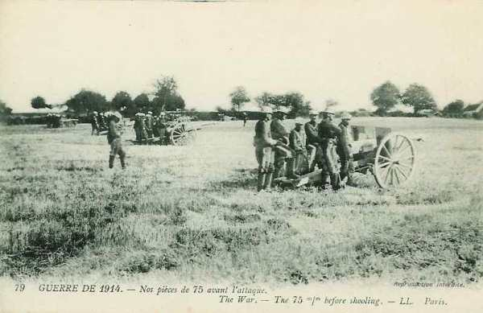
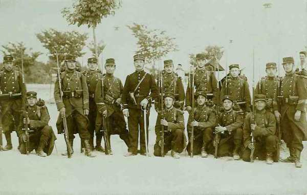
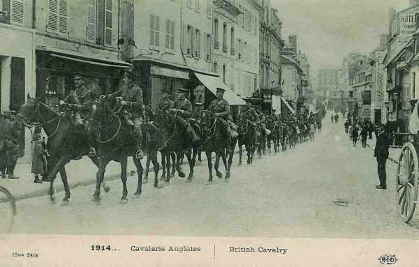
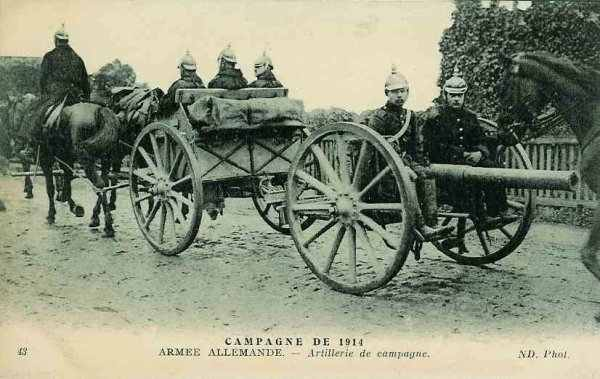

# Le 21 août 1914

Poursuivant les mouvements prévus par le plan Schlieffen, les armées allemandes se déploient entre Bruxelles et Longwy. Chez les Alliés, les armées ont également marché en avant sur tout le front. Les IIIe et IVe armées françaises ont franchi la Chiers et la Semois. Elles vont bientôt se trouver face à face avec les Ve et IVe armées allemandes marchant au-devant d’elles. Ce sera une véritable bataille de rencontre qui se livrera de la Woëvre à la Meuse.

### G.Q.G. français

Le rassemblement, au nord de la Meuse, d’une masse aussi importante ne peut d’après Joffre se réaliser qu’au détriment d’une autre partie du front. Or, face à la Ie et IIe armée, les Allemands prennent l’offensive. Joffre en conclut que c’est dans le Luxembourg que la densité est la moins forte.

A 7h du matin, Joffre émet l’instruction :

« Les IIIe et IVe armées commencent dès aujourd’hui leur marche en direction générale de Neufchâteau (IVe) et d’Arlon (IIIe) en prenant pour objectif les forces allemandes qui sont entrées dans le Luxembourg belge et dont le déplacement est orienté vers l’ouest.

La Ve armée, s’appuyant à la Meuse et à la place de Namur, prendra pour objectif le groupement ennemi du nord. Le commandant en chef des forces anglaises est prié de coopérer à cette action en se tenant à la gauche de la Ve armée et en portant tout d’abord le gros de ses forces dans la direction générale de Soignies. »

Les armées, qui sont déployées de Sedan à Spincourt, s’enfoncent sans se douter qu’elles vont rencontrer les IVe et Ve armées allemandes dont la marche vient juste d’être orientée par Moltke vers le sud-ouest. Le terrain est difficile. Les routes sont rares et la forêt fractionne le combat et rend difficile l’emploi de l’artillerie. L’action d’ensemble dégénère en une série de combats de rencontre. De lourdes pertes en résultent pour les Français car les Allemands ont une meilleure tactique, savent mieux se dissimuler dans les bois, creusent des tranchées et font un usage important des armes automatiques.

A 21h, Joffre confirme aux IIIe et IVe armées l’ordre de continuer leur mouvement vers le nord. « Le but à poursuivre est d’acculer à la Meuse entre Dinant, Namur et l’Ourthe, toutes les forces ennemies qui se trouveraient dans cette région ».

### Armée d’Alsace

L’armée entre dans les faubourgs de Colmar.

### Ie armée française : bataille de Sarrebourg-Morhange

La 15e division s’est portée de nuit vers Gosselming et Oberstinzel. Elle s’empare de Gosselming mais ne réussit pas à franchir la Sarre.

A 7h, son offensive est complètement enrayée. Désorganisées par le bombardement, les troupes commencent à se replier. A 9h, les Bavarois passent à l’attaque.

A partir de 11h, la 15e division cède jusqu’à chercher abri au sud du canal. La 31e brigade suit le mouvement après avoir défendu Sarrebourg à fond.

Sur le front des 13e et 21e C.A., la ligne de résistance peut se maintenir et l’artillerie inflige de lourdes pertes aux Bavarois. Sur le Donon, la 13e division et le 14e C.A. conservent à peu près intégralement le terrain.

_Pièces de 75 avant l’attaque_
_Collection privée_

Dubail doit reporter sa ligne sur la Vezouse en raison du recul de la IIe  armée. Son flanc nord-est en effet découvert et il est attaqué par l’armée de von Heeringen.

L’armée va opérer une conversion de sa gauche et de son centre pour se placer à peu près perpendiculairement au front de la IIe armée depuis la forêt de Charmes jusqu’à Raon-l’Etape, la droite au sud vers Ban-de-Sapt, face à la vallée de la Bruche.

### IIe armée française

Le matin, le 20e C.A. est à Besange, le 15e à Serres et le 16e à Avricourt.

Castelnau espère pouvoir regrouper ses unités sous le couvert du Grand-Couronné, prolongé par les hauteurs de Saffais - Belchamps, après une retraite de 40 à 50 km au départ de Morhange. Si cela s’avérait impossible, il propose de poursuivre sa retraite vers les Hauts de  Meuse, installant sa gauche à Toul (place fortifiée française) et sa droite dans le massif du Châtenois.

Rapport de Castelnau : « le Grand-Couronné est occupé par les troupes du 9e C.A. et certains éléments des divisions de réserve. En arrière, je m’efforce de regrouper les 15e, 16e et 20e C.A. très éprouvés. La 10e D.C. est arrivée très fatiguée dans la région de Manonviller ».

Castelnau envisage donc l’abandon de Nancy.

Joffre fait télégraphier à Castelnau qu’il estime indispensable de tenir les positions organisées autour de Nancy par le 20e C.A. de Foch. La perte de Nancy aurait un effet désastreux sur l’opinion publique. Il espère que la IIe armée pourra s’installer sur le Grand-Couronné et la Meurthe de Nancy à Lunéville. L’armée allemande a peu avancé. Elle est à 20 km de la Meurthe et a subi des pertes sérieuses. Tous les convois de la IIe armée se sont retirés en bon ordre.

Les Bavarois ne poursuivent pas. Dans la soirée, l’armée tient le Grand-Couronné et la Meurthe de Nancy à Lunéville.

### Armée de Lorraine

Commence à se rassembler entre Verdun et Nancy.

### IIIe armée française : livre la bataille de Longwy

En exécution des instructions de Joffre, le IIIe armée fait avancer ses

- 4e et 5e C.A. jusqu’à Virton - Longwy
  6e C.A. en arrière à droite vers Beuveille - Mercy-le-Bas, Landres
  54e division près de l’Orne, prolongeant le front du 6e C.A.

L’armée a franchi la Chiers et la Semois.

### IVe armée française

La IVe armée a franchi la Chiers et la Semois et porte ses têtes de corps jusqu’à

- Offagne et Bertrix (11e)
  Herbeumont (17e)
  Florenville et Izel (12e)
  Jamoigne et Saint Vincent (colonial)
  Bellefontaine (2e)

_Peloton français_
_Collection privée_

Les avions ne relèvent aucune troupe allemande dans les régions d’Arlon, de Luxembourg ou de Thionville.

Vers 18h, de Langle de Cary donne les directions d’attaque à ses C.A.

- Les 11e et 2e C.A. (corps d’aile) marcheront sur Maissin et Léglise.
  Le 17e vers Jehonville - Ochamps.
  Le 12e C.A. vers Recogne - Libramont.
  Le corps colonial vers Neufchâteau.
  Les 9e et 4e D.C. et les éléments débarqués du 9e C.A. couvriront le flanc gauche vers Gedinne - Bièvre.
  Une division coloniale se tiendra en réserve à Jamoigne.

Vers  18h, Ruffey arrête ses ordres pour le 22 août.

- Le 4e C.A. poussera une division à Etalle et une autre à Châtillon, pour pouvoir repousser les forces qui déboucheraient d’Arlon.
  Le 5e C.A. viendra dans la zone Meix - Rachecourt.
  Le 6e C.A. masquera la position Differdange, la débordera par Longwy.
  Le 3e C.A. éclairé par la 7e D.C. s’établira en flanc-garde dans la région Fillières - Mercy-le-Haut, face à Fontoy.

### Ve armée française : bataille de Charleroi

Le général Lanrezac a reçu comme objectif, le 21 au matin, « le groupement ennemi du nord », avec l’appui de la place de Namur et la coopération avec l’armée anglaise, mais il ne veut pas franchir la Sambre avant d’avoir regroupé son armée sur la rive sud de la Sambre et pris la liaison à gauche avec l’armée anglaise.

Le matin, l’armée achève son déploiement.

- Le 1e C.A. garde la Meuse de Givet à Profondeville et il est relevé par la division de réserve Boutegourd  dans le courant de la journée.
  Le 10e C.A. (Defforges) a ses avant-postes sur la Sambre, de Floreffe à Tamines.
  Le 3e C.A. (Sauret) tient la Sambre jusqu’à Marchienne.
  Le 18e C.A. (de Mas Latrie) s’échelonne de Thuin à Solre-le-Château.
  Le C.C. borde le canal de Charleroi, le gros à Fontaine-l’Evêque.

_Général de Mas Latrie (18e C.A.)_
_Collection privée_

Lanrezac donne l’ordre aux chefs de C.A. réunis à son Q.G. l’ordre de ne pas s’engager dans les bas fonds de la Sambre.

### Armée anglaise

La concentration est terminée. Sir James Grieson, qui devait prendre le commandement du 2e C.A. meurt subitement. Il est remplacé par Smith Dorrien qui n’est guère apprécié par French. La cavalerie effectue des reconnaissances vers Binche sans rencontrer d’ennemis.

_Cavalerie anglaise_
_Collection privée_

Une reconnaissance aérienne observe une colonne de troupes allemandes vers Leuven (c’est la Ie armée allemande). Le corps expéditionnaire doit avancer vers le nord-est à la gauche de la Ve armée.

Le G.Q.G. établit dans la soirée les ordres de mouvement vers le nord

- 5e brigade de cavalerie vers Binche (pour opérer la liaison avec l’armée française).
  Division de cavalerie vers Lens.
  Ie C.A. vers Avesnes Landrecies puis entre Spiennes et Saint Denis.
  2e C.A. vers Goegnies Bavai puis vers Mons et Thulin

La 2e brigade de cavalerie traverse le canal de Mons à Condé et prend position de Maurage à Obourg.

En soirée, l’armée tient la ligne du canal de Condé. Les deux C.A. cantonnent aux abords nord du camp retranché de Maubeuge, le 1e à droite, le 2e à gauche, la 19e brigade à Valenciennes.

### Armée belge de campagne

Les belges signalent que des éléments de cavalerie allemande ont traversé Bruxelles se portant sur Ninove et Hal suivis de deux divisions d’infanterie venues de Louvain. Le gros des armées allemandes disparaît du front de l’armée belge et s’infléchit vers le sud. En fin de journée, les armées allemandes sont sur le front Namur - Enghien.

Une armée d’observation formée des 3e et 9e C.A.R. s’installe devant Anvers.

### O.H.L.

**[Lien vers marche générale des armées allemandes](../img/marche_generale_armees_all.jpg)**

**[Lien vers croquis](../img/progression_allemands.jpg)**

La progression des armées allemandes continue comme prévu par le plan.

### Ie armée allemande

- La 1e D.C. est au sud de Nivelles.
  La 4e D.C. est entre Charleroi et Seneffe.
  Le 2e C.A. se trouve à Ganshoren.
  Les 4e, 3e et 9e sont sur la ligne Chastre - Braine-le-Château.
  Le 3e C.A.R. fait face à Anvers.
  Le 4e C.A.R. est à Louvain.

Les reconnaissances trouvent le canal du centre occupé de Mons à Ville-sur-Haine, mais il est libre vers l’ouest.

Pour être certain de déborder l’adversaire, von Kluck veut marcher vers le sud-ouest en laissant Maubeuge à sa gauche. Il a préparé l’ordre d’opérations pour le lendemain lorsque lui parvient celui de von Bülow qui aiguille la Ie armée beaucoup plus à l’est. Von Kluck prévoit que cette fausse direction lui fera manquer la manoeuvre débordante si les Anglais vont prolonger la ligne française à l’ouest de Maubeuge. Il envoie un officier au Q.G. de la IIe armée pour exposer sa manière de voire et faire revenir von Bülow sur sa décision.

On lui répond « Si vous allez au sud-ouest, vous vous écarterez trop de la IIe armée pour pouvoir la soutenir ».

Von Kluck se voit obligé de modifier la direction de ses colonnes.

Cette réponse sera lourde de conséquences : si les Anglais avaient été débordés par leur gauche, ils n’auraient pas pu faire retraite et leur armée aurait été anéantie. La bataille de la Marne n’aurait probablement pas pu avoir lieu et la France aurait été envahie.

Il revient à la Ie armée la charge de couvrir les armées allemandes en direction de la position fortifiée d’Anvers.

### IIe armée allemande : une décision de von Bülow lourde de conséquences

L’armée de von Bülow aborde la Sambre à l’est de Charleroi par ses deux corps d’armée de gauche (10e et Garde). Elle occupe les passages de la Sambre de Charleroi à Namur.

- Le 10e C.A. aborde la Sambre à 15h et force le passage à Roselies, défendu par des éléments du 3e C.A. français.
  La Garde s’est emparée de Tamines et d’Auvelais et refoulé les avant-postes du 10e C.A. français.
  Le 10e C.A.R. est vers Fransnes-lez-Gosselies.
  Le 7e C.A. est dans la région de Nivelles. Il a eu des engagements avec le C.C. Sordet.
  Le 7e C.A.R. se trouve vers Nivelles.
  Le C.C. (von Richthofen) s’est mis en marche par l’est et le nord de Namur.
  La 5e D.C. est à Natoye.
  Le détachement Gallwitz commence le siège de Namur.

Bülow ordonne que la Ie armée se rapproche de la IIe pour la soutenir en cas de besoin. Cet ordre provoque l’ire de von Kluck.

Le C.C. von der Marwitz est mis à la disposition de la IIe armée. La Ie armée perd le soutien d’une importante force de cavalerie.

Les différents C.A. sont entre Nivelles et Jemeppe.

Le Q.G. de l’armée est à Vieux Sart.

Pour le lendemain, l’armée doit s’infléchir pour soutenir la IIe armée (Ollignies - Mignault).

Le 3e C.A.R. va prendre position sur les 2 rives du canal de la Dyle, de Louvain à Malines, pour protéger l’armée dans la direction d’Anvers.

### IIIe armée allemande

L’armée n’a pas progressé ; elle s’est contentée d’achever son déploiement, mettant toutes ses divisions en ligne.

### IVe armée allemande

Le front de l’armée s’étend sur 52 km, alors qu’il n’en comptait que 35 le 18 août.
Le duc Albert rapproche un de ses C.A. de deuxième échelon, le 18e C.A.R., de sa première ligne et le pousse entre le 18e C.A. et le 6e C.A.

L’armée a franchi vers 10h la ligne de Neufchâteau - Bastogne - Houffalize et a commencé à pivoter sur son aile gauche pour faire face au sud-ouest (Givet - Etalle), comme il est prévu dans le plan Schlieffen. Une brigade mixte est dirigée sur Beauraing afin de maintenir la liaison avec von Hausen.

Le duc de Wurtemberg avise Moltke que les aviateurs de la IVe armée ont repéré de fortes colonnes en marche sur le front Stenay -Montmédy (6 C.A. au moins).

- Le 8e C.A. a marché sur Grupont et Smuid. Il se rapproche de la IIIe armée.
  Le 18e remonte sur sur Libin et Libramont ouvrant une fenêtre au 18e C.A.R. qui fait route vers sur Ebly et Anlier.
  Le 6e reste à Léglise - Mellier comme pivot.
  Le 8e C.A.R. ne dépasse pas Bastogne.

_Canon de 77 allemand en marche_
_Collection privée_

Le temps se couvre et les Allemands ne peuvent pas effectuer de reconnaissances aériennes, ce qui les laisse dans l’ignorance des intentions des Français.

### Ve armée allemande

La marche de la Ve armée est réglée par la vitesse de l’aile enveloppante. Elle doit cheminer entre la Sarre et la Nied. Elle se déploie sur la ligne Etalle - Longwy.

Le Q.G. de l’armée s’est transporté de Trèves à Bastogne. Une brigade mixte du 13e C.A. s’installe devant Longwy (français) et ouvre le feu de ses batteries de bombardement.

Vers la soirée, le Kronprinz reçoit  des rapports d’aviateurs (dont Goering) mentionnant des déplacements considérables de troupes françaises sur le front Montmédy - Longuyon - Landres. Ces renseignements le portent à penser qu’une offensive française a effectivement commencé dans le but de dégager Longwy. Dans la soirée, des avant-gardes se heurtent à celles de la IIIe armée française aux alentours de Longwy.

### VIe armée allemande : bataille de Lorraine

[Lien vers la journée suivante](article_04_40.md)