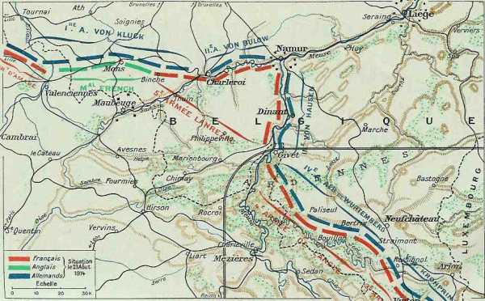
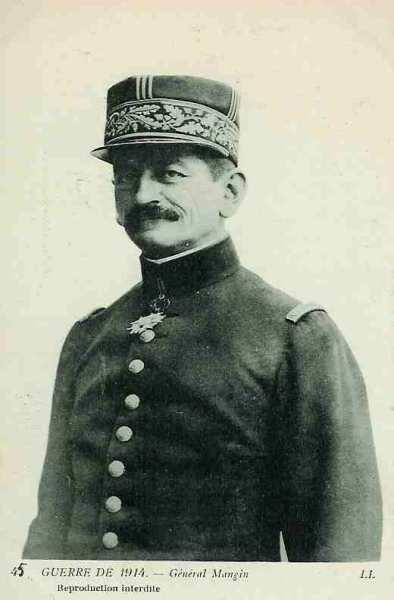
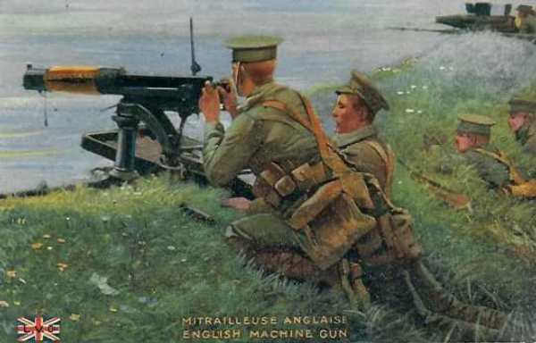
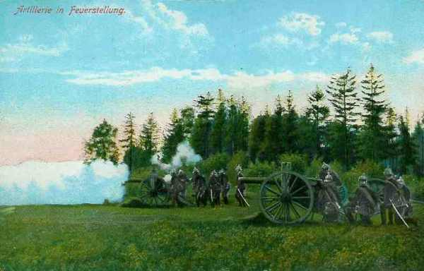
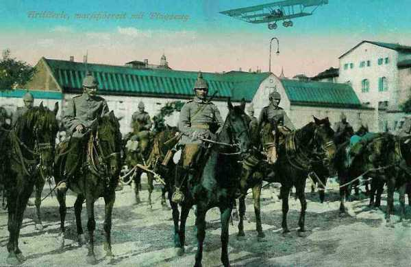
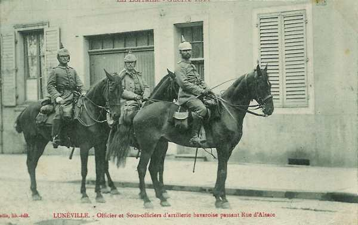

# Le 23 août 1914

L’armée de Lanrezac, qui est en flèche par rapport aux armées françaises voisines, risque d’être prise en tenaille entre les armées de von Bülow et von Hausen. Une prompte retraite permet d’éviter l’encerclement. La retraite de la Ve armée met l’armée anglaise à découvert et celle-ci risque à son tour d’être encerclée, mais elle parvient également à se dégager.

### G.Q.G. français

Joffre envoie un rapport optimiste à Messimy, ministre de la guerre au sujet de son offensive dans les Ardennes. Mais, il apprend par la suite que les IIe et IVe armées effectuent une retraite. Il ne doit que constater l’échec de son plan offensif.

La 88e division territoriale va être mise à la disposition de d’Amade pour couvrir l’agglomération Lille, Roubaix, Tourcoing.

_Position des armées le 23 août 1914_
_Général Niox La grande guerre_

### Armée d’Alsace

Elle opère une retraite.

### Ie armée française

Les troupes du Donon et du col de Saales sont ramenées vers l’ouest vu les échecs subis par la IIe armée en Lorraine. Les trois bataillons alpins reçoivent l’ordre de se retirer du col du Bonhomme.

### IIIe armée française : bataille de Longwy

Le chef du 5e C.A. donne l’ordre d’attaquer sur le front Signeulx, Redoute du Bel Arbre.

La 9e division s’engage sur Baranzy et sur Mussy. En très peu de temps, l’infanterie, mal appuyée par l’artillerie, subit des pertes sensibles. Quand la brume se lève, l’artillerie, surprise en terrain découvert, est rapidement dominée par les batteries de gros calibre allemandes. A 11h, la division est rejetée définitivement sur le plateau de Tellancourt.

La 10e division attaque. Les efforts de l’infanterie se brisent sur des tranchées ou lisières de bois. Vers 9h30, à la levée du brouillard, une attaque vigoureuse nettoie Romain et chasse les Allemands de la redoute du Bel Arbre, mais malgré l’entrée en ligne de la tête du 6e C.A., le repli devient général. La retraite ne s’arrête qu’aux bords de la Chiers.

Au 6e C.A.,

- La 12e division doit marcher sur Aubange par Beuveille.
  La 42e sur Villers-la-Montagne par Pierrepont.
  La 40e sur Fillières et Mercy-le-Haut.

Les Allemands débouchent au sud de Longwy sous le couvert d’un violent feu d’artillerie. La 12e division doit se replier jusqu’à Beuveille.

La 42e division se heurte aux Allemands vers 8h, à la sortie de Pierrepont. Une brigade entière se trouve engagée dans les bois de Doncourt sans pouvoir en déboucher. L’attaque est déjouée en raison de la pression de flanc d’un puissant groupement  qui enlève successivement Ville-au-Montois et Bazailles. La brigade de droite de la 40e division a pris pied sans difficulté sur le plateau de Mercy-le-Haut, et la 7e D.C. entre dans Audun-le-Roman.

Vers midi, la cavalerie doit se replier devant des forces considérables. Quand la cavalerie a atteint Xivry - Circourt sous le feu de l’artillerie, la menace d’enveloppement oblige à battre retraite. Ce mouvement de repli pendant la nuit s’effectue jusque Spincourt. La 42e division repasse la Crusnes et ramène ses troupes derrière l’Othain.

### IVe armée française

Des attaques allemandes se produisent à l’aile gauche de la IVe armée (9e C.A.) et vers le centre. En fin de journée, l’armée tient la ligne Vresse - Bouillon - Messincourt - Saint-Valfroy - Villers-la-Loue.

de Langle de Cary envoie un avis à Joffre que le 17e C.A. est en retraite sur la rive gauche de la Semois et que la désorganisation des trois brigades du corps colonial ont eu pour conséquence le repli des 11e et 12e C.A. Ce compte rendu surprend Joffre. Il pensait qu’il n’y avait que 3 ou 4 C.A. devant le front de l’armée de Langle. L’armée va être obligée de se reporter sur la Meuse et la Chiers. (Ligne générale Montmédy - Sedan - Mézières), ce qui découvre  la flanc droit de la Ve armée.

### Ve armée française : Lanrezac ordonne la retraite

Dans la matinée, les Allemands ne montrent aucune activité sur le front de la Sambre, ce qui permet aux 3e et 10e C.A. de se reformer.

La 1e C.A. poursuit son rassemblement face au nord-ouest. Sur la Meuse, il est relevé par une division de réserve. Franchet d’Esperey déclare pouvoir entreprendre une offensive, mais 12h30, il apprend que la garnison de Namur se replie vers Bois-de-Villers et que les Allemands ont franchi la Meuse à Hastière. La ligne de retraite de la Ve armée vers la France risque d’être compromise. Franchet d’Esperey renonce à attaquer vers la Sambre.

Depuis le milieu de la nuit, des attaques ont été prononcées contre la 102e brigade qui garde les ponts de Bouvignes à Dinant et à Hastière. Deux compagnies sont passées au gué de Waulsort et ont pénétré dans Lenne. Franchet d’Esperey ordonne au général Mangin de se porter sur-le-champ à Onhaye avec 2 bataillons d’infanterie et 2 régiments de cavalerie.

A 17h, il est avisé que les allemands passent le fleuve à Houx et à Dinant. Mangin monte une contre-attaque avec cinq bataillons et neuf batteries d’artillerie et réoccupe Onhaye, conjurant momentanément la menace sur le flanc droit de la Ve armée.

_Général Mangin (1e C.A.)_
_Collection privée_

Entre-temps, von Bülow a repris les attaques à partir de midi avec ses quatre C.A. (7e, 10e, 10e de réserve et Garde). Le 3e C.A. se voit débordé par sa gauche et recule sur Berzée et Thy-le-Château.

Au 18e C.A., la 38e division est en position d’Ham-sur-Heure à Thuin ; la 35e est rassemblée à Leers-et-Fosteau, derrière la 11e brigade qui tient les ponts de Lobbes et de Fontaine-Valmont. A 14h, les Allemands forcent le passage à Lobbes et à Fontaine-Valmont et progressent vers Biercée, menaçant la gauche de la 36e division.

Une contre-attaque de la 35e, toutes forces réunies, le refoule vers Lobbes. Vers 20h, la division de gauche, fortement prise à partie, fléchit jusqu’en arrière de Leers-et-Fosteau, tandis que celle de droite, tournée par l’est, perd Marbaix et Gozée.

Lanrezac veut éviter d’être pris en tenaille entre la IIe armée allemande et la IIIe sur son flanc droit. En présence de l’engagement défavorable du 3e C.A., de la retraite de la division de Namur, de la pression allemande dans la région de Dinant - Givet sur son flanc droit, et enfin de la défaite de la IVe armée, il décide la retraite. A 21h, il ordonne que la Ve armée se mettra en marche avant le lever du jour le 24 et se repliera sur la ligne Givet - Philippeville - Beaumont - Maubeuge.

Cette retraite sonne le glas du plan XVII. Désormais, les armées françaises sont sur la défensive.

### C.C. Sordet

Le corps de cavalerie s’est mis en route, par ordre de Joffre, pour gagner la gauche de l’armée française.

### Armée anglaise : bataille de Mons

**[Lien vers carte région de Mons](../img/region_mons-2.jpg)**

A 6 heures, French confirme à ses subordonnés sa décision de résister pendant 24 heures.

- Le 1e C.A. se déploie sur un front de 11 km de Peissant à Harmignies.

- Le 2e C.A. est en bordure de la route d’Harmignies à Nimy et du canal de Mons à Condé sur une étendue de 27 km, prolongé par la 19e brigade sur une longueur de 8 km.

- Le C.C. (Allenby) soutient la gauche du dispositif à Condé moins une brigade à Binche pour assurer la liaison avec la gauche de l’armée Lanrezac.

La ligne de combat est une chaîne de petits groupes sur la rive du canal, dans les fossés de la route, ou dans des trous de tirailleurs.

Les premiers coups de canon tombent à 9h sur Obourg et, à 10 heures, une attaque d’infanterie se développe entre Obourg et Nimy.

Vers midi, les compagnies qui tiennent Tertre et Obourg en postes avancés cèdent à la menace d’enveloppement. Les Allemands subissent de lourdes pertes devant l’intensité du feu anglais (un bon soldat peut tirer 15 coups au but par minute).

_Mitrailleuse anglaise_
_Collection privée_

### Armée belge de campagne

**[Lien vers croquis](../img/premiere_sortie_anvers.jpg)**

Albert Ie juge le moment opportun pour passer de la défensive à l’offensive. En effet, entre le moment marqué par le départ des principales armées vers le sud et celui de l’arrivée, du débarquement et de l’installation de l’armée allemande de Belgique, il y a un moment critique.
Le Roi veut mettre ce moment à profit pour attirer vers Anvers le plus possible de forces allemandes et ainsi soulager les armées alliées.

- Il faut pour cela que :
  les principales armées allemandes, qui ont infléchi leur mouvement vers le sud dès le 21 août, soient assez distantes de l’armée belge pour ne plus pouvoir intervenir.
  la partie de l’armée allemande de Belgique faisant face à l’armée belge soit inférieure aux forces belges, de telle sorte que l’opération entreprise oblige les Allemands à se renforcer. Pour l’instant, seul le 3e C.A.R. fait face à Anvers. Il vient à peine d’arriver.
Albert Ie estime le moment favorable.

D’après les renseignements receuillis les 21, 22 et 23 août, les forces allemandes semblent réparties sur un front de 35 km allant de Merchtem à Rotselaar, en passant par Grimbergen, Campenhout et Werchter. Le front d’attaque belge est de 12 km : 3 divisions. Le secteur du centre, entre les canaux de Willebroek et de Leuven - Mechelen (gauche du 4e secteur, droite du 3e) offre les meilleures possibilités.
Les ordres préparatoires à l’attaque sont donnés.

### O.H.L.

**[Lien vers marche générale des armées allemandes](../img/marche_generale_armees_all.jpg)**

**[Lien vers croquis](../img/progression_allemands.jpg)**

Moltke a été avisé par von Hausen qu’en amont de Givet, la Meuse n’est pratiquement pas tenue par les troupes françaises, contrairement à la région entre Namur et Givet. Il a donné ordre à la IIIe armée d’attaquer entre Namur et Givet. Moltke se ravise et « recommande à la IIIe armée de faire passer la Meuse à ses unités disponibles au sud de Givet, afin de couper la retraite à l’ennemi ».

### Ie armée allemande : bataille de Mons

L’armée de von Kluck livre la Bataille de Mons. Voici cette bataille vue du côté allemand (Die Schlacht bei Mons).

Von Kluck met ses colonnes en marche vers le sud-ouest, la gauche vers Mons. Les tris C.A. de tête doivent passer la ligne Ath - Le Roeulx à 8h30 et s’emparer dans la journée des hauteurs situées au sud du canal de Condé à Mons.

- Le 2e C.A. se rendra à La Hamaide
  Le 4e C.A.R. à Bierghes.

Dans l’après-midi, les trois C.A. de première ligne se présentent successivement de gauche à droite devant le canal entre Obourg et les abords est de Condé.

- Le 9e C.A. vers midi d’Obourg à Mons.
  Le 3e C.A. peu après 13h entre Jemappes et Saint-Ghislain.
  Le 4e beaucoup plus tard à l’ouest de Saint-Ghislain jusqu’à la frontière franco-belge.

L’armée réussit à forcer le passage sur le canal Mons-Condé, au prix de lourdes pertes, car l’armée anglaise est bien aguerrie et l’infanterie allemande attaque en groupement serré.

- Le 4e C.A. franchit le canal entre Condé et Saint-Ghislain.
  Le 3e C.A. combat entre Tertre et Quaregnon, Jemappes.
  Le 9e C.A. atteint le sud de Mons et Saint-Symphorien.

A la chute du jour, le 7e C.A. (IIe armée), à la gauche du 9e C.A. (Ie armée) n’a atteint que Binche et le 2e C.A. à la droite du 4e C.A. est environ à 30 km au nord de Condé.

Aucun mouvement débordant n’a été ébauché par l’aile droite.

Les ordres de l’armée à 20 heures sont :

- Pour le 3e C.A. d’attaquer à l’ouest de Bavai.

- Pour le 4e C.A. de pousser vers Wargnies-le-grand. Ce C.A. devra également réduire le fort de Curgies.

- Pour le 2e C.A. de faire mouvement sur Condé et d’attaquer les forts de Maulde et de Flines (deux forts démodés qui seront abandonnés).

- Le C.C. doit progresser vers Denain pour couper la retraite vers l’ouest aux Anglais.

_Artillerie allemande en action_
_Collection privée_

### IIe armée allemande

Von Bülow ordonne de reprendre son mouvement vers l’avant à 8h sur toute la ligne :

- Le 7e C.A. doit avancer vers Cerfontaine.
  Le 10e C.A.R. doit faire mouvement vers Philippeville.
  Le 10e C.A. a pour objectif Mettet, Rosée.

On lui remet un ordre d’opérations signé Lanrezac, trouvé sur le corps d’un officier français et il apprend ainsi que la Ve armée s’apprête à contre-attaquer, d’où une certaine circonspection.

Le 7e C.A. ne réussit pas à passer la Sambre entre Merbes-le-Château et Thuin, sauf à Lobbes.

Le 10e C.A.R. s’infiltre dans les bois qui couvrent la droite du 18e C.A. français et la gauche du 3e C.A. français. Le 10e C.A. parvient à atteindre la ligne Biesme - Scry, et se rabat sur la gauche du 3e C.A. Celui-ci doit reculer de six kilomètres, jusqu’à Walcourt. Ce repli oblige la 18e C.A. de ramener son aile droite. A la tombée de la nuit, le front allemand s’enfonce comme un coin au milieu de la Ve armée.

La 2e division de la Garde réalise également des gains de terrain entre Fosse et Saint-Gérard, mais en présentant son flanc gauche sans protection. Franchet d’Esperey s’apprête à attaquer l’aile exposée, mais lorsqu’il apprend que les troupes saxonnes (IIIe armée) ont réussi à passer la Meuse, il doit annuler cette offensive.

- Le 2e C.C. atteint Ath et doit continuer à éclairer le front et le flanc droit de la Ie armée.
  Le 1e C.C. doit assurer l’exploration devant la IIe armée.
  L’armée arrive sur la ligne Merbes-le-Château - Thuin - Saint-Gérard.

Von Bülow est exaspéré que la IIIe armée n’ait pas réussi à traverser la Meuse et adresse un nouveau télégramme à von Hausen : « prière instante à la IIIe armée de franchir encore aujourd’hui la Meuse ».

Il envoie ensuite un officier pour renouveler sa démarche et le persuader d’attaquer le 24 sur Mettet.

### IIIe armée allemande

L’armée s’épuise en vains efforts pour traverser la Meuse. Seuls quelques bataillons réussissent à s’emparer d’ Onhaye.

Von Hausen avait renseigné von Moltke qu’il y avait des forces relativement nombreuses entre Namur et Givet, mais, en revanche, il n’y avait presque pas de troupes au sud de Givet. Sur « recommandation » de von Moltke, il fait appel aux réserves encore rassemblées sur les hauteurs, réunit dix bataillons, leur adjoint neuf batteries, trois escadrons, pour constituer une division de marche, qu’il dirige aussitôt vers le sud par la rive droite de la Meuse. Privé de ses soutiens, le 19e C.A. ne peut ni élargir sa tête de pont d’Onhaye, ni traverser la vallée en d’autres points.

Les deux autres C.A., quoique disposant de toutes leurs unités, ne parviennent pas à faire franchir la vallée de la Meuse, même par une seule compagnie. Cet échec s’explique par les difficultés du terrain et par la longueur des préparatifs. L’artillerie ne commence à ouvrir le feu qu’à 6h, à cause de la brume.

En représailles pour de prétendus francs-tireurs, l’armée de von Hausen exécute à Dinant 612 otages et brûle la ville. 25 civils seront également fusillés à Namur.

Ces actes ont un profond impact sur l’opinion internationale en la défaveur des empires centraux.

### IVe armée allemande

Le 6e C.A. utilise surtout son artillerie pour déloger le corps colonial de Jamoigne. La 16e division chasse une arrière-garde d’Herbeumont, mais la 15e essuie à Plainevaux un retour offensif. Le 8e C.A. tombe à Houdremont et Bièvre, puis à Nafraiture sur des résistances.

### Ve armée allemande

Les C.A. s’ébranlent fort tard. Le feu de la grande batterie de Montquintin - Saint-Mard tient le 5e C.A. en respect. Le 13e et 6e C.A.R. bordent la Chiers et la Crusnes.

En contournant la position fortifiée de Longwy, l’armée atteint Verdun.

_Artillerie allemande_
_Collection privée_

### VIe et VII armées allemandes

Rupprecht de Bavière tente un nouvel effort pour exploiter son succès. Il lance des attaques sur la Vezouze, la Meurthe et la Mortagne, ce qui permet aux Bvarois de s’emparer de Lunéville.

_Officier et sous-officiers d’artillerie bavaroise à Lunéville_
_Collection privée_

[Lien vers la journée suivante](article_04_42.md)