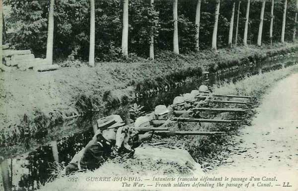
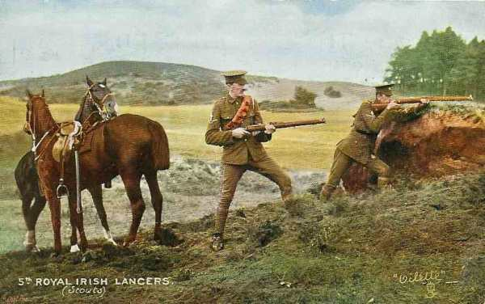
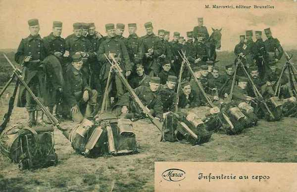
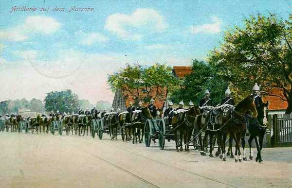
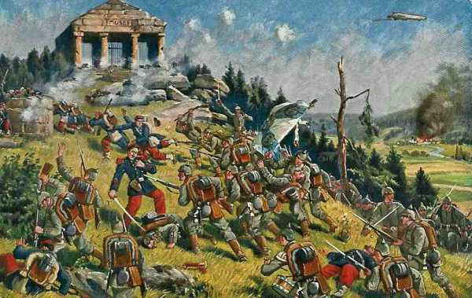

# Le 24 août 1914

C’est la fin de la batille des frontières. Les alliés reculent sur toute la ligne, de Longwy à Condé, et Joffre doit ordonner le repli général. Les Allemands envahissent le territoire français mais les armées n’ont pas été broyées en Lorraine et l’aile gauche n’a pas pu être débordée en Belgique, écrasée et rejetée sur le centre de la France, comme le prévoyait le plan Schlieffen. Les troupes alliées rétrogradent avec des pertes sérieuses, mais en bon ordre. La bataille d’anéantissement espérée par Moltke n’a pas eu lieu.

### G.Q.G. français : Joffre ordonne le repli général

Les anglo-français se dérobent et échappent au double encerclement entre la Ie et la IIIe armée.

Joffre est condamné à la défensive appuyée sur les places fortes et aux grands obstacles de terrain. Il doit garder du champ en abandonnant une partie du territoire français. Il envoie entre 8h30 et 9h les ordres préparant une nouvelle manoeuvre.

- La Ve armée gardant la liaison avec le IVe et avec les Anglais manoeuvre en retraite en s’appuyant sur la place de Maubeuge et le massif des ardennes.

- La IVe armée doit se reporter sur la rive gauche de la Meuse en aval de Mouzon et sur les hauteurs de la rive droite de la Meuse entre Mouzon et Stenay.

- La IIIe armée vient sur le front sur la ligne Montmédy - Damvillers - Azanes, en liaison avec l’armée de Lorraine maintenue sur les Hauts de Meuse en attitude défensive.

- La IIe armée doit être prête à attaquer si les Allemands entreprennent l’investissement de la partie sud du Grand-Couronné de Nancy.

La Ie armée est en bonne situation. La veille, le 21e C.A. a été attaqué et a pu maintenir ses positions, les 8e et 13e C.A. ont gagné les emplacements permettant d’étayer solidement le front de la Ie armée.

L’armée d’Alsace n’a plus devant elle que des éléments de réserve et de la Landwehr.

Joffre estime possible de prélever sur cette armée la plus grande partie du 7e C.A. qui est acheminé vers Amiens.

Il demande aux Anglais de retarder la marche des Allemands entre Valenciennes et Maubeuge, sur le prolongement de la ligne Givet - Beaumont (front de la 5e armée).

Il veut prolonger la gauche des Anglais par des troupes françaises auxquelles il peut donner directement des ordres, contrairement à une armée alliée. Deux divisions de réserve venant de Paris reçoivent la mission de couvrir la gauche anglaise. Joffre prend sous ses ordres directs le C.C. Sordet. Il lui ordonne de passer à gauche des Anglais.

Joffre comptait s’appuyer sur Lille, mais le ministre de la guerre donne l’ordre de ne pas défendre cette ville.

Suite à l’échec de la bataille des frontières, Joffre procède au limogeage de plusieurs généraux.

### Armée d’Alsace

Le 7e C.A. est transporté vers Paris, à la disposition de la VIe armée (Maunoury). Le terrain conquis est abandonné (Mulhouse, Altkirch, Cernay, le Sundgau). Deux groupements défendent la frontière française. Le combat s’arrête et fait place à une guerre de positions.

### IIe armée française : bataille de la trouée de Charmes

**[Lien vers la carte de la trouée de Charmes](../img/mortagne_meurthe.jpg)**

Dans le courant de l’après-midi, une attaque débouche brusquement du Grand Couronné de Nancy. Les flanc-gardes bavaroises se voient délogées d’Erbéviller, de Réméréville et de Courbesseaux par la 70e division de réserve et deux brigades du 9e C.A. restées en Lorraine (Joffre avait prescrit le transport de ce C.A. vers l’ouest pour contrer la menace sur l’aile gauche des armées). De même, le 20e C.A. reprend pied sur les hauteurs de Flainval.

### IIIe armée française : bataille de Longwy

L’armée se replie vers le front Montmédy - Damvillers, derrière la Tinte et le Loison.

Le 4e C.A. est assailli au débouché nord de Virton et refoulé sur la Chiers en amont de Montmédy. Le 6e C.A. reste maître des plateaux entre Longuyon et Spincourt et le 4e C.A. se replie sur l’Othain.

### IVe armée française : bataille de Neufchâteau

L’armée reflue vers la Meuse et la Chiers. Le repli de la IVe armée laisse les troupes allemandes signalées dans la région de la Lesse et de Ciney libres de franchir la Meuse. De Langle reçoit ordre de contre-attaquer le 27 août les troupes qui ont franchi la Meuse à Sedan et Donchéry.

- Le 17e C.A. est au nord de Mouzon.
    Les 9e, 11e C.A. et la 60e div. res. sont sur la rive gauche de la Meuse, entre Sedan et Mézières.
    Le 12e C.A. est à Carignan.
  Le Q.G. de l’armée s’est transporté de Stenay au Chesne dans la nuit du 23 au 24.

_Défense d’un cours d’eau_
_Collection privée_

### Ve armée française

La Ve armée retraite vers la ligne Philippeville - Beaumont - Maubeuge.
La décision avait été prise par le général Lanrezac à la nouvelle que la IVe armée refluait vers la Meuse en amont de Mézières et que les Allemands étaient entrés dans Namur.

En fin de journée, elle occupe la ligne Mariembourg - Solre-le-Château - Maubeuge. Elle décroche sans difficulté vers le sud-ouest.

### Armée anglaise : combat d’Elouges

A l’aube, l’armée anglaise occupe une ligne faisant face au nord-est, à 5 km au sud de Mons, sur les hauteurs.

- Le 1e C.A. occupe la région de Grand Reng - Bougnies.

- Le 2e C.A. est dans la zone de Nouvelles - Hornu - Bois-de-Boussu.

- La 19e brigade d’infanterie et la D.C. sont à Thulin - Elouges - Audregnies - Quiévrain.

Le G.Q.G. est au Cateau.

Les aviateurs ont reconnu l’approche d’une longue colonne allemande de toutes armes faisant route par Pommeroeul tandis que la Ve armée française bat en retraite vers l’alignement Givet - Maubeuge. En conséquence, French donne l’ordre de se replier à la même hauteur, de part et d’autre de Bavai.

Le 1e C.A. constitue une arrière-garde avec la 5e brigade de cavalerie et la 4e brigade (Guards) pour faire une démonstration offensive et retarder ainsi la progression des Allemands. Haig donne des ordres pour que la retraite s’effectue par les routes de Feignies et Bavai.

La 1e division se met en marche vers 4h du matin, la 2e trois quarts d’heure plus tard.

Au 2e C.A., une reconnaissance par avion rapporte qu’une colonne allemande se porte vers Peruwelz. Cette ligne de marche peut l’amener à l’ouest de l’extrême flanc de l’armée anglaise, ce qui constitue un énorme danger. Avant l’aube, les Allemands ont ouvert un violent bombardement contre la droite du 2e C.A. A 5h15, une attaque générale d’infanterie se développe mais elle est repoussée avec pertes.

Vers 9h, la 9e brigade d’infanterie recule en ordre parfait de Frameries vers Sars-la-Bruyère. Les South Lancashire sont pris d’enfilade par des mitrailleuses postées sur les terrils de Frameries et perdent de 2 à 300 hommes avant que la brigade se replie vers Genly.

A l’ouest de Frameries se déroule un combat sur le flanc gauche du 2e C.A. britannique et à Pâturages. Plus à l’ouest, les Dorsets (15e brigade) sont retranchés le long du chemin de fer au nord-ouest de Wasmes. Ils bloquent l’avance allemande. A 9h, les 3 bataillons de la 5e brigade commencent à se replier par Culot et Eugies sur Sars-la-Bruyère.

Plus à l’ouest encore, la 19e brigade (qui tenait la gauche du dispositif anglais) a reçu l’ordre de reculer vers Elouges. En même temps, la 84e division territoriale évacue Condé et retraite vers Cambrai.

Tout le 4e C.A. allemand s’avance vers le sud entre Thulin et Condé, dans un mouvement d’enveloppement. Un combat de flanc-garde se déroule à Elouges. Les I/Norfolks et I/Cheshire attaquent vers le nord et Allenby envoie les 2e et 3e brigades de cavalerie vers Audregnies pour protéger le flanc de l’armée.

Le champ de bataille est délimité au nord par la route Mons - Valenciennes, à l’est par le ruisseau d’Elouges, au sud par la route Elouges - Audregnies et à l’ouest par la vallée de la Honnelle.

A 12h30, une attaque allemande se produit contre les Norfolks et Cheshire par deux colonnes, une débouchant de Quiévrain, l’autre de Baisieux.

_Cavaliers anglais_
_Collection privée_

Le 9e Lanciers avance en colonne d’escadrons au galop avec une partie du 4e Dragon Guards. Ils traversent la route Baisieux - Elouges mais sont mis en échec par le feu allemand. La 3e brigade de cavalerie est en position vers Angre, ses mitrailleuses tirant vers Baisieux. Les Allemands ont au moins sept batteries en action au nord de la route de Valenciennes et des masses importantes sortent de Quiévrain. Les Anglais doivent rétrograder.

Le C.C. Sordet prend au galop possession de Baisieux et de Marchipont et déjoue la menace d’encerclement.

L’armée s’installe pour la nuit sur la ligne Feignies - Jenlain. Pas un seul canon n’a été perdu mais French croit que l’armée française est vaincue et songe à sauver l’armée anglaise d’un désastre, en retraitant constamment.

### Armée belge de campagne

L’armée prend ses positions de combat en vue de la première sortie d’Anvers.
Le front de l’armée s’avance jusqu’à la ligne Londerzeel - Kapelle-op-den-Bos - Mechelen :

- La 5e division occupe Londerzeel - Kapelle-op-den-Bos.

- La 6e division (réserve de l’armée) doit se porter vers Mechelen par Kontich et Waelhem.

- La 1e division évacue le cantonnement de Lier au profit de la 2e division.

- La 3e division reste sur place

- La D.C. se porte vers Putte, en avant de la gauche de l’armée et doit éclairer vers Leuven, Wezemaal, Aarschot, Herselt et Geel, pour éviter que l’armée belge soit attaquée de flanc lors de la sortie. Elle signale que les Allemands occupent Aarschot, Betekom, Tremelo, Werchter, Rotselaar.

- La 5e division envoie des reconnaissances vers Vilvoorde, Grimbergen, Wolvertem et Merchtem. L’avant-garde livre un combat vers le château d’Impde.

- La 6e division doit pousser des reconnaissances vers Eppegem, Vilvoorde, Elewijt, Perk, Kampenhout, Haacht, Keerbergen. Elle signale que les Allemands occupent Hofstade et le château au nord de Zemst. Leurs positions défensives sont établies vers Schiplaken, entre Elewijt et Perk et vers Houtem.

En soirée, il est possible de jalonner la ligne avancée occupée par les Allemands : Opwijk - Merchtem - Zemst - Hofstade - Tremelo - Aarschot.

L’armée belge a contribué à ralentir la marche de l’armée allemande. Celle-ci a parcouru la distance Aachen - Maubeuge (160 km) en 20 jours, du 4 au 24 août, soit une moyenne de 8 km par jour. Sans la résistance des forts de Liège et de l’armée belge, elle aurait parcouru cette distance en cinq ou six jours et serait tombée sur l’armée anglaise en cours de formation, avec les conséquences que l’on devine.

_Infanterie belge_
_Collection privée_

### O.H.L.

**[Lien vers marche générale des armées allemandes](../img/marche_generale_armees_all.jpg)**

**[Lien vers croquis](../img/progression_allemands.jpg)**

### Ie armée allemande : la manoeuvre d’enveloppement échoue

Von Kluck est furieux de n’avoir pas trouvé le flanc de l’armée anglaise dans la journée du 23 et prétend réussir mieux le 24.

Les seules unités dont il dispose pour réaliser la manoeuvre de débordement sont le C.C. von der Marwitz et le 2e C.A., parvenu dans la soirée à La Hamaide, à 25 km en arrière du champ de bataille. Le 4e C.A.R. est à Bierghes. Von Kluck déploie son énergie habituelle pour ne pas laisser s’échapper cette dernière chance. A force d’insistance, il obtient de l’O.H.L. que le C.C. Marwitz soit placé sous ses ordres et le dirige aussitôt sur Denain. Il fait serrer le 2e C.A. sur Condé par une marche de nuit et prescrit la reprise de l’offensive pour le 24 à 5h.

_Colonne d’artillerie allemande_
_Collection privée_

Von Kluck espère ainsi couper la retraite de l’armée britannique et la refouler sur Maubeuge mais il échoue, car French, qui avait deviné ses intentions, oriente ses colonnes vers le sud-ouest avant que la pression du C.C. Marwitz ait pu se faire sentir.

Le 2e C.A. s’empare de Condé-sur-Escaut. Les forts de Maulde et de Flines sont abandonnés par les Français.

Le C.C. von der Marwitz disperse près de Tournai une brigade d’infanterie française et est retardée pour essayer d’encercler les Anglais.

Von Kluck donne l’ordre de reprendre l’attaque le 25 au matin en enveloppant la gauche britannique par la forêt de Raismes et déplace son Q.G. à Thivencelles.

### IIe armée allemande : un appel à l’aide lourd de conséquences

- L’armée entame sa poursuite de l’armée française vers Beaumont, Hemptinne. La bataille de Charleroi a coûté 11.000 pertes à l’armée.

- L’armée investit la position fortifiée de Maubeuge.

- Von Bülow fait appel à l’aide de von Hausen, qui modifie sa route pour se rapprocher de la IIe armée.

### IIIe armée allemande

Von Hausen reçoit un appel urgent de la part de von Bülow pour soutenir son armée. La IIIe armée abandonne son plan d’attaque vers le sud de Givet et perd la possibilité de couper la retraite de la Ve armée. Elle parvient vers Florennes et Rosée.

### IVe armée allemande : bataille de Neufchâteau

L’armée combat les arrière-gardes françaises entre Semois et Meuse et les refoule.

### Ve armée allemande : bataille de Longwy

### VIe armée allemande

Rupprecht de Bavière renouvelle son offensive en Lorraine mais est arrêté par le 20e C.A. de Foch à Nancy. Les Allemands s’assurent une tête de pont à la Mortagne et s’avancent en pointe vers la trouée de Charmes.

L’armée se trouve sur la ligne Blainville - Gerbéviller - Cirey. Le Donon est pris d’assaut et les troupes françaises sont rejetées au-delà de la Meurthe avec de fortes pertes.

_Assaut du Donon_
_Collection privée_

[Lien vers la journée suivante](article_04_43.md)
