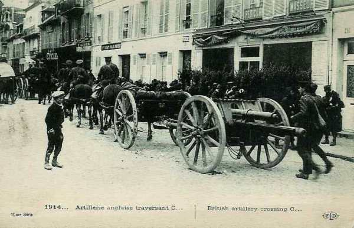
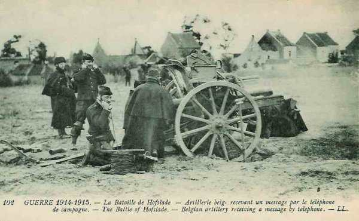
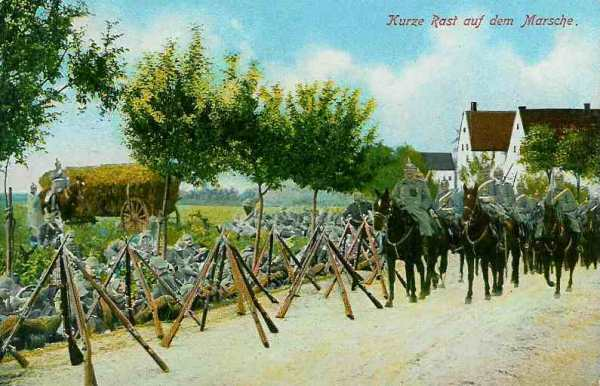
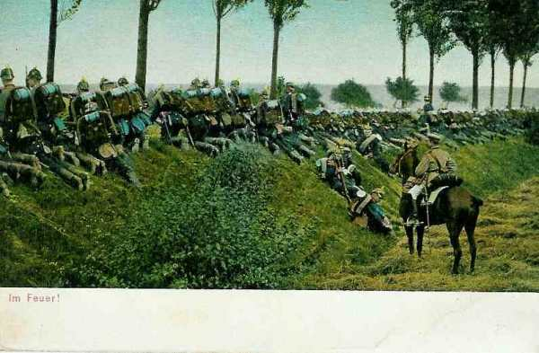

# Le 25 août 1914

Devant l’aile gauche alliée, l’armée allemande a une supériorité de six corps d’armée. La retraite est inévitable et s’effectue en pivotant autour de la place de Verdun. En Lorraine, les Allemands essaient en vain de forcer l’entrée de la trouée de Charmes, boulevard vers le coeur de la France. Les Belges opèrent une première sortie d’Anvers. Moltke commet l’erreur de dégarnir son aile marchante en envoyant des renforts vers le front de l’Est.

### G.Q.G. français

Après l’échec de la bataille des frontières, l’aile gauche des alliés se trouve ramenée comme suit :

- Armée anglaise sur la ligne Cambrai - Le Cateau
  Ve armée sur la ligne Avesnes - Mariembourg
  IVe armée sur la rive droite de la Meuse.
  D.C. Abonneau, entre la IVe et la Ve armée.

Devant les trois C.A. de French et les cinq C.A. de Lanrezac, les Allemands mettent en ligne :

- Ie armée : cinq C.A. (2e, 4e, 4e de réserve, 3e et 9e).
  IIe armée : cinq C.A. (7e, 10e, 10e de réserve, Garde, 7e de réserve).
  IIIe armée : quatre C.A. (11e, 12e, 12e de réserve, 19e).

Soit huit C.A. du côté allié contre quatorze du côté allemand, mieux dotés en artillerie. De plus, le flanc gauche britannique est à découvert et von Kluck exécute une conversion vers le sud, de manière à le déborder.

Il ne reste plus à Joffre qu’à opérer une retraite avec le plus d’ordre possible, en multipliant les contre-attaques pour ralentir l’adversaire d’une part, et de constituer une masse de manœuvre (la VIe armée) qui arrêtera le mouvement -sa droite et décide de contre-attaquer dans la direction des Vosges (14e C.A.). L’objectif est Raon-l’Etape et Baccarat.

- 21e C.A. : rive gauche de la Meurthe.
  14e C.A. : rive droite de la Meurthe vers Raon-l’Etape.
  13e C.A. : Ménarmont.
  8e C.A. : Moriviller.

Une violente attaque contre la gauche du 14e C.A. l’oblige, ainsi que le 21e C.A., à se replier vers le sud.

Quatre bataillons de chasseurs sont transportés de Thaon vers Amiens.

### IIe armée française : bataille de la trouée de Charmes

### IIIe armée française : bataille de Longwy

- Le 6e C.A. se trouve à l’est de la Meuse, dans la région Azannes-Damvillers.
  Le 5e C.A. est à Dun-sur-Meuse.
  Le 4e C.A. a passé la Meuse et se trouve dans la zone de Brieulles
  Le 6e C.A. passe la Meuse pour cantonner entre ce fleuve, la forêt de Hesse et Montfaucon.

La ligne de la Meuse est abandonnée de Namur à Mézières. L’instruction du 25 août, réglant le repli des armées, prévoit que la IIIe armée appuiera Verdun par sa droite et portera sa gauche dans la région de Varenne-Sainte-Menehould, pour rester en liaison avec la IVe armée.

### IVe armée française

L’armée continue son mouvement de repli et se trouve entre Mouzon et Stenay, au contact du 3e C.A. de la Ve armée. De Langle prescrit à ses troupes de s’opposer énergiquement à toute tentative de franchissement de la Meuse.

- 2e C.A. dans la région de Beauclair, gardant les passages de la Meuse à Stenay.
  Corps colonial de Stenay à Mouzon.
  12e C.A. en retraite du Chiers sur la Meuse, vers Pouilly.
  11e entre Remilly et Frénois.
  9e  sur la route de Givet à Rethel.
  53e division en aval de Mézières.
  60e division en aval de Sedan.

Un combat contre la IVe armée allemande a lieu à Sedan. Les Français réussissent à faire sauter les ponts sur la Meuse.

### Ve armée française

Gagne la ligne Avesnes - Chimay.

- La 51e division de réserve, après avoir gardé les passages de la Meuse, est en retraite au sud-ouest de Rocroi.
  Le 10e C.A. arrive au sud de Hirson.
  Le 3e C.A. est vers Fourmies - Anor.
  Le 18e C.A. est au nord-est du Nouvion.
  Le 1e C.A. est en aval de Givet.

### C.C. Sordet

Le C.C. Sordet se trouve entre Cambrai et Bohain et couvre l’aile gauche des Anglais.

Position fortifiée de Maubeuge
La place est investie par un détachement de la IIe armée allemande

### Armée anglaise

Les Anglais gagnent la ligne Cambrai - Le Cateau - Landrecies.

- Le 1e C.A. vers Landrecies.
  Le 2e C.A. entre Le Cateau et Caudry.

A ce moment, l’armée anglaise est encore en avant de la Ve armée française.

French prend la décision de se dérober pour reformer son armée derrière l’Oise et la Somme.

_Artillerie anglaise_
_Collection privée_

### Groupement d’Amade

Les 61e et 62e divisions achèvent de débarquer dans la région d’Arras, leurs premiers détachements font route vers Douai. D’Amade essaie d’organiser une ligne de résistance entre La Bassée et la mer.

### Armée belge de campagne

**[Lien vers croquis](../img/premiere_sortie_anvers.jpg)**

L’ E.M. juge le moment opportun pour faire une sortie du camp retranché d’Anvers. Le secteur Zemst (Sempst) est choisi de manière à menacer les communications allemandes et à percer les lignes des 3e et 9e C.A. qui s’étendent sur un très grand front  allant de Wolvertem par Elewyt à Aarschot et même Diest. Le front d’attaque est délimité par le canal de Willebroek à l’ouest et la Dyle à l’est, soit une largeur de 20 km.

Voici le dispositif d’attaque, de droite à gauche : 5e, 1e, 6e et 2e divisions, la 3e restant en réserve au nord de la Nèthe. Comme le front allemand dépasse considérablement le front d’attaque belge, l’armée doit assurer la couverture de ses flancs.

- A droite est disposé un détachement composé de la cavalerie divisionnaire, d’un régiment d’infanterie, d’un groupe d’artillerie et d’une compagnie de mitrailleurs.
Sa mission consiste à fixer les Allemands sur les positions retranchées qu’ils occupent vers Grimbergen et Wolvertem.

- A gauche, la D.C. est rassemblée entre Putte et Beersel pour couvrir toute attaque venant de la région située au nord de la ligne Demer - Dyle.

Dès 7h30, les 5e, 1e et 6e divisions sont mises en place au sud du chemin de fer Dendermonde - Mechelen.

- La 6e division est chargée de l’attaque centrale sur Hofstade et Elewyt et appuie sa gauche au canal de Willebroek.
  La 1e division se déploie sur le front Weerde - Eppegem.
  La 5e division doit attaquer vers Eppegem et à l’ouest de cette localité.
  la 2e division doit s’engager vers Boortmeerbeek.

La 6e division s’empare de Hofstade vers 13h, mais ne peut occuper Elewyt ; les 1e et 5e prennent Zemst, Weerde et Eppegem, mais à l’aile gauche la 2e division ne peut déboucher sur la rive ouest du canal de Leuven et doit même se replier.

Le commandant de l’armée apprend que des débarquements importants de troupes allemandes ont lieu à Leuven. Il prescrit à la 2e division de se préparer à intervenir à la gauche de la 6e division. Elle doit se porter sur Keerbergen et au nord de Rijmenam, prête à passer sur la rive gauche de la Dyle.

A 18h15, les divisions reçoivent l’ordre pour le logement et pour la continuation de l’attaque le 26.

Cette sortie pousse les Allemands à se renforcer devant Anvers. Le 9e C.A.R. est appelé ainsi que trois brigades. Ces unités viendront à manquer dans la masse de manœuvre allemande lors de la bataille de la Marne.

_Bataille de Hofstade_
_Collection privée_

### O.H.L. : une erreur d’appréciation

**[Lien vers progression des armées allemandes](../img/progression_armees_all2.jpg)**

**[Lien vers croquis](../img/progression_allemands.jpg)**

Moltke est convaincu qu’il a remporté une victoire décisive sur les Français et Anglais et il décide que les armées du front ouest fourniront 6 C.A. au front oriental. (11e C.A. de la IIIe armée, corps de réserve de la Garde de la IIe armée, 8e division de cavalerie et 3e corps de cavalerie de la VIe armée). En fait, seuls deux C.A. seront envoyés sur le front de l’est : le 11e C.A. et le C.A.R. de la Garde. Moltke est tellement convaincu de sa victoire qu’il prend le risque de dégarnir son aile marchante, ce que Schlieffen aurait évité.

### Ie armée allemande : von Kluck oblique vers le sud-ouest

A 8h du matin, l’aviation signale que les colonnes anglaises sont en retraite vers Bavai.

A 8h 15 du matin, le 2e C.A. se dirige vers le Cateau, le 4e C.A. vers Pommereuil - Landrecies, le 3e C.A. vers Maroilles - Berlaimont.

La cavalerie de von der Marwitz rejette vers Bouchain - Denain les troupes territoriales françaises.

A 11h50, von Kluck donne les ordres de marche à ses C.A. : marcher sur une ligne entre Bapaume et Maretz, ce qui infléchit la marche de la Ie armée vers le sud-ouest. Le but est de déborder avec son aile droite l’armée anglaise qui s’est repliée sur la ligne Cambrai - Le Cateau - Landrecies.

Le 2e C.A. (von Linsingen) doit déborder l’armée britannique et préparer l’encerclement final des alliés. Le Q.G. s’installe à Haussy.

Le soir, les avant-gardes des 4e et 3e C.A. sont à Solesmes et Landrecies. Les Allemands sont surpris en formation dense par les mitrailleurs anglais et subissent de fortes pertes.

_Repos au cours d’une marche_
_Collection privée_

La ville de Leuven est saccagée, y compris la bibliothèque universitaire.

### IIe armée allemande

La forteresse de Namur est aux mains de la IIe armée. L’aile gauche de l’armée, fatiguée par trois jours de dur combat, et croyant se heurter à une position solidement défendue par la Ve armée française, n’entame ses mouvements que tardivement. Le C.A. de la Garde ne dépasse pas la route de Rosée à Florennes.

Le 9e C.A. est mis en marche par Saint-Gérard - Florennes vers Philippeville, à la disposition de la IIIe armée. Le corps de réserve de la Garde marchera sur Fosse - Gerpinnes.

La ville fortifiée de Maubeuge se trouve sur le trajet de l’armée. Une division des 7e C.A., 7e C.A.R. et 9e C.A. est détachée pour l’assiéger sous la direction du général von Zwehl.

Von Bülow s’est aperçu de l’erreur qu’il a commise en  orientant vers le sud la Ie armée, ce qui a permis à la gauche alliée de se dégager à temps. Il oriente son armée vers le sud-ouest en espérant gagner les alliés de vitesse.

En conséquence, le 7e C.A. et le 1e C.C. reçoivent pour objectif de prendre les Anglais à revers en contournant Maubeuge par le sud en direction d’Aulnoye.

Les objectifs de marche des autres C.A. sont Felleries et Rance. Le Q.G. de l’armée s’installe à Walcourt.

### IIIe armée allemande

Von Hausen fait passer la Meuse au gros de ses forces et s’engage dans la trouée de Chimay. Il est en retard par rapport aux plans et a laissé s’échapper la Ve armée française. Il sera démis plus tard de ses fonctions pour cette raison.

### IVe armée allemande

livre un combat à Sedan contre la IVe armée française.

_Infanterie allemande faisant feu_
_Collection privée_

### Ve armée allemande

L’armée arrête le mouvement en avant, suite au coup de boutoir reçu en Woëvre, ce qui entraîne la perte du contact avec l’armée française.

Pour la seule province de Luxembourg, 3000 maisons ont été incendiées et +- 1000 civils fusillés.

### VIe armée allemande

Le 3e C.A. bavarois fait face pour s’opposer à l’attaque de la IIe armée déclenchée le 24. Il réussit à l’enrayer et à reconquérir la plus grande partie du terrain perdu.

[Lien vers la journée suivante](article_04_44.md)