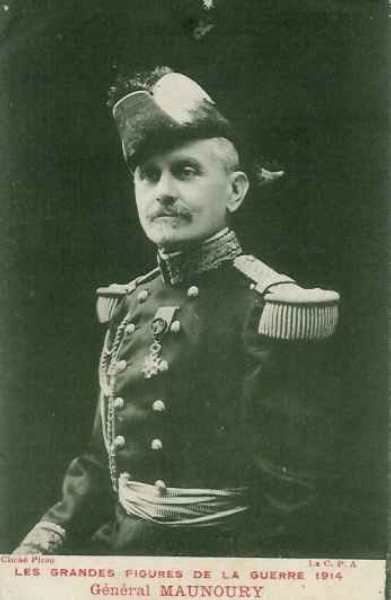
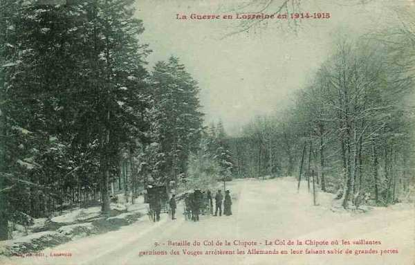
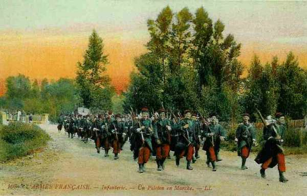
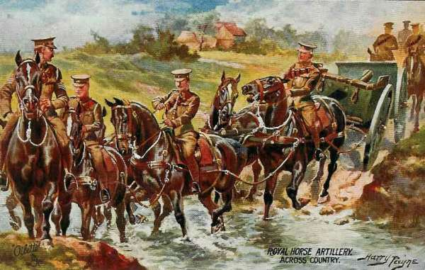
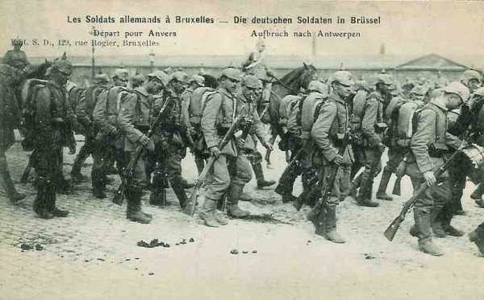
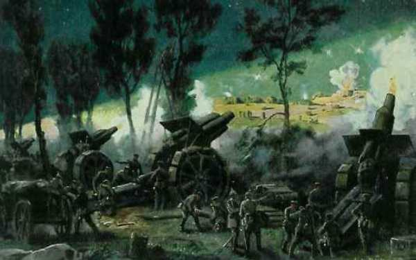
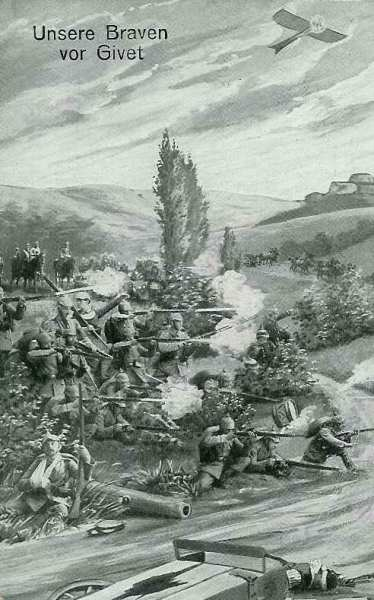

# Le 26 août 1914

Les armées alliées rétrogradent entre Verdun et la Somme, mais Joffre prépare une riposte en créant la VIe armée à l’extrême gauche de son dispositif. Les Anglais marquent un temps d’arrêt dans leur retraite en livrant la bataille du Cateau. La place de Longwy, ancienne forteresse, n’a pas pu résister au pilonnage de mortiers de gros calibre et doit se rendre.

### France

Pour élargir son ministère, Viviani remet sa démission au président de la République. Dans le nouveau cabinet entrent Aristide Briand (vice présidence du conseil et justice), Delcassé (affaires étrangères), Millerand (guerre), Ribot (finances), Sembat (travaux publics) et Jules Guesde.
Messimy, ancien ministre de la guerre, endosse l’uniforme de capitaine des chasseurs à pied.

Le président Poincaré nomme le général Galliéni gouverneur militaire de Paris, en remplacement du général Michel. Galliéni se met immédiatement au travail : il dispose de quatre divisions territoriales et d’une brigade : la 3e dans Paris, la 86e au nord, la 85e à l’est, la 89e au sud et la 185e brigade de territoriaux à l’ouest. Le gouverneur dispose en outre de la brigade de fusiliers marins Ronarch, forte de 5000 hommes.

### G.Q.G. français

- Les armées françaises et britanniques doivent rétrograder sur la ligne Verdun - Laon - La Fère - haute vallée de la Somme.

- A Saint Quentin, Joffre, French et Lanrezac se rencontrent pour essayer de coordonner leur action.

- Joffre dissout l’armée d’Alsace. Une partie demeure dans les Vosges et en Alsace, le reste est attribué à la VIe armée. Le transport d’une division du 7e C.A. et de trois divisions de réserve nécessite 160 trains, partis de la région de Belfort et dirigés sur Amiens.

- Joffre crée la VIe armée, à l’extrême gauche des armées alliées. Elle sera placée sous les ordres de Maunoury.

_Général Maunoury (VIe armée)_
_Collection privée_

### Armée d’Alsace

Après la dissolution de l’armée, la 41e division (7e C.A.) reste dans les Vosges autour de la Schlucht et une brigade de la 58e division vers Thann. Le groupement du général Bataille (divisions de réserve) reste aussi dans les Vosges.

### Ie armée française

Le 21e C.A. reprend l’offensive au sud-ouest de Baccarat, mais ne peut en déboucher. Les Allemands attaquent le col de la Chipote et les deux divisions du 21e C.A. reçoivent l’ordre de creuser des tranchées le long de la route de Bru à Saint-Benoît.

A 9h, l’attaque allemande commence dans la forêt de Sainte-Barbe. Elle progresse et menace de rendre le col de la Chipote intenable. Les Français déclenchent une contre-attaque, les Allemands reculent mais conservent des avant-postes sur le col de la Chipote.

_Col de la Chipote_
_Collection privée_

Devant le 14e C.A., les obus allemands commencent à tomber sur Saint-Dié.

### IIe armée française

La IIe armée française réussit à infliger un échec à la VIe armée allemande : la droite doit abandonner à nouveau Réméréville et Courbessaux. La rive gauche de la Mortagne est évacuée ; l’élan de la VIe armée allemande est brisé et la trouée de Charmes, menacée le 24, est dégagée.

### IIIe armée française

Elle passe la Meuse, poursuivie par l’armée du duc de Wurtemberg et celle du kronprinz impérial. La mission que Ruffey donne à son armée est de retarder les armées allemandes et de combiner ses efforts avec ceux de la IVe armée pour immobiliser l’adversaire sur la Meuse.

L’armée tient le front entre Dun-sur-Meuse et Verdun.

Trois lignes de défense sont organisées sur la rive gauche de la Meuse.

- Le 4e C.A. passe la Meuse au pont de Dun qu’il fait ensuite sauter.
  Le 5e C.A. s’établit de Brieulles à Malancourt.
  Une partie du 6e C.A. s’établit de Brieulles à Cumières.

Les autres éléments de ce C.A. continuent de tenir la rive droite de la Meuse afin de protéger Verdun et de couvrir la retraite.

- Le 4e C.A. garde le secteur entre Sassey et Cléry-le-Petit.
  Le 5e C.A. est entre Cléry et Brieulles.
  Le 6e C.A. est disposé entre Brieulles et Cumières en conservant la liaison avec la place de Verdun.

Le gouverneur de Verdun signale l’apparition à Ornes d’une avant-garde allemande et réclame l’appui de la IIIe armée, mais dès réception de l’ordre de retraite général du G.Q.G., l’armée va gagner l’Aisne par Buzancy et Le Chesne.

### IVe armée française

L’armée, talonnée par l’armée de von Hausen,  franchit la Meuse entre Mézières et Stenay et va s’établir sur la rive gauche du fleuve pour y résister en restant liée à gauche à la Ve armée : le font longe la Meuse entre Stenay et Mézières. La liaison avec la Ve armée a lieu à Rimogne.

- Le 2e C.A. défend le secteur entre Sassey et Stenay.
  Le corps colonial est entre Cesse et Pouilly.
  Le 12e C.A. est entre Beaumont et Villemontry.
  Le 17e C.A. tient le secteur de Mouzon à Remilly.
  Le 11e C.A. est entre Remilly et Mézières.

Langle de Cary prescrit à ses troupes de s’opposer énergiquement à toute tentative allemande en vue du passage de la Meuse.

Chaque C.A. opère la destruction des ponts dans son secteur. A l’ouest, le 9e C.A. se maintient au sud de Rocroi pour couvrir la direction de Signy-l’Abbaye et assurer, avec la 9e D.C., la liaison avec la Ve armée, vers Mézières (3e C.A.).

L’armée va border la Meuse de Sassey à Mézières, mais le recul de la Ve armée ouvre une brèche dans le front et les Allemands vont déboucher de Rocroi devant l’extrême gauche de la IVe armée.

Les Allemands jettent un pont devant le 17e C.A. mais un groupe les arrête dans leur tentative de déboucher de Remilly (ouest de Mézières).

De Langle décide de livrer à partir du 27 « la bataille décisive de la Meuse », mais il doit modifier son ordre car les Allemands ont forcé le passage de la Meuse à Donchéry (entre Mézières et Sedan). En effet, le pont de Donchéry n’avait pas été complètement détruit. Une brèche existe entre la IVe et la Ve armée, provoquant une menace vers Rocroi. Le 9e C.A., voyant s’approcher les colonnes de la IIIe armée allemande, est obligé de se rabattre vers le sud.

- Pour rester lié à la Ve armée,de Langle réalise un dispositif en équerre.
  Face à l’ouest, le 9e C.A., entre en liaison avec la Ve armée à Signy-l’Abbaye.
  Les C.A. de droite doivent attaquer vers Donchéry.

### Ve armée française

En flèche par rapport aux armées voisines, l’armée se replie et atteint l’Oise (gauche à Guise, droite à Aubenton) qu’elle traverse avant de gagner la ligne Laon - La Fère, selon l’instruction du 25 août. La IIe armée allemande est presque au contact.

_Peloton français_
_Collection privée_

### C.C Sordet

Selon les ordres du G.Q.G., le C.C. couvre la gauche de l’armée britannique

### Groupement d’Amade

L’artillerie allemande rend bientôt intenable la situation des territoriaux qui se replient sur Cambrai, puis sur Bapaume. Joffre donne l’ordre à d’Amade de replier les troupes et le matériel derrière la Somme.

### Armée anglaise : bataille du Cateau

Le 1e C.A. retraite vers l’Oise,  dans la direction du sud-ouest pour garder la liaison avec le 2e C.A. mais doit passer à l’est de la forêt de Mormal. Il marche par Loisy, Etreux

Le 2e C.A. et la 4e division arrivent dans la soirée du 25 à hauteur du Cateau sur la route de Cambrai. Smith Dorrien décide de rester sur place et d’affronter les poursuivants. Les Anglais creusent quelques tranchées et s’installent au sud de la route du Cateau à Cambrai.

Les Allemands jettent le gros de leurs forces sur la gauche de Smith Dorrien. Alors que French cherche à décrocher aussi vite que possible, Smith Dorrien veut éviter une retraite en plein jour devant un ennemi aux forces très supérieures.

Le 2e C.A. se laisse accrocher dans la région du Cateau à partir de 9h par 3 C.A. de l’armée de von Kluck (lutte de 1 contre 3). Smith Dorrien demande l’intervention du C.C. Sordet à sa gauche. Une brèche de 12 - 13 km s’est ouverte entre les 1e et 2e C.A. anglais. Allenby est prié de la combler avec sa cavalerie.

Un fait d’armes remarquable : dans une batterie qui a perdu tous ses officiers, un sous-officier et deux artilleurs, seuls survivants, continuent le feu sans s’émouvoir.

_Batterie anglaise_
_Collection privée_

La montée en ligne du C.C. Sordet empêche l’encerclement de l’aile gauche anglaise par l’ouest.

Le soir, le 2e C.A. est menacé d’enveloppement par les deux flancs et doit reprendre la retraite non sans avoir subi des pertes sérieuses : 8000 hommes et 38 canons.

Alarmé par les rapports des combats, French déplace son Q.G. à Noyon. Il croit que le B.E.F. a été anéanti. Il donne un ordre de retraite générale vers le sud. Le 2e C.A. s’abrite derrière le canal de Saint-Quentin puis derrière l’Oise.

- Le 1e C.A. se replie vers Origny-Sainte-Benoite sur l’Oise.
  Le 2e C.A. se replie sur Saint-Quentin.

### Armée belge de campagne

Les Allemands face à l’armée belge se renforcent : de grands rassemblements de troupes de toutes armes ont été signalés dans l’après-midi et la soirée du 25.

Dès la matinée, la sortie d’Anvers est poursuivie. Les Allemands ont profité de la nuit pour réoccuper le hameau de la station de Haacht et s’y défendre avec énergie, mais les Belges parviennent à les en chasser. Dès 4h, le commandant de la 2e division fait savoir que son intention est de partir du front station de Haacht - Wespelaar à l’attaque des ponts d’Over-de-Vaart et de Tildonk.

Vers 9h, la situation à la gauche de l’armée belge devient difficile : les deux bataillons de la 6e brigade qui étaient parvenus à 400 m de Tildonk se butent à la résistance allemande. La D.C. au sud-ouest de Werchter vient de battre en retraite vers Haacht, menacée par une colonne de deux régiments d’infanterie adverse, débouchant de Rotselaar sur Werchter, et d’une nouvelle colonne allant de Baal vers Tremelo.

Vers 11h, le recul de la 6e division et des nouvelles peu rassurantes décident le commandement de l’armée belge à donner l’ordre général de retraite vers le camp retranché.
L’équilibre des forces s’est modifié en la défaveur de l’armée belge suite aux importants débarquements de troupes allemandes à Louvain.

- la 1e division se retire vers Boom.
  la 5e division retraite vers le Rupel et passe la nuit à Puurs.
  la 6e division prend ses logements à Waelhem.
  la 2e division est à Putte.
  la 3e division reste à Duffel.
  la D.C. stationne à Kessel.

L’activité déployée les 25 et 26 par l’armée belge contribue à entretenir auprès du commandement allemand un sentiment d’insécurité au sujet des communications.

- Au moment de la sortie, les Allemands n’ont devant Anvers que :
  le 3e C.A.R.
  la 43e brigade du 4e C.A.R. (à Bruxelles).
  les 11e et 27e brigades de la Landwehr

- Au cours de la sortie d’Anvers, ils débarquent à Leuven :
  le 9e C.A.R.,  et qui restera en Belgique jusqu’au 16 décembre.
  la 26e brigade de la Landwehr.

En résumé, le 25, il y a 3 divisions allemandes devant Anvers et, le 26, 5 divisions et demi. Ces troupes sont soustraites à l’aile marchante et 150.000 hommes vont manquer à von Moltke lors de la bataille de la Marne.

_Soldats allemands se dirigeant vers Anvers_
_Collection privée_

La garnison de Namur qui a échappé à la capture est débarquée par la marine anglaise dans le port d’Ostende. Elle rejoindra le reste de l’armée dans la place d’Anvers.

_Débarquement des troupes belges_
_Collection privée_

### O.H.L. : Moltke se dégarnit de ses réserves

**[Lien vers progression des armées allemandes](../img/progression_armees_all2.jpg)**

**[Lien vers croquis](../img/progression_allemands.jpg)**

Moltke décide de renforcer l’armée du Kronprinz impérial de 6 divisions d’Ersatz, ses dernières réserves stratégiques, primitivement destinées à combattre en Belgique. Il affaiblit ainsi son aile marchante.

Il prélève en outre des troupes à envoyer vers le front de l’Est. Elles manqueront lors de la bataille de la Marne.

### Ie armée allemande : bataille du Cateau

Von Kluck persévère dans sa tentative d’accrocher l’armée anglaise. Le 4e C.A.R. est amené en première ligne entre les 2e et 4e par une marche forcée, et la masse des armées s’ébranle vers Cambrai - Le Cateau.

French avait donné ordre à son armée de se replier vers Saint-Quentin. Smith Dorrien (2e C.A.) préfère attendre les événements sur place en prenant position le long de la route Le Cateau - Cambrai. Les premières unités allemandes qui apparaissent sont le C.C. et 4e C.A. puis, les différents corps de l’armée de von Kluck attaquent le long de la ligne de défense et tentent de contourner la ligne anglaise.

Le 4e C.A. allemand aborde des forces anglaises importantes près de Caudry, Reumont. Le 4e C.A.R. doit diriger sur l’aile nord de la position anglaise une attaque enveloppante. Le 3e C.A. doit effectuer cette même attaque vers l’aile sud.

Le soir, le 4e C.A. parvient à refouler l’aile droite des Anglais. Ils se replient vers Cambrai.

- Le 2e C.A. repousse près de Cambrai de grandes forces de cavalerie française.
  Le C.C. von der Marwitz attaque les Anglais par Wambaix, Beauvois, Quiévy.
  Le 4e C.A. aborde les forces britanniques à Caudry, Troisvilles, Reumont.
  Le 4e C.A.R. amorce une attaque enveloppante sur l’aile nord.
  Le 3e C.A. amorce une attaque enveloppante sur l’aile sud.

Le soir, l’armée occupe la ligne Hermies - Marcoing - Landrecies, au sud de la route Cambrai - Le Cateau. Les Anglais ont dû reculer en plein jour et en combattant, mais ils n’ont pas été encerclés. Aucune victoire décisive n’est acquise par von Kluck.

La subordination de la Ie armée par rapport à la IIe, qui avait tant irrité  von Kluck, est levée.

Au lieu de courir sus à l’adversaire vaincu avec toutes ses forces par la voie la plus directe, c’est-à-dire Saint-Quentin - La Fère, von Kluck préfère reprendre sa manoeuvre enveloppante en s’étendant au sud-ouest vers Péronne. Il part de l’hypothèse (erronée) que les Anglais se replieront vers les ports de la Manche. Les Anglais bénéficient ainsi d’un certain répit.
Le Q.G. reste à Solesmes.

Des fractions de l’armée d’Amade sont battues et le 2e C.A. repousse à Guyencourt le 3e D.C. française.

Von Kluck oriente encore davantage son armée vers l’ouest. Sa gauche se dirige vers Vermand.

### IIe armée allemande

Devant la IIe armée, les forces françaises se retirent de Landrecies - Avesnes vers Guise - Vervins.

L’investissement complet de Maubeuge par la 2e division de la IIe armée et la 1e division de la Ie armée commence.

### IIIe armée allemande

Elle arrive à  Mariembourg, Gonrieux. Ses avant-gardes au sud de Rocroi sont en contact avec des avant-postes du 9e C.A. allemand dans la vallée de la Sormonne. Conformément aux instructions, von Hausen détache une division du 12e C.A.R. pour investir Givet, ce qui affaiblit son armée.

_Siège de Givet_
_Collection privée_

_Infanterie allemande devant Givet_
_Collection privée_

### IVe armée allemande

L’armée aborde la Meuse en aval de Stenay jusqu’au-delà de Sedan et force le passage d’abord à Donchéry puis en plusieurs autres points. Elle est contre-attaquée par la IVe armée française au sud de Sedan. Pendant plusieurs jours, son aile droite est immobilisée et son aile gauche doit être rappelée en arrière.

Le duc de Wurtemberg demande un appui de la part de la Ve armée et le C.C. est envoyé vers Stenay en renfort.

### Ve armée allemande

Elle atteint Pont-à-Mousson et le nord de Verdun et se trouve sur la ligne Witarville - Mangiennes - Spincourt - Landres.

Le Ve  C.A. est retiré de l’armée pour être envoyé sur le front de l’est.

La place de Longwy, érigée en fort d’arrêt, a été écrasée par l’artillerie lourde allemande. Elle doit se rendre. Le lieutenant-Colonel Darche fait hisser le drapeau blanc et les 3.700 hommes de la garnison se rendent sans conditions. Il n’a pas été nécessaire de donner l’assaut, le bombardement d’artillerie lourde a suffi à détruire toute résistance.

L’armée doit gagner la Meuse le 29 août mais les ponts sur la Meuse ont été détruits sur tout le front de la Ve armée.

Voici les objectifs des C.A. allemands.

- 13e C.A. : vers Sassey - Don par Louppy.
  6e C.A. : en réserve sur Liny - Velosnes.
  16e C.A. sur Sivry - Consenvoye par Damvillers.
  5e C.A.R. : nord et ouest de Verdun avec la réserve générale de Metz.

La ville fortifiée de Montmédy doit être enlevée et deux brigades de la Landwehr, des pionniers et de l’artillerie (dont des mortiers de 30 cm) doivent remplir cette mission.

### VIe et VIIe armées allemandes

L’attaque de Rupprecht de Bavière échoue. Les Bavarois sont gênés par la résistance du fort de Manonviller. Ils reculent de plusieurs km au nord de la Mortagne et sont définitivement bloqués devant Nancy et la Meurthe.

[Lien vers la journée suivante](article_04_45.md)