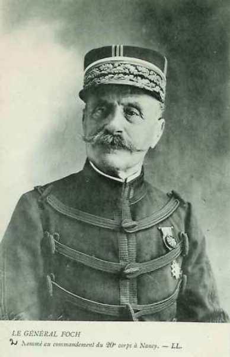
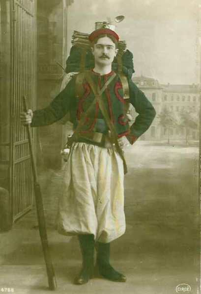
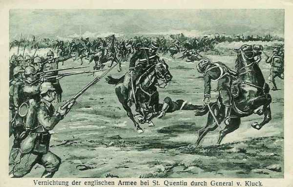
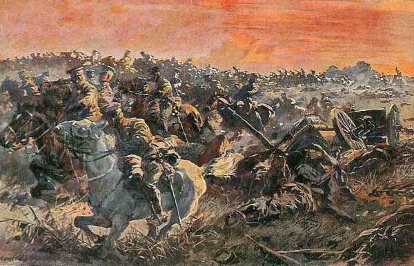
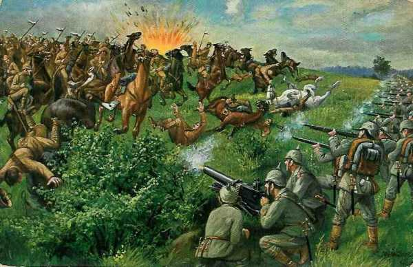
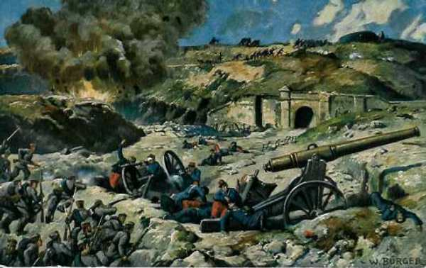

# Le 27 août 1914

Joffre décide de contre-attaquer pour ralentir la retraite et soulager l’armée anglaise : c’est la bataille de Guise - Saint-Quentin. Les Allemands réussissent à franchir la Meuse. Pour combler le vide entre les Ve et IVe armées, Joffre crée la IXe armée sous le commandement de Foch. Moltke donne l’ordre de marcher sur Paris.

### G.Q.G. français

- Alexandre Millerand, qui remplace Messimy au portefeuille de la guerre, rend visite au général Joffre.

- Joffre prend la décision de faire contre-attaquer la Ve armée pour rendre confiance aux Anglais et ralentir l’armée de von Kluck. Il ordonne à Lanrezac de porter l’aile gauche de la 5e armée le 28 entre l’Oise et Saint Quentin pour attaquer la Ie armée. Il prescrit au Général d’Amade de porter les 61 et 62e divisions de réserve d’Arras à Péronne.

- Les 55e et 56e divisions de réserve s’embarquent à Saint-Mihiel pour rejoindre Montdidier.
    La 63e divisionde réserve s’embarque de Belfort pour Amiens.

- Il y a un vide de 20 km dans le dispositif français entre les IVe et Ve armées. Joffre nomme Foch chef d’un nouveau groupement à insérer entre les IVe et Ve armées, qui deviendra la IXe armée.

_Général Foch (IXe armée)_
_Collection privée_

### Ie armée française

L’armée allemande dessine un mouvement débordant à l’est du col de la Chipote et vers 15h30, elle réussit à reprendre le col. Un bataillon du 6e colonial passe à la contre-attaque, mais le risque est réel que les Allemands forcent le passage de Raon-l’Etape sur Rambervillers.

Dubail a donné l’ordre au 13e C.A. de reprendre l’offensive pour regagner le terrain perdu. Dès que le brouillard se dissipe, les Français ouvrent le feu sur les hauteurs à l’est de la Mortagne, puis l’infanterie se met en mouvement. Les Allemands contre-attaquent et l’infanterie du 13e C.A. perd la crête.

Le 8e C.A. doit poursuivre son offensive. La 16e division (Maud’huy) doit s’établir sur la rive ouest de la Mortagne.

### IIe armée française

Voici la position des différents C.A. :

- 16e : le long de la Mortagne, à hauteur de Xermaménil.
    15e : vers Mont-sur-Meurthe.
    20e : au nord de la Meurthe : Rosières-aux-Salines - Dombasle - Buissoncourt.
    9e C.A. : Courbessaux - Réméréville.

### IIIe armée française

On signale sur le front de l’armée la présence du 16e C.A. allemand dans la région de Spincourt et celle de la 33e division vers Réchicourt et Ollières.

### IVe armée française

Des combats très violents sont livrés sur le front de l’armée sur une longueur de 50 km, jusqu’à Signy-l’Abbaye contre l’armée de von Hausen.

Le 2e C.A. doit défendre les passages de la Meuse de Sassey à Luzy mais la rive est de la Meuse domine et offre des positions favorables pour l’artillerie allemande.

Les Allemands ont jeté des ponts de Cesse à Luzy et un tir d’artillerie français est effectué, coupant ces ponts. Vers Stenay, une brigade allemande essaie de passer la Meuse mais est rejetée par l’infanterie française à Luzy et Cesse. Les Allemands se replient sur la Meuse.

Le corps colonial tient avec une division le front Luzy - Pouilly.

A la tombée de la nuit, l’armée du duc de Wurtemberg n’a pu faire aucun progrès sérieux sur la rive gauche de la Meuse. Un drapeau allemand a été pris par le 137e R.I. (11e C.A.) dans les bois de Bulson.

_Fantassin colonial_
_Collection privée_

Devant le 12e C.A., les Allemands ont passé la Meuse à Remilly et Villers-devant-Mouzon et s’efforcent de déboucher vers le sud, menaçant de couper le 12e C.A. du 17e.

Devant le 11e C.A. (général Eydoux), les Allemands ont réussi à franchir la Meuse sur des ponts jetés à Villers-devant-Mouzon et Martincourt. Ils passent à l’attaque mais leurs assauts sont brisés par les fantassins de la 21e division.

A 18h30, de Langle de Cary reçoit l’ordre du G.Q.G. de reporter son armée sur la ligne de l’Aisne pour se conformer au plan de retrait stratégique de l’ensemble des armées françaises.

- Le 2e C.A. doit rejoindre la région de Monthois en abandonnant sans combat la ligne de la Meuse.
    Le 12e C.A. doit se retirer à Vouziers.
    Le 17e à Chuffily.
    Le 11e à Attigny.
    Le 9e vers Rethel, Château-Porcien.

Le mouvement commence la nuit même. Le 9e C.A. couvre la retraite en se maintenant autour de Launois et Poix-Terron.

### Ve armée française : bataille de Guise - Saint-Quentin

Le soir du 27, la Ve armée se trouve toujours en flèche, menacée sur ses deux flancs (Guise - Aubenton). Lanrezac envisage l’éventualité d’une retraite sur Laon pour le 28 quand le colonel Alexandre, du G.Q.G., vient lui porter l’ordre de prendre l’offensive sur Saint-Quentin.

Le but est de dégager l’armée anglaise et de permettre à la VIe armée d’entrer en ligne.

L’armée fait face au nord et on lui demande d’attaquer vers l’ouest. Elle risque donc d’être assaillie de flanc lors de son mouvement par les colonnes allemandes déjà signalées au nord de l’Oise.

Lanrezac entre dans une violente colère et critique Joffre. C’est le premier pas vers son limogeage.

Lanrezac réunit les commandants de C.A. et prépare la contre-attaque avec les 3e et 18e corps + la division d’Afrique en direction de Saint-Quentin. Le groupe Valabrègue se portera le 28 vers La Fère par la rive gauche de l’Oise. La réalisation du dispositif d’attaque va maintenir la Ve armée sur l’Oise pendant toute la journée.

Lanrezac ne peut compter sur le concours de l’armée anglaise sur sa gauche, mais, sur sa droite, la IVe armée résiste aux assauts furieux de l’armée de von Hausen, dans la région de Signy-l’Abbaye. La IVe armée a toutefois devant elle des forces si considérables que son recul prochain est prévisible.

### VIe armée française

Elle se constitue dans la région d’Amiens et est composée du 7e C.A. (provenant d’Alsace), des 55, 56, 61 et 62e divisions de réserve plus la brigade marocaine Ditte. Les 61e et 62e divisions de réserve, amenées de Paris, débarquent dans la région d’Amiens. Ce sera la masse de manoeuvre avec laquelle Joffre essaiera à son tour d’envelopper l’armée allemande.

Maunoury prend le commandement de la VIe armée. Il reçoit l’ordre du G.Q.G. de disposer ses forces de manière à pouvoir agir offensivement sur l’aile droite allemande. Les premiers contingents se dirigent vers la région de la Somme et entrent en contact avec des éléments de la Ie armée allemande près de Péronne.

### Groupement Foch

Il se constitue du 9e et 11e corps d’armée, enlevés à la IVe armée, des 52e et 60e divisions de réserve et de la 9e D.C. + la 42e division prélevée sur la IIIe armée. Son objectif est de s’opposer aux forces allemandes qui ont débouché de Rocroi puis de manoeuvrer en retraite vers le confluent de l’Aisne et de la Suippe.

### C.C. Sordet

Le C.C. traverse la Somme. Il cantonne ensuite à l’ouest de la rivière mais est soumis au feu de l’artillerie lourde allemande tirant à grande distance. Trois bataillons de chasseurs gardent les ponts de Brie et de Saint-Christ.

### Armée anglaise

Trois bataillons des fusiliers marins britanniques débarquent à Ostende pour venir prêter main forte à l’armée belge.

French donne l’ordre de retraite au B.E.F., loin de toute zone de combats sans en avertir le secrétaire d’Etat à la guerre, Kitchener. Il refuse de s’arrêter sur la Somme et ne veut même pas s’engager à défendre la ligne de l’Oise. Joffre craint qu’il n’abandonne la lutte.

Au soir, l’armée s’est déjà repliée sur l’Oise, entre La Fère et Chauny.

- La 3e division se met en marche sur Ham, est attaquée par la cavalerie de von der Marwitz et rallie le 2e C.A. tard dans la nuit.

- La 5e division marche droit sur Noyon et bivouaque au sud de l’Oise.

- Au départ, la 1e division qui forme l’arrière-garde s’attarde sur la position au nord d’Etreux et se fait accrocher par la cavalerie allemande mais est dégagée par le 15e hussards. Le soir, la division bivouaque à Hauteville et la 2e à Mont d’Origny.

_Combat de l’armée anglaise près de Saint-Quentin_
_Collection privée_

_Combat de l’armée anglaise près de Saint-Quentin_
_Collection privée_

_Combat de l’armée anglaise près de Saint-Quentin_
_Collection privée_

Haig informe Lanrezac que le gros de l’armée anglaise est dans l’impossibilité de participer à l’attaque de Saint-Quentin. Les divisions Valabrègue remplaceront de leur mieux l’armée de French.

### Armée belge

Jusqu’au 8 septembre, l’armée va se tenir sur la défensive.
Un ordre du 27 place toutes les division en ligne dans les 3e et 4e secteurs. Le 3e secteur étant considéré comme le plus important, le commandement y place trois division (2e, 3e et 6e) et en met deux en place dans le 4e (1e et 5e).

_Les forts d’Anvers_
_L’action de l’armée belge_

Comme il est vital de maintenir libres les communications avec la côte, un détachement de 3500 hommes d’infanterie, deux escadrons et une batterie d’obusiers de 95, un groupe de batteries de 75, prolonge la ligne de défense du 4e secteur par l’occupation de Dendermonde.

### O.H.L.

**[Lien vers progression des armées allemandes](../img/progression_armees_all2.jpg)**

**[Lien vers croquis](../img/progression_allemands.jpg)**

Un communiqué officiel décrit les armées alliées comme en pleine retraite et incapables de contenir l’avance allemande.
Moltke donne ses ordres le soir : marcher sur Paris.

- La Ie armée marchera à l’ouest de l’Oise vers le cours inférieur de la Seine. Elle devra assurer la protection de l’ensemble de la ligne allemande.

- La IIe armée fera route vers Paris par La Fère et Laon. Elle est chargée d’investir Maubeuge, La Fère et Laon, cette dernière place de concert avec la IIIe armée.

- La IIIe armée poursuivra sa marche sur la ligne Laon - Guignicourt vers Château-Thierry. Elle doit s’emparer de Hirson, de Laon et du fort de Condé, de concert avec la IIe armée.

- La IVe armée se dirigera vers Reims via Epernay. Le matériel nécessaire à la prise de Reims sera mis en temps utile à la disposition de l’armée.

- La Ve armée fera mouvement vers Châlons-sur-Marne - Vitry-le-François. Elle s’échelonnera en arrière et à gauche du dispositif général jusqu’au moment où la VIe armée, parvenue à l’est de la Meuse, pourra s’en charger. Elle investira Verdun.

- Les VIe et VIIe armées doivent empêcher l’irruption des Français en Lorraine et basse Alsace tout en conservant le contact avec Metz. La place de Metz est mise sous le commandement de la VIe armée. Si les Français se retirent, la VIe armée franchira avec le 3e C.C. la Moselle entre Toul et Epinal, dans la direction générale de Neufchâteau.

- La VIIe armée reste provisoirement subordonnée à la VIe. Si cette dernière franchit la Moselle, elle redeviendra indépendante. La forteresse de Strasbourg reste sous ses ordres.

Moltke prévoit la possibilité d’aller plutôt vers le sud que vers le sud-ouest si les armées se heurtent à une résistance sérieuse sur l’Aisne et ensuite sur la Marne.

Cette dernière phrase affaiblit l’idée première et peut jeter le trouble dans l’esprit des exécutants. Moltke ne donne pas l’impression de reprendre fermement en main la conduite des opérations qu’il a volontairement abandonnée à la veille de la bataille de Belgique.

Le mouvement de la Ie armée vers la Basse Seine est un souvenir des projets de Schlieffen. Comme l’enveloppement de l’aile gauche des armées alliées n’a pas eu lieu, Moltke essaie de réparer l’erreur. Or, sa masse de manoeuvre est de cinq C.A. (au lieu des sept prévus par Schlieffen). Schlieffen avait en outre prévu de masquer Paris avec des unités d’Ersatz. Or, ces unités sont soit à la frontière russe ou en Alsace-Lorraine et l’aile droite a été affaiblie par le prélèvement du C.A.R. de la Garde et du 11e C.A.

Suite aux transferts de C.A. vers l’est et aux sièges à effectuer, les armées du front ouest perdent 10 divisions :

- Ie armée : 3e C.A.R. devant Anvers et une brigade du 4e C.A.R. à Bruxelles.

- IIe armée : 7e C.A.R. devant Maubeuge, une division Du 7e C.A. envoyé en Prusse orientale, de même que le C.A.R. de la Garde.

- IIIe armée : 11e C.A. envoyé en Prusse orientale, une division du 12e C.A.R. est devant Givet. On se demande si une division était nécessaire pour assiéger une ancienne citadelle de Vauban comme à Givet.

L’aile droite de l’armée allemande est diminuée de un cinquième.

### Ie armée allemande

La droite arrive vers Combles, à l’est de Péronnes, la gauche vers Bohain (20 km au nord-est de Saint Quentin). L’armée s’empare des passages de la Somme près de Péronnes. Elle n’a plus en face d’elle que les 61e et 62e divisions de réserve et le corps de cavalerie Sordet. Elle repousse des fractions de l’armée d’Amade vers Amiens.

Le soir, la position des différents C.A. passe par la ligne Sallisel -Bohain.

Le C.C. von der Marwitz a traversé la Somme et explore vers l’Oise et Amiens.

La Q.G. déménage de Solesmes vers Villers-Faucon.

Pour le lendemain, l’armée a pour objectif la ligne Combles - Péronne- Brie-le-Verguier.

### IIe armée allemande

L’armée continue la poursuite des Français en espérant les déborder par la droite.

- La Ie armée par Cambrai - le Cateau.
    La IIe armée par Landrecies - Ohain.

Les C.A. s’échelonnent de Saint-Soupplets à La Capelle.

Le Q.G. de l’armée s’installe à Avesnes.

### IIIe armée allemande : combat de Signy-l’Abbaye

A débouché du massif occidental de l’Ardenne. Elle se laisse dévier vers le sud-est suite aux appels du Duc de Wurtemberg. Avec les 12e et 19e C.A., elle butte contre l’extrême gauche de l’armée de Langle de Carry qui l’arrête net lors des combats de Signy-l’Abbaye.

### IVe armée allemande

Suite à une attaque menée par le IIIe armée française, le duc de Wurtemberg réclame une intervention de la part de la IIIe armée (von Hausen).

### Ve armée allemande

Le 6e C.A.R. et le 16e C.A. doivent forcer le passage de la Meuse et se porter vers Cunel - Nantillois (6e C.A.) et vers Dannevoux - Gercourt (16e).

### VIe armée allemande

Les Allemands se retranchent fortement à la lisière ouest de Lunéville, au nord-est de Friscati et s’emparent de Saint-Dié.

### VIIe armée allemande

Réussit à s’emparer du fort de Manonviller.

Le fort a été construit à +- 10 km à l’est de Lunéville pour contrôler la ligne de chemin de fer Nancy - Avricourt, la route de Paris à Strasbourg et la vallée de la Vezouse. Il a fait l’objet d’une réfection récente et comporte une garnison de +- 900 hommes.

Le fort a été bombardé du 23 au 27 août par des pièces lourdes. Il a reçu 134 coups de 305 et 159 coups de 420 ainsi que 1195 coups de 210. A ce moment, une seule tourelle de 57 mm est encore en service. Le fort n’aurait probablement pas pu s’opposer à un assaut. Une partie de la garnison a été victime d’un début d’asphyxie car les gros projectiles dégagent de l’oxyde de carbone.

Après une attaque de 48 heures, le commandant fait hisser le drapeau blanc et le fort capitule avec les honneurs de la guerre.

_Prise du fort de Manonviller_
_Collection privée_

Montmédy, ancienne place forte avec des remparts datant de l’époque de Vauban, est abandonnée par sa garnison.

[Lien vers la journée suivante](article_04_46.md)
