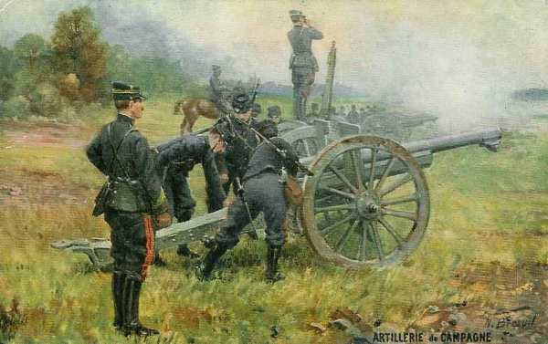
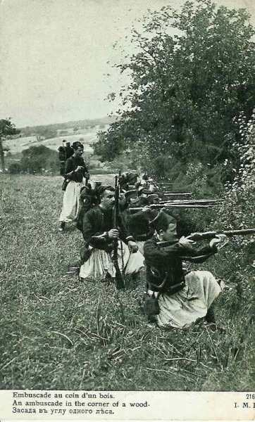
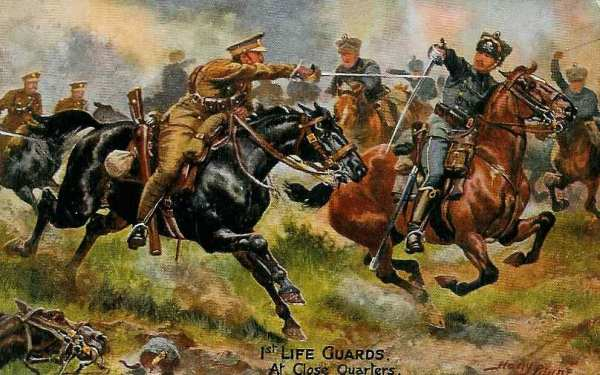
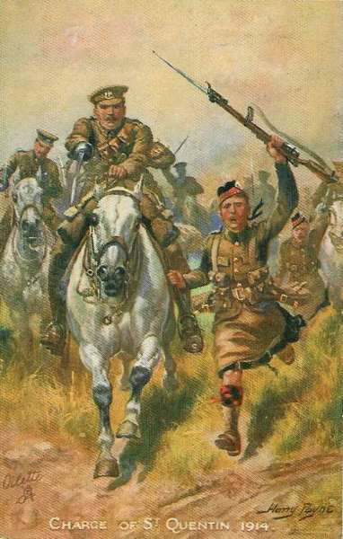
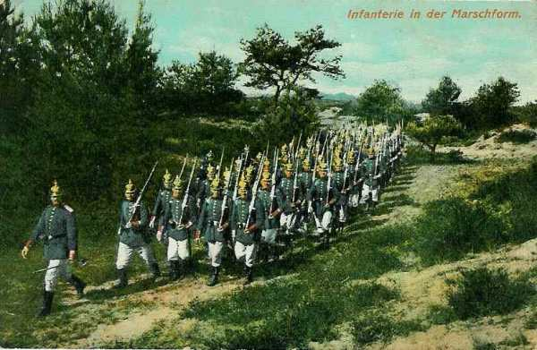

# Le 28 août 1914

L’armée de Langle de Cary, talonnée par celle de von Hausen, livre le combat de Signy-l’Abbaye, et l’offensive allemande marque un temps d’arrêt tandis que l’armée de von Kluck atteint l’importante coupure de la Somme.

### G.Q.G. français

Joffre s’est enfin rendu compte de la faiblesse de son aile gauche. Le seul salut consiste à renforcer cette aile par des troupes prises à la droite, mais il doit pour cela effectuer un large repli tout en conservant la liaison des armées entre elles, la IIIe armée restant appuyée à Verdun, devenu le pivot de la manœuvre. L’ensemble du dispositif se déplace vers le sud.

Gallieni reçoit les pleins pouvoirs à Paris pour mettre la ville en état de défense. Il entame une série de travaux de fortifications.

Joffre se rend à Amiens auprès de French pour essayer de le persuader de rester dans la ligne des armées françaises. French ne veut rien entendre. Il est donc impossible de stabiliser le front et Joffre doit ordonner une nouvelle retraite.

Afin de redonner confiance aux Britanniques, isolés et fortement éprouvés, Joffre donne l’ordre à la Ve armée d’exécuter une offensive vers l’ouest au-delà de l’Oise sur Saint-Quentin. Cette offensive nécessite un changement de front car la Ve armée fait face au nord. L’attaque ne peut dès lors commencer que le 29. Il faut toutefois que le flanc de l’attaque soit couvert vers le nord par des éléments maintenus dans la région de Guise.

### Armée d’Alsace

Joffre annonce sa décision de dissoudre l’armée d’Alsace. Son existence a duré trois semaines. L’offensive d’Alsace a été un succès éphémère suivi d’un échec.

### Ie armée française

Le 21e C.A. reprend l’offensive vers le nord-est, la 46e division marche sur Sainte-barbe, la 26e brigade et la 2e brigade coloniale vers le col de la Chipote. Les Allemands déclenchent un feu d’artillerie lourde vers Saint-Benoît, mais la 2e brigade coloniale s’empare néanmoins du col de la Chipote. Par la suite, les Allemands débordent Saint-Benoît et s’emparent à nouveau de ce col. Le soir, le 21e C.A. est au nord-est de Rambervillers.

Le 8e C.A. doit attaquer dans la direction de Magnières, Valois mais ne peut franchir la Mortagne. A 14h, fortement pressé, il demande le concours de l’armée.

Malgré la réussite de cette offensive, la menace allemande sur Rambervillers n’est pas écartée.

### IIe armée française

- Castelnau prescrit un effort général pour atteindre la Meurthe.
  Le 16e C.A. doit opérer une attaque générale sur le front Gerbéviller - Xermaménil. Il reprend Gerbéviller, prend pied sur la rive est de la Mortagne et s’y maintient sous un feu violent d’artillerie, mais les Allemands ont creusé trois lignes de tranchées parallèles à la Mortagne entre Gerbéviller et Moyen et les Français ne parviennent pas à les en déloger. De même, Gerbéviller est défendu par une artillerie lourde dissimulée vers Fraimbois. Il est impossible de la repérer faute d’aéroplanes. Vers 17h ; le 222e se trouve à 1.500 m en amont de Gerbéviller, dans des tranchées faisant face à celles des Allemands.

- Au 15e C.A., l’avant-garde de la 30e division entre dans Rehainviller.

- Le 20e C.A. à droite a pour mission de déboucher sur Lunéville par les hauteurs de Friscati. Il attaque vers midi.

### IIIe armée française

D’importantes colonnes d’infanterie et d’artillerie, précédées de cavalerie, sont signalées sur les routes de Billy-sous-Mangiennes à Damvillers et de Pilon à Mangiennes.

Vers 17h, les Allemands prennent l’offensive sur la route au sud de Beaufort mais l’artillerie française ouvre un feu violent à 1.200 mètres, qui décime les colonnes allemandes. Ruffey songe à contre-attaquer pour rejeter les Allemands sur la rive droite de la Meuse.

_Batterie de 75_
_Collection privée_

### IVe armée française : combat de Signy-l’Abbaye

Vers midi, des colonnes allemandes sont signalées vers Raucourt et l’armée allemande dispose d’une forte artillerie lourde. Vers midi, elle déclenche entre Raucourt et Villers-devant-Raucourt un formidable barrage de 105 et de 150. Vers 13h30, les éléments du 17e C.A. se replient vers Bulson. A 15h30, de Langle de Cary passe au P.C. de Eydoux et lui donne l’ordre d’attaquer vers Bulson. L’artillerie ouvre un feu violent sur les tranchées allemandes du bois de la Marfée - Noyers. Les Français s’emparent du bois de la Marfée et Noyers est enlevé.

En raison de l’apparition de forces allemandes dans la région de Rocroi - Givet, le 9e C.A. est poussé au sud-ouest de Mézières. Il doit couvrir la IVe armée dans le couloir resserré entre la région boisée de Froidmont et les forêts de Signy-l’Abbaye.

_Zouaves en embuscade_
_Collection privée_

Dès 3h du matin, les avant-gardes de la IIIe armée allemande attaquent, à Bel-Air et à Falluel, les deux  compagnies de zouaves qui forment la tête de la division marocaine. L’infanterie allemande menace de tourner les zouaves et les deux compagnies se replient lentement vers le gros de la brigade, entre Dommery et Signy-l’Abbaye.

Le commandant du 9e C.A. (général Dubois), craignant de voir l’adversaire s’emparer de la route de Signy-l’Abbaye à Rethel, décide de prononcer dans cette direction une vigoureuse offensive. Sur tout le front, la bataille fait rage. La division marocaine (général Humbert), appuyée par la 9e D.C., lutte toute la journée avec énergie. Dommery est pris et repris. Les Allemands criblent d’obus de gros calibre les alentours du village de Dommery. A la tombée du jour, les zouaves refoulent les Allemands dans la forêt de Signy-l’Abbaye. Vers l’est, une autre brigade marocaine se rue sur Fosse-à-l’Eau et sur Mesancelles. Après une lutte acharnée, elle reste maîtresse du terrain. La division marocaine perd 3.000 hommes, mais elle a tenu tête à l’armée de von Hausen.

Dans le secteur de Sedan, toutes les troupes françaises du 11e C.A. se portent résolument à l’attaque. Le bois de la Marfée (près de Sedan) est complètement dégagé, Noyers est enlevé.

L’ordre de retraite parvient à l’armée dans la soirée. La résistance opiniâtre de Langle de Cary sur la Meuse facilite le repli général.

### Ve armée française

Joffre se rend en personne au Q.G. de Lanrezac à Marle. Une violente dispute éclate entre les deux généraux. Joffre surveille que Lanrezac donne bien les ordres d’attaque vers Saint-Quentin.

### VIe armée française

Sur le plateau du Santerre, les avant-postes de l’armée Maunoury sont assaillis par l’armée de von Kluck au sud de la Somme, entre Bray et Ham. L’armée doit se replier derrière l’Avre.

### Groupement Foch : combat de Signy-l’Abbaye.

Le groupement livre le combat de Signy l’Abbaye avec la IVe armée contre la IIIe armée allemande (von Hausen).

### C.C. Sordet

Le C.C. doit retraiter et bivouaquer à l’ouest de la route de Péronne à Roye.

### Armée anglaise

Le 1e C.A. se remet en marche, couvert par une flanc-garde vers l’ouest. La 1e division forme l’arrière-garde. La retraite est serrée de près par le C.C. von Richthofen, descendant de Maroilles et d’Avesnes. Deux colonnes anglaises se heurtent aux 3e et 5e brigades de uhlans de la Garde, vers Golancourt. Un combat de cavalerie a lieu entre le 1e lanciers britannique et les uhlans à Cerisy, à mi-chemin entre Saint-Quentin et La Fère.

_Un des derniers combats de cavalerie_
_Collection privée_

Le 2e C.A. britannique atteint la Somme, après une retraite de 70 km en un jour et demi.

_Charge près de Saint-Quentin_
_Collection privée_

Haig est prêt à appuyer l’offensive prévue de la Ve armée mais French s’y oppose. L’attaque sera à charge uniquement de la Ve armée. Lanrezac est indigné que l’armée anglaise ne participe pas à cette attaque.

En fin de soirée, les troupes anglaises s’arrêtent sur la ligne Noyon - Chauny - La Fère.

Joffre se rend au château de Compiègne, nouveau siège de l’Etat-Major de l’armée anglaise et une conférence a lieu avec French, Haig, Smith Dorrien et Allenby. Il est signifié à Joffre que l’armée anglaise restera à une étape en arrière de la gauche française.

### O.H.L.

**[Lien vers progression des armées allemandes](../img/progression_armees_all2.jpg)**

**[Lien vers croquis](../img/progression_allemands.jpg)**

Le souci de von Moltke est d’éloigner les Français de Paris et de les encercler. Les Ie et IIe armées doivent opérer un mouvement de conversion sur l’Oise.

La IIe armée doit obtenir la reddition de Maubeuge puis de La Fère en collaboration avec la IIIe armée.

L’O.H.L. déménage de Coblence à Luxembourg.

La Ie armée doit marcher vers la basse Seine, la IIe armée doit s’avancer au-delà de la ligne La Fère - Laon sur Paris. La marche de la Ie armée est donc infléchie vers le sud-ouest.

Un écart se creuse entre les IIe et IIIe armées. La première marche vers le sud-ouest et l’autre vers le sud. La masse principale allemande est complètement désarticulée.

A gauche, les IVe et Ve armées sont aux prises avec les Français sur la Meuse. A droite, les Ie et IIe armées marchent depuis trois jours vers le sud-ouest. La IIIe armée doit également dévier vers le sud-ouest, mais elle subit de pressants appels de la IVe, pour s’orienter vers le sud-est.

Le soir, les armées reçoivent des instructions de l’O.H.L.

- La Ie armée avec le 2e C.C. doit faire mouvement à l’ouest de l’Oise vers la basse Seine.

- La IIe armée doit se diriger vers la ligne La Fère - Laon sur Paris. Maubeuge, La Fère et Laon doivent être réduits.

_Infanterie allemande (uniformes bleus)_
_Collection privée_

### Ie armée allemande : atteint la Somme

Von Kluck décide dans l’après-midi de reprendre le 29 la poursuite du corps expéditionnaire britannique dont il a perdu le contact depuis la bataille du Cateau et qui semble s’être retiré derrière l’Oise, dans la région de La Fère. Il se propose de le tourner par le sud en abordant l’Oise entre Noyon et Compiègne.

Par un ordre daté de Solesmes à 8h du soir, von Kluck assigne les points de passage de la Somme à ses différents corps d’armée dans les environs de Péronne.

La VIe armée française essaie de s’opposer au passage de la rivière, mais elle est défaite à Manancourt. Les 2e et 4e C.A.R. repoussent l’armée française à Sailly-Sallisel et à Morval.

Le 3e C.A. repousse également plusieurs bataillons venant de Saint-Quentin.

Le soir, la rive gauche de la Somme est aux mains des Allemands, de Feuillières à Saint-Christ.

Le Q.G. de l’armée se transporte à Péronnes. L’empereur envoie ses félicitations à von Kluck.

### IIe armée allemande

L’armée reçoit pour mission de franchir la ligne La Fère - Laon et de se porter sur Paris. Sa direction continue à s’infléchir vers le sud-ouest et s’écarte de la IIIe, qui fait mouvement vers le sud.

Von Bülow veut laisser reposer son armée une journée mais, apprenant que l’armée de von Kluck continue sa marche, il fait avancer sa droite (7e C.A. et 10e C.A.R.) vers Saint-Quentin pour conserver la liaison. Il se rend maître de cette ville et entreprend le passage de l’Oise à Guise. Les ponts de Guise et de Flavigny sont enlevés dans la soirée.

### IIIe armée allemande : combat de Signy- l’Abbaye

L’armée de von Hausen avance vers Rethel sur l’Aisne. Le général veut tenter la rupture du front français entre les Ve et IVe armées. Un violent combat a lieu à Signy-l’Abbaye et Thin-le-Moutier contre le 9e C.A. français.

L’armée reçoit comme directives générales de von Moltke, de marcher sur Château-Thierry, et s’ébranle vers le sud-ouest (Rumigny - Liart - Signy-l’Abbaye - Launois). Elle fait face à une brèche entre les IVe et Ve armées françaises, mais suite à un appel du duc de Wurtemberg, von Hausen oriente les 12e et 19e C.A. vers le sud-est, ce qui empêche d’exploiter cette brèche.

### IV armée allemande

Le duc de Wurtemberg réitère ses appels de la veille à von Hausen. La IVe armée passe la Meuse. Elle doit marcher vers Epernay via Reims. Comme les Français se retirent, le duc de Wurtemberg fait dire à von Hausen qu’il n’a plus besoin de lui.

### Ve armée allemande

L’armée doit pousser vers Châlons et Vitry-le-François et investir Verdun.

### VIe et VIIe armées allemandes

Ces armées reçoivent un rôle défensif : s’opposer à une irruption des Français en Lorraine.

[Lien vers la journée suivante](article_04_47.md)