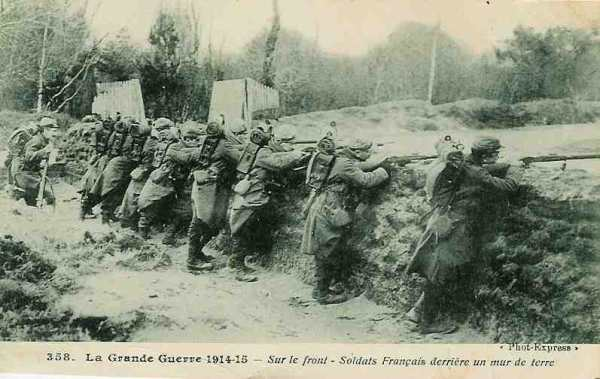
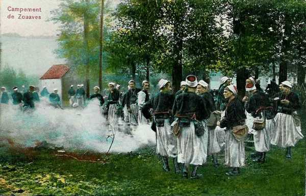
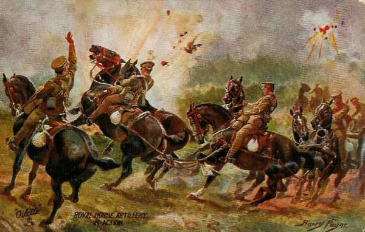
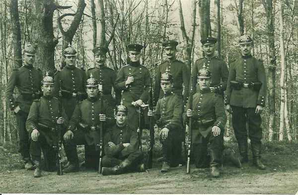

# Le 29 août 1914

Joffre indique la direction de retraite des armées. Celle de Lanrezac livre contre la IIe armée allemande la bataille de Guise - Saint-Quentin mais doit ensuite poursuivre la retraite pour ne pas se trouver en flèche par rapport à ses voisines. Moltke donne ordre à ses armées d’infléchir la marche vers le sud.

### G.Q.G. français

La direction de recul des armées est fixée :

- VIe armée vers le camp retranché de Paris.
  Ve armée sur l’Aisne (en amont de Soissons).
  Armée anglaise derrière la Marne en aval de Meaux.
  Groupe d’Amade dans la région de Rouen.
  IVe armée vers la montagne de Reims.
  IIIe armée au nord-ouest de Verdun.

Pour garantir la liaison entre les Anglais et la Ve armée, il est fait appel à 2 divisions de cavalerie, la 8e et 10e, prélevées sur les armées de l’est.

Une partie du 6e C.A. est transférée de Verdun à Reims.

### Ie armée française

L’offensive se poursuit. Le soir toutefois, les Allemands sont à Saint-Dié et peuvent s’avancer vers Epinal.

- Le 21e C.A. a reçu l’ordre de reprendre le col de la Chipote.
  Le 8e C.A. doit développer son action vers Ménarmont et Vathiménil.
  Le 13e C.A. doit se porter à l’est de la Mortagne.
  Le 14e C.A. a perdu Saint-Dié.

### IIe armée française

- Le 16e C.A. poursuit son offensive, appuyé à gauche par la 30e division (15e C.A.) qui tient le passage de la Mortagne à Xermaménil. L’objectif du 16e C.A. est Fraimbois mais le mouvement est gêné par le tir de l’artillerie allemande. Le gros des divisions est en fin de journée sur la rive est de la Mortagne.

- Le 15e C.A. combine son action avec celle des 16e et 20e C.A. Les observations aériennes signalent que les Allemands dégarnissent la première ligne et en créent une seconde sur entre le Sanon et la Vesouze.

### IIIe armée française

Le commandant de l’armée apprend que les Allemands ont passé la Meuse sur le front de la IVe armée dont la droite se retire sur Buzancy. Le rôle de la IIIe armée est de défendre les passages de la Meuse et de contre-attaquer les colonnes qui poursuivent la IVe armée.

_Infanterie française derrière un mur_
_Collection privée_

Vers 12h50, l’on signale que les Allemands entrent à Stenay.

L’armée reçoit l’ordre de repli du G.Q.G. et rétrograde à contrecœur vers l’Argonne pour rester en liaison avec le

### IVe armée française

L’armée a reçu pour le 30 août l’ordre de se replier sur la ligne de l’Aisne.

Le mouvement vers l’Aisne est protégé en direction du nord et du nord-ouest par le 9e C.A. qui se maintient le 29 dans la région de Poix-Terron. Les 2e, 17e et 11e C.A. gagnent la ligne de Buzancy par Le Chesne et Bouvellemont.

Les Allemands ne tentent pas de poursuivre. Ils entrent à Mézières et progressent le long de la rive gauche de la Meuse. Le général Dubois est menacé d’une attaque provenant de Donchéry - Mézières et ne peut plus se maintenir dans la région Launois - Poix-Terron sous peine d’être enveloppé. Le commandant du 9e C.A. décide d’attaquer les colonnes adverses pour les retarder et les contraindre à un déploiement.

Dubois prescrit à la 9e D.C. de rallier la région de Wassigny et à la 17e division de gagner Novion-Porcien, à la division marocaine de rompre le combat.

Au point du jour, la division marocaine est violemment attaquée par des forces considérables qui cherchent à enlever Launois. Un bataillon vient à leur secours et les Allemands s’arrêtent. La division marocaine peut se replier.

_Campement de zouaves_
_Collection privée_

Pour éviter que les Allemands devancent la 17e division dans son repli, Dubois ordonne à la 9e D.C. de tenir à tout prix dans la direction de Rethel. Les ponts de Rethel sont ainsi solidement tenus.

### Ve armée française : bataille de Guise - Saint-Quentin

Sur l’Oise à hauteur de Guise, l’armée Lanrezac livre bataille à la IIe armée allemande. Le 1e corps français conduit par Franchet d’Espérey attaque vers le nord l’armée de von Bülow. Les deux corps de gauche (3e et 18e) lancés en direction de Saint-Quentin surprennent l’aile droite de von Bülow qui poursuit les Britanniques. Les Allemands, fortement malmenés par cette attaque, se ressaisissent et se dégagent en attaquant à leur tour avec leur aile gauche les deux corps de droite de la 5e armée (1e et 10e) en position défensive derrière l’Oise. La Ie armée allemande infléchit sa marche vers le sud-est pour répondre aux appels de von Bülow qui demandait secours à ses voisins de droite et de gauche.

Lanrezac, après la bataille de Guise, estime que son armée, très en pointe par rapport à ses voisines, est découverte sur sa droite et sur sa gauche. Il préfère se retirer sur le massif de Saint-Gobain afin d’être au niveau des forces anglaises et de l’armée de Langle de Cary.

Il donne les ordres pour le 30 : la gauche de l’armée doit tenir ferme sur l’Oise en aval de Guise pendant que la droite reprendra son offensive contre le groupe allemand du nord pour le rejeter au-delà de l’Oise.

Toutefois, pour éviter que la Ve armée soit isolée, Joffre ordonne d’arrêter son offensive et de continuer la retraite.

### VIe armée française

Maunoury rassemble les gros de son armée dans le triangle Corbie - Bray-sur-Somme - Chaulnes.
Ses avants postes (plateau du Santerre) sont assaillis par l’armée de von Kluck. Un combat se livre à Proyart et le 7e C.A. inflige de lourdes pertes à la Ie armée allemande.
Dans le courant de la nuit, Maunoury ordonne la retraite vers Montdidier - Roye.

### Armée anglaise

French veut continuer la retraite. Les anglais livrent un combat d’arrière-garde à Proyart et Rosières (sud-ouest de Péronnes).

_Artillerie anglaise au combat_
_Collection privée_

### Armée belge

Un changement est apporté à la disposition défensive d’Anvers à la demande du gouverneur. Celui-ci est reçu par le Roi et attire son attention sur le peu d’avancement des travaux de défense des 1e et 2e secteurs. Il demande de pouvoir disposer de troupes de campagne pour assurer la mise en état de défense de la place. Une division est affectée à la chacun des quatre secteurs de la rive droite de l’Escaut.

_Les forts d’Anvers_
_L’action de l’armée belge_

- 6e division au 1e secteur
  2e division au 2e secteur
  3e division au 3e secteur
  5e division au 4e secteur

La 1e division reste en réserve vers Kontich.

### O.H.L.

**[Lien vers progression des armées allemandes](../img/progression_armees_all2.jpg)**

**[Lien vers croquis](../img/progression_allemands.jpg)**

Les armées allemandes du centre (IIIe et IVe) doivent infléchir leur marche vers le sud. Les armées reçoivent pour le 30 août et premier septembre des ordres fixant les directions de marche.

### Ie armée allemande

L’armée atteint la ligne Villers-Bretonneux - Nesle face à l’Avre, affluent de la Somme.

Le 4e C.A.R. doit couvrir l’armée à Combles dans la direction d’Arras et d’Amiens.

- Le 2e C.A., après avoir passé la Somme, livre un combat à Proyart contre le 7e C.A. français, puis à la 55e division de réserve dans les environs de Nesles. Ce sont les premiers éléments de la VIe armée française.

- Le 4e C.A. combat à Rosières, Méharicourt contre le 7e C.A. français et des chasseurs alpins.

Le QG de von Kluck est installé à Mareuil.

L’armée s’empare de la ville d’Amiens.

Kluck organise un rabattement de ses colonnes vers l’Oise avec pour objectifs Coucy-le-Château - Bailly - Ressons-sous-Matz, afin de dépasser les Français en les débordant sur le flanc.
L’armée doit attaquer sur la ligne de l’Avre entre Moreuil et Roye.

Le C.C. Marwitz doit prolonger le front sur la gauche de manière à pouvoir préserver le flanc de l’armée contre une attaque éventuelle des Anglais débouchant de l’Oise. Von Kluck se prive ainsi de son moyen de reconnaissance. Les Français n’acceptent pas la bataille sur l’Avre et continuent à rétrograder.

Von Kluck envoie un radiogramme à Moltke : « la Ie armée oblique vers l’Oise et avancera le 31 sur Compiègne - Noyon ».

### IIe armée allemande : bataille de Guise - Saint-Quentin

Les 61e et 62e divisions de réserve sont dispersées par une attaque de la Ve armée. En fin de journée, von Bülow réclame l’aide de von Kluck. La IIe armée a été freinée dans son avance si bien que von Kluck va se trouver en échelon avancé par rapport à la IIe armée.

### IIIe armée allemande

Vers minuit, von Hausen apprend que des débarquements français ont été repérés à Montcornet et à Rethel. Le 12e C.A. est en contact avec le détachement Foch.

L’armée pivote vers le sud-est pour marcher sur Vendresse et prendre à revers l’armée de Langle de Cary. Dans la soirée, le duc de Wurtemberg fait savoir qu’il n’a plus besoin du concours de la IIIe armée et celle-ci reprend sa marche vers le sud.

Sur ces entrefaites, von Hausen reçoit un appel de von Bülow. Le soir, l’armée est à 20 km de l’Aisne. Von Hausen veut s’emparer des passages et porte ses C.A. droit au sud vers Château-Porcien, Rethel et Attigny.

### IVe armée allemande

L’armée obtient la reddition du fort des Ayvelles, fort non modernisé, créé par Séré de Rivières.

### Ve armée allemande

Le détachement d’armée veut commencer le siège de Montmédy mais la garnison s’enfuit. Elle se heurte aux Wurtembergeois sur la route de Louppy - Murvaux.

_Militaires wurtembergeois_
_Collection privée_

Le Kronprinz, bloqué sur la Meuse entre Dun et Stenay, demande du secours à Moltke, qui fait obliquer vers le sud-est les IIIe et IVe armées. Le danger passé, les deux armées reprennent leur direction primitive.

### VIe armée allemande

Rupprecht de Bavière attaque énergiquement les fortifications de la frontière dans les hauteurs à l’est de Nancy. En dehors de la prise de Manonvillers, toutes ces attaques échouent avec de lourdes pertes.

[Lien vers la journée suivante](article_04_48.md)