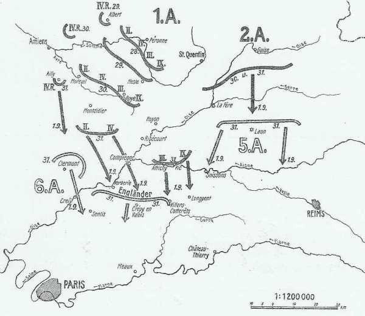
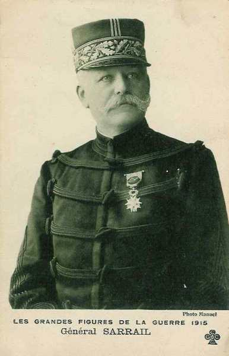
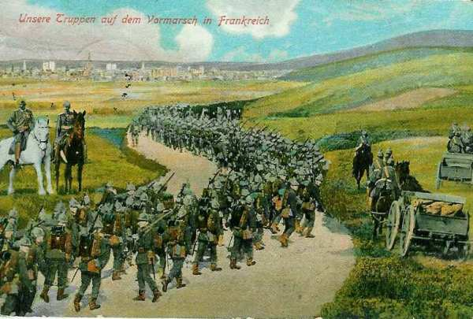
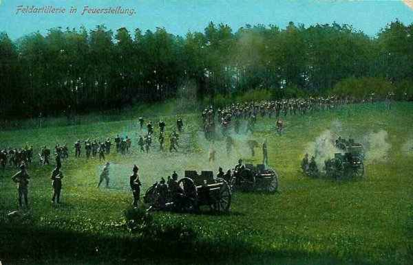

# Le 30 août 1914

Pendant que les Ie et IIe armées françaises combattent au col de la Chipote et vers Lunéville, les autres armées poursuivent leur retraite en bon ordre. Sarrail veut s’accrocher à la place forte de Verdun et doit étendre son front pour rester en contact avec la IVe armée. L’aile droite allemande commence à dévier par rapport à la direction de Paris suite à des demandes d’assistance des armées voisines. Moltke entérine la situation, consacrant l’abandon progressif du plan Schlieffen.

### G.Q.G. français

_Situation au 30 août_
_Der Marnefeldzug_

Joffre conseille au gouvernement de quitter la capitale aussitôt que possible.

Il limoge le commandant de la IIIe armée, Ruffey et le remplace par Sarrail.

Deux brigades et l’artillerie de la 8e D.C. sont transportées sur Châlons où elles vont faire partie du 2e C.C. (Conneau).

### Ie armée française

- Le 8e C.A., en liaison à gauche avec le 16e, doit attaquer en direction générale de Domptail. Son offensive sur Saint-Pierremont et Magnières est ralentie par des travaux de campagne allemands et un feu terrible d’artillerie lourde. Il réussit toutefois à consolider sa position en prenant Magnières et Saint-Pierremont.

- Le 13e C.A. rencontre partout des tranchées et des fils de fer.

- Le 21e C.A. fait des progrès appréciables au col de la Chipote, chassant les Allemands de leurs tranchées sans pouvoir les occuper lui-même.

### IIe armée française

prononce une attaque vers Lunéville.

### IIIe armée française

Ruffey ne veut pas reculer sans combat malgré la retraite de la IVe armée. Il veut rester le plus longtemps possible sur la Meuse en aval de Verdun. Dès l’aube, il prescrit au 6e C.A. de se tenir prêt à repousser toute tentative allemande sur Sivry et Vilosnes. Le 5e C.A. agira par son artillerie et le 4e attaquera Villers-devant-Dun.

L’armée tient tête à la Ve armée allemande (kronprinz) en direction de Beauclair-Nouart et de Fosse. Une charge à la baïonnette déblaie en profondeur trois kilomètres de terrain.

Ruffey est remplacé par Sarrail sur ordre du G.Q.G. La raison semble être un désaccord entre Joffre et Ruffey.

_Général Sarrail (IIIe armée)_
_Collection privée_

Dès sa prise de commandement, Sarrail prescrit au 4e C.A. de tenir à tout prix les positions atteintes.

### IVe armée française

L’armée a reçu l’ordre de gagner la ligne Buzancy - Bouvellemont.

- 12e C.A. vers La Chesne et Montyon.
  Le corps colonial vers Châtillon-sur-Bar.

Au point du jour, la division marocaine est violemment attaquée par des forces considérables qui cherchent à enlever Launois.  Des éléments de la 17e division accourent à son secours et les Allemands, surpris, s’arrêtent. La cavalerie a eu un engagement pendant la nuit à Novion-Porcien. Elle se porte vers le sud dans la région de Ecly - Arnicourt - Bertoncourt.

L’armée a combattu jour et nuit et ne pouvant s’organiser sur de solides positions d’arrêt, elle retraite vers Grand-Pré.

### Ve armée française : bataille de Guise-Saint-Quentin

### VIe armée française

Les débarquements se poursuivent et l’armée n’est pas encore prête pour une attaque.
Maunoury reçoit du G.Q.G. une directive de retrait vers Paris.

### IXe armée française

Foch prend effectivement le commandement de ce qui deviendra la IXe armée française.

### Armée anglaise

French informe Joffre que le B.E.F. ne sera pas en état de combattre avant une dizaine de jours.

Un 3e C.A. est formé sous le commandement de Pulteney.

_Général Pulteney (3e C.A.)_
_Collection privée_

L’armée anglaise est derrière la Lette.

### Armée belge

Les allemands devant Anvers paraissent déplacer des forces de leur droite vers leur gauche.

### O.H.L. : le mouvement des armées s’infléchit vers la gauche

**[Lien vers progression des armées allemandes](../img/progression_armees_all2.jpg)**

**[Lien vers croquis](../img/progression_allemands.jpg)**

Moltke reçoit un message radio de von Bülow :
"ennemi battu aujourd’hui d’une façon décisive. Fractions importantes se replient derrière La Fère. Pour exploiter complètement ce succès, conversion Ie armée vers La Fère - Laon autour de Chauny comme pivot est instamment désirable".

Moltke approuve les projets de von Kluck et von Bülow et  télégraphie l’ordre suivant :

"Les mouvements entamés par les Ie et IIe armées répondent aux intentions de la Direction suprême. Aile gauche de la IIe armée : direction approximative : Reims".

Seule la Ve armée ne progresse pas. Pour l’aider, il faut prescrire au duc de Wurtemberg de pousser vers le sud comme le demande le kronprinz pour prendre à revers les forces qui lui sont opposées.

von Hausen est également incité à poursuivre vers le sud. Pour éviter de créer une brèche, il faut rapprocher la IIe armée de la IIIe et orienter sa gauche vers Reims. La Ie armée se liant à elle obliquera à son tour vers l’est.

- C’est un coup de barre à gauche pour l’aile marchante des armées allemandes :
  L’axe de marche de la IIIe armée est rejeté de la direction de Château-Thierry vers Châlons, soit 75 km plus à l’est.
  La IIe armée va aborder la Marne entre Epernay et Château-Thierry au lieu de marcher sur Paris.
  La Ie armée, si elle veut rester liée à la IIe, doit renoncer à marcher vers la Basse Seine et passer sur la rive gauche de l’Oise pour marcher vers Meaux.

von Moltke renonce, trois jours à peine après l’envoi de la directive du 27 août, à marcher sur Paris.

### Ie armée allemande : oubli de la directive du 27 août

Le 2e C.A. atteint Villers-Bretonneux.

- Le 4e C.A.R. reconnaît d’importants bivouacs français à Albert et marche sur Amiens.

- Le 9e C.A. se déploie au sud de Roye avec le C.C. de von der Marwitz.

Suite à la demande d’assistance de von Bülow, von Kluck estime nécessaire de quitter la direction sud-ouest pour opérer une conversion vers le sud et même vers le sud-est pour soutenir la IIe armée. C’est un début de déviation par rapport à la marche sur Paris prévue au plan Schlieffen. Il rend compte à l’O.H.L. qu’il oblique vers l’Oise et avancera le 31 vers Compiègne et Noyon (et non vers Laon, comme le demande von Bülow).

Il néglige ainsi les Anglais et essaie de contourner la Ve armée française par l’ouest. La directive de l’O.H.L. du 27 août est complètement oubliée.

Il donne par conséquent ordre aux différents C.A. de pousser

- Vers Coucy-le-Château pour le 9e C.A.
  Vers Bailly et Cuts pour le 3e C.A.
  Vers Soissons pour la cavalerie.

_Troupes allemandes progressant en France_
_collection privée_

La conversion de la Ie armée sur l’Oise est un événement lourd de conséquences. L’encerclement de Paris par l’ouest, qu’avait ordonné l’O.H.L., est abandonné.

Moltke ratifie cette désobéissance par rapport à ses instructions. Une fois de plus, Moltke laisse ses subordonnés agir à leur guise. L’armée va s’engouffrer entre les camps retranchés de Paris et de Verdun, offrant les deux flancs aux entreprises des Français.

La Ie armée arrive sur la rive Moreuil - Roye alors que la IIe armée est sensiblement plus au nord, sur la ligne Ribemont - Vervins.

### IIe armée allemande

Comme Lanrezac poursuit son mouvement de retraite, von Bülow s’estime vainqueur et, bannissant toute crainte,  envoie partout des messages de victoire, conviant la Ie armée à converger vers La Fère et Laon pour donner le coup de grâce aux Français. Il s’occupe à préparer le siège de La Fère, dont il ignore l’évacuation.

### IIIe armée allemande

La IIIe armée cherche à forcer le passage de l’Aisne à Château-Porcien. Von Hausen télégraphie à l’O.H.L. pour se faire confirmer sa direction pour le 31 août.

### IVe armée allemande

Comme l’armée du kronprinz (Ve) est bloquée entre Dun et Stenay, la IVe armée doit obliquer vers l’est pour soutenir la Ve.

### Ve armée allemande

Le kronprinz impérial qui, bloqué sur la Meuse entre Dun et Stenay, demande du secours à Moltke. Ce dernier fait obliquer vers le sud est les IIIe et IVe armées "pour aider la Ve armée qui combat difficilement au passage de la Meuse".

_Artillerie allemande faisant feu_
_Collection privée_

[Lien vers la journée suivante](article_04_49.md)