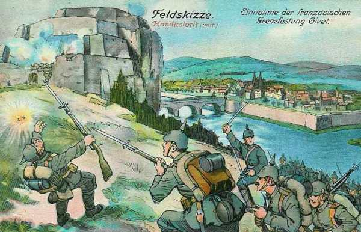
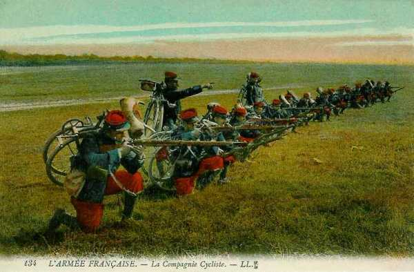
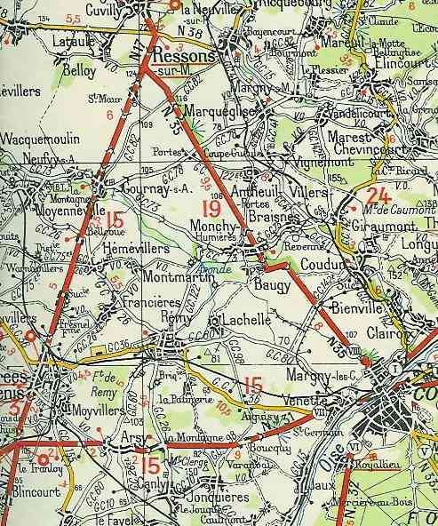
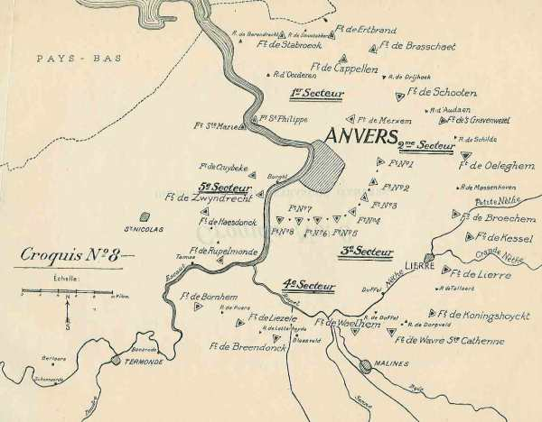
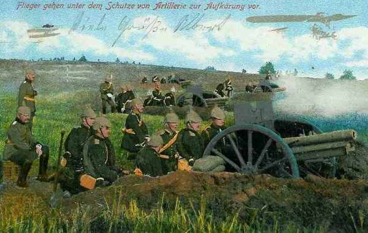

# Le 31 août 1914

L’armée de Castelnau bloque les attaques allemandes vers Nancy. L’armée anglaise franchit l’Aisne. Du côté allemand, le Plan Schlieffen est complètement abandonné. L’objectif n’est plus de se diriger vers Paris mais d’encercler la Ve armée française.

### G.Q.G. français

- L’Etat-Major de Joffre lui conseille de poursuivre la retraite jusqu’au sud de la Seine.

- Les pertes totales de l’armée française rien que pour le mois d’août se montent à 200.000 hommes.

- La 10e D.C. est transférée à partir de Nancy pour faire partie du C.C. Conneau. Le reste du 9e C.A. est prélevé sur la IIe armée pour renforcer les IXe et IVe armées.

La 8e D.C. est transférée de Corcieux à Châlons.

### Position fortifiée de Givet

Après avoir été bombardée avec de l’artillerie de gros calibre et subi un assaut, la garnison de Givet doit se rendre.

_Assaut de Givet_
_Collection privée_

### IIe armée française : début de la bataille du Grand Couronné de Nancy jusqu’au 11 septembre.

_Bataille du Grand-Couronné de Nancy_
_Collection privée_

### IIIe armée française : Sarrail s’accroche à Verdun

Les colonnes d’infanterie partent à l’assaut de Montigny et de Mont-devant-Sassey. Elles ne sont arrêtées que par le tir des batteries allemandes. A Doulcon, le 115e d’infanterie soutient la contre-attaque des colonnes allemandes qui débouchent de Dun. Pour maintenir la liaison avec la IVe armée, qui retraite vers la Champagne, la IIIe armée doit reculer à son tour. Le C.A. de droite (6e C.A.) continue à border la Meuse.

_Compagnie cycliste française_
_Collection privée_

Sarrail reçoit l’ordre du G.Q.G. de rompre le combat. Les pertes de l’armée se montent à 2.000 hommes mais l’avance allemande est fortement retardée. La retraite s’effectue jusqu’au sud de l’Ornain, à l’est de Vitry, puis jusqu’au sud de Bar-le-Duc. Sarrail dirige les 65e, 67e et 75e divisions de réserve au sud de Verdun, mais il arrête les arrière-gardes du 5e C.A. à Gesnes et Cierges, au nord de Montfaucon.

Le 6e C.A. garde le contact à Malancourt avec la garnison de Verdun et continue à border la Meuse.

Joffre voulait que la repli s’effectue jusqu’à Joinville, dans la Haute- Marne mais Sarrail veut garder le contact avec Verdun, en allongeant sa gauche pour rester en liaison avec la IVe armée, faisant face au nord pour défendre la place et face à l’est pour menacer le flanc de l’armée du Kronprinz. Le Haut Commandement approuve ces dispositions.

Dans la nuit du 31 août au 1e septembre, les troupes du Kronprinz traversent la Meuse à Vilosnes malgré la résistance acharnée du 106e R.I.  Sarrail compte rejeter les Allemands sur la rive droite quand il reçoit l’ordre de rompre le combat.
Le repli de l’armée s’effectue jusqu’au sud de l’Ornain, à l’est de Vitry.

### Ve armée française

L’armée se trouve toujours en flèche par rapport à ses voisines et risque d’être encerclée par la Ie armée allemande à l’ouest et par la IIIe armée allemande à l’est. Il y a un vide de 30 km entre la droite de la Ve et la gauche de la IVe armée, où les Allemands pourraient s’engouffrer. La cavalerie allemande a passé l’Oise et menace les arrières françaises. Lanrezac réussit à sortir son armée de cette situation en retraitant sur Laon. Seul le 148e R.I., qui n’a pas reçu l’ordre de retraite, perd une grande partie de son effectif, qui tombe aux mains des Allemands ou se disperse dans la forêt de Saint-Gobain.

### Une observation importante

Le capitaine Lepic, commandant d’un escadron de cavalerie, est en observation sur une petite crête, au sud du hameau de Saint-Maur, à 500 m  de la fourche des nationales 17 et 35. La première est la route de Paris, la seconde se dirige vers Compiègne, en direction de la Marne. Il voit neuf escadrons, deux sections de mitrailleuses, huit canons, puis une colonne d’infanterie et ensuite une masse d’infanterie à perte de vue.

_Fourche des nationales 17 et 35_
_C Michelin, d’après carte n°56, édition 1937 - Autorisation n° 05-B-18Le hameau de Saint-Maur est au sud sud ouest de Ressons_

A 15h30, il rédige son rapport : à la bifurcation, la masse des troupes a abandonné la route de Paris et marche en direction du sud-est.

Quelques heures plus tard, le renseignement arrive au 2e bureau de la Ve armée à Jonchery.

### VI armée française

Comme la Ie armée allemande s’oriente vers le sud-est, la VIe armée est dans une position débordante par rapport au front allemand. Maunoury propose d’attaquer de flanc mais une offensive générale n’est pas encore possible à cause de la retraite rapide des Anglais, ce qui crée une brèche dans la ligne des alliés.

### IXe armée française

Foch crée un front au nord de Reims.

### Armée anglaise

Les fusiliers marins britanniques abandonnent Ostende.

L’armée anglaise est derrière l’Aisne.

French adresse à Kitchener une note disant que le B.E.F. fera retraite derrière la Seine, en quittant la ligne de bataille des armées françaises. Le cabinet de Kitchener lui intime l’ordre de coopérer avec Joffre.

### Armée belge

L’armée allemande en face du 4e secteur renforce sa gauche au détriment de sa droite. Les forces face à Anvers sont toujours les 3e et 9e C.A.R. et des formations de la Landwehr.

_Les forts d’Anvers_
_L’action de l’armée belge_

### O.H.L.

**[Lien vers progression des armées allemandes](../img/progression_armees_all2.jpg)**

**[Lien vers croquis](../img/progression_allemands.jpg)**

von Kluck confirme qu’il a rejeté complètement l’adversaire au-delà de l’Avre. La Ie armée a conversé en direction de l’Oise et se portera au-delà de Compiègne et Noyon pour exploiter les succès de la IIe armée.

Moltke est tranquilisé pour son aile droite mais est convaincu que les trois armées du centre exécutent une contre-offensive générale dont le but est de battre les forces allemandes qui ont franchi la Meuse. Il faut à tout prix éviter un échec au kronprinz. La IVe armée est invitée à agir en direction du sud sinon la Ve armée ne pourra pas passer la Meuse.

Moltke adresse une message radio à von Hausen et au duc de Wurtemberg :
"il est de toute nécessité que les IIIe et IVe armées continuent à se porter en avant sans arrêt car la Ve armée est engagée dans un dur combat pour franchir la Meuse".

En fait, l’attaque française de Sarrail, de Langle et Foch n’était qu’une manoeuvre de retardement.

### Ie armée allemande : abandon du plan Schlieffen

Von Kluck reçoit un message radio de l’O.H.L. « les mouvements entamés par la Ie armée correspondent aux intentions de l’O.H.L. »

La direction de progression de l’armée est à présent vers Compiègne et Meaux. Il n’est plus question d’enlever Paris, mais de mettre hors de cause la Ve armée française.
Von Kluck ne cesse de stimuler les C.A. de gauche.

Il ordonne à 14h à ses trois C.A. de gauche (9e, 3e et 4e)
de "dépasser leurs objectifs de la journée et de pousser aussi loin que possible en direction de Verberie et Soissons pour atteindre encore l’ennemi en retraite".

L’armée se rue vers le sud : le 3e C.A. aborde l’Aisne inférieure à Attichy, Vic ; le 9e C.A. à Vezaponin ; la cavalerie de von Marwitz passe l’Oise pour couper la ligne de retraite de la Ve armée. Ce plan échoue de peu, car Lanrezac fait retraiter son armée à marches forcées.

Le soir, l’armée allemande est sur l’Aisne à l’ouest de Soissons. Sa gauche a parcouru une distance de 50 km, un record. L’avance de la Ie armée par rapport à la IIe s’est encore accentuée.
Le Q.G. de l’armée se déplace de Péronne à Noyon.

Pour von Kluck, la situation est lumineuse :  l’armée anglaise s’étant dérobée, il s’agit de saisir l’aile gauche de la Ve armée française. C’est cette aile qui va l’attirer vers le sud-est.

Il décide de marcher le 31 non à  l’est sur La Fère - Laon où il risquerait d’arriver trop tard, mais au sud-est, sur l’Oise, de Noyon à Compiègne. Il pense ainsi "exploiter le succès de la IIe armée en exécutant une poursuite débordante et en essayant, par des marches extraordinaires, de saisir de flanc les forces françaises qui se replient devant la IIe armée".

La Ie armée commence à converger vers le sud-est. Le plan Schlieffen est abandonné.

### IIe armée allemande

von Bülow donne un jour de repos à son armée. Comme la Ie armée continue à progresser, le décalage s’accentue entre les deux armées.

A 18h15, il envoie l’appel télégraphique suivant :
"Ennemi battu. En vue exploitation complète du succès, il est instamment désirable que la Ie armée converse face à La Fère - Laon" (vers l’est).

_Artillerie allemande_
_Collection privée_

### IIIe armée allemande

Comme la Ve armée a réussi à forcer le passage de la Meuse, l’armée continue sa route vers le sud, un moment interrompue.

### IVe armée allemande

L’armée reprend sa route vers le sud.

### Ve armée allemande

L’armée réussit à forcer le passage de la Meuse à Vilosnes.

[Lien vers la journée suivante](article_04_50.md)