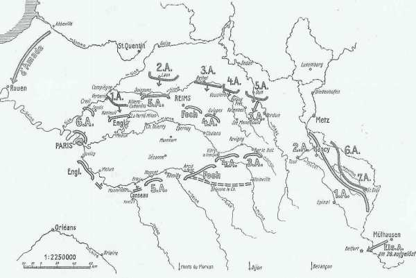
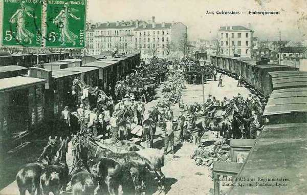
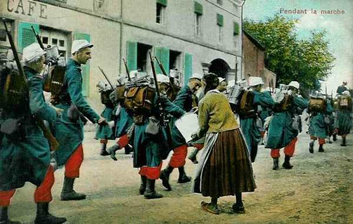
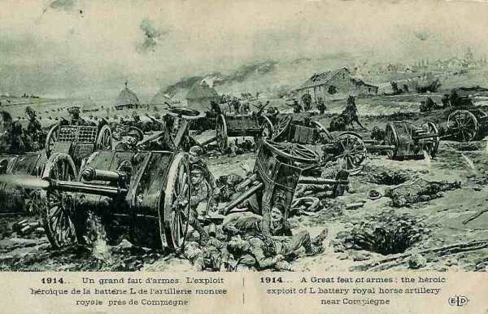
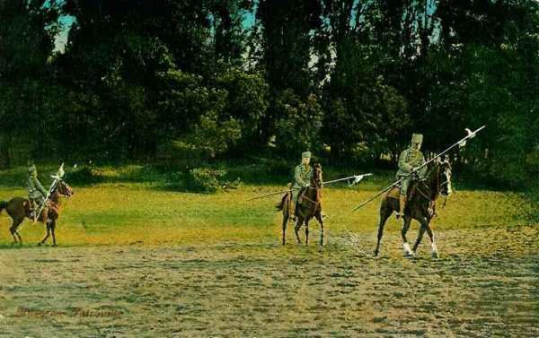

# Le 1er septembre 1914

Joffre prévoit dans ses instructions un repli vers la Seine et l’Aube. La VIe armée est placée sous les ordres de Galliéni. Ce dernier apprend que l’armée allemande a changé de direction et prête son flanc à une attaque de la part de la VIe armée. Les Anglais, pressés par l’armée de von Kluck, retraitent à marches forcées et franchissent la Marne.

_Situation au 1e septembre_
_Der Marnefeldzug_

### France

La VIe armée, repliée de la Somme, est mise à la disposition du général Galliéni, de même que le groupe de divisions de réserve Ebener (61e et 62e D.R.) et enfin la 45e division algérienne. L’aviation du camp retranché compte neuf appareils (Blériot, Henri-Farman et Deperdussin).

Le ministre de la Guerre avise Galliéni que le Gouvernement quittera Paris le lendemain 2 septembre, en lui laissant tous les pouvoirs civils et militaires.

### G.Q.G. français

Joffre émet l’instruction générale n° 4, qui prévoit un repli vers la Seine et l’Aube et une attaque du centre allemand par le VIe armée. Le Q.G. doit être transféré à Bar-sur-Aube, vu l’avancée des armées allemandes.

Il avertit Galliéni que la Ie armée allemande a changé sa direction de marche. Elle s’oriente à présent vers le sud-est.

La ligne de contact des armées est Beauvais - Verberie - Senlis -Meaux.

Afin de renforcer son aile gauche, Joffre ordonne à la 3e armée d’embarquer le  4e C.A. vers Paris dès le 2 septembre.

Il constitue dans la région d’Epernay - Dormans un 2e C.C. (général Conneau) avec les 8e et 10e divisions venues de l’est pour relier l’aile gauche de la Ve armée à l’armée anglaise. La 10e D.C. est transférée de Pont-Saint-Vincent à Epernay dans ce but.

_Embarquement des cuirassiers_
_Collection privée_

_Général Conneau (2e C.C.)_
_Collection privée_

### IIe armée française : bataille du Grand Couronné de Nancy

### Ve armée française

Elle traverse l’Aisne et est en liaison avec le détachement de Foch.

Le capitaine Falgade trouve dans la sacoche d’un officier allemand blessé les ordres de mouvement de la Ie armée allemande, établissant un changement de direction vers le sud-est.

### VIe armée française

L’armée, après avoir traversé l’Oise, reprend sa marche vers le sud, en se rapprochant de Paris et en occupant le front Clermont - Verberie.

- Elle comprend :
  le 7e C.A.
  Le groupe de divisions de réserve Lamaze (55e et 56e D.R.)
  La brigade marocaine Ditte

soit au total 60.000 hommes, en majorité réservistes.

L’aviation de l’armée compte deux escadrilles de cinq avions chacune.

A 23h55, le général Maunoury signale au G.Q.G. le glissement probable de la Ie armée allemande vers le sud-est et il offre de contre-attaquer vers le nord-est le lendemain. Joffre juge la situation encore trop imprécise et lui fait répondre : "Votre mission est de couvrir Paris. Mettez-vous en relations avec le Gouverneur".

_Infanterie en marche_
_Collection privée_

### Armée anglaise

L’armée se trouve à une journée de marche plus au sud par rapport à la Ve armée française.

Au sud de Compiègne, un combat se déroule avec la Ie armée allemande à Néry. Une batterie tire jusqu’à son dernier obus, son effectif est réduit à 2 hommes.

_Fait d’armes à Néry près de Compiègne_
_Collection privée_

Kitchener rencontre French à Paris et lui ordonne de coopérer avec l’armée française.

Les Anglais se retirent vers Senlis - Crépy-en-Valois - La Ferté-Milon.

### Armée belge

Les survivants de la 4e division (siège de Namur) s’embarquent au Havre en direction des ports belges.
Comme les Allemands se renforcent devant le 4e secteur, le commandement belge décide d’opérer un renforcement parallèle : la 1e division doit s’y porter.

_Les forts d’Anvers_
_L’action de l’armée belge_

### O.H.L.

Moltke prescrit à von Hausen de poursuivre son attaque en direction du sud-est.

**[Lien vers progression des armées allemandes](../img/progression_armees_all2.jpg)**

**[Lien vers croquis](../img/progression_allemands.jpg)**

A 14h30, von Moltke transmet à von Bülow le message suivant :

« IIIe, IVe et Ve armées engagées dans de durs combats contre forces supérieures. Aile droite de la IIIe armée près de Château-Porcien sur l’Aisne. Il est urgent d’orienter de ce côté aile gauche de la IIe armée en faisant si possible entrer cavalerie en action aujourd’hui même. Une division cavalerie ennemie reconnue à l’ouest de Château-Porcien ».

La situation de la gauche et du centre de la masse allemande n’est pas aussi critique que l’indique ce message. La Ve armée force le passage de la Meuse entre Consenvoye et Dun, mais la IVe armée avance presque sans combattre et la IIIe armée, au sud de l’Aisne, se heurte à des effectifs notablement inférieurs aux siens.

von Hausen fait savoir qu’en fin de journée il s’est heurté à un ennemi qui s’est retranché dans une position organisée derrière la coupure de l’Aisne et qu’il ne pourra vraisemblablement attaquer que le 2 septembre.Il n’est plus question de séparer l’armée de Foch de celle de Franchet d’Esperey.

L’armée du kronprinz se trouve en situation difficile et Moltke veut absolument lui éviter un échec. Il faut pousser la IVe armée en avant et la faire appuyer par la IIIe.

Pour ce faire, Moltke envoie un radio à von Hausen :
"Il est absolument indiqué que la IIIe armée continue immédiatement son attaque en direction du sud car le succès de la journée en dépend".

C’est un nouveau coup de barre à gauche.

### Ie armée allemande : à 40 km de Paris

La poursuite est menée avec la même énergie sans résultat. La droite de l’armée double l’étape, parcourt 50 km pour arriver en soirée sur l’Aisne, sur la ligne Verberie - Crépy-en-Valois - Villers-Cotterêts.

A 8h du matin, les avant-gardes des 4e, 3e et 9e C.A. doivent traverser l’Aisne et l’Oise.

Un combat est mené par le 2e C.A. pour s’assurer le passage de l’Oise à Verberie et Saint-Sauveur, par le 4e C.A. à Gilocourt et par le 3e C.A. à Villers-Cotterêts.

Le C.C. von der Marwitz surprend les Anglais à Néry, puis subit de lourdes pertes dans la région de Rosières (au nord de Nanteuil-le-Haudouin, là précisément où arriveront les taxis de la Marne).

Vers 11h du matin, les colonnes françaises se retirent sur la Marne.

L’ordre d’opérations pour le 2 septembre prescrit au gros de l’armée de franchir à 8 h la ligne jalonnée par Verberie et Villers-Cotterêts, tandis que qu’à gauche le 9e C.A. se mettre en route dès 3 h pour tourner l’aile droite britannique par l’est de la forêt de Villers-Cotterêts. La 4e C.A.R. quittera sa position en échelon pour se remettre en ligne avec les autres C.A.

En voulant encercler l’adversaire, von Kluck a dévié la marche de son armée de 45 degrés vers l’est.

A 20h, on apporte au Q.G. de la Ie armée des papiers trouvés sur un cycliste anglais. Il s’agit de l’ordre de satationnement du 1e C.A. : celuic- se trouve à 12 km au sud de Crépy-en-Valois. Il paraît possible à von Kluck de les atteindre et dès 20h, il donne l’ordre d’armée suivant :

"La Ie armée attaquera les Anglais demain 2 septembre dans le dispositif suivant de la droite à la gauche :
4e C.A.R, 2e, 4e, 3e et 9e C.A. Franchissement de la ligne Verberie - Villers-Cotterêts à 8h. Les deux corps d’aile partiront de façon à envelopper l’armée anglaise. Le C.C. von der Marwitz éclairera vers le front nord de Paris".

_Hussards allemands_
_Collection privée_

### IIe armée allemande

La cavalerie se trouve entre le massif de Villers-Cotterêts et Soissons. Au reçu du message de l’O.H.L. (voir ci-dessus), von Bülow s’empresse d’obtempérer. Le 1e C.C., depuis le matin en route vers Soissons, se trouve trop loin pour intervenir, mais la Garde et le 10e C.A. sont détournés de leurs objectifs vers le sud-est par Sissonne et Marchais, précédés de cyclistes et d’infanterie transportée par camions. Peu après, la IIIe armée signale qu’elle n’a plus besoin d’aide. La gauche de la IIe armée reprend la direction du sud.

L’armée fournit un gros effort en atteignant le cours de l’Aisne tard dans la soirée.

### IIIe armée allemande

L’armée se trouve au sud de l’Aisne et se heurte à des effectifs français inférieurs aux siens.

### Ve armée allemande

L’armée force le passage de la Meuse entre Consenvoye et Dun, et éprouve la plus grande peine à gravir les pentes donnant accès du fleuve au plateau de Montfaucon.

### VIIe armée allemande

L’armée perd la 13e C.A., transporté à Buzancy. En compensation, elle reçoit des divisions d’ersatz, une division de réserve et le 14e C.A.R. qui se trouve vers Provenchères - Sainte-Marie-aux-Mines.

[Lien vers la journée suivante](article_04_51.md)