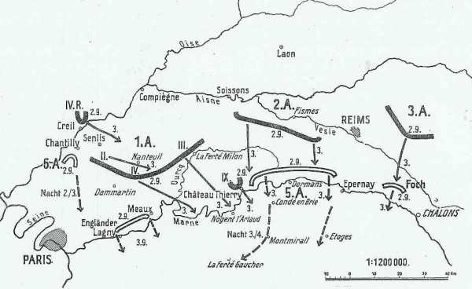
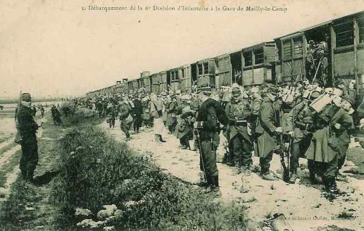
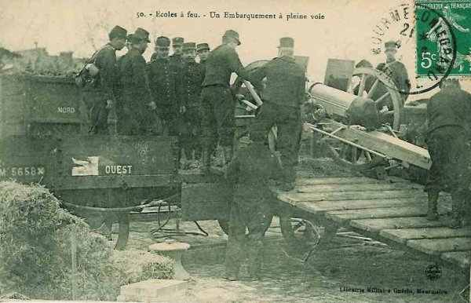
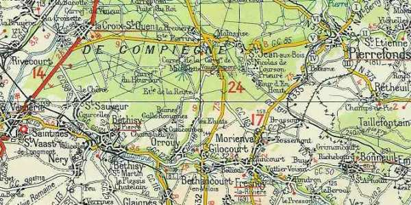
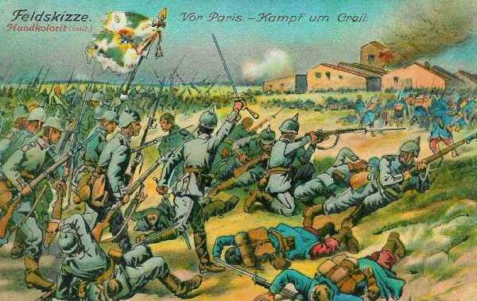
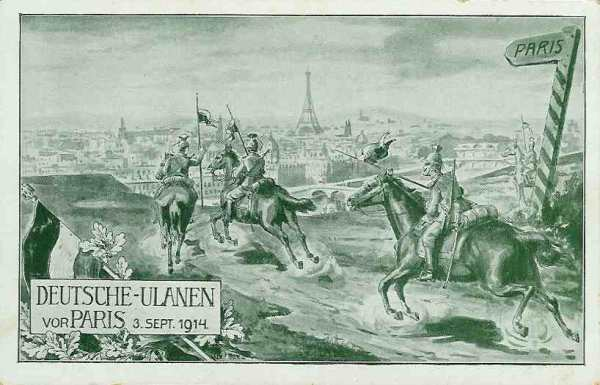

# Le 2 septembre 1914

La VIe armée française reçoit en renfort le 4e C.A. L’armée de von Kluck ne réussit pas à accrocher l’armée anglaise mais s’empare de ponts encore intacts sur la Marne. von Kluck feint d’ignorer l’ordre de l’O.H.L. qui lui prescrit de se tenir en échelon refusé pour couvrir l’aile droite des armées allemandes.

_Situation aux 2 et 3 septembre 1914_
_Des Marnefeldzug_

### France

Le gouvernement français quitte Paris pour Bordeaux.

### G.Q.G. français

Joffre reçoit le commandement de l’armée de Paris. Il ordonne le transfert du reste du 9e C.A. pour renforcer son aile gauche.

Le 4e C.A. (IIIe armée) s’embarque à Sainte-Menehould pour être rattaché à la VIe armée et débarqué à Pantin et Le Bourget.

_Transport de troupes par chemin de fer_
_Collection privée_

L’instruction générale n° 4 dessine le cadre de la situation stratégique : pour éviter que la Ve armée se fasse envelopper, elle doit gagner du champ, au prix de l’abandon d’une partie du territoire national. Les armées pivoteront autour du point fixe de Verdun et seront amenées sur la ligne Pont-sur-Yonne - Nogent-sur-Seine - Arcis-sur-Aube - Bar-le-Duc.

_Chargement d’un 75 sur un wagon de chemin de fer_
_Collection privée_

Joffre demande au ministre et obtient que le camp retranché de Paris soit placé sous son commandement.

### IIe armée française

Bataille du Grand Couronné de Nancy

### IIIe armée française

Livre un combat acharné avec la Ve armée allemande (Kronprinz) dans la forêt de l’Argonne.

### Ve armée française

L’armée se trouve dans la région de Fère-en-Tardenois - Reims.

En survolant l’Oise dans un avion piloté par le sergent Louis Breguet, le lieutenant aviateur Watteau a l’impression d’un énorme serpent gris traversant Verberie suit la vallée de l’Automne, qui conduit vers le sud-est.

_Verberie et la vallée de l’Automne_
_c Michelin, d’après carte n° 56, édition 1937 - autorisation n° 05-B-18_

### VIe armée française

Livre des combats avec l’avant-garde de l’armée von Kluck près de Senlis. La VIe armée est incorporée dans les armées de Paris, commandées par Galliéni. Elle comprend les 55e , 56e et 63e divisions de réserve, la 14e D.I. et la brigade marocaine (général Ditte). Son dispositif est orienté vers le nord (vers les forêts d’Ermenonville et de Chantilly). Galliéni renforce l’armée en lui adjoignant une brigade de cavalerie (général Gillet), couvrant la droite de l’armée.

Les reconnaissances signalent la marche de fortes colonnes partant de la région à l’est de la forêt d’Ermenonville et se dirigeant vers la Marne en amont de Meaux.

### Armée anglaise

Les anglais traversent la Marne, se mettant à l’abri des poursuites par la Ie armée allemande. Des reconnaissances aériennes signalent que les Allemands ont suspendu leur mouvement vers le sud-est pour passer la Marne à La Ferté-sous-Jouarre et Château-Thierry.

Le soir

- Les 3e et 5e brigades de cavalerie sont à Mauroy (sud de La Ferté-sous-Jouarre).
  La 1e C.A. est au sud de Signy-Signet.
  Le 2e C.A. est entre Ville-Mareuil et Couilly.
  Le 3e C.A. est dans la région de Saint-Germain-lès-Couilly et Chanteloup.

### Armée belge

Les survivants de la 4e division (siège de Namur) s’embarquent au Havre en direction des ports belges.

### O.H.L. : une grave décision

**[Lien vers progression des armées allemandes](../img/progression_armees_all2.jpg)**

**[Lien vers croquis](../img/progression_allemands.jpg)**

Moltke va prendre une des décisions les plus graves de la campagne : il transmet les intentions de la direction suprême : refouler les Français vers le sud-est et les couper de Paris. Ces ordres n’ont plus le moindre rapport avec la plan Schlieffen.

Comme la garnison de Paris constitue un danger potentiel, von Kluck reçoit l’ordre, pour couvrir le flanc droit des armées allemandes, de se tenir en échelon refusé, au niveau de l’arrière de la IIe armée. C’est l’abandon pur et simple de la directive du 27 août par l’O.H.L. lui-même.

A 21h30, Moltke imprime un nouveau changementde direction à ses armées :
"L’intention de la Direction suprême est de refouler les Français en direction du sud-est en les coupant de Paris. La Ie armée suivra la IIe en échelon et assurera la couverture du flanc droit des armées".

### Ie armée allemande : von Kluck ignore un ordre de l’O.H.L.

Malgré toute diligence, l’armée arrive trop tard pour accrocher l’armée britannique, qui s’est mise hors de portée en rompant de très bonne heure. En revanche, aux deux ailes, l’armée rencontre des unités françaises.

Le 2e C.A. et le C.C. délogent de Senlis une arrière-garde de la 56e D.R. L’armée est dans la région de Creil - Senlis - Nanteuil-le-Haudouin - La Ferté-Milon.

_Combat de Creil_
_Collection privée_

Von Kluck s’apprête à franchir l’Ourcq au nord de Neuilly-Saint-Front lorsqu’il est informé, vers 9h, par l’aviation de la présence d’importantes colonnes entre la Vesle et la Marne se dirigeant du nord au sud vers les ponts de la Marne entre Château-Thierry et Dormans. Von Quast, chef du 9e C.A., fonce vers Château-Thierry et y arrive tard dans la soirée, mais les colonnes de la Ve armée ont déjà franchi la Marne. Il s’empare, sans difficulté, du pont insuffisamment détruit, ainsi que de celui de Chézy.

Quand il apprend ce succès, von Kluck est enchanté et fait établir un ordre complet qui part trois quarts d’heure plus tard.

- Le 9e C.A. continuera son attaque contre les Français qui se replient devant la IIe armée par Fère-en-Tardenois sur Château-Thierry.

- Le 3e C.A. marchera au sud du 9e sur Château-Thierry. On dépêchera de la cavalerie, de l’artillerie, des mitrailleuses et de l’infanterie sur camions en avant du gros pour attaquer l’adversaire au passage de la Marne.

- Le 4e C.A. se portera dans la région de Crouy, en se couvrant à droite vers Paris et Meaux.

- Le 2e C.A. se portera dans la région de Nanteuil-le-Haudouin.

- Le 4e C.A.R. se portera dans la région à l’est et au nord-est de Senlis.

Le Q.G. de l’armée est à la Ferté-Milon.

Von Kluck se rend compte de sa position très avancée par rapport aux autres armées. Depuis le passage de l’Oise, il appuie de plus en plus à gauche sans tenir compte de la VIe armée ni même de l’armée britannique, ni de la IIe armée allemande. Il serre tellement du côté de cette dernière qu’il empiète sur sa zone de marche.

Les uhlans atteignent, au nord de Louvres, les hauteurs d’où l’on voit la tour Eiffel

_Uhlans devant Paris_
_Collection privée_

### IIe armée allemande

Von Bülow entreprend de se remettre à la hauteur de la Ie armée, alors qu’il a perdu une journée devant La Fère, abandonnée par les Français. Ce n’est pas facile, car l’armée de von Kluck double les étapes.

Elle atteint au soir la ligne sud de Soissons - Reims et occupe Laon. Son aile droite avancera le lendemain vers Château-Thierry. Elle passe la Vesle et s’arrête à 6 ou 7 km au sud de la rivière, entre Noyant et Reims.

La 2e division d’infanterie de la Garde est détachée inutilement pour attaquer le camp retranché de Reims, qui n’est pas défendu.

### IIIe armée allemande

L’armée se trouve à l’est de Reims. Elle détache inutilement la 23e  division de réserve pour faire le siège de Reims, qui n’est pas défendu.

### IVe armée allemande

La IVe armée prolonge la IIIe par Autry jusqu’à l’Argonne, où elle se relie à la Ve armée.

Elle fait face au sud-est entre la Marne et l’Aisne.

### Ve armée allemande

Elle commence à investir la position fortifiée de Verdun tout en contournant la place fortifiée, en direction de Varennes et Montfaucon.

### VIe et VIIe armées allemandes : bataille du Grand Couronné de Nancy

[Lien vers la journée suivante](article_04_52.md)