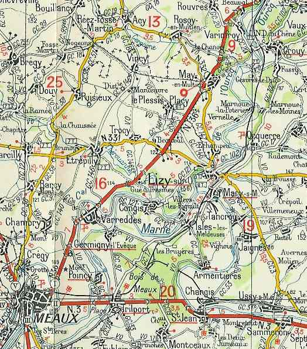
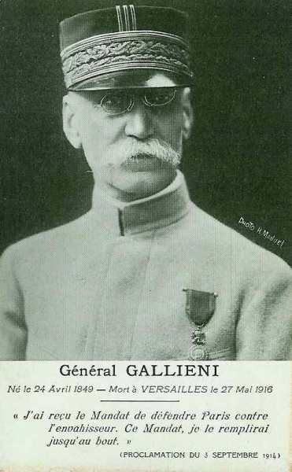
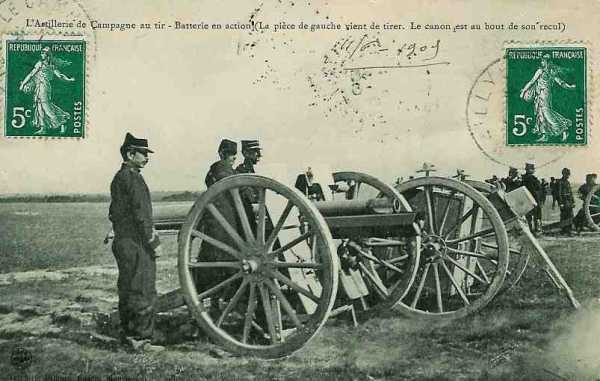
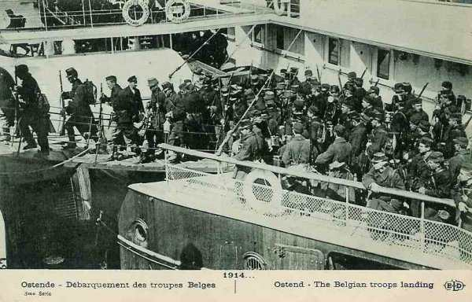
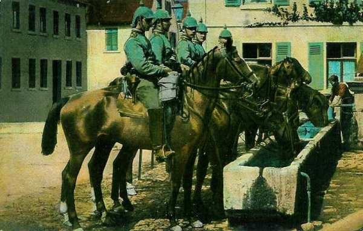
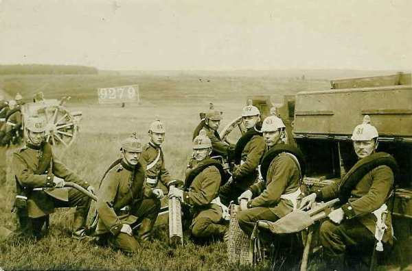

# Le 3 septembre 1914

Joffre prélève à l’est deux C.A. pour renforcer son aile gauche. Galliéni s’engage à défendre Paris jusqu’au bout. L’armée allemande passe à l’est de Paris afin de couper les armées françaises de la capitale et von Kluck continue inlassablement sa poursuite malgré les ordres de l’O.H.L. Son armée a franchi la Marne, laissant le flanc droit des armées allemandes à découvert.

### G.Q.G. français

Joffre transfère les 15e et 21e C.A. pour renforcer son aile gauche.

Le 15e C.A. fait mouvement par terre et voie ferrée et débarque ses premiers éléments dans la nuit du 6 au 7, de Ligny-en-Barrois à Bar-le-Duc.

Les indications recueillies par la cavalerie et l’aviation deviennent innombrables. La Ie armée passe par la vallée de l’Ourcq et sa tête commence à franchir la Marne à Trilport, à l’est de Meaux.

_Franchissement de la Marne à Trilport_
_c Michelin, d’après carte n° 36, édition 1937 - Autorisation n° 05-B-18_

### Paris

Galliéni publie sa célèbre proclamation où il s’engage à défendre Paris jusqu’au bout.

_Général Galliéni (gouverneur de Paris)_
_Collection privée_

Dans l’après-midi, un avion Robert-Esnault-Pelterie va reconnaître la région au nord de la Marne de Meaux. A l’atterrissage, l’observateur fait son rapport :
"A 18h, à Etrepilly, troupes arrêtées sur une longueur de 16 km avec le sud-est comme direction".

Or, Etrepilly est à trois kilomètres seulement au nord de la Marne. De Paris, le renseignement est immédiatement transmis au G.Q.G.

Un message est capté par la tour Eiffel "Très bien compris, gagnez rive sud de la Marne. Oberste Heeresleitung".

Galliéni décide de faire tous les efforts possibles pour obtenir du général Joffre l’autorisation d’attaquer le flanc droit de von Kluck.

### IIe armée française : bataille du Grand Couronné de Nancy

_Canon de 75_
_Collection privée_

### IIIe armée française

Le 4e C.A. est prélevé sur l’armée et Sarrail n’a plus que deux C.A. (5e et 6e) et un groupe de divisions de réserve pour enrayer les progrès de la Ve armée allemande. Sarrail estime devoir faire tous ses efforts pour assurer jusqu’au bout la défense de Verdun. Il est obligé d’étendre indéfiniment son front vers le sud pour rester en liaison à la fois avec la IVe armée et avec la place de Verdun.

### IVe armée française

Le corps colonial tient tête à Auve et Saint-Remy-sur-Bussy aux avant-gardes de la IVe arme du duc de Wurtemberg.

### Ve armée française

Un corps de cavalerie sous le commandement du général Conneau est placé à la gauche de l’armée, dégarnie par la retraite des Anglais. L’armée passe la Marne entre Epernay et Château-Thierry.

Lanrezac est limogé et remplacé par Franchet d’Esperey.

Pendant la nuit du 3 au 4, l’armée poursuit sa retraite sans relâche.

### VIe armée française

L’armée prend position sur le front nord-est de Paris entre la route de Senlis et la Marne : le 7e C.A. à hauteur de Louvres et le groupe de divisions de réserve dans la région de Dammartin.

Des observations aériennes lui rapportent que trois colonnes de 6 à 8 km de long marchent vers le sud-est dans la direction de La Ferté-sous-Jouarre et Château-Thierry.
Von Kluck oblique donc au sud-est, évitant le camp retranché. Les renseignements sont transmis à G.Q.G. Il n’y a aucune force allemande significative au nord de Paris.

### IXe armée française

Foch a réussi à grouper les éléments de son armée derrière la Marne, d’Epernay à Châlons sans être trop vivement pressé par le IIIe armée allemande.

### Armée anglaise

L’armée borde la Marne de Lagny à Signy-Signets. Le vide de +- 25 km entre les Anglais et la Ve armée est comblé par le C.C. du général Conneau.

### Armée belge

Les survivants du siège de Namur (4e division) débarquent à Oostende et à Zeebrugge.

_Débarquement des troupes belges_
_Collection privée_

Les troupes chargées de l’observation et de la protection de la ligne de communication des arméesallemandes se sont établies sur le front Haacht - Pont Brûlé - Asse. Elles constatent que l’armée allemande s’est solidement sur le front Haacht - Elewijt - Eppegem - Pont-Brûlé - Wolvertem. Une ligne contine de tranchées court sur ce front. Parfois, cette ligne est double ou triple et constitueune position de 300 à 600m de profondeur. Un réseau de fils de fer a été établi devant les tranchées. Les tours des églises d’Elewijt et d’Eppegem servent d’observatoires et les maisons environnantes ont été crénelées.

### O.H.L.

**[Lien vers progression des armées allemandes](../img/progression_armees_all2.jpg)**

**[Lien vers croquis](../img/progression_allemands.jpg)**

La certitude d’avoir remporté la victoire décisive sur les frontières de France commence à s’émousser. La poursuite ne prend pas l’allure d’une simple promenade militaire. Le 27 août, Moltke a voulu reprendre la manoeuvre de Schlieffen en encerclant les Français par un mouvement autour de Paris, mais a dû y renoncer, car les Français montrent leur force de résistance. Il faudra livrer une nouvelle bataille.

Après réflexion, Moltke finit par en prendre son parti. Puisqu’il ne peut déborder la ligne ennemie par l’ouest de Paris, il le fera par l’est, en masquant la capitale avec une partie de la Ie armée.

### Ie armée allemande : aborde la Marne et ignore les ordres de von Moltke

Au reçu de l’instruction de l’O.H.L. (2 septembre à 9h30) , von Kluck ne modifie en rien ses dispositions. Il prescrit au contraire à ses trois C.A. de gauche de franchir la Marne de Château-Thierry à La Ferté-sous-Jouarre. Les 2e et 4e C.A.R. resteront au nord de cette rivière face au camp retranché de Paris.

C’est un acte flagrant d’indiscipline.

A 10h, von Kluck apprend que le 9e C.A. a passé la Marne à Château-Thierry et Chézy. Il se trouve aux prises avec d’importantes forces françaises au sud de la rivière (18e C.A. et C.C. Conneau).

A 13h, von Kluck ordonne à ses trois C.A. de gauche de franchir la Marne, de Château-Thierry à La Ferté-sous-Jouarre, tandis que ses deux C.A. de droite (2e et 4e de réserve) resteront au nord de la Marne, face au camp retranché de Paris.

A 13h10, il en rend compte à Luxembourg par le message radio suivant, émis seulement à 16h50 :
"Ie armée refoule les Français avec aile gauche et franchit la Marne à Château-Thierry et à l’ouest, pousse centre sur La Ferté-sous-Jouarre et couvre flanc droit avec 2e C.A. et 4e C.A.R. dans la région de Nanteuil".

En fin de journée, le centre et la gauche de l’armée s’alignent au sud de la Marne. Ce mouvement est dû à l’initiative de von Quast (2e C.A.). Au lieu de lui faire faire demi-tour, von Kluck décide de lui faire poursuivre sa route au sud de la Marne. C’est ainsi qu’il ordonne à ses C.A. de gauche et du centre (9e, 3e et 4e) d’atteindre les plateaux au sud du Petit Morin entre Montmirail et Rebais. Le 2e C.A. doit gagner la région de Meaux. Seul le 4e C.A.R. assurera la couverture face à Paris.

En fait, von Kluck poursuit inlassablement un but : écraser l’aile gauche ennemie. Chaque matin, il croit l’avoir atteinte et il constate que ce but a été manqué. On lui apprend enfin qu’on a fixé l’aile gauche adverse, et il estime pouvoir réussir la manoeuvre.

A 21h15, von Kluck expédie l’ordre d’opérations pour le 4 septembre.

- La Ie armée continuera à franchir la Marne pour refouler les Français vers l’est.

- La 9e C.A. se portera dans la direction de Montmirail.

- Le 3e C.A. se portera sur Saint-Barthélémy et Montolivet.

- Le 4e C.A. franchira la Marne à La Ferté-sous-Jouarre et Saacy, puis se portera dans la direction générale de Rebais.

- Le 2e C.A., se couvrant vers Paris, atteindra la Marne à l’ouest de La Ferté-sous-Jouarre et poussera des éléments avancés jusqu’à la grand route de Meaux à La Ferté-sous-Jouarre.

- Le 4e C.A.R. se portera dans la région de Nanteuil-le-Haudouin. Il sera chargé de la protection du flanc et des communications du côté de Paris.

- Le C.C. se mettra en marche avec deux divisions sur La Ferté-sous-Jouarre et laissera une division face au front nord-est de Paris.

A 21h30, von Kluck rend compte de cet ordre à Luxembourg par télégramme :
"Ie armée a franchi la Marne le 3 avec des éléments avancés, de La Ferté-sous-Jouarre à Château-Thierry. Elle continuera le 4 par Rebais et Montmirail".

Ce télégramme ne parviendra à Moltke que le lendemain.

_Chasseurs à cheval allemands_
_Collection privée_

Par ces dispositions, von Kluck compromet davantage la situation et aggrave son cas : le 3 septembre, la couverture face à Paris comprenait encore deux C.A. (2e et 4e C.A.R.) ainsi que le 2e C.C. tout entier. Suite aux ordres pour le 4 septembre, la couverture se réduit à un C.A. et une D.C. Le 4e C.A.R. est dépourvu d’artillerie lourde.

### IIe armée allemande

L’aile droite a passé l’Aisne à Soissons. Elle est une journée en arrière par rapport à la Ie armée. Dans le courant de la soirée, elle atteint la Marne à Château-Thierry, d’où chevauchement des Ie et IIe armées. Le 1e C.C. doit se porter de Château-Thierry vers Montmirail.

Von Bülow est arrivé trop tard pour inquiéter la Ve armée au passage de la Marne et télégraphie à l’O.H.L. « L’armée a poursuivi aujourd’hui l’ennemi l’épée dans les reins jusqu’au-delà de la Marne. L’ennemi reflue en complète désorganisation, même au sud de la Marne ».

von Bülow s’inquiète toutefois de la trop grande avance de von Kluck. De plus, la Ie armée a donné à son C.A. de gauche non la direction du sud mais celle du sud-est, si bien qu’il viendra se placer devant le C.A. de droite de la IIe armée et l’obligera à obliquer vers l’est, ce qui contribuera à élargir la brèche entre les deux armées.

### IIIe armée allemande

Elle se trouve à 10 km au nord de la Marne au niveau de Châlons.

### IVe armée allemande

Le gros se trouve à 30 km au nord de Vitry-le-François.

### Ve armée allemande

L’aile gauche de l’armée, après avoir conquis de haute lutte les pentes de la rive ouest de la Meuse les 1e et 2 septembre, constate dans la matinée que les Français se sont retirés pendant la nuit en pivotant autour de Verdun. Elle les poursuit sans hâte. Le Kronprinz voudrait laisser souffler ses troupes mais Moltke lui demande de presser sa marche.

_Artilleurs allemands_
_Collection privée_

### VIe armée allemande

Rupprecht lance une nouvelle offensive en Lorraine.

[Lien vers la journée suivante](article_04_53.md)
