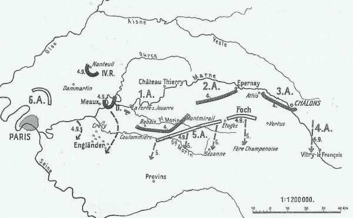
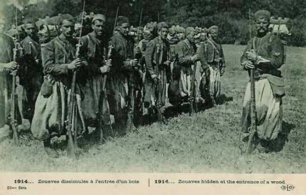
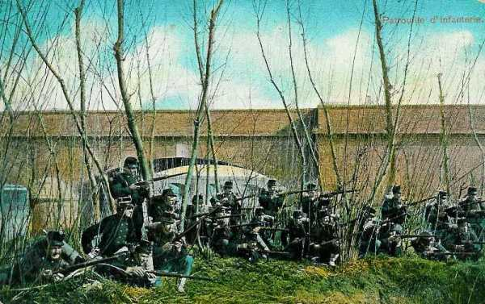
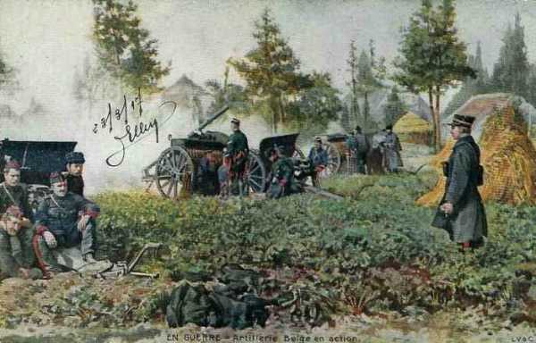
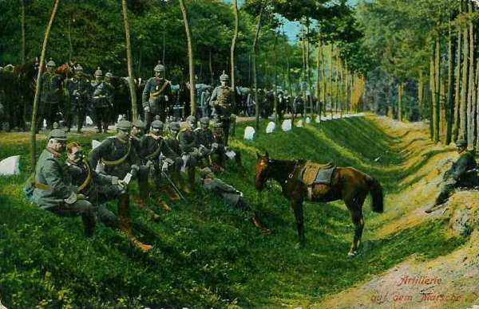
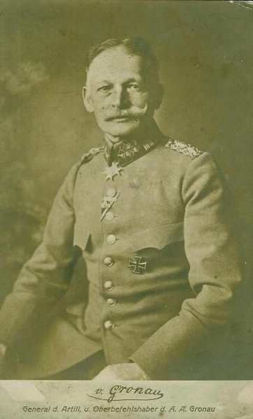

# Le 4 septembre 1914

Sur incitation de Galliéni, Joffre accepte de lancer une offensive générale le 6 septembre mais doit pour cela obtenir la coopération des Anglais. Galliéni expédie à la VIe armée des ordres d’attaque sur l’Ourcq. Les premiers accrochages ont lieu entre la brigade marocaine et le 4e C.A.R. laissé par von Kluck face à Paris.

_Situation au 4 septembre_
_Der Marnefeldzug_

### G.Q.G. français

Les aviateurs communiquent leurs observations : plusieurs longues colonnes allemandes sont observées marchant sur les ponts de La Ferté-sous-Jouarre et Lizy-sur-Ourcq.

Les 9e et 21e C.A. sont enlevés de Lorraine pour être transportés vers l’ouest. Le 21e est transporté sur Wassy pour renforcer l’armée de Langle (IIIe).

Galliéni téléphone à Joffre et insiste sur l’urgence de l’attaque et demande l’autorisation de porter en avant la VIe armée dès le 5 au matin. Joffre, d’abord hésitant, donne l’autorisation.

Joffre se dispose à lancer l’offensive le 6 septembre. Il signe l’ordre général n° 6, mais French hésite à participer à une contre-attaque.

- La VIe armée doit franchir l’Ourcq entre Lizy-sur-Ourcq et May-en-Multien, en direction de Château-Thierry.

- L’armée anglaise doit occuper le front Changis, Coulommiers, en direction de Montmirail.

- La Ve armée doit attaquer sur le front Courtacon - Esternay - Sézanne.

- La IXe armée couvrira la droite de la Ve armée dans la région des marais de Saint-Gond.

Dans la nuit du 4 au 5 part du G.Q.G. l’ordre assignant leur tâche aux armées de gauche et du centre :

« 1° Il convient de profiter de la situation aventurée de la Ie armée allemande pour concentrer sur elle l’effort des armées alliées d’extrême gauche.

Toutes les dispositions seront prises dans la journée du 5 septembre en vue de partir à l’attaque le 6.

Dispositif à réaliser pour le 5 septembre au soir :

a)    Toutes les forces disponibles de la VIe armée au nord-est de Meaux, prêtes à franchir l’Ourcq entre Lizy-sur-Ourcq et May-en Multien dans la direction générale de Château-Thierry...

b)    L’armée anglaise, établie sur le front Changis - Coulommiers face à l’est, prête à attaquer dans la direction générale de Montmirail.

c)    La 5e armée, se resserrant légèrement sur sa gauche, s’établira sur le front général Courtacon - Esternay - Sézanne, prête à attaquer dans la direction générale sud-nord, le C.C. Conneau assurant la liaison entre l’armée anglaise et la Ve armée.

2° La IXe armée (général Foch) couvrira la droite de la Ve armée en tenant les débouchés des marais de Saint-Gond et portant une partie de ses forces sur le plateau au nord de Sézanne.

3° L’offensive sera déclenchée par les différentes armées le 6 septembre, dès le matin".

En résumé, à l’ouest, l’armée britannique et la VIe armée sont poussées concentriquement sur la droite allemande. A l’est, la Ve armée reçoit comme objectif les forces allemandes qui avancent en Champagne. Le centre reçoit d’abord une mission de résistance. Les IVe et IXe armées sont distendues sur un front de plus de 100 km (du sud-ouest de Revigny au nord de Sézanne).

### IIe armée française

Castelnau résiste aux attaques et bombardements sur le Grand Couronné de Nancy opérés par la VIe armée allemande.

### Ve armée française

Elle fait halte au sud de la route de la Ferté-Gaucher à Etoges. Sa gauche est en contact entre le Grand et le Petit Morin avec les C.A. de gauche de l’armée de von Kluck (9e et 3e C.A.)

A 16h, le général Franchet d’Esperey envoie une note au G.Q.G. :

"La bataille ne pourra avoir lieu qu’après-demain 6 septembre.

Demain, la Ve armée continuera son mouvement rétrograde sur la ligne Provins-Sézanne. L’armée anglaise fera un changement de direction face à l’est, sur la ligne Changis - Coulommiers, à condition que son flanc gauche soit appuyé par le VIe armée sur l’Ourcq au nord de Lizy-sur-Ourcq, demain 5 septembre.

Le 6, la direction générale de l’offensive anglaise serait Montmirail, celle de la VIe armée serait Château-Thierry, celle de la Ve armée serait Montmirail."

C’est le schéma de la bataille de la Marne.

### VIe armée française

Des reconnaissances de cavalerie confirment le changement de direction de la Ie armée allemande, déjà constaté par l’aviation. La route Senlis - Paris et la région de l’ouest sont vides d’ennemis.

Galliéni expédie dès 20h30 au général Maunoury un ordre d’opérations pour la journée du lendemain.

I) Tous nos renseignements concordent à démontrer que les gros de la Ie armée allemande, qui faisaient face jusqu’ici à la VIe armée, se sont orientés vers le sud-est. Des colonnes importantes ont été signalées hier soir se dirigeant vers la Marne pour la franchir entre La Ferté-sous-Jouarre et Château-Thierry. Ce mouvement paraît nettement dirigé contre la droite anglaise et la gauche de la Ve armée française. Une colonne allemande, qui paraît constituer la droite allemande, était aujourd’hui en marche de Nanteuil-le-Haudouin sur Meaux et Lizy-sur-Ourcq.

Dans ces conditions, Paris cessant d’être menacé, toutes les forces mobiles de l’armée de Paris doivent manœuvrer de manière à conserver le contact avec l’armée allemande et à la suivre pour se tenir prêtes à participer à la bataille à prévoir.
L’armée anglaise a fait connaître qu’elle se prépare à agir dans le même sens.

II)               ...

III) Le lendemain, la VIe armée se mettra en mouvement dans la direction de l’est en se maintenant sur la rive droite (nord) de la Marne de manière à amener son front à hauteur de Meaux et à être prête à attaquer le 6 au matin en liaison avec l’armée anglaise qui attaquera sur le font Coulommiers - Changis... »

L’ordre de bataille est le suivant :

- 55 et 56e divisions de réserve et une brigade marocaine au nord de Dammartin.
  7e C.A. entre Dammartin et Othis.
  14e  division et 63e division de réserve à Rouvres.
  Brigade de cavalerie Gillet au nord-est de Claye.
  61 et 62e divisions de réserve à Pontoise, devant rejoindre la ligne de front.
  45e division algérienne (Drude) à Dammartin comme réserve d’armée.
  4e C.A. à Gagny.
  La garnison de Paris (83, 85, 89 et 92e divisions territoriales)
  La brigade de fusiliers marins de l’amiral Ronarc’h.

L’armée doit gagner le front Lizy-sur-Ourcq - May-en-Multien. Elle a son centre de gravité entre Dammartin et Luzarches.

En début d’après-midi a lieu un combat de rencontre entre la VIe  armée et le IVe C.A.R., dans la région de Marcilly - Chambry. Le C.A. allemand doit repasser la Thérouanne. Ce sont les premiers combats de la bataille de la Marne.

Diverses unités sont transférées vers le champ de bataille principal :

- Une partie du 9e C.A. de Nancy à Troyes.
  Le 21e C.A. d’Epinal à Gondrecourt.

_Zouaves_
_Collection privée_

### Armée anglaise

L’armée est au repos et reçoit un renfort de 20.000 combattants. Elle opère sa conversion pour appuyer la gauche de la VIe armée française qui se porte sur la ligne de l’Ourcq, au nord de Meaux.

La direction de l’offensive de la VIe armée sera Château-Thierry, celle de la Ve armée et de l’armée anglaise sera Montmirail.

Voici la position des C.A. :

- 1e C.A. : Courpeloy - Pézarches.
  2e C.A. : La Haussaye - Tigeaux.
  3e C.A : Bailly.
  C.C. : Haute-Maison - Coulommiers, en liaison avec le C.A. français.

### Armée belge de campagne

Les Allemands entament une offensive pour couper la ligne de communication entre Anvers et la côte.

8h : de nombreuses troupes allemandes marchent sur Dendermonde : au moins 20.000 hommes.

8h45 : le général Warnant signale qu’il a dû  replier ses postes situés en avant de Dendermonde, étant attaqué par l’est et le sud.

10h : le bombardement de Dendermonde commence de plusieurs côtés. La ville est évacuée par les troupes belges. Dans le 4e secteur, le 1e bataillon de la 5e division est attaqué au sud de Kapelle-op-den-Bos et refoulé.

Dès qu’il est mis au courant de la situation, le Roi ordonne de tendre immédiatement l’inondation de la Durme et de diriger les 1e et 6e divisions sur la rive gauche de l’Escaut car les Allemands semblent vouloir attaquer sur la rive gauche avec des forces évaluées à deux divisions. Pour garderla communication vers l’ouest, il faut lutter avec des forces à peu près égales.

13h : les Allemands s’en prennent à la redoute de Letterheide près du fort de Liezele.

16h30 : le détachement Warnant est menacé par une colonne allemande qui a passé l’Escaut à Baasrode (est de Dendermonde). Il a dû abandonner la défense de l’Escaut et se retirer au nord de la Durme vers Hamme, n’ayant pu détruire le pont sur l’Escaut à Dendermonde. Les communications de l’armée belge avec l’Ouest sont sérieusement menacées.

19h : ordre est donné à la 2e division et à la D.C. de se porter immédiatement par le pont de Burcht sur la rive gauche de l’Escaut. Le gouverneur confie le commandement de ce détachement au lieutenant-général De Guise.

20h45 : le détachement Warnant a été repoussé par des troupes évaluées à 25.000 Allemands équipés d’une nombreuse artillerie. La colonne a été ralliée au nord de la Durme.

23h : le 4e secteur (5e division) est attaqué vers Londerzeel et Kapelle-op-den-Bos, par des troupes de toutes armes venant de Grimbergen.

En fin de journée, la situation se stabilise :  la 5e division reste chargée de la défense du 4e secteur et la 2e division doit rester sur la rive droite de l’Escaut, en réserve des 4e et 5e secteurs.

Les survivants du siège de Namur (4e division) débarquent à Oostende et à Zeebrugge.

_Patrouille d’infanterie belge_
_Collection privée_

_Artillerie belge en action_
_Collection privée_

### O.H.L. : Moltke ne peut pas renforcer l’aile droite

**[Lien vers progression des armées allemandes](../img/progression_armees_all2.jpg)**

**[Lien vers croquis](../img/progression_allemands.jpg)**

De source sûre, Moltke apprend que les Français déplacent depuis plusieurs jours des unités de leur droite vers leur gauche par chemin de fer. Il pense que les français projettent une contre-offensive dès que leurs forces seront regroupées. Le camp retranché de Paris leur en donne le moyen. Cette région permet la concentration rapide d’une armée en toute sécurité.

L’aile droite allemande, d’après la directive du 2 septembre, doit couper la ligne alliée de Paris et la rejeter vers le sud-est. Il faudrait, pour protéger ce mouvement, détacher plusieurs C.A. face à la capitale. Comme l’O.H.L. n’a pas de réserve à sa disposition, c’est aux armées de l’aile droite qu’il appartient de fournir ces détachements, mais elles n’ont pas assez d’effectifs pour s’en démunir et poursuivre en même temps l’offensive.

Moltke se rend enfin compte que l’aile droite a été affaiblie : trois C.A. sont occupés à assiéger des places fortes, une brigade tient garnison à Bruxelles et deux C.A. ont été envoyés sur le front oriental.

Il se rend compte que son flanc droit peut être débordé à son tour. Comment sortir de cette impasse ? Il faudrait prélever des troupes sur les armées de gauche pour les transférer vers l’aile droite. Rupprecht de Bavière refuse de voir réduire son armée et le Kaiser prend son parti.

A 17h30, l’O.H.L. reçoit un télégramme de von Kluck (daté de la veille à 21h30), annonçant qu’il compte pousser sur Rebais et Montmirail (à 20 km au sud de la Marne)

Moltke prend peur et à 18h, il signe l’ordre télégraphique suivant :
"Ie et IIe armées resteront face au front de Paris : Ie armée entre Oise et Marne, IIe armée entre Marne et Seine. La IIIe armée marchera sur Troyes.

"Les IVe et Ve armées, se portant rapidement vers le sud-est, ouvriront le passage de la Moselle aux VIe et VIIe armées. Aile droite de la Ve armée sur Revigny. Avec aile gauche, prise des forts de Troyon, Les Paroches, Camp des Romains".

C’est le troisième plan adopté en neuf jours.

- 27 août : les armées sont orientées vers Paris et la Basse Seine.
  2 septembre, les armées sont orientées vers le sud-est, pour couper les armées françaises de Paris.
  4 septembre : Moltke oriente les deux armées de droite face à l’ouest, en direction de Paris et de la Basse Seine.

### Ie armée allemande

Von Kluck, qui a cherché depuis le début de la guerre à enfoncer le flanc gauche des alliés, n’admet pas d’abandonner la poursuite, surtout qu’il est en contact des Anglais et de l’aile gauche française.

Le soir, la Ie armée a tous ses C.A. sauf un au sud de la Marne, sur le Petit Morin (entre Montmirail et La Ferté-sous-Jouarre). Seuls le 4e C.A.R. et le 4e D.C. sont dans la région de Nanteuil-le-Haudouin.

Les ordres pour le jour suivant sont de continuer la marche vers la Seine en se couvrant du côté de Paris.

Le front à atteindre suit la ligne Esternay - Sancy - Choisy - Coulommiers. Le 4e C.A.R. et la 4e D.C. couvrent le flanc de l’armée dans la région de Nanteuil-le-Haudouin - Marcilly - Chambry.

Après une marche de 420 km, les troupes sont épuisées. Von Kluck n’est plus qu’à 18 km de Paris et continue à avancer vers le sud.

_Colonne d’artillerie allemande_
_Collection privée_

Le 4e C.A.R., flanc-garde du dispositif, doit se porter dans la région de Marcilly - Chambry contre le front nord-est de Paris. L’infanterie atteint ses positions entre 9 et 10h. On signale qu’une colonne française se dirige vers l’est. Von Gronau (commandant du détachement) donne l’ordre d’attaquer. Une rencontre se produit avec l’aile droite de la VIe armée française. Le champ de bataille est coupé en diagonale (sud-est vers nord-ouest) par une suite de hauteurs (Penchard, Monthyon, bois de Tillières).

_Général von Gronau_
_Collection privée_

La 22e division de réserve se saisit du mamelon de Penchard et se trouve nez à nez avec la brigade marocaine. L’attaque de la division marocaine échoue, l’infanterie allemande prend l’offensive et rejette les bataillons français vers Villeroy, où elle est arrêtée par la 55e division de réserve française. En fin de journée, la 55e division de réserve se replie un peu en arrière d’Iverny et de Plessis-l’Evêque.

### IIe armée allemande

Vers 14h, l’armée est entièrement au sud de la Marne, de Dormans à Epernay (Epernay - Mareuil-en-Brie - Condé-en-Brie).

### IIIe armée allemande

Après avoir dû combattre des arrière-gardes, l’armée atteint la Marne au soir et elle tient la zone de Tours-sur-Marne à Châlons. Von Hausen donne un jour de repos à ses troupes, tant pour les laisser se remettre de leurs fatigues que pour faire serrer les deux divisions de réserve retardées devant Givet et Reims.

Il forme une cavalerie d’armée, chargée de reconnaître, le 5 septembre, le terrain entre la Marne et l’Aube afin de conserver le contact avec l’adversaire.

Von Hausen signale que le gros de l’armée française se replie au sud du Petit Morin (les marais de Saint-Gond) vers la ligne Sézanne - Fère-Champenoise.

### IVe armée allemande

Le duc de Wurtemberg compte atteindre en soirée la ligne générale Châlons - Sainte-Ménehould. Moltke oriente vers le sud-est l’aile droite de l’armée.

### Ve armée allemande

La Ve armée converge dans le même sens que la IIIe armée française et aligne son gros entre l’Aisne et la Meuse, des environs de Sainte-Ménehould jusqu’à Forges.

L’armée reçoit pour mission d’enlever les forts de Troyon, des Paroches et du Camp des Romains (forts du système Séré de Rivières).

[Lien vers la journée suivante](article_04_54.md)