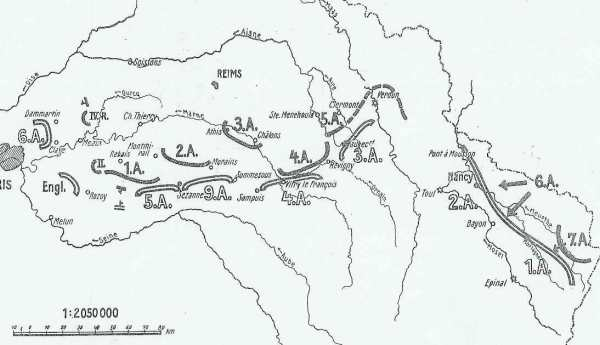
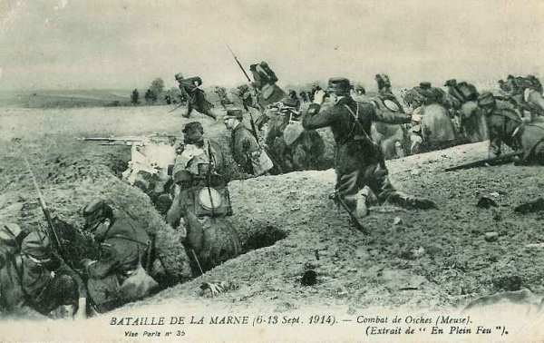
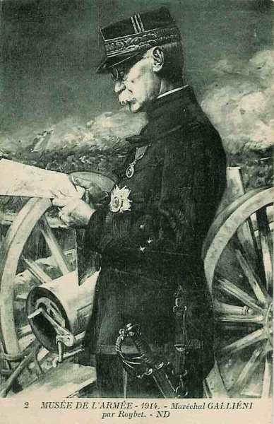
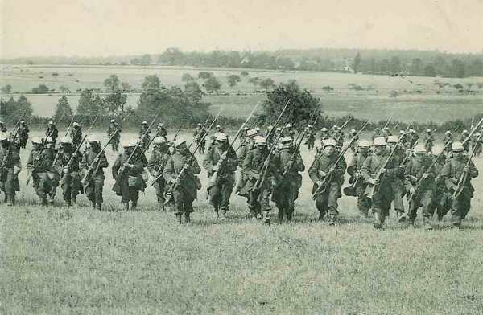
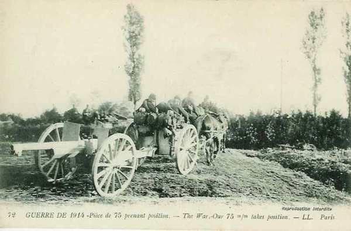
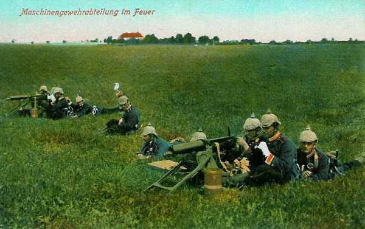

# Le 5 septembre 1914

Joffre lance son fameux appel : il ne s’agit plus de céder le moindre pouce de terrain mais de contre-attaquer. La VIe armée attaque le 4e C.A.R. laissé en flanc-garde dans la région de Saint-Soupplets. Joffre fait appel à l’honneur de l’Angleterre, ce qui décide French de passer à l’attaque. Moltke s’est rendu compte du danger pour son flanc droit et ordonne aux Ie et IIe armées de faire face à Paris mais von Kluck ignore l’ordre et continue sa marche vers le sud. Il a déjà largement dépassé la Marne.

_Situation au 5 septembre_
_Der Marnefeldzug_

### G.Q.G. français

Le Q.G. doit déménager à Châtillon-sur-Seine.

A 7h30, Joffre lance un ordre du jour pathétique

« Au moment où s’engage une bataille dont dépend le salut du pays, il importe de rappeler à tous que le moment est venu de ne plus regarder en arrière ; tous les efforts doivent être employés à attaquer et à refouler l’ennemi. Une troupe qui ne pourra plus avancer devra, coûte que coûte, garder le terrain conquis et se faire tuer sur place plutôt que de reculer. Dans les circonstances actuelles, aucune défaillance ne peut être tolérée »

Joffre se rend au Q.G. de French qui est réticent de participer à l’offensive. Or, sa participation est indispensable.Il plaide pour l’intervention anglaise, dit que l’heure est décisive.

Joffre, si flegmatique d’habitude, frappe sur la table d’un coupe de poing et dit "L’honneur de l’Angleterre est en jeu, Monsieur le Maréchal !".
French, qui jusqu’à présent avait écouté impassible, rougit fortement. Il y a un court silence impressionnant, puis il murmure avec émotion : "I will do all my possible".

Joffre rappelle les 15e et 21e C.A. de Lorraine et des Vosges. Le 15e C.A. embarque à destination de Bar-le-Duc et le 21e embarque à Epinal vers le plateau de Mailly.

Voici à cette date la position des armées françaises :
le front entre la VIe armée à l’ouest et la IIIe armée à l’est s’étend sur 280 km.

- VIe armée : entre Dammartin-en-Goëlle et Claye-Souilly, couverte au nord par le C.C. Sordet.

- Armée anglaise : de Rosoy-Lagny à la lisière sud de la forêt de Crécy.

- Ve armée : du nord-est de Provins à Sézanne, couverte à gauche par le C.C. Conneau (4e, 8e,10e D.C.).

- IXe armée : de Sézanne à Sommesous (camp de Mailly).

- IVe armée : de Sompuis à Sermaize.

- IIIe armée : entre Revigny-sur-Ornain et les abords de Verdun.

En matinée, Joffre donne aux armées de droite l’ordre suivant :
"Demain 6 septembre, la IVe armée, arrêtant son mouvement vers le sud, fera tête à l’ennemi et s’efforcera de se tenir prête à reprendre l’offensive, en liant son mouvement à celui de la IIIe armée.

"La IIIe armée, se couvrant vers le nord, débouchera vers l’ouest pour attaquer dans le flanc gauche les forces ennemies qui marchent à l’ouest de l’Argonne".

### IIe armée française : bataille du Grand Couronné de Nancy

### IIIe armée française

- Le 5e C.A. est établi au nord de Revigny, de Sommeilles à Vaubécourt.

- Le 6e C.A. tient le front Sommaisne - Beauzée - Deuxnouds. Après le départ de la 42e division vers l’armée de Foch, le 6e C.A. ne comprend plus que les 12e et 40e divisions.

- Le 3e groupe de divisions de réserve, provenant de l’armée de Lorraine, prend position de Courouvre à Saint-Mihiel.

En soirée, Joffre met à la disposition de la IVe armée le 21e C.A., retiré de la Ie armée (Dubail).

### IVe armée française

Malgré les succès remportés sur la Meuse, la IVe armée a, selon l’ordre de Joffre, suivi le mouvement général de repli vers le sud. Les forces ont été diminuées des 9e et 11e C.A., qui vont former le noyau de l’armée Foch.
Le 5, malgré le mouvement offensif de la VIe armée sur l’Ourcq, le IVe armée est encore en retraite devant l’aile gauche de von Hausen et la IVe armée allemande.

_Combat de Osches_
_Collection privée_

- Le 17e C.A. a traversé la Marne entre Châlons et Vésigneul et tient le soir les abords sud de la voie ferrée de Sommesous à Vitry.

- Le 12e C.A. occupe Huiron et Frignicourt, mais la plus grande partie du C.A. s’est embarquée à Loisy et Vitry pour aller se recontituer à l’arrière, sur l’Aube.

- Le corps colonial parvient à passer vers 17h sur la rive gauche de la Saulx et occupe Vauclerc et Favresse.

### VIe armée française

Joffre envoie à Galliéni le message suivant :

« En raison du mouvement des armées allemandes qui paraissent glisser en avant de notre front dans la direction du sud-est, j’ai l’intention de porter votre armée en avant dans leur flanc, c’est-à-dire dans la direction de l’est, en liaison avec les troupes anglaises.

Prenez dès maintenant vos dispositions pour que vos troupes soient prêtes à marcher cet après-midi et entamer demain un mouvement général dans l’est du camp retranché.

Je mets la 45e division maintenant sous vos ordres. Venez de votre personne me parler le plus tôt possible ».

_Général Galliéni (gouverneur de Paris)_
_Collection privée_

Voici les positions d’attaque le long de l’Ourcq :

Au nord de Dammartin, les 55 et 56e divisions de réserve et une brigade marocaine.

Entre Dammartin et Saint-Denis, la 14e division du 7e C.A. et la 63e division de réserve.

- Au nord-est de Clayes, la brigade de cavalerie Gillet.
    A Pontoise, les 61 et 62e divisions.
    A Gagny, le 7e C.A., venu d’Alsace.

Cela représente dix divisions d’infanterie appuyées par les C.C. Sordet et Gillet, y compris 8 à 9 bataillons de zouaves.

L’avant-garde de la 56e division de réserve a occupé Saint-Soupplets. Elle est canonnée par les batteries de la 4e D.C. allemande en position sur les hauteurs d’Oissery. Les Français doivent reculer et les Allemands s’emparent de Saint-Soupplets.

_Charge d’infanterie française_
_Collection privée_

Un accrochage avec l’aile droite de la Ie armée allemande a lieu dans cette dernière localité.

C’est au cours de ce combat que Charles Péguy, écrivain, poète et essayste de grand renom, tomba au combat à Villeroy.

_Batterie de 75 prenant la position de combat_
_Collection privée_

### IX armée française

Elle prend officiellement sa dénomination.

### Armée anglaise

Joffre se rend chez French pour le persuader à concourir à l’offensive. French reste hésitant. Joffre déclare que l’honneur de l’Angleterre est en jeu et French lui répond qu’il fera tout ce qui est en ses possibilités pour participer à la contre-offensive. Le B.E.F. arrête sa retraite.

### Armée belge

Au lieu de continuer leur offensive vers Dendermonde, les Allemands se retirent au sud de l’Escaut après avoir fait sauter le pont. Pourquoi abandonner leur attaque ?
Tout simplement pour inciter les Belges à rester sur la défensive car l’O.H.L. a appris que des débarquements alliés ont lieu à Zeebrugge et à Oostende.

- La ligne de retraite des Belges vers la côte est la voie ferrée Anvers - Temse - Sint-Niklaas - Sint-Gillis-Waas - Zelzate - Eeklo - Brugge - Oostende.
  Elle est couverte par deux lignes de défense :
    L’Escaut d’Anvers jusqu’à Gent.
    La Durme, de son embouchure jusqu’à Lokeren, prolongée par le canal de Zuidlede et celui de Gent - Terneuzen.

- Deux autres itinéraires sont possibles :
    Le route allant des ponts de la tête de Flandre au pont de Zelzate par Burcht - Beveren-Waas - Stekene - Koewacht et Overslag.
    la route allant des ponts d’Hemixem et de Temse au pont de Terdonk par Sint-Niklaas - Moerbeke et Wachtebeke.

### O.H.L. : aveu d’échec

**[Lien vers progression des armées allemandes](../img/progression_armees_all2.jpg)**

**[Lien vers croquis](../img/progression_allemands.jpg)**

Les instructions transmises aux commandants d’armée reconnaissent l’échec provisoire du plan Schlieffen :

« L’adversaire s’est soustrait à l’offensive enveloppante des Ie et IIe armées et est parvenu à s’appuyer à Paris avec une partie de ses forces. En outre les comptes rendus des armées et d’agents dignes de foi permettent de conclure au transport de troupes ennemies de la ligne Toul - Belfort vers l’ouest.

Dans ces conditions, il n’est plus possible de refouler l’ensemble des forces françaises vers la Suisse dans la direction du sud-est. Au contraire, il y a lieu de tenir compte de ce que l’ennemi rassemble des forces importantes dans la région de Paris...pour menacer le flanc droit du dispositif allemand.

En conséquence, les Ie et IIe armées devront rester face au front de Paris...

Les IIIe, IVe et Ve armées sont encore au contact d’importantes forces ennemies. Elles devront s’employer à les refouler par une action continue vers le sud-est... ».

Les Ie et IIe armées doivent donc se placer face au front est de Paris, afin de couvrir les autres armées allemandes.

- Ie armée entre Oise et Marne.
    IIe armée entre Marne et Seine.

Moltke a en effet appris que des transports de troupes françaises ont eu lieu vers l’ouest, par prélèvement sur les IIe, IVe et Ve armées. Des forces françaises importantes sont signalées vers Dammartin.

Quand il apprend que von Kluck continue à foncer au sud de la Marne et ignore les ordres de l’O.H.L., il envoie un membre de sont état-major, le colonel Hentsch, pour l’arrêter.

Moltke ne soupçonne pas que la retraite des alliés a pris fin et que le lendemain ils passeront à l’attaque de Paris à Verdun.

- Voici la position des armées allemandes à cette date :
    Ie armée : a franchi le Grand Morin entre Coulommiers et Esternay.

- IIe armée : a franchi la Marne à Dormans et Epernay et a dépassé la route de Montmirail à Châlons avec ses têtes de colonnes.

- IIIe armée : s’étend du sud-ouest des marais de Saint-Gond au nord de Sompuis.

- IVe armée : se trouve entre Vitry et Heiltz-le-Maurupt.

- Ve armée : descend les deux versants de l’Argonne.

### Ie armée allemande

A 7h, von Kluck reçoit l’ordre préparatoire de Moltke. Après en avoir pris connaissance, il ne cherche qu’à l’éluder. Le commandement suprême prescrit à la Ie armée de rester en l’Oise et la Marne, alors que la grande majorité des forces a franchi depuis longtemps la Marne. Von Kluck prend prétexte de cette contradiction entre la lettre de l’ordre et la réalité des faits. Non seulement, il ne ramène pas son armée au nord de la Marne, mais il ne l’arrête pas et la laisse avancer vers le sud.

Il transfère d’ailleurs son Q.G. à Rebais, 12 km au sud de la Marne et envoie à l’O.H.L. un compte rendu frisant la désinvolture où il marque son intention de poursuivre jusqu’à la Seine (« Si on exécute l’ordre reçu d’investir Paris, les éléments ennemis reprendront leur liberté de manoeuvre sur Troyes. A Paris il n’y a probablement de forces importantes qu’en voie de concentration... je tiens pour une opération peu heureuse en ce moment celle qui consisterait à abandonner le contact avec un ennemi parfaitement capable de combattre vigoureusement et à déplacer les Ie et IIe armées. Je propose de mener la poursuite jusqu’à la Seine et d’investir ensuite Paris »).

A 11h, von Kluck donne ses ordres de poursuivre vers le sud : il ignore toujours ceux de l’O.H.L., qui sont de protéger l’armée allemande d’une attaque éventuelle provenant de Paris. Il préfère ne pas perdre le contact avec les armées anglaises et françaises en retraite. Les différents C.A. doivent atteindre la ligne Germigny - Nogent.

Une avant-garde atteint Villiers-Saint-Georges près de Provins. C’est l’avance extrême de l’armée allemande.
Le Q.G. de l’armée s’établit à Charly-sur-Marne.
Les ponts sur la Marne de Lizy, Germigny, La Ferté-sous-Jouarre, Lamy et Nanteuil doivent être occupés.

Sur le flanc droit de l’armée, les seuls éléments de couverture sont le 4e C.A. et la 4e D.C. et encore, le 4e C.A.R. a été affaibli suite à des prélèvements : notamment la brigade von Lepel est à Bruxelles et deux bataillons sont affectés à la garde des étapes. De 25 bataillons, le C.A. est réduit à 16 et ne dispose que de 6 batteries de 77.

Le commandant de C.A., von Gronau, dispose son C.A. face à l’ouest, sur la ligne Marcilly - Barcy - Chambry. La 22e division de réserve marchera sur Penchard et la 7e D.R. sur Saint-Mard.

_Mitrailleuses allemandes_
_Collection privée_

Cette dernière division se heurte à la 55e division de réserve française. Von Gronau ordonne une attaque des 55e et 22e divisions de réserve, qui oblige les Français à reculer sur une ligne de Saint-Soupplets à Penchard.

Le 7e C.A. français, qui se trouve vers la forêt d’Ermenonville, n’essaie pas d’envelopper le 4e C.A.R.

Von Gronau décide de se replier derrière la coupure de la Thérouanne (5km vers l’est), craignant d’être enveloppé le lendemain.

L’armée française occupe Saint-Soupplets.

Hentsch arrive au Q.G. de von Kluck le soir. A sa demande, l’état-major de la Ie armée établit les ordres pour ramener le lendemain le gros des armées au nord de la Marne. Seul le 9e C.A. restera sur place le long du Grand Morin. Les autres feront demi-tour pour regagner les régions de la Ferté-Gaucher (3e), la Ferté-sous-Jouarre (4e) et le nord de Meaux (2e).

En fin de nuit, un radiogramme parvient du 4e C.A.R., qui appelle au secours, car un adversaire supérieur a surgi devant lui au début de l’après-midi. Il envoie le 2e C.A. vers la boucle de la Marne.

### IIe armée allemande

Les forces allemandes réussissent à s’emparer de 4 forts de la ceinture fortifiée de Maubeuge.

Von Bülow est persuadé que les Français vont se réfugier derrière la Seine. La nouvelle instruction générale de l’O.H.L. prescrivant de s’établir entre Seine et Marne face à Paris lui est remise à 8h30. Il arrête aussitôt la marche de son aile droite dont la 7e C.A. est masqué par la gauche de l’armée de von Kluck, qui bloque la grand’ route au sud de Montmirail. Von Bülow prescrit seulement à sa gauche (C.A. de la Garde) de pousser jusqu’à Morains-le-Petit, défendu victorieusement par une arrière-garde française.

Le gros de l’armée ne dépasse pas la ligne Montmirail - Vertus. Von Bülow a l’intention de redresser le front de son armée vers le sud-ouest. Le 7e C.A. doit se placer entre Marne et Petit Morin, le reste de la ligne pivotera autour de Montmirail pour s’aligner sur Sézanne et Marigny-le-Grand.

### IIIe armée allemande

Von Hausen a octroyé un jour de repos à son armée et elle n’a pas bougé. Dans la soirée, il reçoit un radio contenant l’instruction générale aux termes de laquelle la IIIe armée doit poursuivre sa marche vers le sud, dans la direction générale de Troyes - Vendeuvre. Il donne par conséquent l’ordre de se porter pour le lendemain sur la ligne Vertus - Vitry-le-François et transfère son Q.G. à Châlons-sur-Marne.

### IV armée allemande

Le duc de Wurtemberg a atteint la ligne Vitry - Sainte-Ménehould. Il compte porter ses avant-gardes le 6 août au-delà du canal de la Marne au Rhin.

### VIe armée allemande

S’empare de Pont-à-Mousson.

[Lien vers la journée suivante](article_04_66.md)
