# Le 6 septembre 1914

Au nord de la Marne, la VIe armée FR progresse mais sans parvenir à l’Ourcq. L’armée anglaise atteint le cours inférieur du Grand-Morin, à l’ouest de Coulommiers. A sa droite, la Ve armée FR, progresse de plusieurs km.
Von Kluck reporte en toute hâte ses forces sur la rive droite de la Marne pour enrayer l’attaque de la VIe armée. Les IIe et IIIe armées allemandes attaquent vigoureusement et sous leur pression, la IXe armée FR ne peut se maintenir aux débouchés des marais de Saint-Gond.
La IVe armée FR est sérieusement accrochée dans la région de Vitry-le-François et une brèche de 20 km s’ouvre entre elle et la IXe armée.
La IIIe armée ne peut déclencher l’attaque en direction de l’ouest car elle fait face aux forces allemandes qui débouchent de l’Argonne, vers Revigny.

### G.Q.G. français

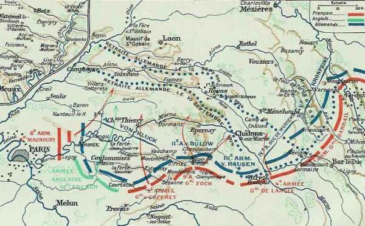
_Situation le 5 septembre au soir_
_Niox : la grande guerre_

Joffre poursuit la mise en œuvre de son plan d’attaque. Il doit toutefois surveiller deux points faibles dans son dispositif : l’intervalle entre la IX armée (Foch) et la IIIe (Sarrail) et celui entre la IVe armée (de Langle) et la IIIe armée.
Il prend des dispositions pour colmater les brèches de Mailly et de Revigny

- Brèche de Mailly : il envoie le 21e C.A. (sa réserve) dans la région de Vassy à disposition de la IVe armée et incite de Langle à contre-attaquer les forces qui déborderaient l’aile droite de la IXe armée dans la région de Sommesous.
  Brèche de Revigny : il prescrit à la IVe armée d’étendre son aile droite vers Sermaize-les-Bains et il met le 15e C.A. (sa réserve) à la disposition de la IIIe armée dans la région de Gondrecourt.

### IIe armée française

Deux batailles se livrent aux extrémités du front de la IIe armée.
A droite, les 16e et 8e C.A. rétablissent complètement leurs lignes.

- Le 16e C.A. réoccupe Gerbéviller.
  Le 20e réalise une importante avance. La 39e div. reprend Crévic. La 70e div. rés. progresse mais ne peut réoccuper Réméréville et Courbesseaux.

L’effort principal des Allemands se porte à la gauche de la IIe armée, sur les deux rives de la Moselle. La position de Sainte-Geneviève est bombardée toute la journée.
L’infanterie allemande monte à l’assaut de la position de Sainte-Geneviève vers 18h, en masses profondes, au son des fifres et des tambours mais les bataillons sont fauchés par le tir des 75 et des mitrailleuses. Les assaillants reprendront l’attaque pendant la nuit sans plus de succès. Le commandement allemand essaie ensuite de tourner la position.

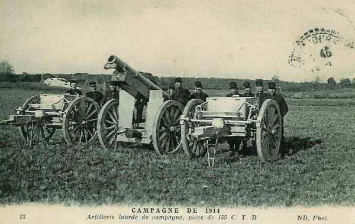
_Canon Rimailho de 155_
_Collection privée_

La ligne de défense française est intégralement maintenue mais la retraite de la 73e D.R. sur une profondeur de 6 km découvre le flanc gauche du Grand Couronné.

### IIIe armée française

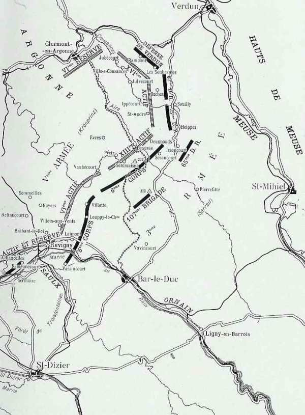
_IIIe armée française - Ve armée allemande_
_C Michelin, d’après guide édition 1919 - Autorisation n° 06-B-05_

Les instructions de Joffre sont de ne pas se laisser couper de la IVe armée alors que Sarrail ne veut pas s’éloigner de Verdun.

Les effectifs se situent entre la voie ferrée de Sainte-Menehould, Revigny et le secteur sud-ouest de Verdun (Souilly). La gauche est séparée de la IVe armée par une dizaine de km. Le point faible se situe à la jointure avec la IX armée (Foch). Sarrail reçoit du renfort (21e C.A. débarquant de Vassy).

Quand lui parvient l’ordre d’attaquer le flanc gauche allemand, l’armée, face à l’ouest, est déjà pressée sur toute la ligne par un ennemi très supérieur en nombre mais parvient à résister sur place.

- 5e C.A. : Les Allemands prennent l’offensive avant 6 heures du matin. Sommeilles et Nettancourt sont perdus. Le feu d’artillerie est si intense sur Noyers que la localité doit être abandonnée.
Les allemands manoeuvrent pour accentuer la poussée qui doit briser la liaison entre les armées de Sarrail et Langle de Cary ; ils descendent sur Villers-aux-Vents. toute la journée, le C.A. se défend pied à pied mais, tour à tour, Villers-aux-Vents, Brabant-le-Roi, Revigny, Laimont sont abandonnés.

- 6e C.A. : Les Allemands devancent son offensive et le C.A. doit résister sur la ligne Sommaisne - Beauzée - Deuxnouds.
Le centre se voit obligé d’abandonner Sommaisne, pour s’établir entre ce village et l’Aire. Il doit abandonner Beauzée et Deuxnouds et se retire au nord et à l’ouest de Seraucourt.

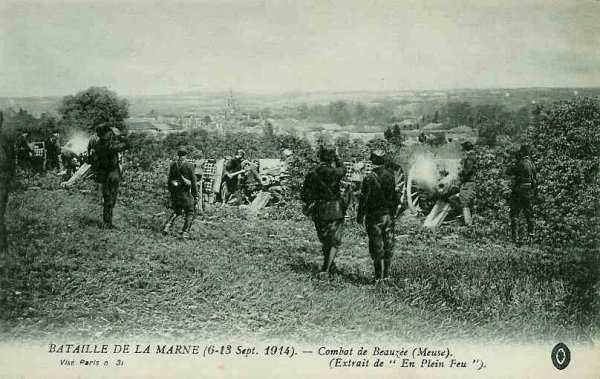
_Combat de Beauzée_
_Collection privée_

- 3e groupe de divisions de réserve : Les 75e et 67e divisions de réserve attaquent d’Issoncourt et de Souilly dans la direction de Saint-André-Ippécourt. En fin de journée, elles sont rejetées sur la ligne Signal d’Heippes - Souilly.

En soirée, les Allemands sont arrêtés sur la ligne Vassincourt - Villotte et la liaison avec le 2e C.A. de la IVe armée est maintenu. La charnière entre la IIIe et la IVe armée est menacée.

### IVe armée française

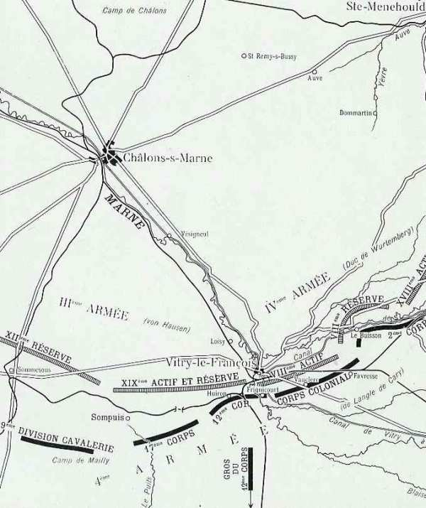
_IVe armée française - IIIe et IVe armées allemandes_
_C Michelin, d’après guide édition 1919 - Autorisation n° 06-B-05_

Elle s’étend sur une quarantaine de km, du sud-ouest de Sompuis à l’ouest de Revigny, le confluent de la Saulx et de l’Ornain.

L’aile gauche s’épaule sur la position fortifiée de Verdun et l’autre est solidement constituée des 17e et 12e C.A. La liaison entre la IVe et Ve armée se situe à Sermaize - Revigny.

La IVe armée est attaquée sur tout son front (coupure de l’Ornain, canal de la Marne au Rhin).

- 17e C.A. : Le C.A. se porte vers le nord. Malgré le feu de l’artillerie allemande établie au nord de la ligne de Sommesous à Vitry, une vive lutte d’infanterie se déroule à l’est du château de Beaucamp. Le soir, le 17e C.A. refoule le 19e saxon et porte ses avant-postes auprès de la ligne de chemin de fer, à l’ouest de Huiron.

- 12e C.A. : L’attaque allemande se produit dès le matin. Le C.A., fortement diminué, perd, après une résistance acharnée, Frignicourt, Courdemanges et Huiron, mais les Allemands ne tirent pas parti de leur avance et les français reprennent, dans la soirée, ces deux derniers villages.

- Corps colonial : A la gauche de ce C.A., après une lutte violente sur le canal de Saint-Dizier, les Allemands passent sur la rive sud et attaquent en force, mais ne peuvent pas entamer la ligne Blaise - Norrois - Matignicourt. Sur la droite, Vauclerc et Ecriennes tombent après de durs combats.

- 2e C.A. : Au cours de la matinée, le canal est forcé à l’ouest de Le Buisson. Le C.A. est menacéde perdre le contact avec le corps colonial. Le général Gérard envoie une brigade autour de Favresse pour remplacer les coloniaux.

Une brèche dangereuse sépare la IVe armée de la IXe entre Sommesous et Sompuis et entre la IVe et la IIIe à Revigny.

La IVe armée allemande est arrêtée dans sa poursuite entre les brèches de Mailly et Revigny et se trouve au sud-ouest de Vitry-le-François jusqu’à  l’Ornain. Le duc de Württemberg doit réclamer dès 11h le secours du C.A. de von Hausen (19e) pour permettre à sa droite (8e C.A.) de résister aux attaques de l’aile gauche de l’armée de Langle.
En soirée, la IIIe armée tient le front Villers-sur-Couzances - Asches - Saint-André - Sermaize - Villotte - Laimont, Neuville-sur-Orne - Vassincourt.

### Ve armée française

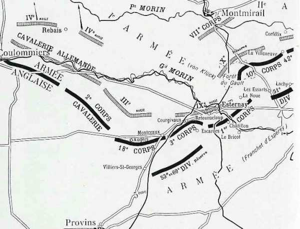
_Armée anglaise - Ve armée française - Ie et IIe armées allemandes_
_C Michelin, d’après guide édition 1919 - Autorisation n° 06-B-05_

La Ve armée, quant à elle, s’étend sur le front depuis le nord de Provins (18e C.A.) jusqu’à Sézanne (10e C.A.). Son objectif est d’attaquer le front Courtacon - Esternay - Sézanne, soit vers le nord. Les deux C.A. de gauche (18e et 3e) font face à l’aile gauche de von Kluck (3e et 9e C.A.). Les deux C.A. de droite (1e et 10e) sont opposés à l’aile droite de von Bülow (7e C.A. et 10e  C.A.R.)

La Ve armée doit attaquer dès 6h vers Montmirail les 3e et 9e C.A. de von Kluck. Le C.C. Conneau agira  en liaison avec le 18e C.A. tout en se reliant à l’armée anglaise.

- Le 18e C.A. (Maud’huy) refoule les avant-postes du 3e C.A. allemand de Sancy.
  Le 3e C.A. enlève Escardes et Courgivaux.
  Le 1e C.A. (Deligny) chasse l’armée allemande de Châtillon formidablement organisé et parvient jusqu’aux abords d’Esternay.
  Le 10e C.A. (Defforges) combat en liaison étroite avec la 42e division (Grossetti) de l’armée Foch contre le 10e C.A.R et le 7e C.A. de l’armée von Bülow vers Villeneuve-lès-Charleville qui sera prise et reprise plusieurs fois.

_Combat de Courgivaux_
_Collection privée_

En soirée, la Ve armée française n’a progressé que de 5 km, permettant à la Ie armée allemande de se dégager d’une situation critique.

### VIe armée française

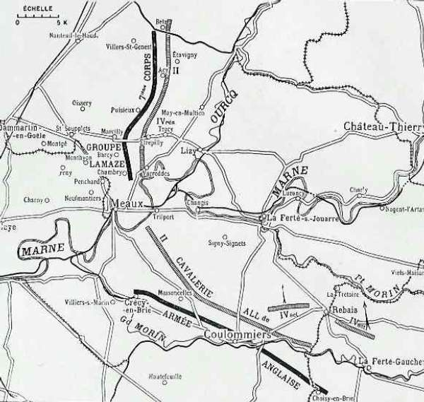
_VIe armée française - Ie armée allemande_
_C Michelin, d’après guide édition 1919 - Autorisation n° 06-B-05_

Selon l’ordre célèbre de Joffre, la VIe armée tombe sur le flanc droit de la Ie armée allemande en débouchant de Brézy, Saint-Soupplets et Penchard (route de Senlis-Meaux).
Maunoury ordonne l’attaque par la VIe armée.

- De Plessis-l’Evêque à Villeroy, le groupe de Lamaze (55e et 56e divisions), la brigade marocaine et la 45e division refoulent le 4e C.A. allemand de réserve des hauteurs de Penchard et de Monthyon.

- Parti du front Oissery - Saint-Soupplets, le 7e C.A. entame un enveloppement par le nord. La 14e division de ce C.A. (de Villaret) arrive jusqu’à Bouillancy.

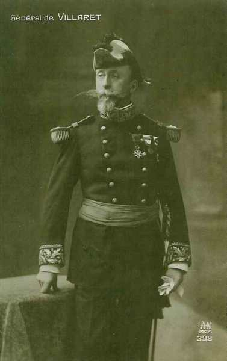
_Général de Villaret (14e division)_
_Collection privée_

Les aviateurs signalent devant les 3e et 9e C.A. des colonnes allemandes remontant du sud au nord. Il s’agit d’une offensive générale déclenchée par von Kluck pour contrer l’attaque de la VIe armée.

La VIe armée dépasse les hauteurs de Penchard et atteint à 9h la ligne Chambry - Barcy - Marcilly.

A gauche, se débarrassant assez vite des batteries de la 4e D.C. en positions près de Bouillancy, la division d’aile du 7e C.A. gagne du terrain vers l’est et menace de déborder la ligne allemande vers le nord. La 3e D.I. allemande débouche de Vareddes et s’aligne sur les hauteurs qui couronnent la rive droite de la Marne, puis passe à l’attaque. Cette attaque refoule quelque peu la droite française mais est prise sous le feu des batteries établies au nord de Penchard.

_Chasseurs à Nanteuil-le-Haudouin_
_Collection privée_

En soirée,  la VIe armée a quelque peu progressé au centre sur le front de l’Ourcq, entre Chambry - Puisieux et Acy-en-Multien, à quelques km de l’Ourcq.

Les C.A. allemands de gauche sont menacés d’enveloppement et à 10h du soir, von Kluck donne l’ordre aux 3e et 9e C.A. de revenir sur la rive nord du Petit Morin en aval de Montmirail. Ce sont ses dernières forces qui se trouvent au sud de la Marne.

### IXe armée française

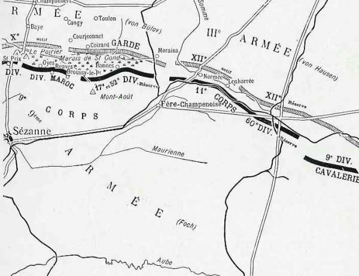
_IXe armée française - IIe et IIe armées allemandes_
_C Michelin, d’après guide édition 1919 - Autorisation n° 06-B-05_

L’armée a pris position au sud des marais de Saint-Gond, le 9e C.A. derrière les marais avec des avant-gardes au nord. A droite, la coupure de la Somme est défendue par le 11e C.A. à Ecury-le-Repos, Normée et Lenharrée. A l’est de cette localité, il y a un vide de 25 km séparant la IXe armée de la IVe, dont la gauche ne dépasse pas Sompuis. La 9e D.C. du général de l’Espée doit combler cette brèche.
Dans le secteur du 9e C.A.

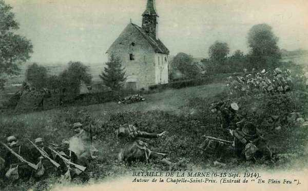
_Combat à Saint-Prix_
_Collection privée_

- La 42e division prend l’offensive avant le jour dans la direction générale nord-ouest contre Soisy et Villeneuve mais le 10e C.A. allemand, débouchant de Corfélix et des hauteurs de Saint-Prix, contre-attaque en force et l’oblige à reculer. Le combat est extrêmement violent. La Villeneuve est perdue à 8h du matin, est reprise à 9h et reperdue vers midi. L’intervention du 10e C.A. de l’armée de Franchet d’Espérey permet à la 51e division qui a perdu Saint-Prix, de conserver Soisy.

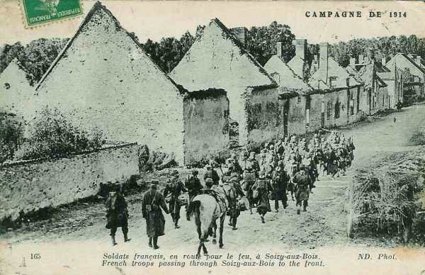
_Infanterie française à Soisy-aux-Bois_
_Collection privée_

- Après s’être organisé défensivement à la lisière sud des marais de Saint-gond, le 9e C.A. doit déboucher vers Champaubert. La gauche de la division du Maroc reçoit l’ordre de se porter sur Saint-Prix et Baye. Ce mouvement offensif est bientôt arrêté.

- La 17e et la 52e divisions de réserve s’établissent à la lisière sud-est des marais, en s’appuyant sur le Mont-Août. Le 135e (17e division) livre des combats violents à Toulon-la-Montagne et à Morains-le-Petit, mais est obligé de battre en retraite, et, repassant les marais, va se reformer au Mont-Août.

Le 11e C.A., pressé par deux C.A. allemands (12e C.A. et 12e C.A.R.), plie et son recul oblige la 17e division à se retirer devant la Garde au sud des marais de Saint-Gond. Foch est obligé d’engager ses réserves dans ce secteur.
La division du Maroc reste sur la défensive. A la gauche, le combat se déroule sur une crête appelée « Signal du Poirier ». Cette crête est perdue par les Français. Sur la droite, Oyes, Reuves et Broussy-le-Petit résistent à toutes les attaques.

Le 11e C.A., malgré des pertes élevées, tient jusqu’à 15h sous une avalanche de projectiles de gros calibre. Il doit par la suite évacuer Normée et Lenharrée et s’établit dans les bois avoisinants. Ce jour, la 18e division arrivant de Lorraine vient renforcer ce C.A.

Le soir, le 11e C.A. doit évacuer Ecury-le-repos et Normée devant une attaque par le 12e C.A. saxon.
Le 9e C.A. ne peut progresser et doit renoncer à se maintenir au nord des marais, mais il parvient à garder sa ligne de résistance au sud de ceux-ci.

### Armée anglaise : sur le Grand Morin

En matinée, les Anglais tiennent le front entre la Ferté-sous-Jouarre et Montmirail.
French ne s’est pas aperçu de la disparition du 2e C.A. allemand face à son armée. Celle-ci prend contact avec le réseau de cavalerie de von der Marwitz, chargé de protéger le flanc sud de la Ie armée. Le soir, l’armée anglaise est sur le Grand Morin, de Villeneuve-sur-Morin à Marolles-en-Brie. Elle comprend trois C.A. : à droite, le 1e C.A. (Haig) ; au centre, le 2e (Smith Dorrien) ; à gauche le 3e (Pulteney).

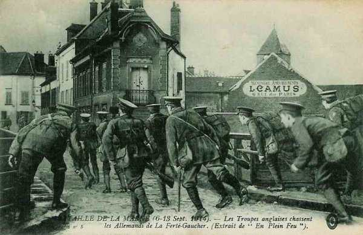
_L’armée anglaise à La Ferté-Gaucher_
_Collection privée_

Toutefois, French, échaudé par ses expériences depuis le début de la campagne, redoute de dépasser les armées voisines et ne marche qu’avec hésitation. Il demande l’appui d’une division française. Les forces du C.C. von der Marwitz qui lui font face se replient lentement et s’arrêtent le soir aux abords de Coulommiers.
Entre la droite de l’armée anglaise et la gauche de la Ve armée française, il y a un vide de +- 20 km, qui sera comblé par le C.C. Conneau.

- Voici la position des Anglais en soirée :
  1e C.A. : Choisy.
  2e C.A. : Coulommiers.
  3e C.A. : Villers-sur-Morin - Crécy.

Le gros de la Ie armée allemande s’est retiré vers le nord sans se laisser accrocher.
French donne l’ordre de forcer le passage du Grand Morin pour le 7.

Joffre demande à French d’opérer une conversion vers le nord, alors que l’armée anglaise avait jusqu’à présent marché vers l’est-nord-est.
French se rend à présent compte que la Ie armée allemande recule et abandonne toute hésitation.

### Armée belge

- L’effectif de l’armée belge se monte à 80.000 hommes, répartis comme suit :
  1e division dans le 5e secteur et sur la ligne de la Durme.
  5e division dans le 4e secteur.
  3e division dans le 3e secteur.
  2e et 6e divisions en réserve, la 2e au nord-est de Lier et la 6e au nord de Kontich.
  D.C. à Heist-op-den-Berg.

La 1e division joue un rôle important car elle garde la ligne de communications vers Oostende, que l’armée emprunterait si elle devait abandonner Anvers.

Il ne reste plus que les 3e,6e, 2e divisions et la D.C.
pour attaquer sur le front Muizen - Haacht - Werchter - Aarschot, soit 20 km. Ces divisions vont agir sur la droite allemande, de Muizen à Aarschot, jugée la plus vulnérable.

### O.H.L.

Les directions prescrites aux trois premières armées pour faire face à Paris sont :

- Ie : ramener ses C.A. en arrière, en commençant par la droite.
  IIe : maintenir la droite immobile, le centre et la gauche continuant d’avancer.
  IIIe : poursuivre vers l’est.

### Ie armée allemande

En matinée, les aviateurs signalent devant les 3e et 9e C.A. des colonnes françaises remontant du sud au nord. Il s’agit d’une offensive générale. Les 2e et 4e C.A., partis dans la nuit, repassent le Grand Morin en direction du nord.

Von Kluck voit son aile gauche vivement pressée et son aile droite risque à tout moment d’être assaillie. Restant fidèle aux principes de Schlieffen, il veut envelopper l’aile gauche des Français. Il aiguille la 3e division (2e C.A.) par Vareddes sur le plateau qui sépare la Marne de la Thérouanne. Se fiant à la solidité des 3e et 9e C.A. et escomptant la lenteur des Anglais, il décide de jeter dans la bataille le 4e C.A. et lui prescrit de se porter vers La Ferté-sous-Jouarre pour écraser l’armée de Maunoury.

Pendant toute la journée, le 3e C.A. se maintient sur le front Sancy - Montceaux. Au 9e C.A., le général von Quast veut tromper l’adversaire en passant à l’offensive. Une première attaque se brise sous le feu des canons français mais une seconde offensive réussit à dégager le 9e C.A. avant la nuit.

En soirée, les C.A. de gauche sont menacés d’enveloppement et à 10h du soir, von Kluck donne l’ordre aux 3e et 9e C.A. de revenir sur la rive nord du Petit Morin en aval de Montmirail.

- L’armée de von Kluck est ainsi coupée en deux :
  2 C.A. (3e et 9e) se battent face au sud sur la ligne Sancy - Esternay (30 - 40 km au sud de la Marne)
  Les trois autres C.A. sont face à l’ouest.

Le vide s’élargit à mesure que von Kluck retire des unités pour les porter sur l’Ourcq. Il demande dès lors à von Bülow de lui envoyer en renfort le 7e C.A. et le 10e C.A.R. pour remplacer les 2e et 4e C.A., mais Bülow refuse car le 10e C.A.R. est déjà engagé sur le Petit Morin.

### IIe armée allemande

L’armée doit s’aligner en cours de journée sur le front Artonges - Montmirail - Marigny-le-Grand. Von Bülow croit que l’adversaire s’est retiré au-delà de la Seine et il prescrit à ses unités de poursuivre l’armée française, d’anéantir les arrière-gardes et de lancer des unités jusqu’à la vallée de la Seine pour y détruire la voie ferrée.

Le premier obstacle à franchir est constitué par le cours du Petit Morin et des marais de Saint-Gond dont il est le déversoir.
La droite de von Bülow se heurte à l’armée de Foch et à l’aile droite de Franchet d’Espérey (Ve armée).

Le 10e C.A. et la Garde refoulent les avant-gardes du 9e C.A. français au sud du marais. La 1e D.I. réussit à occuper Bannes mais, se trouvant sous des feux croisés, elle doit se replier en toute hâte. Plus à l’est, la 2e D.I. de la Garde fait face à Morains-le-Petit mais doit attendre l’appui de la IIIe armée pour prendre l’offensive.

Pour masquer la brèche entre les Ie et IIe armées face aux Anglais, il n’y a que le C.C. von der Marwitz sur le Petit Morin entre La Ferté-sous-Jouarre et Montmirail.

### IIIe armée allemande

Sur ordre de von Hausen, l’armée a pris un jour de repos sur la Marne le 5 septembre et se trouve fort en arrière des IIe et IVe armées. Elle doit atteindre la ligne Troyes - Vendeuvre et pour cela doit marcher droit au sud.

Le matin, le C.A. de la Garde demande de l’aide, prétendant que sa gauche est en danger. Von Hausen doit venir en aide à von Bülow, mais en se divisant. Son 12e C.A. occupe un front de 25 km. Il doit également venir au secours de la IVe armée, si bien que son armée doit opérer en fourche.

### IVe armée allemande

L’armée est arrêtée dans sa poursuite entre les brèches de Mailly et de Revigny et se trouve au sud-ouest de Vitry-le-François jusqu’à l’Ornain. Le duc de Württemberg doit réclamer dès 11h le secours du C.A. de von Hausen (19e) pour permettre à sa droite (8e C.A.) de résister aux attaques de l’aile gauche de l’armée de Langle.

### Ve armée allemande

Elle doit céder le 5e C.A., qui est dirigé vers Thionville pour être embarqué vers la Prusse orientale. Moltke donne un contre-ordre, mais l’unité est trop loin pour pouvoir rejoindre le champ de bataille.
Les IVe et Ve armées sont privées d’ un cinquième de leurs forces.
Les deux armées vont affronter celles des généraux de Langle et Sarrail.

[Lien vers la journée suivante](article_04_67.md)