# Le 9 septembre 1914

Joffre continue à renforcer la VIe armée par des prélèvements à l’est. Une menace pèse sur les arrières de la IIIe armée française car les Allemands atteignent la Meuse vers Saint-Mihiel. Les Ie et IIe armées allemandes restent séparées par une brèche et von Bülow entame une retraite. von Kluck est isolé et doit également donner un ordre de retraite. Au centre, les Allemands déclenchent une violente offensive contre l’armée de Foch mais Franchet d’Esperey lui vient en aide, ce qui sauve la situation. L’armée belge entame une seconde sortie d’Anvers vers les lignes de communication de l’armée allemande.

### G.Q.G. français

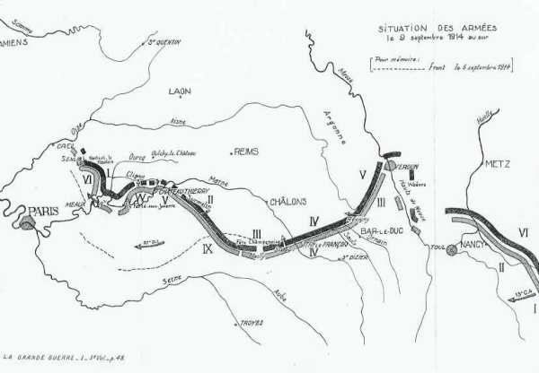
_Situation au 9 septembre_
_Les armées françaises dans la grande guerre_

Joffre sent la nécessité de renforcer la VIe armée. Il ordonne à la Ie armée (Dubail) de libérer un C.A. qui sera transporté à partir du 11 septembre vers Paris. Il renforce la VIe armée avec la 37e division d’infanterie, prélevée sur la Ve armée.

- Joffre signe l’instruction particulière n° 20 à 22h.
    L’armée anglaise poussera vers le nord entre l’Ourcq et Château-Thierry.
    La VIe armée appuiera l’aile gauche des Anglais.
    La Ve armée accompagnera le mouvement des anglais par son aile gauche.

La 6e D.C. est transférée de Mirecourt à Brienne.

### IIe armée

- Les 20e et 16e C.A. attaquent pour empêcher les Allemands de porter leurs réserves plus au nord.
    La 70e D.R. attaque entre la forêt de Saint-Paul et les bois d’Haraucourt, la 39e D.I. vers Drouville.
    Le 16e C.A. dirige la 64e brigade sur Rosières-aux-Salines.

Le 20e C.A. réalise d’importants progrès et pénètre jusqu’au milieu de la forêt de Saint-Paul. Sur la rive gauche de la Moselle, la 73e D.R. réoccupe Dieulouard.

### IIIe armée française

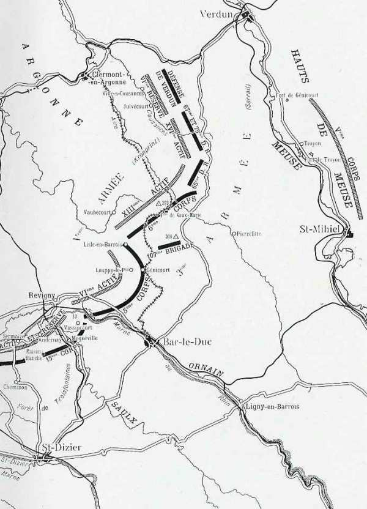
_IIIe armée française - Ve armée allemande_
_C Michelin, d’après guide édition 1918 - autorisation n° 05-B-18_

La situation continue à être difficile sur les arrières de l’armée, vers Saint-Mihiel et Verdun.
Sur son front, les Allemands ne gagnent pas un pouce de terrain et les forts de Troyon et de Génicourt tiennent encore. Vers 11h, le fort de Troyon, en ruine, cesse de tirer.

Les Allemands menacent alors la ligne de la Meuse vers Saint-Mihiel.
Des batteries allemandes, établies sur le Mort-Homme, bombardent le fort de Bois-Bourrus.
L’on craint que la IIIe armée soit coupée de la IVe, puis encerclée. Sarrail reçoit l’autorisation de replier sa droite le cas échéant mais se cramponne à Verdun. Il n’abandonnera pas le camp retranché tant que la Meuse ne sera pas franchie.

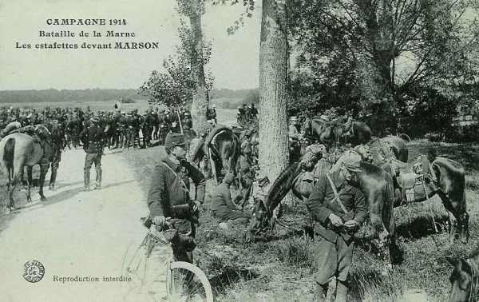
_Estafettes à Marson_
_Collection privée_

- 15e C.A. : L’attaque sur Vassincourt est reprise dès l’aube par la 57e brigade.

- 5e C.A. : Le C.A. coopère avec le 15e en attaquant de Vassincourt à l’Ornain.

- 6e C.A. : Le ligne ne bouge pas.

- Groupe des divisions de réserve : Il ne se produit aucune modifications importante sur le terrain.

### IVe armée française

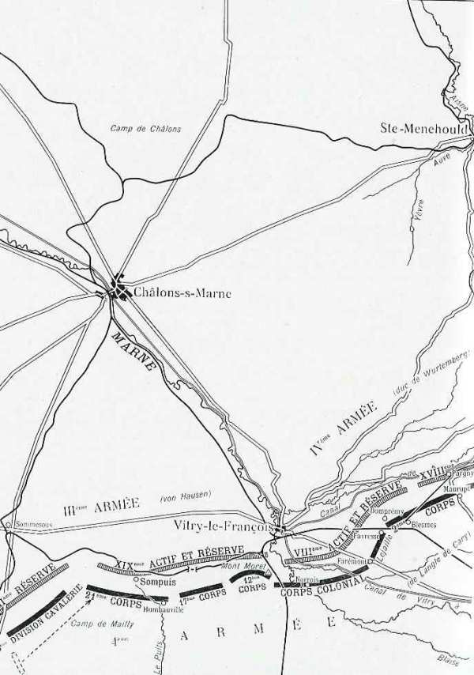
_IVe armée française - IIIe et IVe armées allemandes_
_C Michelin, d’après guide édition 1918 - autorisation n° 05-B-18_

Les assauts par les armées de von Hausen et du duc de Wurtemberg ne parviennent pas à faire fléchir l’armée.
Les Allemands sont signalés à Poivre-Sainte-Suzanne et à Mailly-le-Grand. Ces nouvelles arrivent au moment où la IXe armée est refoulée au sud de la ligne Semoine - Gourgançon.
Malgré l’artillerie lourde qui la soutient au nord-est de Sompuis, la ligne saxonne finit par céder.

- 21e C.A. : A l’extrême gauche du C.A., la 43e division, après avoir réduit au silence l’artillerie allemande, s’avance vers le sud ouest de Sompuis. La 13e division française fait reculer la 23e divison saxonne.
  La 23e division chasse les Allemands d’Humbauville et bivouaque le soir au sud de Sompuis.

- 17e C.A. : Il réussit également à progresser.

- 12e C.A. et corps colonial : Le Mont Moret est l’objet d’assauts impétueux de la part des Allemands, qui leur coûtent des pertes sérieuses. Le C.A. ne cède pas un pouce de terrain.

- 2e C.A. : la brigade Lejaille maintient les positions de Farémont, Favresse et Blesmes. Les troupes françaises ne parviennent pas à s’emparer de Domprémy.

Le 2e C.A. opère une poussée sur Sermaize et Andernay, appuyé par le 15e C.A. qui attaque sur le front Contrisson - Moynéville - Vassincourt.
En fin de journée, la gauche de l’armée a progressé vers Sompuis.

La situation de la droite et du centre étant satisfaisante, de Langle porte à l’ouest de la Marne deux divisions pour y renforcer les 17e et 21e C.A. afin de venir en aide à Foch. Toutefois, sur le front de la IVe armée, on n’a pas l’impression d’avoir remporté une victoire.

### Ve armée française

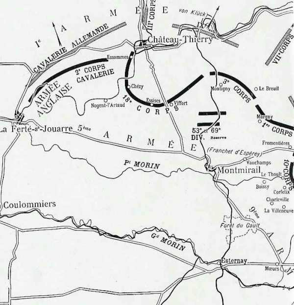
_Armée anglaise - Ve armée française - IIe armée allemande_
_C Michelin, d’après guide édition 1917 - autorisation n° 05-B-18_

- Des reconnaissances d’avions signalent que les colonnes allemandes sont en retraite et Franchet d’Espérey pousse son armée en avant. Il met son C.A. de droite (10e C.A.) à la disposition de la IXe armée.
    Le 18e C.A. (de Maud’huy) est orienté vers Château-Thierry et s’empare de la localité ; le groupe Valabrègue reste en seconde ligne sur Artonges, au nord de Montmirail.

- Le 3e .C.A. se porte sur Montigny-les-Condé, au sud-est de Château-Thierry.

- Le 1e C.A. doit passer le Petit Morin et coopérer, sur le plateau de Vauchamps, à l’action du 10e C.A. vers Bannay, c.a.d. vers l’est. Vers 8h30, il borde le Surmelin.

- La 19e division (10e C.A.) arrive au nord de Boissy-le-Repos quand elle est arrêtée par des tirs de mitrailleuses vers La Morterie et le bois du Thoult. La 2e division reçoit l’ordre de déborder ce bois.

La 37e division est rassemblée à Esternay et est embarquée à destination de la VIe armée, car Maunoury conçoit des inquiétudes pour son flanc gauche.

Franchet d’Espérey arrive vers midi au 1e C.A. et dit « Foch a été battu ce matin ; il contre-attaque à 16h ; il faut l’aider ; marchez sur Etoges ». Il est décidé que le 1e C.A. poussera une partie de ses forces dans la direction de Fromentières, Champaubert pour dégager la gauche de Foch, qui ne parvient pas à déboucher au nord du Petit-Morin, dans la région de Bannay - Baye.
L’action destinée à prendre de flanc et à revers l’adversaire combattant la gauche de l’armée Foch sera menée par la 19e division. Celle-ci s’engagera sur Bannay et sur Baye.

De Maud’huy apprend dans le cours de l’après-midi que Château-Thierry a été abandonné par l’armée allemande et y envoie la 38e division.

On apprend que la IXe armée a repris l’offensive. La 19e division traverse Soigny, Boissy-le-Repos. Douze batteries françaises tirent sur les convois d’un C.A. en retraite vers Bannay.

Vers 17h, le groupe est (1e et 3e C.A.) pousse par Champaubert et Vauchamps vers les plateaux de la rive sud du Surmelin.
Château-Thierry sur la Marne est atteint en soirée par la 38e division (18e C.A.).

### VIe armée française

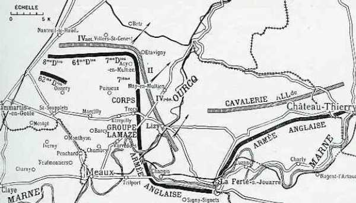
_VIe armée française - Ie armée allemande_
_C Michelin, d’après guide édition 1919 - autorisation n° 05-B-18_

Le 9 septembre marque le point culminant de la bataille de l’Ourcq. Sous la pression de la VIe armée et l’avance menaçante de l’armée anglaise, la Ie armée allemande est obligée de se retirer de la ligne Etrepilly - Vareddes.

_Charge d’infanterie à Etrepilly_
_Collection privée_

Dans la nuit, Maunoury rend compte à Joffre : ses troupes décimées, épuisées (par exemple, l’effectif de la 28e brigade a décru de moitié), paraissent difficilement aptes à reprendre la lutte. Tout en reconnaissant l’exactitude des faits, Joffre lui prescrit de tenir jusqu’au dernier homme.

Dans la nuit du 8 au 9, Galliéni envoie un détachement de zouaves, provenant des dépôts de Saint-Denis, vers Senlis et Creil. Son arrivée jette le trouble sur les arrières de l’armée allemande.

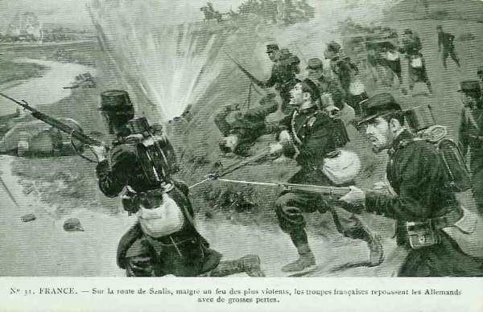
_Attaque vers Senlis_
_Collection privée_

L’ordre d’opérations pour la journée du 9 prescrit simplement de garder les positions de la veille, tout en se tenant prêt à reprendre l’offensive.

Les 7e et 61e divisions plient sous l’offensive du 4e C.A. allemand, qui enlève Nanteuil-le-Haudouin et Villers-Saint-Genest. La 8e division est rappelée de Meaux en toute hâte pour barrer la route de Paris.
Il n’est pas question pour Galliéni de reculer.

La 5e D.C. se trouve aux lisières de Villers-Cotterêts, sur les lignes de communication allemandes. Cornulier-Lucinière donne l’ordre à la 5e division de gagner la région de Noroy. Elle s’y porte et de bons observatoires permettent d’installer des batteries dans des conditions excellentes. Pendant deux heures, les 75 canonnent les convois et les détachements en marche. Plusieurs avions d’observation allemands, un convoi automobile chargé de munitions sont détruits.

Bridoux se porte, avec les 1e et 3e divisions, sur le plateau de Bargny où il couvre la gauche de la VIe armée. La 1e division se rapproche de Crépy-en-Valois de façon à pouvoir agir sur le plateau dans la direction de Gondreville - Bargny.

En raison du renforcement allemand face à l’extrême gauche de la VIe armée, Boëlle prescrit au 4e C.A. de se maintenir coûte que coûte sur ses positions. A Sennevières, la 7e division est renforcés par une partie du 103e régiment, débarqué à Nanteuil-le-Haudouin le 8 au soir (les 103e et 104e régiments ont été transportés dans les « taxis de la Marne »).

Au groupe Lamaze, au petit jour, une reconnaissance d’infanterie traverse Brunoy puis Etrepilly sans voir aucun Allemand. A la sortie du village, elle aperçoit une section en retraite vers Trocy.

En début de matinée, la VIe armée subit le plus violent effort qui ait été dirigé contre elle. Le 4e C.A. doit abandonner Boissy, Fresnoy, Villers-Saint-Genest et même Nanteuil-le-Haudouin.

Le commandant du 7e C.A. demande au 4e C.A. d’avancer la droite de la 7e division au nord-est de Gueux et de la renforcer en artillerie pour arrêter une attaque éventuelle débouchant d’Etavigny. A ce moment, la 61e division tient le front Villers-Saint-Genest - Fresnoy. Betz est réoccupé par les Allemands.

L’artillerie allemande canonne Rozières, à partir du nord de la voie ferrée Crépy - Senlis. Un bataillon du 317e se porte vers ce village, renforcé par huit automitrailleuses.

Dans l’après-midi, l’artillerie allemande est évacuée du plateau de Trocy en direction du nord. Pour faciliter cette retraite, von Kluck fait violemment contre-attaquer par le 4e C.A. débouchant de Betz la gauche française qui plie sous le choc. Maunoury rappelle alors la 8e division de sa position au sud de la Marne et Galliéni lui expédie en renfort la 62e division., mais la situation reste critique à la gauche de la VIe armée, qui risque d’être tournée.

L’ordre général à la VIe armée prévoit pour le 10 une offensive partielle, les Allemands ayant évacué la rive ouest de l’Ourcq. Les 4e et 5e C.A. resteraient en place, le 7e ayant reporté sa gauche en arrière pour ne pas être en flèche. La 45e division et le groupe Lamaze se porteront au nord de la Thérouanne. La 8e division marchera sur Silly-le-Long.

Des reconnaissances envoyées pendant la nuit font savoir que Trocy, La Plessis-Macy, May-en-Multien sont vides d’ennemis, que ceux-ci se retirent vers le nord.

Galliéni lance un ordre général.
« 1. Après quatre journées de bataille, pendant lesquelles elle a contenu trois corps d’armée ennemis, la VIe armée a été obligée à la fin de la journée du 9 septembre d’infléchir sa gauche en arrière devant la menace d’un débordement de troupes venant de Villers-Cotterêts et Nanteuil-le-Haudouin.
« A la fin de cette journée, elle occupait la ligne générale Silly-le-Long - Chèvreville - Puisieux - Etrépilly.
« 2. En vue d’assurer la sécurité du camp retranché et de parer à toute éventualité, toutes les troupes de la défense devront être demain à 6h sur leurs emplacements de combat. »

### IXe armée française

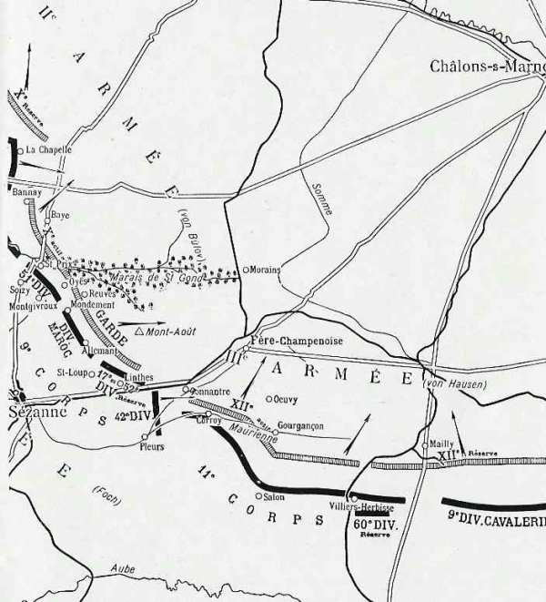
_IXe armée française - IIe armée allemande_
_C Michelin, d’après guide édition 1917 - autorisation n° 05-B-18_

Von Bülow et von Hausen se ruent contre l’armée de Foch, avant d’entamer le mouvement de recul imposé par la retraite des armées allemandes de droite. Ils sont prêts de réussir mais l’appui de la Ve armée et une manoeuvre de Foch rétablissent la situation.

- Le 10e C.A. est détaché de la Ve armée et mis à la disposition de la IXe. L’action du 1e C.A. sur le flanc allemand lui permet de progresser et de s’emparer de Corfélix à la tombée du jour. Il passe le petit Morin à La Thoult.

- La 51e division a relevé la 42e qui a combattu pendant quatre jours. Elle a l’ordre d’enlever Saint-Prix. Les têtes de colonnes arrivent à cette localité vers 23h.

- Dans le secteur du 9e C.A., les Allemands s’emparent de Mondement et Montgivroux. Une nouvelle progression de trois km leur permettrait de tomber dans le dos de la IXe armée, mais le général Humbert empêche toute avance et les rejette vers les marais.

- Le 11e C.A. est rejeté des hauteurs d’Oeuvy à 8h du matin et doit se replier sur la ligne Corroy-Salon.

Vers 16h, la 42e division entre en ligne et la situation change subitement. Von Bülow et von Hausen considèrent la partie comme perdue et commencent à prendre des dispositions pour la retraite.

Un épisode célèbre de cette journée :
Les Allemands occupent le château et le village de Mondement, balayant de leurs mitrailleuses les abords et la route de Broye.
Devant cette attaque imprévue, Humbert demande un rapide appui. Il met le 77e à la disposition de la division marocaine. Aussitôt, le général Grossetti (42e division) dirige le 19e bataillon de chasseurs sur Montgivroux et le 16e sur Mondement.

_Général Humbert (div. marocaine)_
_Collection privée_

Le moment est décisif. Si les Allemands s’emparent de la crête d’Allemant, qui domine de cent mètres toute la plaine à l’est, la gauche de l’armée est compromise, mais l’artillerie du 9e C.A., renforcée par deux groupes marocains et par des batteries de la 42e division, barre les débouchés d’Oyes, de Saint-Prix, de la crête du Poirier et du bois de Saint-Gond.
Humbert prescrit à la brigade Blondlat de contre-attaquer Mondement.

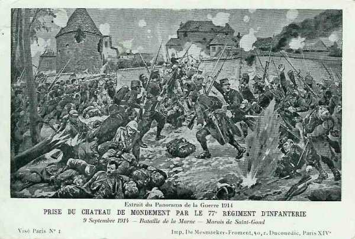
_Attaque du château de Mondement_
_Collection privée_

Le château est garni de mitrailleuses, le mur du parc garni de défenseurs. L’artillerie française n’obtient aucun résultat contre le château, étant trop éloignée, jusqu’au moment où une pièce d’artillerie est amenée dans l’allée conduisant au château pour pouvoir effectuer des tirs directs. Lestoquoi lance ensuite trois compagnies sur le château. Les Allemands ne résistent pas à cette attaque et fuient de toutes parts.

Foch donne en soirée l’ordre qui suit :
« La 9e armée étant fortement engagée par sa droite vers Sommesous et le 10e C.A. étant mis sous ses ordres, les dispositions suivantes seront prises le 9 septembre, à la première heure :

« Le 10e C.A. relèvera vers 5 heures la 42e division d’infanterie dans ses attaques contre le front Bannay, Baye, en particulier la route de Soisy-aux-Bois à Baye où il se reliera à la division marocaine qui tient le bois de Saint-Gond, Montgivroux et Mondement. Il aura en tout cas à interdire à l’ennemi, d’une façon indiscutable, le plateau de La Villeneuve, Charleville, Montgivroux, ainsi que ses abords nord.

« La 42e division d’infanterie, à mesure qu’elle sera relevée de ses emplacements par la 10e C.A., viendra se former par Broyes, Saint-Loup, en réserve d’armée, de Linthes à Pleurs, en prévenant de son mouvement la division marocaine ».
Humbert donne l’ordre de bivouaquer sur place à Mondement.

L’armée allemande commence à rebrousser chemin tandis que le 9e C.A. progresse. Les 68e et 90e régiments refoulent les arrière-gardes de la Garde prussienne.

Joffre couvre la droite de l’armée au moyen d’un nouveau C.C. sous les ordres du général de l’Espée et comprenant les 6e et 9e D.C.

### Armée anglaise

French décide d’accélérer la marche de son armée. Celle-ci franchit la Marne à Nogent-l’Artaud et atteint la route de Château-Thierry à Lizy-sur-Ourcq d’où elle canonne les colonnes allemandes qui retraitent vers le nord.

- En matinée
  Voici l’axe de marche des différents C.A. :
    1e C.A. entre la route de Sablonnières, Hondevilliers, Nogent-l’Artaud, Saulchery.
    2e C.A. vers Saacy, Méry, Montreuil.
    3e C.A. La Ferté-sous-Jouarre, Dhuisy.

La marche reprend avant l’aube. Avec sa D.C., Allenby met la main sur les ponts de Charly-sur-Marne et de Saulchery, puis se porte sur le plateau au nord, de façon à couvrir le passage du 1e C.A. qui atteint Domptin.

A gauche, la 3e division (3e C.A.) s’empare du pont de Nanteuil et le franchit dans les dernières heures de la matinée. La 5e division passe à Méry.
Le 3e C.A. à La Ferté-sous-Jouarre et la 8e division à Changis éprouvent des difficultés à passer la Marne.

_L’armée anglaise à La Ferté-sous-Jouarre_
_Collection privée_

De grand matin, Pulteney engage le 3e C.A. au sud de La Ferté dont les ponts avaient été coupés. Dans cette région (coude de la Marne), la vallée est fortement encaissée. Les Allemands défendent vigoureusement le passage, appuyés par une forte artillerie tirant des hauteurs nord.

La 4e division capture plusieurs bateaux et les utilise vers 22h pour créer un pont malgré un feu très violent. Un détachement passe la Marne en amont, vers Chamigny, mais le gros ne franchira le pont de La Ferté que dans les premières heures du 10 septembre.

La ligne de front passe par La Ferté - Bézu - Domptin, la cavalerie est en avant du front.
Comme French voulait faire border simultanément la Marne par tous ses C.A., il avait freiné la gauche anglaise, ce qui a facilité la retraite de la Ie armée allemande.
L’armée de von Kluck risque d’être prise en tenaille, surtout le 4e C.A.R. et le 2e C.A., qui sont pressés par le groupe de Lamaze.

### Armée belge : seconde sortie d’Anvers

**[Lien vers le croquis](../img/deuxieme_sortie_anvers.jpg)**

Le général de Witte fait attaquer Aarschot par trois colonnes :

- Le 27e de ligne par la chaussée de Lierre.
    Le 7e et le bataillon cycliste par Betekom.
    La brigade de lanciers par Testelt.

9h : Le Demer est traversé à Betecom sur une passerelle. Le groupement principal se porte vers les lisières ouest et sud d’Aarschot, menaçant la retraite de la garnison.

11h30 : Les Allemands évacuent Aarschot. Les ponts de Muizen, Rijmenam et Hansbrug sont occupés par la 3e division.

16h30 : le 9e de Ligne rompt la résistance d’un ennemi solidement organisé à Haacht et repousse peu après une contre-attaque au château de Heikem.

La 2e division déloge les Allemands de Werchter et la 6e brigade occupe Wezemaal, la 3e division s’assure les débouchés de la Dyle à Haacht, Rijmenam et Muizen ; la 1e division rentre dans Dendermonde détruite.

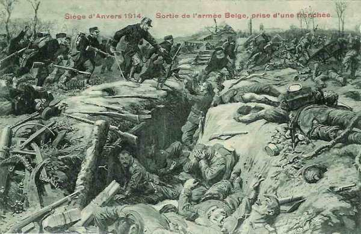
_Attaque d’une tranchée allemande_
_Collection privée_

### O.H.L.

Le représentant de von Moltke, Hentsch, part à 7h pour Q.G. de la Ie armée à Mareuil-sur-Ourcq (distance : 80 km). Il n’atteint cette localité que vers midi. Entre temps, la D.C. de la Garde s’était repliée sur la ligne du Surmelin, livrant aux alliés les routes conduisant à Chézy et à Château-Thierry.

Quand Hentsch arrive à Mareuil vers midi et demi, il n’y trouve que le chef d’Etat-Major, von Kühl.
A 14h, l’O.H.L. prescrit un commencement de retraite. Le mouvement vers le nord de von Kluck a découvert la droite de von Bülow et provoqué de sa part un mouvement rétrograde. Ce mouvement découvre à son tour la droite de von Hausen.

### Ie armée allemande

La Ie armée allemande lance une violente offensive vers Nanteuil-le-Haudouin et réussit à s’emparer de la localité. Maunoury vient à craindre que son armée ne soit battue.

La 5e division se porte à Trocy pour attaquer les Anglais en direction de Dhuizy, car ces derniers franchissent la Marne. Les Anglais sont stoppés à Mombertoin.

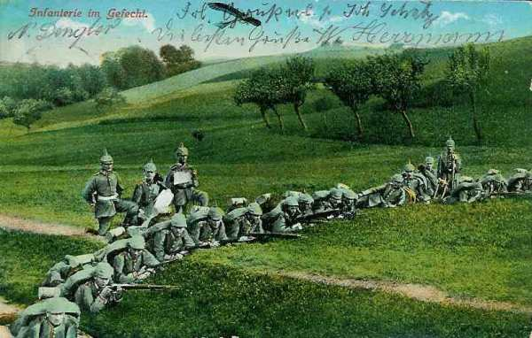
_Infanterie allemande au combat_
_Collection privée_

La situation de la Ie armée reste globalement favorable.

A ce moment, le lieutenant-colonel Hentsch, l’envoyé de Moltke, nanti des pleins pouvoirs, arrive et rencontre von Kühl, le chef d’état-major de la Ie armée.
Le front sud, le long de la Marne, s’étend de Congis à Chamigny (3 km en amont de La Ferté-sous-Jouarre). Les crêtes à l’ouest de Vareddes ont été évacuées pendant la nuit du 8 au 9 août par la 3e D.I. qui s’est repliée sur la ligne Etrepilly - Congis. Le 2e C.C. et cinq bataillons de chasseurs tiennent le cours de la Marne depuis Ussy jusqu’à Chamigny contre le 3e C.A. britannique qui s’emploie mollement à forcer le passage. Au-delà de Chamigny, la vallée de la Marne n’est pas défendue et il n’y a même pas une patrouille aux ponts.

A 10h30, von Kluck apprend indirectement qu’une forte colonne d’infanterie et d’artillerie passe la Marne à Charly. Or, de Charly à l’Ourcq, il n’y a qu’une vingtaine de kilomètres et il ne dispose que de la brigade Kraewel pour barrer la route aux Anglais. Si la gauche de la ligne allemande à l’ouest de l’Ourcq reste sur place à Congis et à Acy-en-Multien, elle court le risque d’être canonnée dans le dos par l’artillerie britannique.

A 11h30, von Kluck donne l’ordre au général von Linsingen de porter la 5e D.I., restée en réserve vers Trocy, pour rejoindre la brigade Kraewel et l’aider à interdire le passage aux colonnes britanniques. Le plateau de Trocy est abandonné.

A l’aile droite de la Ie armée, la 6e D.I. attend pour s’engager que la 9e C.A. l’ait rejoint. La brigade Lepel (venue de Bruxelles) s’approche de Nanteuil-le-Haudouin.
Hentsch et Kühl examinent la situation. Hentsch fait part de la triste impression recueillie lors de son passage au Q.G. de la IIe armée. Cette dernière aurait besoin de soutien. von Kühl refuse de la secourir avant d’avoir écrasé l’armée de Maunoury, ce qui est une question d’heures. Mais qu’adviendrait-il le lendemain, demanda Hentsch ?

Von Kühl est bien obligé de répondre négativement. Hentsch déclare que dans ces conditions, la retraite s’impose. Il indique la direction que doit prendre la Ie armée et ajoute qu’il a les pleins pouvoirs pour prescrire à von Kluck de battre en retraite.

En effet, le recul de la IIe armée vers le nord-est laisse la Ie armée complètement isolée. Moins d’une heure après avoir appris la retraite de l’armée de von Bülow, il met von Kluck au courant de la situation, obtient son accord et expédie un ordre préparatoire prescrivant aux unités de l’aile droite de suspendre leur marche en avant et de prendre leurs dispositions pour se diriger vers l’Aisne, soit la ligne Gondreville - Crépy-en-Valois - la Ferté-Milon.

Cet ordre est daté de 14h. En ce moment, le 9e C.A. avait traversé la forêt de Villers-Cotterêts et s’apprêtait à foncer sur la gauche de l’armée de Maunoury ; la brigade Lepel arrivait vers Nanteuil-le-Haudouin et faisait naître un commencement de panique chez les Français. C’est au moment que ce succès se dessine que von Kluck doit abandonner son offensive.

Toutefois, sans cette retraite, l’armée de von Kluck risque d’être enveloppée sur son aile gauche par des forces supérieures et d’être refoulée loin des autres armées.

### IIe armée allemande

Le groupement Kirchbach marche à l’attaque du front Connantre, Mailly-le-Camp.

Le corps de la Garde est maître de Mondement. La IXe armée (9e C.A.) reflue d’une dizaine de km, pour atteindre le nord-est de Sézanne. Fère-Champenoise est prise.

Vers 10h, von Bülow apprend que le 18e C.A. français et le C.C. Conneau se dirigent vers Chézy et Château-Thierry. A leur gauche, les 1e et 2e C.A. britanniques, précédés de la cavalerie d’Allenby, se disposent à franchir la Marne dans les environs de Nogent-l’Artaud. Les têtes de colonnes étaient à 9h à Nanteuil-sur-Marne, Citry, Pavant et Nogent-l’Artaud.

Vers 13h, les attaques de la Garde cessent et vers 17h, le groupement Kirchbach lâche prise.

A 14h45, von Bülow informe von Hausen par radio de la retraite de la IIe armée.

### IIIe armée allemande

En apprenant par un message radio la retraite de la IIe armée, von Hausen ordonne à ses troupes de se retirer.

### IVe armée allemande

Von Hentsch se rend au siège de la IVe armée. Le duc de Württemberg veut ramener ses C.A. derrière la Marne et le canal de la Marne au Rhin.

### Ve armée allemande

Le Kronprinz ordonne une attaque de nuit sur un front de 25 km, avec deux C.A. et demi de Louppy à Souilly.

### Armée belge

La 1e division occupe Dendermonde. Les troupes du général Clooten sont à Tielt et à Deinze.

[Lien vers la journée suivante](article_04_71.md)
