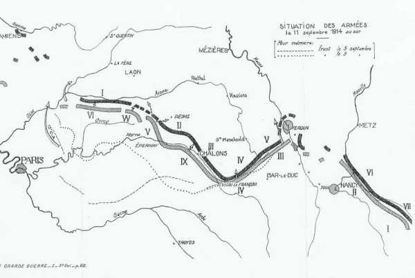
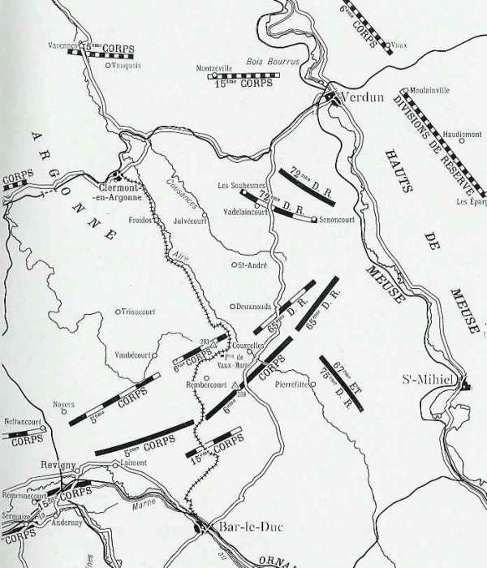
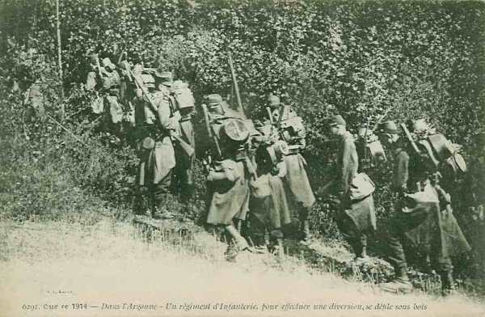
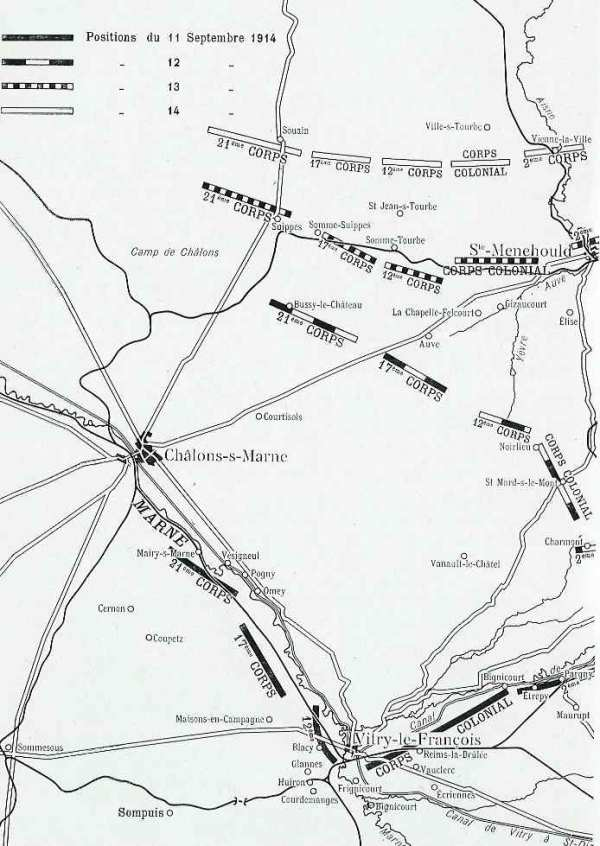
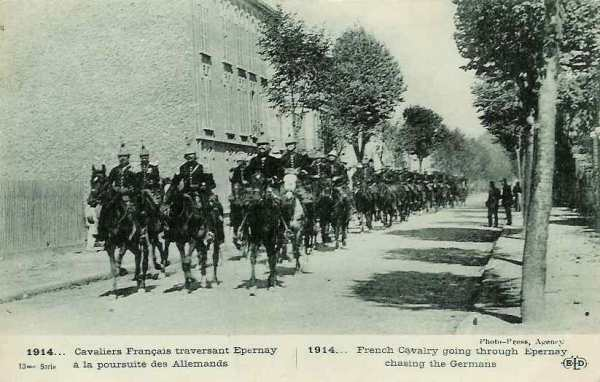
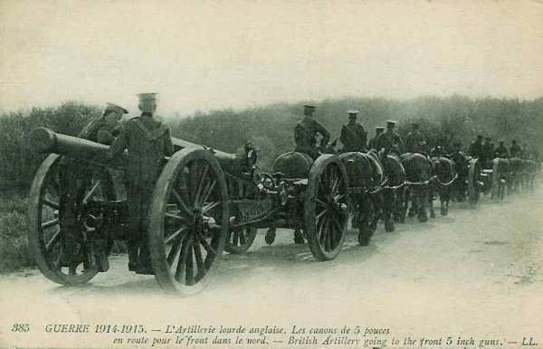
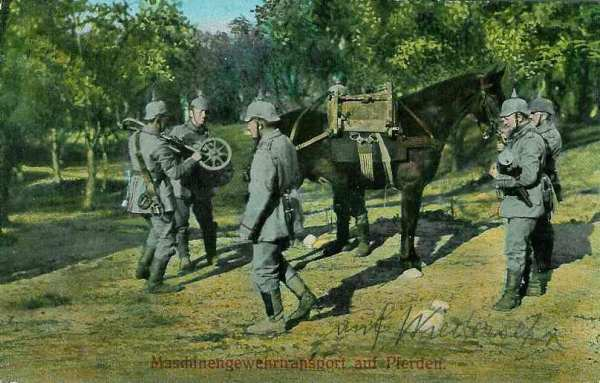

# Le 11 septembre 1914

Joffre télégraphie au ministre "La bataille de la Marne s’achève par une victoire incontestable". L’armée de Sarrail doit encore supporter une journée de lutte et se porte en avant, suivant le mouvement de la IXe armée. Les deux armées d’aile gauche et l’armée anglaise continuent la poursuite. von Moltke doit faire replier son centre afin de ne pas être coupé de ses lignes de communication.

### G.Q.G. français

_Situation le 11 septembre 1914_
_Les armées françaises dans la grande guerre_

Joffre télégraphie au ministre « la bataille de la Marne s’achève en une victoire incontestable ».
Avant de rédiger ce message, les membres du G.Q.G. ont dû décider du nom à attribuer à la bataille. La Marne fut retenue.

- Joffre décide de renforcer la VIe armée pour la mettre en mesure de déborder l’aile droite allemande. Il adresse une instruction particulière aux armées d’aile gauche pour l’exploitation de la retraite allemande.
C’est ainsi que
  La 37e division est transférée de Romilly à Creil.
  Le 13e C.A. est transféré d’Epinal vers la zone nord de Paris.

### IIe armée : début du dégagement de Nancy

La lutte se concentre entre le mont d’Amance et le Sanon. La bataille de la Marne est déjà gagnée et la bataille en Lorraine n’a plus la même importance pour le commandement allemand.

- Les ordres sont de poursuivre l’offensive à l’est de Nancy.
  Au 2e G.D.R., la lutte continue dans la forêt de Champenoux.
  Le 20e C.A. attaque vers Réméréville et Drouville.
L’avance est pénible. L’infanterie allemande, solidement retranchée, est bien pourvue de mitrailleuses et résiste avec ténacité.

### IIIe armée française

_IIIe armée française - Ve armée allemande_
_C Michelin, d’après guide édition 1919 - autorisation 06-B-05_

Le recul de l’armée du duc de Wurtemberg rend précaire la situation de celle du Kronprinz. Il doit retirer ses troupes par échelons.
Dans la journée, la gauche de la IIIe armée progresse de manière sensible mais la droite ne peut que maintenir ses positions.

Sarrail doit encore supporter une dure journée de lutte.

- 15e C.A. : Il progresse malgré une pluie diluvienne. La gauche occupe Andernay et Remennecourt, tandis que la droite touche le canal de la Marne au Rhin.

- 5e C.A. : Il reprend Laimont et Villotte-devant-Louppy aux Allemands qui restent en contact étroit et se défendent avec énergie.

- Le 6e C.A. et le groupement des divisions de réserve ne peuvent se maintenir sous un feu violent d’artillerie lourde.

A 19h15, le mouvement en avant du 2e C.A. (4e armée) permet au 15e C.A. de gagner du terrain an nord du canal de la Marne au Rhin, entre Contrisson et Neuville-sur-Orne.

_Régiment en Argonne_
_Collection privée_

Joffre écrit à Sarrail : « En réduisant l’amplitude de votre mouvement de repli et en prenant une attitude enveloppante par rapport à la gauche du dispositif ennemi, vous avez parfaitement rempli la mission qui vous avait été assignée ».

### IVe armée française

_IVe armée française - IIIe et IVe armées allemandes_
_C Michelin, d’après guide édition 1919 - autorisation 06-B-05_

La gauche de l’armée se porte nettement en avant, suivant le mouvement de la IXe armée, tandis que la droite reste sur la défensive une grande partie du jour. von Hausen, en reculant, découvre l’armée du duc de Wurtemberg. Cette dernière est obligée de rompre à son tour devant le centre et la droite de Langle de Cary.

L’armée fait mouvement vers Dammartin-sur-Yère pour prendre pied sur les hauteurs qui séparent la vallée de l’Aisne des plaines de Champagne.

- 21e C.A. : Il va s’établir à Cernon et Coupetz, avec des avant-gardes sur la Marne à Mairy.

- 17e C.A. : Il attaque vigoureusement dans la nuit du 10 au 11 et traverse le chemin de fer vers 08h. Il refoule les troupes allemandes au-delà de Maisons-en-Champagne où il s’établit.

- 12e C.A. : Le C.A. se heurte à une défense bien organisée à Vitry. En combattant, il s’avance par Frignicourt, Courdemanges, Huiron et Glannes et s’établit le soir à Blacy.

- Corps colonial : Il occupe Ecriennes, Vauclerc, Reims-la-Brûlée et, par sa droite, atteint le canal de la Marne au Rhin, vers Bignicourt.

- 2e C.A. : Le C.A. attaque à fond. Les Allemands résistent pendant la plus grande partie de la journée, mais Maurupt, Etrepy, Pargny, Sermaize sont finalement enlevés. Le soir le C.A. borde la canal.

_Général Cordonnier (3e div. 2e C.A.)_
_Collection privée_

- Le corps colonial a passé la Saulx et cantonne entre Heiltz-l’Evêque et Brusson.
  Le 2e C.A. borde l’Ornain d’ Etrepy à Sermaize, en liaison avec le 15e (IIIe armée). qui a atteint dès le matin le canal de la Marne au Rhin.

L’armée n’a plus un allemand devant elle.

### Ve armée française

L’armée a ordre de continuer la poursuite, les C.A. de droite s’échelonnant légèrement en arrière, de manière à pouvoir s’engager face au nord ou à l’est.
Le C.C. Conneau marche devant le front de la Ve armée, dans la direction de Fismes.

Une attaque est lancée vers Mont-Notre-Dame, où les Allemands se sont retranchés avec des mitrailleuses et de l’artillerie. Le groupe cycliste et trois batteries appuient cette attaque. La localité est prise à 15h, après un combat de trois heures.

- L’armée porte ses têtes de colonnes au sud de la Vesle, entre Chéry et Ville-en-Tardenois.
  Le 10e C.A. remonte de Vertus sur Epernay.
•-Le 18e C.A. atteint la région Mareuil-en-Dôle, Chéry, au sud de Fismes.
  A sa droite, le groupe Valabrègue marche en direction de Berry-au-Bac, Guignicourt, Juvincourt.
  Le 3e C.A. marche vers Saint-Thierry et Thillois
  Le 1e C.A. opère un mouvement de conversion vers l’est.

### VIe armée française

La poursuite se déclenche lentement. Un ordre préparatoire parvenu vers 4h30 fait connaître que les troupes doivent se tenir prêtes dès 6h. Il faut poursuivre l’armée allemande sans lui laisser de répit. La VIe armée doit se porter au nord-est :

- 4e C.A. aura à sa droite les 61e et 62e divisions (groupe Ebener) à partir de Crépy. La colonne de gauche doit suivre l’itinéraire Rozières - Trumilly - Béthancourt - Morienval - Pierrefonds, la colonne de droite  marchera vers Crépy-en- Valois - Feigneux - Rétheuil - Chelles.

- 3e D.C. doit surveiller les passages de l’Oise entre Pont-Sainte-Maxence et Compiègne.

- Groupe de Lamaze (55e et 56e divisions) progressera suivant l’itinéraire La Ferté-Milon - Faverolles - Corcy - Longpont.

- 7e C.A. : progressera vers Villers-Cotterêts - Soucy.

Les avant-postes de la VIe armée doivent atteindre la ligne Pierrefonds - Coeuvres-et-Valsery - Saint-Pierre-Aigle - Chaudun, les gros celles de Rétheuil - Longpont.
Au 1e C.C., la 5e division reste aux environs de Beauvais
Les 1e et 2e D.C. commencent la poursuite avec un retard sensible. Leurs gros suivent la direction de Senlis - Rully - Verberie, localités que les Allemands ont abandonné le matin. Le pont de l’Oise ayant été détruit au moment de la retraite, la 1e division jette un pont de circonstance au moyen de péniches. Le C.C. cantonne dans la région de Verberie du 11 au 12.

Les troupes marchent en colonnes de route pour hâter le mouvement car il n’y a aucune troupe ennemie en vue.

Au 7e C.A., la colonne de gauche (7e division) pousse ses avant-postes aux débouchés nord de la forêt de Villers-Cotterêts, à hauteur de Vivières. Les Allemands se dérobent en bon ordre et à toute vitesse. La 63e division se porte à l’ouest de la forêt de Villers-Cotterêts. La 56e division s’arrête au nord de cette forêt.
La 55e division marche par la route de Villers-Cotterêts à Soissons.

### IXe armée française

L’armée reçoit l’ordre de continuer la poursuite en vue de se rapprocher le plus possible de la Marne.

_Dragons à Epernay_
_Collection privée_

- Le 11e C.A. via Sommesous - Châlons - Gourgançon - Connantray.
  Le 9e C.A. via Bergère-les-Vertus - Mareuil-sur-Ay.
  Le 10e C.A. vers Mareuil-sur-Ay - Epernay. Il assurera la liaison avec le 1e C.A. (Ve armée).

La région qui s’étend devant la IXe armée, surtout à l’est de la route de Vertus à Reims, est un terrain favorable pour une poursuite, la plaine champenoise. L’armée ne dispose toutefois que d’une faible cavalerie : moins de 500 chevaux, qui couvre la marche de la division marocaine et de la 17e division (Chaintrix, Champigneul, Jâlons, Condé-sur-Marne).

Dans la matinée, les têtes du 9e C.A. atteignent la Marne mais tous les ponts ont été détruits. Un pont provisoire est jeté à l’ouest de Condé, dans la boucle de la Marne.
Pendant ces travaux, les troupes cantonnent au sud de la Marne.

Le 11e C.A. marche sur le front Normée - Vassimont - Sommesous - Châlons.

### Armée anglaise

Elle continue la poursuite sans incident. La cavalerie atteint la ligne de l’Aisne, les 3e et 5e brigades au sud de Soissons, la division Allenby à l’est vers Couvrelles et Serseuil.

_Canon anglais 5 pouces_
_Collection privée_

Derrière la cavalerie, les gros dépassent l’Ourcq vers Ouchy-le-Château et Fère-en-Tardenois.

### Armée belge

La bataille de la 2e sortie d’Anvers commence vers onze heures.

**[Lien vers le croquis](../img/deuxieme_sortie_anvers.jpg)**

- La **5e division** se porte en avant en trois colonnes
  1e brigade par la rive droite du canal de Willebroek vers Beigem et Pont-Brûlé qu’elle trouve solidement retranchés.

- 16e brigade sur la rive gauche jusqu’aux lisières d’Eppegem, en arrêtant deux retours offensifs de l’armée allemande.

- 17e brigade fait mouvement via Zemst sur Weerde. Prise de flanc, elle réalise peu de progrès.

La **1e division** pousse ses trois brigades côte à côte entre la Senne et le canal de Leuven, vers Nieuwenrode, Humbeek et Pont-Brûlé.

- A la nuit tombante
  la 1e brigade se trouve arrêtée vers Beygem, devant des retranchements renforcés de réseaux de fil de fer.
  la 16e brigade atteitn a lisière du Katter Meuter Bos, puissamment défendue. Elle bivouaque vers le château de Kleempoel.

La **1e division** fait mouvement vers Hofstade - Schiplaken - Venne.

La **3e division** monte une attaque vigoureuse vers Tildonk, Beuken, Over-de-Vaart.

La **6e division** se porte à l’attaque de Tildon et de Bueken.

La **2e division** reste inactive au cours de la journée, de même que la D.C.

A 23h, un communiqué de la Tour Eiffel signale que l’aile droite allemande est en retraite sur une profondeur de +- 75 km. Albert Ie décide par conséquent de poursuivre l’offensive.

- Voici la situation de l’armée en fin de journée :
  les 5e, 1e, 3e et 6e divisions ont progressé jusqu’à la ligne Eversem - Humbeek - nord d’Eppegem - Zemst - sud de Schiplaken - Katermeuterbos et le canal de Mechelen à Leuven.

- Les ordres pour le 12 sont :
  Les 1e, 3e et 6e divisions conservent les mêmes secteurs d’attaque.
  La 2e division se portera à l’attaque de Wijgmaal.
  La 4e division, tenue jusqu’à présent en réserve, se portera sur Mechelen.

### O.H.L.

Von Moltke doit faire replier son centre afin d’éviter une catastrophe. Il part pour la première fois depuis le début de la campagne rendre visite à ses commandants d’armée. Au Q.G. de la Ve armée, Moltke déclare qu’il est nécessaire, en raison de la situation générale, de se replier immédiatement. Le kronprinz s’insurge et aucun ordre de retraite n’est donné pendant l’entrevue.

Au Q.G. de la IIIe armée, von Hausen est alité, atteint de typhus, tout en continuant à exercer le commandement. L’armée a pu au cours de la nuit et de la matinée se porter au nord de la Marne sur la position Mourmelon-le-Petit - Francheville non sans pertes. Avec ses six divisions fortement éprouvées, l’armée doit tenir un front de plus de 40 km. Moltke prescrit à von Hausen de tenir coûte que coûte jusqu’à nouvel ordre.

Au Q.G. de la IV armée à Courtisols, Moltke apprend que l’armée s’est repliée dans la nuit sur la ligne Francheville (15 km au sud-est de Châlons) - Revigny sans être gênée par l’adversaire. Moltke demande au duc de Wurtemberg s’il serait à même de prendre à son compte une partie du front de la IIIe armée. Ce dernier répond affirmativement.

Face à la IIe armée, l’adversaire semble vouloir diriger son effort principal contre l’aile droite et le centre de la IIIe armée. Il faut replier le centre allemand vers Suippes - Sainte-Menehould. Si les français réussissent à percer d’ouest en est, ce serait une catastrophe pour l’ensemble des armées allemandes car les IVe et Ve armées seraient coupées de leurs lignes de ravitaillement et acculées à Verdun et à la Meuse. Les IVe et Ve armées ne peuvent rester en coin avec leur flanc à découvert et devront par conséquent être reportées vers Suippes - Sainte-Menehould.

Moltke se rend à nouveau au Q.G. de la IIIe armée et signe l’ordre suivant :

- « Sa Majesté ordonne que les armées atteignent les lignes suivantes :
  IIIe armée : Thuisy (exclu) - Suippes (exclu), liaison à Thuisy avec la IIe armée.
  IVe armée : Suippes (inclus) - Sainte-Menehould (exclu)
  Ve armée : Sainte-Menehould (inclus) et à l’est.

Puis, Moltke se rend à Reims, Q.G. de von Bülow. En attendant l’arrivée de la VIIe armée, les Ie et IIe armées devront se tenir sur la stricte défensive. Les éléments de la VIIe armée seront subordonnés à von Bülow.
Dans la nuit du 11 au 12, toutes les armées allemandes sont en retraite.

- Von Kluck : derrière l’Aisne.
  Von Bülow : derrière la Vesle.
  Le duc de Wurtemberg : vers les plateaux entre Marne et Aisne.
  Le kronprinz de Prusse : vers l’Argonne.
  Le kronprinz de Bavière vers la frontière.

### Ie armée allemande

L’armée passe l’Aisne, le 9e C.A. à Berneuil, la 4e C.A.R. à Nouvron, la 4e C.A. à Cuise, Lamotte, Saconin.

_Transport d’une mitrailleuse_
_Collection privée_

### IIe armée allemande

L’armée se retire de part et d’autre de Reims, derrière la coupure de la Vesle, la 13e division restant à Fismes.

### IIIe armée allemande

Von Hausen retraite entre Thuisy et Suippes.

### IVe  et Ve armées allemandes

Font retraite vers la région de Sainte-Menehould mais ne peuvent pas s’entendre sur le front définitif qu’ils doivent respectivement occuper.

[Lien vers la journée suivante](article_04_73.md)