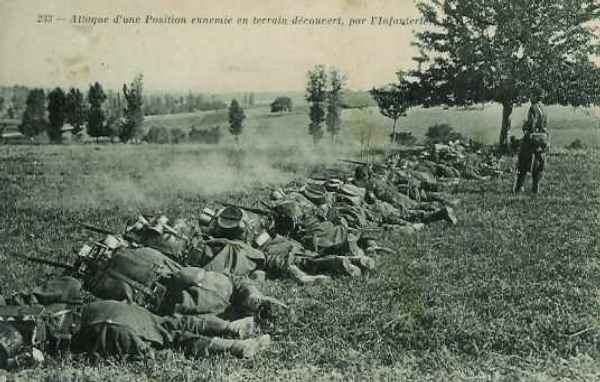
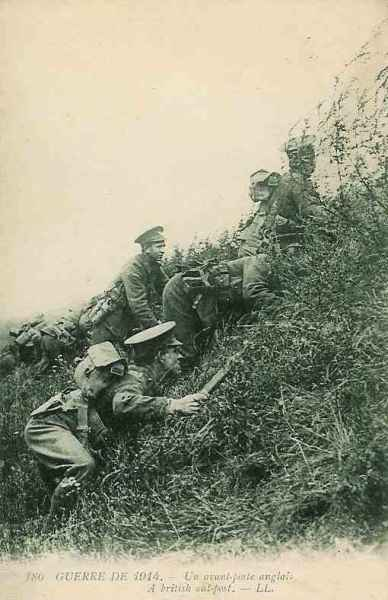
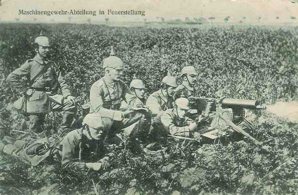
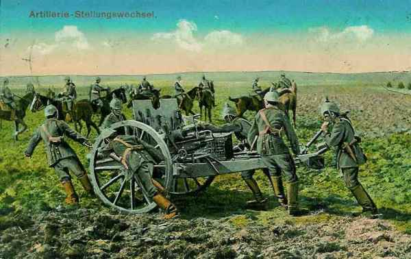

# Le 12 septembre 1914

Sur tout le front de l’Oise à la Meuse, les Allemands sont en retraite. Joffre donne un premier ordre visant à envelopper la droite des armées allemandes. Une brèche existe toujours entre les Ie et IIe armées. Von Kluck et von Bülow se disputent et von Kluck refuse de prêter assistance à von Bülow, quoiqu’il lui soit subordonné.

### G.Q.G.

L’idée d’un enveloppement de la droite allemande se précise. Joffre écrit à Maunoury : « Afin de déborder l’ennemi par l’ouest, la VIe armée, laissant un fort détachement dans l’ouest du massif de Saint-Gobain pour assurer la liaison avec l’armée anglaise, portera progressivement son gros sur la rive droite de l’Oise ».

### Ie et IIe armées françaises

Les Allemands sont en retraite sur tout le front. Les Ie et IIe armées françaises progressent vers la frontière allemande.
La Ie armée reprend Saint-Dié et marche sur Raon-l’Etape et Baccarat.

### IIIe armée française

Dans le secteur de l’armée, les Allemands disposent d’une grande supériorité en effectifs : cinq C.A. français font face à sept C.A. allemands, mais ces derniers opèrent malgré tout une retraite pour se conformer aux mouvements de l’ensemble des armées.

### IVe armée française

Le général Maistre remplace le général Legrand à la tête du 21e C.A.

_Général Maistre_
_Collection privée_

Les 21e, 12e et 17e C.A. passent la Marne entre Mairy et Vitry en décrivant un vaste mouvement de conversion pour se rabattre sur le front Courtisols, Poix, Somme-Yèvre.
Les Allemands ayant fait sauter les ponts, il faut les rétablir.

**[Lien vers croquis](../img/marne_11_14_septembre.jpg)** C Michelin, d’après guide édition 1918 - autorisation n° 06-B-05

En soirée, les troupes dépassent le front assigné et atteignent la ligne de la Noblette à la Cheppe et à Bucy-le-Château.
Le corps colonial et le 2e C.A. passent la Saulx et se portent sur Possesse et Charmont.

### Ve armée française

L’armée marche entre Vesle et Aisne. Le C.C. Conneau doit se porter dans la région de Berry-au-Bac, Guignicourt, Juvincourt et Damapy, couvrant le flanc du 18e C.A. et éclairant vers Laon.

- La 4e division par Vauxcéré et Longueval sur l’Aisne.
  La 10e division vers Fismes, Berry-au-Bac et Juvincourt.
  La 8e vers Guignicourt avec comme mission de reconnaître la ligne ferrée de Laon à Reims.

A 8h30, les premiers éléments du 18e C.A. atteignent la route de Chéry à Mont-Notre-Dame. Après un combat de retardement, les Allemands se replient au nord, sur Longueval.

_Attaque d’une position ennemie_
_Collection privée_

Le 18e C.A. doit enlever le pont de Fismes, passer l’Aisne et pousser au nord de l’Ailette. On estime encore à la Ve armée que la résistance allemande a uniquement pour but de gagner du temps.
De Maud’huy porte la 38e division sur Fismes et s’empare du pont. Le gros du C.A. force les passages de la Vesle à Courlandon et à Breuil.

La division Valabrègue doit percer vers la vaste plaine à l’est du plateau de Craonne.

Le reste de l’armée s’échelonne à l’est.

Le général Deligny a donné l’ordre au 1e C.A. de s’emparer de Reims dans le plus bref délai. Tout le C.A. se rapproche de cette ville non sans avoir rencontré une vive résistance au débouché de la montagne de Reims.

Le 3e C.A. marche par Gueux et Thillois.

- En soirée,
  Le 10e C.A. est à Cormontreuil.
  Le 3e est à Champigny.
  Le 1e C.A. est dans la région de Champfleury. La 51e division passe la Marne à Epernay.

### VIe armée française

L’armée va border la ligne de l’Aisne, de Compiègne à Soissons.

Au C.C. Bridoux, la 1e division passe le pont de bateaux jeté à Verberie. Les 1e et 3e divisions gagnent fort tard dans la soirée
leurs cantonnements autour de Saint-Martin-au-Bois.

Au 4e C.A., la marche s’effectue en deux colonnes, la 8e division par Pierrefonds, la 7e par Chelles. Dès le début, la marche est rendue difficile par une violente canonnade bien réglée, qui inflige à ce C.A. des pertes sensibles. Vers 15h, la 14e division (7e C.A.) s’empare du pont de Vic-sur-Aisne. A 18h, les divisions atteignent l’Aisne où elles trouvent les ponts de Lamotte et d’Attichy détruits. Seule une passerelle d’écluse est encore praticable.

Au groupe Lamaze, le 56e division doit marcher vers Saconin, la 55e par le nord-ouest de Soissons, puis Chavigny et Juvigny.
Les Allemands ont abandonné leurs tranchées au sud de l’Aisne mais ont installé des batteries au nord de la rivière.

Des reconnaissances annoncent que toute la rive nord de l’Aisne est occupée par l’armée allemande, dont les obusiers arrosent la rive sud.

### IX armée française

Le 9e C.A. franchit la Marne dès 9h entre Epernay et Châlons.

Au 11e C.A., Eydoux donne l’ordre de passer la Marne et d’occuper Châlons. Le deuxième régiment de chasseurs passe la Marne à Sogny et se heurte aux arrière-gardes allemandes à l’Epine. Le reste du C.A. n’est pas en contact avec les Allemands qui se sont dérobés. Le C.A. passe la nuit du 12 au 13 au nord de la Vesle.

### Armée anglaise

L’armée borde l’Aisne de l’est de Soissons jusqu’à Vailly.
Le 3e C.A. (Pulteney) opère au nord de Buzancy en direction de Soissons. L’artillerie allemande se replie au nord de l’Aisne. A la tombée de la nuit, le 3e C.A. est tout proche de la rivière dont les ponts ont été détruits.

_Avant-poste anglais_
_Collection privée_

Le 2e C.A. atteint Braine et ses environs. La cavalerie d’Allenby a nettoyé Braine et va cantonner à Dhuizel.

Nulle part, sauf aux environs de Braine, les colonnes britanniques n’ont rencontré de résistance sérieuse.

### Armée belge

**[Lien vers le croquis](../img/deuxieme_sortie_anvers.jpg)**

La **2e division** doit attaquer vers Wijgmaal et les défenses ouest de la Dyle (à franchir à Molen à 6h30)
La 6e brigade doit marcher par Wezemaal et la route de Leuven à l’attaque des positions situées à l’est de la Dyle et du canal. Trois combats ont lieu : à Molen, Wezemaal - Putkapel et Holsbeek.

A 14h30, le commandant de la division apprend que la 6e division bat en retraite par Werchter et que des forces allemandes importantes se dirigent vers Leuven et vers Aarschot. Il prescrit par conséquent à sa division de se retirer au nord du Demer vers Baal et Betekom.

La **6e division** doit reprendre l’attaque sur Tildonk entre les 3e et 2e divisions. Les Allemands réussissent à enrayer l’offensive et la division s’efforce de résister le plus longtemps possible sur le front Hombos - Kelg pour ne pas découvrir le flanc de la 3e division.

La **3e division** attaque la tête de pont d’Over-de-Vaart. La position allemande est précédée d’un glacis de 650 m. Le commandement organise une grande batterie qui doit concentrer son tir sur les châteaux d’Over-de-Vaart et de Wespelaar. Le feu est ouvert vers 4h30. La progression vers Over-de-Vaart est très pénible car les mitrailleuses allemandes sont bien abritées.

_Section de mitrailleurs allemands_
_Collection privée_

La **1e division** doit mener une attaque sur Kampenhout.
10h30 : l’infanterie de la 2e brigade mixte reste clouée à la lisière sud du bois du château de Schiplaken par des feux provenant de Wippendries.

La **5e division** doit fixer l’adversaire devant elle.  Beygem est pris vers 10h45 mais repris par les Allemands vers 18h. Les Belges se replient sur Nieuwenrode et Kapelle-op-den-Bos. La 17e brigade parvient à enlever Weerde.

### O.H.L.

Moltke coordonne le repli de ses armées mais le kronprinz impérial et le duc de Wurtemberg ne peuvent se mettre d’accord sur le front définitif qu’ils doivent occuper avec leurs armées. Moltke renonce à trancher le différend.
Moltke prélève le Ie C.A. bavarois pour renforcer la VIIe armée, chargée de combler la brèche entre von Kluck et von Bülow.
Guillaume II songe déjà à adjoindre von Falkenhayn à Moltke.

### Ie armée allemande

Von Kluck reçoit une demande d’assistance de la part de von Bülow mais informe ce dernier qu’il est fortement attaqué sur l’Aisne, sur le front Attichy - Soissons, qu’il compte tenir la rive nord de l’Aisne d’Attichy à Condé, mais qu’il ne peut attaquer vers Saint-Thierry.

### IIe armée allemande

La droite de l’armée a été refoulée, les français ont franchi la Vesle et von Bülow réclame des renforts à von Kluck, en vue de les envoyer sur les arrières français, vers Saint-Thierry. L’effort français vise à refouler l’aile droite de von Bülow vers la Champagne. Von Bülow ordonne à von Heeringen de pousser le 7e C.A. vers Laon en face de la brèche qui sépare les Ie et IIe armées.

### IIIe armée allemande

L’armée fait savoir qu’elle a organisé la position sur la coupure allant de la Vesle à Suippes et qu’elle occupera le 13 la ligne Prosnes - Souain.

_Changement de position d’un canon_
_Collection privée_

### IVe armée allemande

Elle occupe au soir le front Suippes - Valmy et compte se retirer vers la ligne Souain - Binarville. Elle reste fortement en avant de la IIIe armée et pourrait être prise à revers. Moltke fait télégraphier au duc de Wurtemberg qu’il doit garder un contact étroit avec les armées voisines.

### Ve armée allemande

Le kronprinz impérial se décide à abandonner la partie, comme les autres armées allemandes sont en retraite.
Il fait savoir que le 5e C.A. décrochera de la région de Troyon pour redescendre en Woëvre, ce qui sauve le fort de Troyon.

[Lien vers la journée suivante](article_04_74.md)