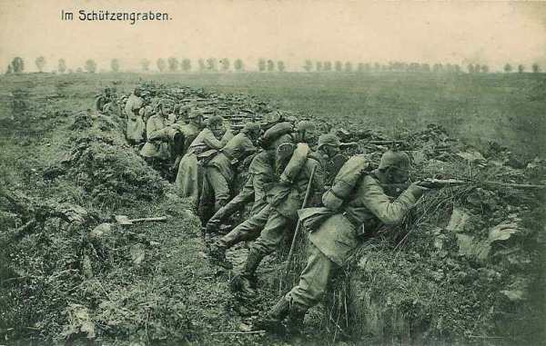
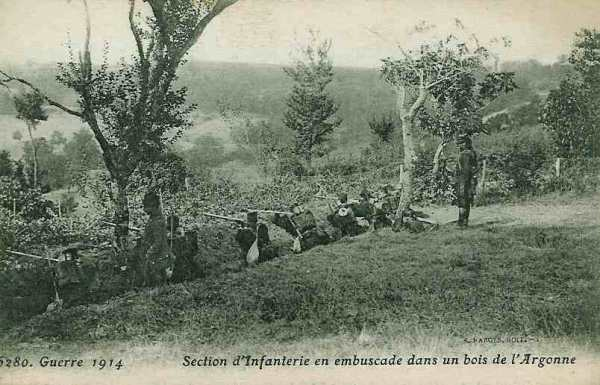
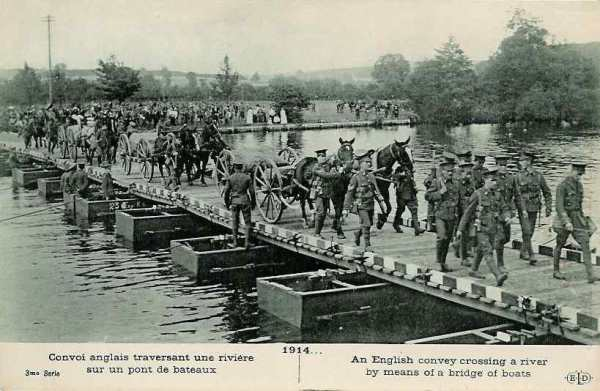

# Le 13 septembre 1914

La poursuite par les armées alliées continue mais elles se heurtent à des positions solidement tenues et préparées à l’avance qu’elles ne peuvent plus franchir. Ces positions tracent grosso modo le front  qui va se figer pendant les quatre années de guerre.
Des noms de localités comme Craonne ou Somme-Py seront cités dans les communiqués tout au long de la guerre.

### G.Q.G.

Joffre envoie une dépêche télégraphique à ses armées :
« Notre victoire s’affirme de plus en plus complète ; partout l’ennemi est en retraite, partout les allemands abandonnent prisonniers, blessés, matériel.
« Après les efforts héroïques dépensés par nos troupes dans cette lutte formidable, qui a duré du 5 au 12 septembre, toutes nos armées, surexcitées par le succès exécutent une poursuite sans exemple.
« A notre gauche, nous avons franchi l’Aisne en aval de Soissons, gagnant ainsi plus de cent kilomètres en six jours de lutte.
« Nos armées du centre sont déjà au bord de la Marne.
« Nos armées de Lorraine et des Vosges arrivent à la frontière.
« Nos troupes, comme celles de nos alliés, sont  admirables de moral, d’endurance et d’ardeur.
« La poursuite sera continuée avec toute notre énergie.
« Le gouvernement de la République peut être fier de l’armée qu’il a préparée.

Dans la nuit du 13 au 14, Joffre envoie à la Ve armée l’ordre d’orienter sa marche un peu plus vers le nord, de façon à dégager l’armée britannique et la VIe armée. C’est le début de la « course vers la mer ».

### IIIe armée française

- 15e C.A. : Le C.A. atteint Froidos, Julvécourt, Montzéville et les Bois Bourrus.

- 5e C.A. : Le C.A. se dirige par Noyers et Triaucourt sur Vauquois et Varennes.

- 6e C.A. : Le C.A. suit le chemin de Deuxnouds - Saint-André, passe la Meuse, une division au nord de Verdun, l’autre au sud, et gagne Beaumont et Vaux.

- Groupement de divisions de réserve : Le groupement passe la Meuse et occupe la droite de la IIIe armée vers Moulainville, Haudiomont, les Eparges.

### IVe armée française

L’armée se heurte à une résistance imprévue entre la Suippe et l’Aisne. Ses avant-gardes sont arrêtées par un ennemi retranché, fortement soutenu par son artillerie. La ligne atteinte ne sera pas dépassée jusqu’à la bataille d’hiver de Champagne en 1914-1915.

- 12e C.A. : prend position vers Somme-Tourbe.

- Corps colonial : Il s’avance à cheval sur l’Yèvre et s’établit au nord de la voie ferrée à l’ouest de Saint-Menehould.

- 2e C.A. : Il est à Saint-Menehould.

_Tranchée allemande_
_Collection privée_

Le 2e C.A. traverse Sainte-Menehould mais les Allemands reprennent Servon. Le général Cordonnier est blessé. Désormais, le 2e C.A. va être fixé sur ses positions.

La ligne de résistance allemande s’étend de Villers-aux-Vents à Souilly.

_Soldats français en Argonne_
_Collection privée_

Le matin du 13, le 15e C.A. traverse Bar-le-Duc, Sommeilles, Marats-la-Grande et Rembercourt-aux-Pots et cantonne dans cette région.

### Ve armée française

L’armée doit prendre la direction de Château-Porcien, de manière à pouvoir appuyer, à droite la IXe armée et à gauche l’armée anglaise.
Le C.C. Conneau va pourchasser les Allemands en retraite entre Sissonne et Rethel.

En fin de journée, le 18e C.A. doit atteindre la zone Corbény, Pontavert, Beaurieux, Craonne, derrière la cavalerie. Celle-ci
parvient en fin de journée dans la région de Sissonne - Sainte-Preuve - Lappion.

L’armée allemande évacue Révillon et le pont de Maizy reste intact. La 4e division passe l’Aisne et atteint Pontavert. A 14h30, elle atteint la voie ferrée Laon - Reims. Craonne est occupée par les troupes allemandes.

Vers 17h, le 18e C.A. atteint Craonne. A sa droite, le groupe Valabrègue est à Juvincourt et les troupes britanniques à Courtecon, au sud de l’Ailette, après avoir dépassé le Chemin-des-Dames.

Le général Conneau arrête sa 4e division vers Amifontaine, la 10e vers Sissonne et la 8e vers La Ville-aux-Bois. Corbeny est enlevé et le 2e bataillon du 144e entre dans Craonne.

A gauche, la 38e division occupe le plateau de Paissy, en contact avec les Anglais.

- L’E.M. de la Ve armée compte bien continuer la poursuite.
  Le 1e C.A. doit se porter dans la direction générale de Roizy, 20 km au nord-est de Reims.
  Le 10e C.A. doit se rendre maître des hauteurs de Berru.
  Le 3e C.A. doit s’emparer des hauteurs de Brimont.

Dès 5h, le 10e C.A. est immobilisé par des tirs d’artillerie partant du fort de la Pompelle ; le 3e C.A. est arrêté à Saint-Thierry. Le général Deligny décide de lancer une attaque au terme de laquelle Bétheny est repris.

Le gros de la 2e division entre dans Reims à 14h. Pendant ce temps, le 3e C.A. marche sur Brimont et le 10e sur le fort de Witry.
Franchet d’Esperey fait une entrée triomphale dans Reims.

Au 10e C.A., la 19e division marche vers le fort de la Pompelle quand brusquement l’ouvrage ouvre un feu de pièces lourdes. Le fort de Saint-Thierry est pris vers midi par le 3e C.A. mais les principaux ouvrages, La Pompelle, Nogent, Witry-les-Reims, Fresnes et Brimont restent dans les mains allemandes.

### VIe armée française

- L’armée s’efforcera de border l’Oise de Noyon à Condren :
  La 7e division se portera sur Noyon par Attichy et Carlepont.

- La 8e division marchera sur Compiègne par la rive sud de l’Aisne puis franchira cette rivière vers Choisy.

- Le C.C. Bridoux continue vers le nord mais en raison de la fatigue des chevaux et du manque d’approvisionnements, il s’arrête au nord-est de Montdidier, sur l’Avre.
Le 4e C.A. passe toute la matinée à  traverser l’Aisne sur un pont de bateaux. Les Allemands canonnent à partir de Nampcel.

Au 7e C.A., la 14e division a passé l’Aisne à Vic. Elle se porte sur Autrèche - Audignicourt.
Au groupe Lamaze, la 56e division rencontre à Pommiers des difficultés pour le rétablissement du pont. Les Allemands opèrent un bombardement intensif à partir de la sucrerie.
La 37e division, arrêtée le soir du 12 entre Crépy et Senlis, doit se porter sur Verberie et y passer l’Oise. Elle peut effectuer ce mouvement sans difficulté, utilisant le pont de Verberie et celui de La Croix-Saint-Ouen.

### IXe armée française

L’armée doit continuer la poursuite vers le nord-est avec la ligne de la Py et de la Suippe comme objectif, de Somme-Py à Heutrégiville (nord-est de Reims).
Voici les objectifs des unités :

- 9e C.A. : front Heutrégiville - Pont-Faverger.
  42e division : Mourmelon-le-Grand - Dontrien.
  10e C.A. : route de Rethel à Reims.

Dès le lever du jour, les escadrons divisionnaires signalent des forces allemandes dans des tranchées à Prunay, au nord-ouest de Mourmelon-le-Petit. Partout, les reconnaissances se heurtent à des tranchées. Ces positions, commandées par des hauteurs boisées qui s’étendent à l’est de Reims jusqu’à la Suippe, sont solidement établies.

A midi, la division du Maroc s’empare de Prunay ; la 17e division se met en action sur Prosnes qui est pris, puis soumis à un  tir provenant d’une puissante artillerie lourde dissimulée dans le massif de Moronvillers.
En fin de journée, la division du Maroc bivouaque dans la région Prunay, Beaumont, Verzy, la 17e division vers Thuizy, Sept-Saulx.

Le 10e C.A. n’a pu dépasser Sillery, la 18e division s’est arrêtée à Baconne et la 42e au nord du fort Saint-Hilaire, en bordure du camp de Châlons.

### Armée anglaise

French estime que de fortes arrière-gardes, appartenant à trois C.A. au moins, tiennent les ponts. Il donne l’ordre de forcer le passage.

Dans le secteur du 3e C.A., le pont de Venizel est réparé et une reconnaissance est effectuée pour en jeter un autre à Soissons.
La 13e brigade peut passer à Venizel et se rassembler à 13h à Bucy-le-Long.

A 14h, la 1e brigade attaque en direction de Chivres et de Vregny. Cette attaque réussit, mais le feu de mitrailleuses tirant de Vregny oblige les Anglais à s’arrêter jusqu’à la nuit.

Dans l’intervalle, un pont de bateaux a été terminé à Venizel et la brigade peut traverser l’Oise pour gagner Bucy-le-Long.
Une tentative pour jeter un pont de bateaux près de Soissons a échoué sous le feu des obusiers lourds.

Le 2e C.A. trouve tous les ponts coupés, sauf celui de Condé, encore aux mains des Allemands.
La 13e brigade ne peut passer à Missy ; la 14e, dirigée à l’est de Venizel, traverse l’Aisne en radeau, suivie de la 15e brigade.

Au 1e C.A., la cavalerie d’Allenby et la 1e division ne rencontrent qu’une faible résistance et passent aisément la rivière. La 1e division peut alors pousser en avant, couverte sur sa droite par la cavalerie. La tête de la 2e division atteint l’Aisne vers 9h. Le Génie entreprend la construction d’un pont de bateaux.

_Convoi anglais traversant une rivière_
_Collection privée_

### O.H.L.

Moltke veut prélever un C.A. sur chaque armée et concentrer ces troupes au plus tôt dans la région nord de Reims, derrière l’aile droite de la IIe armée.

### Ie armée allemande

L’armée maintient ses positions sur le front Attichy - Condé. Elle n’est pas en mesure d’ effectuer une contre-offensive vers Reims pour répondre à la demande de la IIe armée.

### IIe armée allemande

Elle s’engage à maintenir ses positions de la veille.

### IIIe armée allemande

Le général von Einem remplace von Hausen, gravement malade. L’armée cède le 12e C.A.

_Général von Einem (IIIe armée)_
_Collection privée_

### IVe armée allemande

Le duc de Wurtemberg accepte de céder le 18e C.A.

### Ve armée allemande

L’armée se replie sur Vienne-la-Ville, Clermont, Varennes, Montfaucon et Consenvoye qui resteront ses points d’appui pendant une bonne partie de la guerre. Le kronprinz accepte de céder le 6e C.A. pour colmater la brèche entre les Ie et IIe armées.

[Lien vers la journée suivante](article_04_80.md)