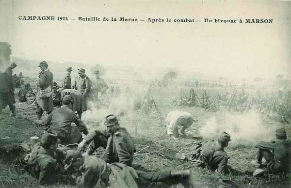
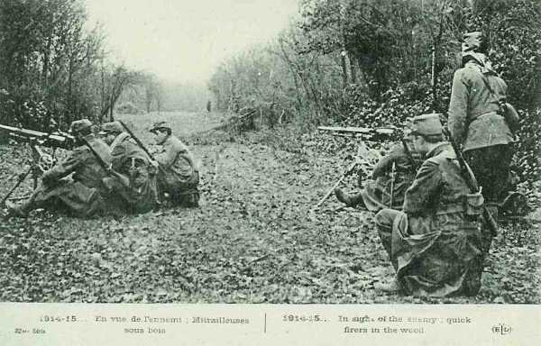
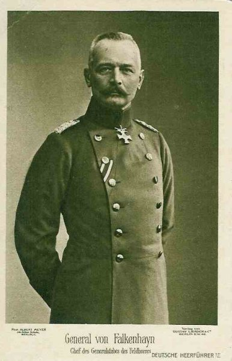
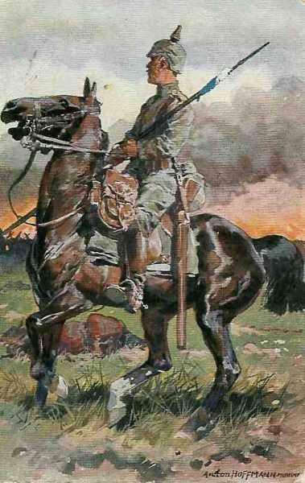

# Le 14 septembre 1914 : Moltke est limogé

Joffre croit toujours que l’armée de von Kluck est isolée du reste des armées allemandes, ce qui n’est déjà plus le cas, les Bavarois ayant comblé la brèche. Il prescrit à Maunoury de déborder l’aile droite de von Kluck.
Dans le camp allemand, Moltke, rendu responsable de la défaite de la Marne, a perdu la confiance de Guillaume II. Il est limogé et remplacé par von Falkenhayn.

### G.Q.G.

Joffre croit toujours à la brèche de l’Aisne et adresse aux commandants d’armée une directive leur fixant des objectifs de grande envergure : la VIe armée, l’armée anglaise et la Ve armée doivent « mettre hors de cause l’aile droite allemande nettement séparée de la masse principale » ; les armées du centre (IVe et IXe) doivent exécuter vers la Meuse une vaste conversion qui pourrait les amener sur le front Stenay - Rocroi.

Les renseignements qui lui parviennent  lui révèlent l’impossibilité de réaliser ces opérations. Il fait télégraphier vers 15h aux commandants d’armée : « l’ennemi semble vouloir accepter une nouvelle bataille sur des positions organisées au nord de l’Aisne, de la Vesle et la Suippe. Les commandants doivent prendre par suite des mesures d’attaque avec tout leurs moyens, en organisant progressivement le terrain conquis ».

**[Lien vers carte](../img/champ_bataille_aisne.jpg)**

### Ie armée française

L’armée perd le 8e C.A. mais reçoit en échange le 16e et les cinq divisions de réserve de Nancy. Elle est chargée des opérations entre la Moselle et les Vosges.

### IIe armée française

Dubail répartit son armée en trois groupements, qui doivent opérer dans la Woëvre.

### IIIe armée française

Le 5e C.A. doit marcher sur Varennes, le 15e sur Montfaucon - Gercourt, le 6e doit traverser Verdun.

_Bivouac à Marson_
_Collection privée_

### Ve armée française

Franchet d’Esperey a acheminé sa gauche - C.C. Conneau et 18e C.A. - sur Craonne, Berry-au-Bac et Sissonne et sa droite vers Asfeld. Le général Conneau trouve les ponts intacts dans la région de Berry-au-Bac et pousse une de ses divisions vers le nord. Elle ne rencontre pas d’adversaires et atteint Sissonne sans difficulté. Il y donc une brèche dans le dispositif allemand qui ne peut être exploitée faute de renforts : le 18e C.A. est engagé à fond dans la région de Craonne contre des renforts du 7e C.A.R. allemand accourus de Laon ; à l’est, le gros de la Ve armée affronte l’armée de von Bülow installée sur les hauteurs est et nord-est de Reims (La Pompelle, Berru, Brimont).
Conneau, isolé, doit faire replier ses divisions au sud de l’Aisne et la continuité du front allemand peut être rétablie.

_Mitrailleuses françaises_
_Collection privée_

C’est une occasion manquée : les Allemands vont solidement se retrancher sur le Chemin des Dames et l’attaque de cette position entraînera de lourdes pertes pour l’armée française trois ans plus tard.

### VIe armée française

Les renseignements de la VIe armée localisent la droite allemande près de Nampcel, village situé entre Oise et Aisne. En réalité, tout le 9e C.A. allemand se réunit à cheval sur l’Oise autour de Noyon.

Maunoury se heurte ainsi à l’ouest de Soissons et sur les plateaux au nord-ouest de l’Aisne, à la droite de von Kluck.

Le C.C. Bridoux se trouve sur la rive ouest de l’Oise pour rechercher l’enveloppement de la droite allemande. Il se dirige en longeant la voie ferrée Amiens - Tergnier. La 5e D.C. se porte en direction de Montdidier. La 5e brigade de dragons s’empare d’importants approvisionnements mais la cavalerie allemande la repousse.

La division Comby, venant de la Ie armée, débarque dans la région de Creil et doit porter ses premiers éléments sur la ligne Clermont - Catenoy.
La 8e division (Lartigue) doit marcher au nord de Lassigny en se reliant avec la division Comby.

Le 4e C.A. a devant lui le 9e C.A. allemand. Le groupe Ebener, qui constitue la droite du 4e C.A., ne parvient pas à progresser.

Le 7e C.A. est bloqué dans son offensive et doit être dégagé par des attaques de la 45e division (Drude) dans la région de Cuffies - Pasly.

En fin de journée, force est de constater que le mouvement offensif de la VIe armée a échoué.

### IXe armée française

L’armée tient les positions au nord des massifs de Nogent-l’Abesse et de Moronvilliers. Elle tente vainement d’atteindre la région d’Attigny et Château-Porcien.

### O.H.L.

Moltke est provisoirement rassuré mais il apprend que des rassemblements seraient en cours dans la région de Gent (Gand) en Belgique et pourraient menacer les communications des armées de son aile droite. Il donne l’ordre d’arrêter le transport du 1e C.A. bavarois en route vers Namur et place ce dernier sous les ordres du gouverneur général de Belgique, le général von der Goltz.

_Général von Falkenhayn_
_Collection privée_

Cette décision provoque l’agitation dans l’O.H.L. Plusieurs fois, ce C.A. a vu changer sa destination. Moltke ne paraît plus capable  de prendre de saines décisions. Le chef du cabinet militaire de l’empereur, le général von Lyncker est prévenu et il suggère à Guillaume II de remplacer Moltke par von Falkenhayn, ministre de la guerre.

Moltke est convoqué chez l’empereur qui l’invite à se porter malade et à rentrer à Berlin pour se reposer. Moltke accepte la décision qui lui a été notifiée.

Von Falkenhayn est à 52 ans le plus jeune des généraux d’armée, altesses princières mises à part.

Le jour même de sa désignation, il se met au travail et rédige un plan d’opérations  dont l’idée directrice est le retour au plan Schlieffen, c.a.d. une manœuvre débordante contre l’aile gauche alliée. La VIe armée, ramenée de Lorraine, constituera la masse de manœuvre et se rassemblera dans la région de Maubeuge, les avant-gardes à hauteur d’Hirson, pour le 21 septembre.

- En attendant, les armées d’aile gauche exécuteront un repli excentrique
  Ie armée : vers le sud-ouest de Saint-Quentin - La Fère - Nouvion - Catillon.
  IIe et VII armées : vers Laon - Reims - Prosnes.
  Le vide entre les Ie et VIIe armées sera comblé par les 1e et 2e C.C.
  Les IIIe, IVe et Ve armées se maintiendront sur leurs positions puis passeront à l’offensive à partir du 18 en commençant par la gauche : la Ve armée de part et d’autre de Verdun, la IVe armée vers Châlons, le IIIe vers Tours-sur-Marne.

A la demande de son chef d’opérations, von Tappen, Falkenhayn renonce à son idée de replier l’aile droite et décide d’accepter la bataille décisive sur le front Noyon - Reims - Verdun. Pour poursuivre la manœuvre débordante par l’ouest, il ordonne de commencer le transport de la VIe armée sur Saint-Quentin et de diriger, dans le même direction, le 1e C.A. bavarois arrêté devant Namur. Il prescrit au général von Stranz de déclencher une action contre les Hauts-de-Meuse en vue d’enlever les forts de Troyon et du Camp des romains.

### Ie et IIe armées allemandes

Von Kluck et von Bülow ne sont pas d’accord sur la conduite à tenir : von Kluck  estime qu’il doit rester fort sur sa droite afin de se soustraire à l’enveloppement et donc ne doit pas se replier vers le nord. Von Bülow estime qu’il faut régler avantageusement la situation au centre, entre Sissonne et Reims. Il est donc indispensable que l’aile gauche de von Kluck se porte sur Fismes. Le litige est porté à l’O.H.L. par von Kluck. Von Bülow réplique qu’il s’oppose à une contre-offensive de von Kluck. Von Falkenhayn donne raison à von Bülow.

La IIe armée reçoit en renfort le 7e C.A. venu de Maubeuge et le 12e  C.A. provenant de la IIIe armée. Ce dernier se range derrière la gauche de la IIe armée. La VIIe armée bavaroise arrive également en renfort des Ie et IIe armées.

_Cavalier allemand en tenue de campagne_
_Collection privée_

La droite de la IIe armée reprend le terrain perdu et s’installe sur le front qui se maintiendra jusqu’en 1917 sur la ligne Péronne - Laon - Verdun.
IVe et Ve armées allemandes
Les armées s’installent sur les positions qui leur ont été assignées de part et d’autre de l’Argonne.

### VIe armée allemande

L’armée a terminé son repli vers la frontière. Les trois C.A. bavarois sont regroupés pour être acheminés de la Lorraine vers Cambrai. Les unités de réserve  de Landwehr et d’Ersatz  sont réunies avec le restant de la VIIe armée  en un détachement d’armée sous le commandement de von Falkenhausen (gouverneur général de Belgique en 40-44) et  prennent position  de la côte de Delme jusqu’à Cirey-sur-Vezouse par Château-Salins - Avricourt.

### VIIe armée allemande

La plupart des C.A. sont transférés de l’Alsace vers Arras. Ils sont remplacés par un détachement d’armée aux ordres du général von Gaede avec mission de garder les débouchés des Vosges.

La partie ne va plus se jouer désormais sur la frontière est de la France mais dans le nord.

### Armée anglaise

- Les Britanniques sont dans la région de Vailly et ne peuvent atteindre au nord de l’Aisne que le revers sud de la crête du Chemin des Dames.
  Le 1e C.A. est à Bourg-et-Comin
  Le 2e C.A. est à Vailly
  Le 3e C.A. est à Venizel.

A 12h, les 1e et 2e brigades sont face au Chemin des Dames. Il s’agit d’une suite de crêtes de 30 km de long longeant l’Aisne et l’Ailette. Toute l’après-midi est consacrée à des attaques et contre-attaques. Peu à peu, la vigueur des offensives décroît.

Durant la nuit du 14 au 15 :
Le 1e C.A. et le C.C. tiennent la ligne Troyon - sud de Chivy, sud de Beaulne, en contact avec l’armée allemande.
Au 2e C.A., la 3e division encercle Vailly, la 5e est vers Missy-sur-Aisne.
Le 3e C.A. occupe la ligne Moncel - Crouy - Venizel - Chassemy.

### Armée belge

L’armée se tient sur la défensive et le dispositif est adapté en conséquence :
1e division : Waelhem - Sint-Katelijne-Waver.
3e division : Koningshooikt - Sint-Katelijne-Waver.
6e division : Koningshooikt - Lier.
5e division : dans le 4e secteur, encadre le dispositif vers la droite
2e division : dans l’intervalle Lier - Broekem, encadre le dispositif vers la droite.
4e division : forme la réserve d’armée vers Kontich - Hove.
D.C. à Heist-op-den-Berg.

Chaque division a reçu l’ordre de maintenir en avant une brigade mixte chargée de couvrir les observatoires d’artillerie des forts.

Le détachement que la D.C. avait laissé à Aarschot est violemment attaqué et se replie conformément aux instructions.

Au centre, entre les deux canaux, les Allemands poussent leurs organisations défensives vers le nord et construisent des ponts sur les canaux entre Mechelen et Leuven et sur la Dyle.

[Lien vers la journée suivante](article_04_81.md)