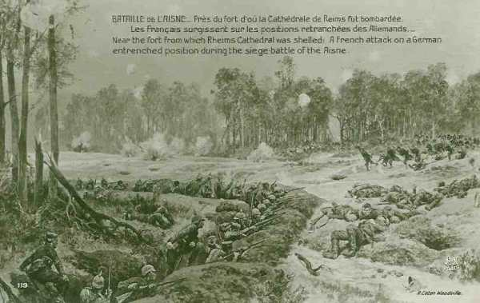
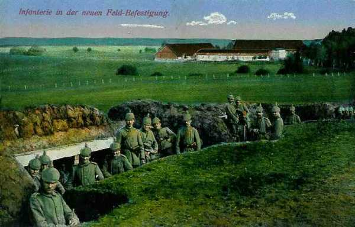
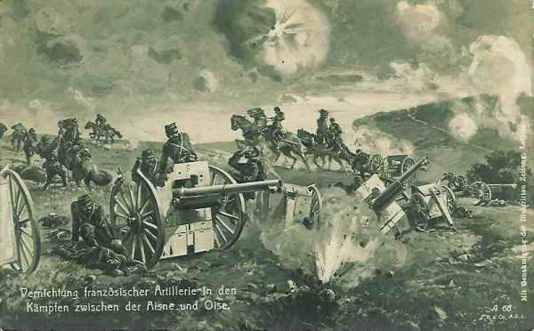
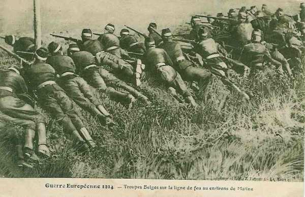

# Le 15 septembre 1914 : Bataille de l’Aisne

Sur l’ensemble du front des armées, les troupes se retranchent et les combats s’enlisent. Seule l’aile gauche française peut obtenir une victoire en enveloppant l’aile droite allemande. C’est le rôle de la VIe armée de Maunoury. Joffre prélève des troupes sur l’ensemble du front pour renforcer son aile gauche.

### G.Q.G.

Le plan de Joffre est de fixer l’armée de von Kluck par des attaques de front opérées avec un minimum de forces et de la déborder sur la rive droite de l’Oise en utilisant le 13e C.A., que viendra renforcer un autre C.A., prélevé sur le reste de la VIe armée.

Joffre insiste pour que le 13e C.A. pousse au-delà de Noyon, en direction de Guiscard, Villequier-le-Haut, Flavy-Martel, de manière à déborder l’aile droite de von Kluck et de menacer ses communications, mais Maunoury croit que cette aile s’arrête à l’Oise et ne donne pas à l’attaque de la VIe armée toute l’ampleur nécessaire.

**[Lien vers carte](../img/champ_bataille_aisne.jpg)**

### IIIe armée française

Elle continue à pousser vers le nord
Le 15e C.A. est à l’ouest de la Meuse vers Cumières. L’armée tient un front passant par Haraigne - Morgemoulins - Fromezey - Gincrey - Mogeville.
Le 8e C.A. s’embarque dans la région de Charmes et débarque à Saint-Mihiel.

### IVe armée française

L’armée est arrêtée dans son offensive.

_Bataille de l’Aisne_
_Collection privée_

### Ve armée française

Au 12e C.A., de Maud’huy ordonne de tenir La Ville-Aux-Bois - Craonne - plateau de Vauclerc - Hurtebise - Chemin des Dames.

8h : les Allemands commencent à s’infiltrer dans les bois de La Ville-Aux-Bois. Le combat se poursuit toute la journée.

8h15 : une attaque allemande se produit de Juvincourt sur Pontavert.

9h45 : tout le plateau au nord et à l’ouest de Craonne est sous le feu de l’artillerie allemande.

11h : l’artillerie de la 4e D.C. reçoit du général Conneau l’ordre d’appuyer l’attaque du 18e C.A. au nord de Pontavert. Elle tire sur les bois entre Corbény et Craonne.

13h45 : une batterie du 18e C.A. située au nord de Craonelle arrête une offensive allemande vers Craonne.

14h : les Allemands prennent La Ville-aux-Bois que le général de Maud’huy décide de reprendre par une attaque de nuit.

17h30 : la 35e division est violemment attaquée vers Craonne.

### VIe armée française

D’après l’ordre général n° 91, la VIe armée doit briser, le 15, définitivement la résistance allemande en débordant et enveloppant son aile droite. Le rôle principal revient au 4e C.A. Le 13e C.A. pousserait les avant-gardes de sa division de tête à Thourotte en couvrant le flanc gauche de l’armée. La 3e D.C. doit se porter sur Noyon.

De grand matin, la 37e division atteint Carlepont sans incident, couverte par des fractions du 3e C.A. qui occupe la forêt d’Ourscamp, entre Bailly et Carlepont. Le général Comby est à Carlepont et décide de se porter rapidement sur Laigle, Pommeraye et Cuts, pour tenir la route Noyon - Blérancourt et déborder la droite allemande.

La nuit du 14 au 15, la 70e brigade tient les bois de Cuts, la 73e La Pommeraie et Cuts, Hesdin et Laigle.

9h : la brigade Félineau (14e) atteint la chaussée de Brunehaut.
Au 4e C.A., la 7e division doit attaquer sur le front Bois de la Montagne, route de Trocy-le-Mont à Nampcel, en direction générale de Blérancourt, mais elle est arrêtée, par l’artillerie lourde allemande,
sur la ligne passant par la ferme des Loges et la Bascule de Quennièvres

12h30 : le 124e se heurte à une ligne de tranchées défendue par un feu violent de mitrailleuses.

13h45 : la 74e brigade tient Belle-Fontaine et essaie d’avancer sur Lombray, la 73e attaque Cuts.

14h : une reconnaissance aérienne signale de l’infanterie allemande vers Blérancourt, Saint-Paul-aux-Bois, Saint-Aubin et de l’artillerie lourde vers Nampcel.

17h30 : le 4e C.A. se voit immobilisé devant des défenses bien organisées. Des spahis ont un engagement avec un régiment de uhlans (un des derniers combats à cheval) au sud de Brétigny.

23h : une brigade allemande sort de Noyon et marche sur Sempigny, en direction de Carlepont.

La masse de manoeuvre sur laquelle comptait Joffre pour encercler l’armée de von Kluck ne parvient pas à atteindre son objectif.

### IXe armée française

- Foch prescrit d’attaquer avec toutes les forces.
    18e division : vers Moronvilliers
    42e division : vers Aubérive

Ces tentatives ne remportent aucun succès : la 18e division ne gagne que 2 km et ne peut se maintenir. La 42e division et le 10e C.A. rencontrent une résistance semblable.
A 17h, Foch prescrit de s’organiser sur les positions conquises.

### O.H.L.

Von Falkenhayn met au point une manoeuvre débordante au moyen de la VIe armée (provenant de Lorraine). Pour libérer ses transports de toute menace pouvant provenir d’Anvers, il ordonne d’attaquer la place.

_Soldats allemands occupant une tranchée_
_Collection privée_

### Armée anglaise

Les anglais subissent des pertes considérables suite à des tirs d’artillerie provenant du nord de l’Aisne.
La 6e division a passé l’Aisne mais se fait violemment contre-attaquer. Les pertes anglaises sont lourdes.
Au 2e C.A., le général Hamilton attaque avec la 3e division mais échoue.
La journée du 15 marque la fin de l’offensive pour les Anglais.

_Bataille de l’Aisne du côté anglais_
_Collection privée_

### Armée belge

L’armée reste sur la défensive, selon le dispositif en vigueur depuis le 14 septembre.

_Soldats belges à Malines_
_Collection privée_

[Lien vers la journée suivante](article_04_82.md)
