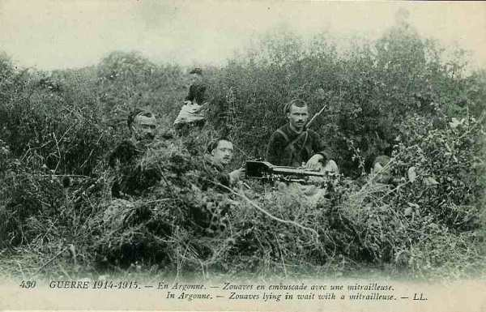
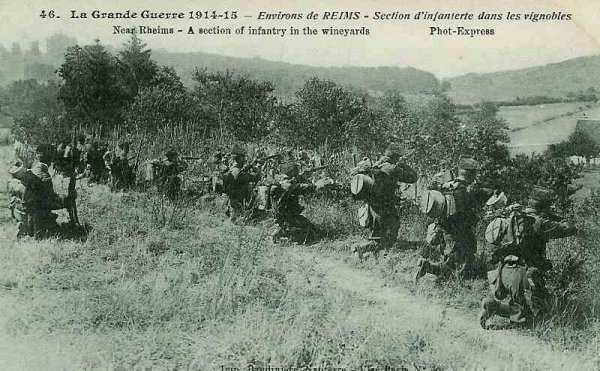

# Le 16 septembre 1914

Les armées françaises ne progressent plus malgré les offensives conduites méthodiquement par les différents commandants.
Sur le front belge, les Allemands constituent un parc d’artillerie de siège destiné à faire tomber Anvers.

### G.Q.G.

L’ordre général n° 96 prescrit de reprendre l’attaque des 5h du matin.
Au cours de la journée toutefois, les armées françaises ne progressent pas significativement : elles marquent le pas de l’Oise à la Moselle.
Joffre réitère son ordre à la VIe armée pour que le 13e C.A. marche sur Noyon, Guiscard pour faire tomber les positions allemandes de Carlepont et Cuts mais Maunoury doit courir au plus pressé en empêchant la 37e division et la 4e C.A. de fléchir sous la poussée allemande.

**[Lien vers carte](../img/champ_bataille_aisne.jpg)**

### IIIe armée française

Elle prend l’offensive sur tout le front, sans résultats. La 5e C.A. essuie un échec sérieux dans la région de Clermont.

### IVe armée française

L’armée ne modifie pas ses emplacements d’une façon sensible.

### Ve armée française

Franchet d’Esperey ne renonce pas à élargir la poche que sa gauche avait créée dans les positions allemandes. Les 10e et 3e C.A. maintiennent leurs positions sur la droite, le 18e reprend ses attaques et le groupe Valabrègue se porte en avant.

De Maud’huy lance sa droite contre La Ville-aux-Bois.
3h : six compagnies du 18e, rassemblées au nord de Pontavert se portent sur ce village par le nord, deux autres l’attaquent par le sud. Les Saxons se barricadent dans certaines constructions et l’artillerie allemande ouvre le feu sur la lisière nord.

19h : la partie nord du village doit être évacuée à cause des tirs intenses de l’artillerie allemande.
Deux bataillons résistent héroïquement dans Craonne mais la localité doit finalement être abandonnée vers 18h.

### VIe armée française

Le 13e C.A. prend les devants et dès 4h, il se met en marche vers Noyon, mais les espoirs fondés sur l’intervention de ce C.A. sont trompés : l’offensive se heurte à une contre-offensive allemande. Au lieu de déborder la droite allemande, les Français sont à leur tour menacés d’enveloppement.

Dans la nuit du 15 au 16, le général Comby avait reçu l’ordre de continuer vigoureusement son offensive sur Bourguignon, camelin, La Fresne au nord-est de Blérancourt.
Le matin du 16, le combat s’engage sur tout le front et débute bien. La 73e brigade atteint les bois au nord de Cuts et la 74e progresse vers Camelin, La Fresne mais les Allemands attaquent par surprise et de flanc la 16e brigade du Maroc. Sa déroute découvre entièrement l’aile gauche du C.A. et l’expose à un désastre. La général Comby décide d’arrêter l’offensive et de se fortifier. Les Allemands pénètrent dans le bois de Carlepont et attaquent Hesdin.

La situation reste grave jusqu’à 14h : les Allemands ont pénétré dans la partie nord du bois de Laigle mais ne parviennent pas plus loin grâce à la ténacité des zouaves. Ils finissent par entrer dans Carlepont, coupant la retraite de la 37e division vers l’Aisne. Le général Comby reçoit du renfort (3e brigade du Maroc) et ordre lui est donné d’enlever Carlepont et de se diriger ensuite sur Laigle. Carlepont est repris au prix d’une perte de 1200 hommes.
A la nuit, le groupement Comby tient la ligne Cuts - La Pommeraye - Hesdin - Laigle - Carlepont.

_Zouaves maniant une mitrailleuse_
_Collection privée_

Le général Boëlle avait prescrit au 4e C.A. la reprise de l’offensive. Les attaques commencent à 5h mais dès le début, la 15e brigade se voit dans une situation précaire.
10h : la 7e division est soumise à un violent bombardement.
Maunoury prescrit au 13e C.A. de diriger sur la rive gauche de l’Oise toutes les forces disponibles.

12h : Carlepont va être perdu. La 3e brigade marocaine tente sur Carlepont une première attaque.

18h30 : la 3e brigade marocaine tient la partie sud de Carlepont mais sa droite a dû se replier.
Au soir : la VIe armée fait connaître que le 13e C.A. a été bousculé au sud-ouest de Noyon par une attaque de nuit (9e C.A.R. allemand) et que le 4e C.A. a été arrêté par une attaque de flanc.

La VIe armée, à part quelques offensives enrayées a simplement maintenu ses positions de la journée et n’a pas pu envelopper l’aile gauche de von Kluck.

### IXe armée française

Foch décide l’attaque méthodique des hauteurs de Moronvilliers. La 11e C.A. progresse à l’est d’Aubérive et de Dontrien, en liaison avec la 42e division qui attaque à l’ouest de la Suippe mais les Allemands prennent les devants : dans la nuit du 15 au 16, ils dirigent deux attaques contre la division marocaine sans succès. Au point du jour, l’offensive s’engage sur le front du 9e C.A. La 17e division gagne 400 m mais est rejetée par une contre-attaque. Une seconde attaque échoue également.

_Infanterie dans les vignobles près de Reims_
_Collection privée_

### O.H.L.

Von Falkenhayn ordonne le renforcement de l’aile droite allemande : la VIIe armée est transportée dans la région de l’Aisne et von Heeringen est à Château-Porcien le 18 septembre.

### Ie armée allemande

Von Kluck déclenche une violente réaction sur les deux rives de l’Oise. La 9e C.A.R. attaque au sud-est et sud-ouest de Noyon. Sur la rive droite de l’Oise, il assaille la tête du 13e C.A. (général Alix) et la stoppe à Ribécourt. Sur la rive gauche, le village de Carlepont tombe en ses mains. La 37e D.I. risque d’être prise à revers.

### Armée anglaise

Au soir du 15, l’armée anglaise dessine un saillant très marqué vers l’Ailette, rejoignant la gauche du 18e C.A.

### Armée belge

Dès le 16 arrive une artillerie nombreuse et puissante venue d’Allemagne et du siège de Maubeuge (qui s’est rendue le 7 septembre). A l’ouest du canal de Willebroek, les positions allemandes vers Meise, Wolvertem, Brussegem et Groot-Bijgaarden sont renforcées ;
Les obusiers de 420 sont mis en batterie au sud de Meise et à Beigem.

Dès 18h, après un bombardement court et vif, les Allemands se lancent à l’attaque. La ligne des avant-postes belges recule jusqu’aux anciens remparts.

Les allemands forcent l’entrée de Dendermonde et le bataillon belge recule sur la rive nord de l’Escaut et fait sauter le pont.

[Lien vers la journée suivante](article_04_83.md)