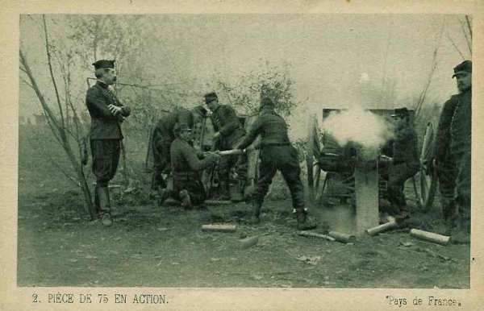
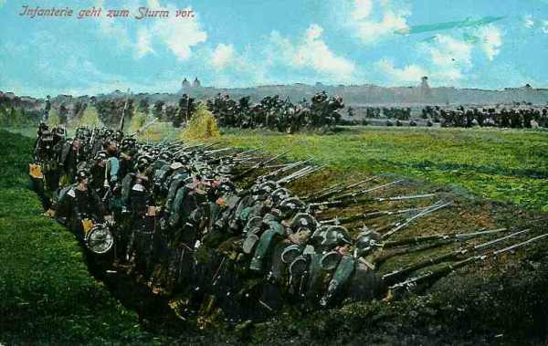

# Le 17 septembre 1914

Comme l’armée de Maunoury a échoué dans sa tentative de déborder l’aile droite allemande, Joffre crée la IIe armée dans la région d’Amiens en prélevant des troupes sur le reste du front. von Falkenhayn va tenter de mettre à profit cette situation en frappant au point le plus faible du dispositif français.

### G.Q.G.

Le G.Q.G., étant sans illusions sur les chances de l’armée Maunoury d’envelopper l’aile droite de von Kluck, décide de prolonger et d’amplifier la manoeuvre entre l’Oise et la Somme.

- Une nouvelle armée est créée dans ce but : l’ordre particulier n° 31 stipule que : « Une armée, placée sous le commandement du général de Castelnau, et dénommée IIe armée, est constituée dans la région au sud d’Amiens.
Elle comprendra :
  le 13e C.A.
  le 4e C.A. (y compris les trois brigades marocaines).
  le 14e C.A., qui débarquera dans la région de Clermont - Beauvais.
  le 20e C.A., qui débarquera dans la région de Poix - Grandvillers - Aumale - Froissy à partir du 20 septembre
  le C.C. Conneau (1e, 5e, 8e, 10e D.C.).

Deux des D.C. (1e et 5e) doivent opérer dans la région de Péronne, les deux autre (8e et 10e) sont en marche vers Compiègne, qu’elles atteindront vraisemblablement le 20 septembre au soir.

La IIe armée sous Nancy est dissoute. Le C.C. Conneau couvrira la concentration de la IIe armée ».

Joffre lance entre l’Oise et la Somme 160.000 combattants d’élite.

**[Lien vers carte](../img/champ_bataille_aisne.jpg)**

### IIIe et IVe armées françaises

L’attitude reste défensive. Le 8e C.A. est à Lamorville (nord de Saint-Mihiel) et est dirigé sur Sainte-Menehould. Le 20e C.A. s’embarque en chemin de fer vers la région d’Amiens pour rejoindre la nouvelle IIe armée.

_Régiment français en Argonne_
_Collection privée_

### Ve armée française

Franchet d’Esperey compte prendre l’offensive dans la matinée du 17 avec les 18e et 1e C.A. C’est au contraire les Allemands qui entreprennent une violente attaque de Juvincourt vers Ville-aux-Bois.

La 38e brigade (Passaga) veut lancer une attaque de nuit vers Craonne et Corbény mais une partie des compagnies s’égare dans l’obscurité.

Le front de la 36e division est violemment attaqué, en particulier vers la ferme Hurtebise. En fin de journée, la division continue de tenir la croupe au nord-est de Craonnelle, le moulin de Vauclerc, Hurtebise.

### VIe armée française

La manœuvre d’enveloppement à effectuer par l’armée échoue définitivement car les Allemands se sont renforcés vers le nord.

La 37e division française, qui se trouve en flèche, est encerclée et ne pourra décrocher qu’au cours de la nuit, au prix de lourdes pertes.

La 5e D.C. veut aborder Saint-Quentin par l’ouest-sud-ouest. Le général Bridoux, tombé dans une embuscade, est mortellement blessé et les Allemands s’emparent de documents d’Etat-Major. Le général Buisson succède au général Bridoux et ramène les divisions dans leurs cantonnements dans la région de Péronne.

D’après l’ordre général n° 104, l’armée doit organiser le terrain conquis mais le 13e C.A. se heurte à une contre-offensive déclenchée vers la rive ouest de l’Oise. Ce C.A. est fixé sur un front partant de Beuvraigne, englobant le Bois des Loges, Canny et laissant Lassigny aux Allemands, pour atteindre l’Oise entre Pimprez et Ribécourt. C’est le front qu’il tiendra jusqu’à la retraite allemande en mars 1917.

La brigade marocaine enlève la partie nord de Carlepont sans pouvoir déboucher sur Laigle.

Sur le front du 4e C.A., les combats ont commencé vers 5h. Les Allemands prononcent une contre-attaque au nord-ouest de Carlepont. 10h : la 10e brigade française se replie à l’ouest de l’Oise.

12h30 : la 3e brigade marocaine et les troupes du 4e C.A. doivent évacuer Carlepont.

Un ordre de la VIe armée prescrit au général Ebener la retraite sur la ligne Bailly - Bois-Saint-Mard, front qui se maintiendra pendant plusieurs années.
Le reste de l’armée garde ses positions.

### IXe armée

Foch cherche à poursuivre l’offensive. L’effort principal serait effectué par les 18e et 42e divisions.
La 42e division est mise à la disposition du général Dubois et se rassemble à Baconnes. La préparation est confiée à trente-deux batteries de 75 et l’attaque doit déboucher entre 10 et 12h. Les divisions gagnent peu de terrain car les offensives contre des tranchées couvertes de fil de fer et protégées par une artillerie puissante n’ont aucune chance de succès.

_Canon de 75 en action_
_Collection privée_

### O.H.L.

Von Falkenhayn sait que Joffre prélève des troupes pour les porter vers l’aile gauche des armées. Il va tenter d’ entraver ce mouvement en retenant dans l’est une partie des forces françaises et en attaquant dans les Hauts-de-Meuse : il va ainsi déclencher la bataille de Saint-Mihiel (20 - 25 septembre).

### VIe armée allemande

L’armée, partie de Lorraine, vient prolonger la droite de la Ie armée (von Kluck) et permet de reprendre la manœuvre d’enveloppement.

_Infanterie allemande dans les tranchées_
_Collection privée_

### Armée anglaise

Les 17, 18 et 19, tout le front est violemment bombardé et le 1e C.A. constamment assailli mais l’offensive allemande est repoussée avec de grosses pertes.

### Armée belge

Une vive canonnade et fusillade éclatent à Dendermonde mais les Belges tiennent toujours la rive nord de l’Escaut. La 4e division, en réserve à Kontich, reçoit l’ordre de se porter à cheval sur l‘Escaut, de manière à pouvoir intervenir rapidement sur l’une ou l’autre rive.

[Lien vers la journée suivante](article_04_84.md)