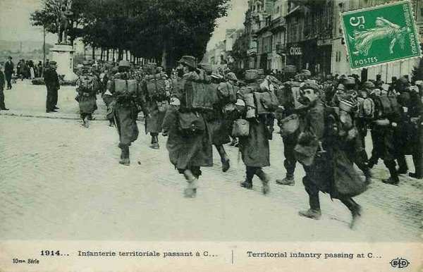
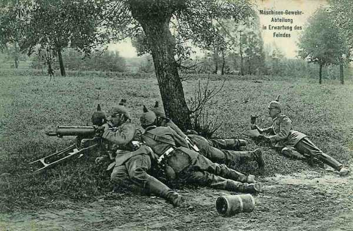

# Le 18 septembre 1914

Le point faible du dispositif français est les Hauts-de-Meuse, tenus uniquement par des troupes de réserve. C’est là que von Falkenhayn décide de lancer une offensive.

### G.Q.G.

Joffre envoie un télégramme à la Ie armée : « l’ennemi semble masser des forces importantes dans la région de Metz - Thionville dans l’intention probable d’intervenir sur le flanc droit de la IIe armée. La Ie doit se tenir prête à intervenir efficacement vers le nord. Elle  tiendra prête, aux environs de Nancy, une forte réserve, autant que possible un C.A. »

Le 14e C.A. est transféré de Bayon à Clermont - Beauvais.

**[Lien vers carte](../img/champ_bataille_aisne.jpg)**

### Ie armée française

Un télégramme chiffré du Q.G. prescrit de tenir le 16e C.A. prêt à embarquer pour l’ouest. Dubail le dirige sur la Moselle, entre Charmes et Epinal. A dater du 19, la Ie armée aura à couvrir seule un front immense, de la Suisse à Pont-à-Mousson.

### IIe armée française

La IIe armée est dissoute pour aller se reconstituer vers Amiens. Le 8e C.A. passe à la IIIe armée, qui devra prendre, le 21, l’offensive dans la région de Spincourt. Les divisions de réserve (3e groupement, général Pol Durant) restent sur les Hauts-de-Meuse, le 8e C.A. porte une de ses divisions dans la Woëvre, vers Woël.

Les Hauts-de-Meuse ne sont donc plus tenus que par un groupe de divisions de réserve, étalé sur un large front entre les routes Verdun - Metz et Saint-Mihiel - Pont-à-Mousson, et par la 7e D.C. à sa droite.
Le secteur de la Woëvre méridionale est placé sous le commandement de Dubail, après le départ de Castelnau pour la Picardie.

_Infanterie territoriale_
_Collection privée_

### Ve armée française

Elle continue à renforcer sa gauche au détriment de sa droite qui perd le 10e C.A., placé en réserve générale dans la région de Fismes. Au cours de la nuit du 17 au 18, le 3e C.A. perd le château de Brimont et se voit refoulé jusqu’à la route Reims - Laon. La situation de la Ve armée devient difficile : de fortes colonnes allemandes sont en marche entre Chamouille, Vendresse et Paissy. On prévoit une grosse attaque pour la matinée du 19 sur la droite anglaise et la gauche du 18e C.A.

### VIe armée française

Le1e C.C. reste dans ses cantonnements. Le général Buisson constate que les chevaux d’artillerie sont tellement épuisés qu’ils sont incapables de gravir une côte au pas ou de trotter sur les routes en terrain horizontal. Il estime qu’un arrêt de huit jours serait nécessaire.

Un ordre de Joffre prescrit de garder une attitude défensive sur le front Soissons - Vic -Tracy-le-Val - Bailly pendant la formation de la nouvelle IIe armée (4e, 13e, 14e, 20e C.A. et deux C.C.), qui se concentre au nord-ouest de Noyon afin d’opérer contre le flanc allemand. Cet ordre constate l’échec de l’offensive sur l’Aisne.

Un peu avant midi, un ordre parvient à la VIe armée (n° 119) selon lequel le 4e C.A. sera transféré au sud-ouest de Compiègne.

Le 7e C.A. et le groupe de Lamaze ont reçu l’ordre de maintenir leurs positions sur l’Aisne.

### O.H.L.

Von Falkenhayn prépare une offensive vers les Hauts-de-Meuse, tenus par un groupement de divisions de réserve, point faible de l’armée française.
Armée anglaise
La nuit du 17 au 18 septembre est marquée par plusieurs attaques allemandes contre la 1e division à l’extrême droite.

### VIe armée allemande

- Le mouvement de l’armée commence pour déborder les alliés. Elle fait mouvement à partir de Metz vers Saint-Quentin -soit via Trier - Aachen - Liège - Bruxelles - Mons
  soit via Thionville - Luxembourg - Namur - Bruxelles - Mons.

Rupprecht de Bavière gagne Luxembourg en soirée. Sa mission est de refouler l’infanterie française apparue entre Roye et Montdidier en mettant en ligne le 21e C.A. Il doit ensuite envelopper la gauche française. von Falkenhayn lui demande  d’engager les C.A. au fur et à mesure de leur arrivée, ce qui provoque des protestations de sa part.

_Section de mitrailleurs allemands_
_Collection privée_

### Armée belge

A l’aube, les éléments avancés de la 4e division bordent la Durme. La division doit défendre la ligne de la Durme, de Tilrode à Waasmunster. Pour empêcher l’artillerie allemande de s’établir par surprise à  distance de tir convenable des forts, les divisions reçoivent l’ordre de pousser leurs gardes sur la ligne Buggenhout - Bonheiden - Londerzeel - Geerdegem - Muyzenstraat - Putte - Hellebrug - Boeven - Grobbedonk.

[Lien vers la journée suivante](article_04_85.md)