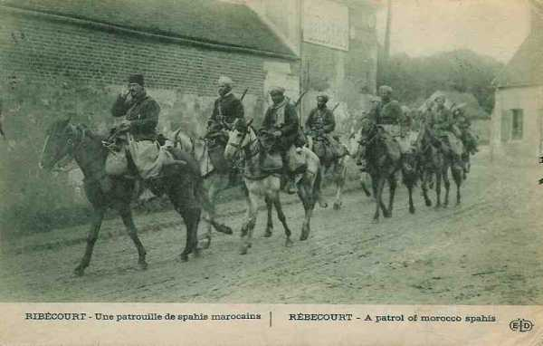
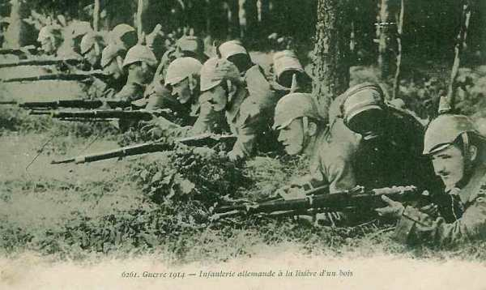

# Le 19 septembre 1914

### G.Q.G.

Joffre signale qu’un détachement britannique, débarqué à Calais et Dunkerque, agit sur les communications allemandes vers Valenciennes - Aulnay - Maubeuge.

Il émet l’instruction particulière n° 32 aux IIe, VIe armées et au groupement de divisions territoriales. La IIe armée (qui se trouve à l’extrême gauche du dispositif allié) doit agir contre l’aile droite allemande afin de dégager la VIe armée. Il doit conserver une direction de marche débordante par rapport aux unités allemandes et s’élever sans cesse contre le flanc allemand pour le menacer d’enveloppement.

**[Lien vers carte](../img/champ_bataille_aisne.jpg)**

### IIIe armée française

Vers 13h, un ordre du G.Q.G. prescrit que le 8e C.A. gagne les quais d’embarquement dans les gares de Saint-Mihiel, Sampigny et Lérouville. Le C.A. cesse d’appartenir à la IIIe armée.

_Spahis à Ribecourt_
_Collection privée_

### O.H.L.

Von Falkenhayn donne l’ordre suivant : « l’armée allemande avance sur tout le front. Les Ie et VIIe armées doivent continuer l’offensive en cours. »

Cet ordre se heurte à un scepticisme général chez les exécutants, puis von Falkenhayn doit réviser ses ordres : les Ve, IVe et VIIe armées se contenteront d’occuper leurs positions. Seules les IIe, VIe et Ie armées s’efforceront de progresser entre Reims et Compiègne. Or, dans ce secteur, l’épuisement des unités est grand et von Bülow n’agit pratiquement pas.

_Infanterie allemande à la lisière d’un bois_
_Collection privée_

Les attaques déclenchées le 16 contre le centre allié cessent définitivement.

### Ve armée allemande

Les C.A. de von Stranz se mettent en place sur leurs positions de départ pour l’attaque des Hauts-de-Meuse : Etain (33e division), Fresnes-en-Woëvre (5e C.A.), Thiaucourt (3e C.A. bavarois), nord de Pont-à-Mousson (14e C.A.). Le secteur n’est défendu que par le seul groupe de divisions de réserve sous le commandement du général Pol Durand, étalé sur un large front entre les routes Verdun - Metz et Saint-Mihiel - Pont-à-Mousson, et par la 7e D.C. à leur droite. Le secteur de Woëvre méridionale est passé sous le commandement de Dubail au départ de Castelnau pour la Picardie.

### VIe armée allemande

Les C.A. de Rupprecht de Bavière commencent à s’embarquer pour la région de Maubeuge.

### Armée belge

Le commandement belge reprend le projet d’entraver par tous les moyens possibles les transports de troupes et décide d’organiser sept détachements de 100 cyclistes volontaires chargés de détruire tunnels, remblais, aiguillages etc...