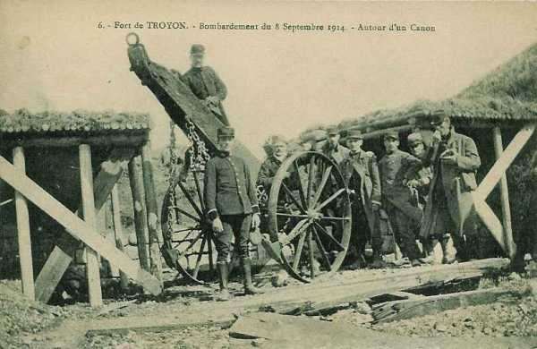
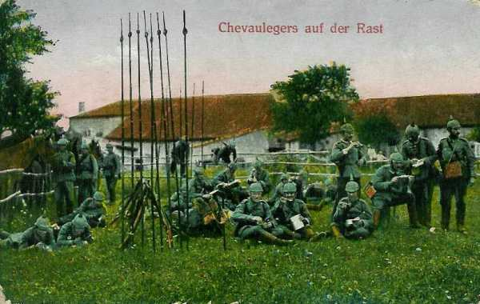
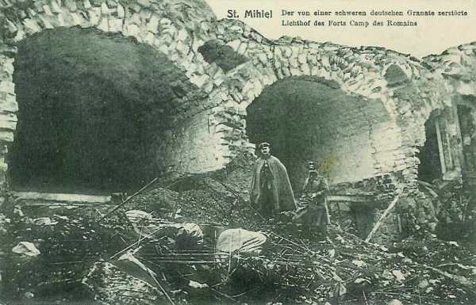
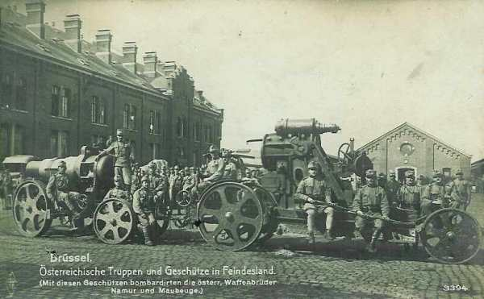
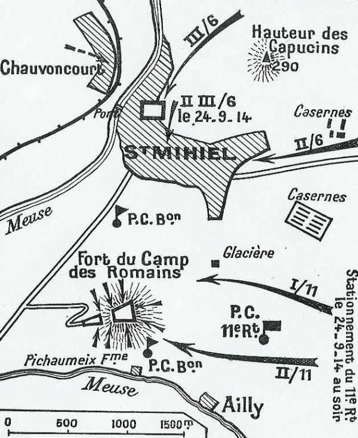
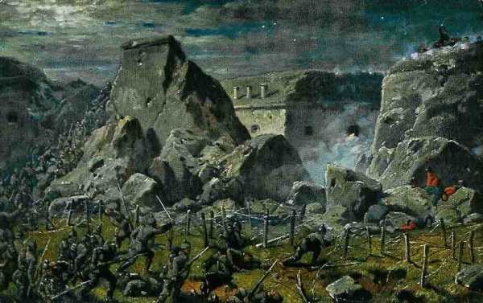

# Bataille des Hauts de Meuse (18 - 25 septembre 1914)

Alors que les armées s’enlisent dans les tranchées, le général von Gebsattel tente un coup contre les faibles défenses des Hauts de Meuse, au sud de Verdun. Il réussit à refouler les troupes françaises, et crée le "saillant de Saint-Mihiel", qui aura de lourdes conséquences au détriment de l’armée française.

### Cadre de la bataille

Après les batailles de la Marne, du Grand Couronné de Nancy et de la Trouée de Charmes, l’armée allemande a été refoulée et la guerre de positions commence pour quatre ans. Toutefois, les Allemands tentent encore une offensive au sud de Verdun afin d’isoler cette place forte.

### Le terrain

**[Lien vers carte](../img/hauts_de_meuse.jpg)**

De Dun-sur-Meuse à Commercy, la Meuse est bordée à l’est par une ligne de hauteurs connues sous le nom de Hauts de Meuse. Une plaine s’étend au pied et à l’est de ces hauteurs, qui la dominent de 100 à 150 m : c’est la Woëvre. Elle est limitée au nord par la dépression de l’Orne et au sud par le ruisseau tortueux et profond du Rupt de Mad, affluent de la Moselle, près de Metz.

Les faibles dépressions de ce sol argileux et uniforme
sont facilement transformées en étangs, dont le plus profond est celui de Lachaussée, qui mesure plusieurs kilomètres.

De faibles pluies rendent la circulation dans les champs très difficile. Dans ces conditions, la possession des routes et surtout des carrefours est de première importance. Conflans-en-Jarnisy est le centre ferroviaire de la Woëvre.

Presque tous les ravins qui s’élèvent de la Woëvre vers les Hauts de Meuse  sont traversés par des routes donnant sur un plateau boisé. La plus importante de ces voies entre Verdun et Commercy est celle qui passe par la trouée de Spada pour aboutir à Lacroix-sur-Meuse.

Les Hauts de Meuse sont constitués par un plateau entièrement boisé dont les pentes sont beaucoup plus raides vers la Woëvre que vers la Meuse. La largeur de ce plateau est variable : de 2,5 km à Commercy jusqu’à 15 km à hauteur d’Hattonchâtel. Elle n’est que de 8 km devant Saint-Mihiel et de 9 km à l’est de Verdun.

Les promontoires du plateau des Hauts de Meuse sur la Woëvre fournissent de nombreux observatoires vers la plaine.

La Meuse et l’Aire coulent sensiblement dans la même direction générale vers le nord-ouest et sont séparées par une zone de 20 à 30 km de largeur. Le sommet de Montfaucon est le point dominant dans la partie nord, suivi de la butte du Vauquois. A l’ouest de l’Aire s’étend la forêt de l’Argonne.

### Les défenses françaises

Pour la défense de la frontière, la général Séré de Rivière a créé une ligne de forts tenant l’intervalle entre les places fortes de Toul et de Verdun. Ces forts, à l’exception de celui de Liouville, n’ont pas reçu, depuis leur construction, en 1880 aucun des renforcements nécessités par l’emploi des gros obus explosifs.

Considérant que les effectifs utilisables en couverture seront insuffisants pour permettre la défense active des Hauts de Meuse, la ligne de la Meuse, flanquée par des forts, a été choisie comme position de défense. Les forts de Troyon, Génicourt, du Camp des Romains sont placés sur le versant occidental des Hauts de Meuse, les forts de Liouville et de Gironville, situés sur le bord oriental du plateau, font face à la Meuse.

### Les forces en présence

**Armée française**

**10e C.A. (Rennes) : général Defforges**

_Général Defforges_

19e division : général Bonnier

| Unité | Commandant | Régiments |
| --- | --- | --- |
| 37e brigade | Bailly | 48e R.I. (Guingamp)71e R.I. (Valenciennes) |
| 38e brigade | Rogerie | 41e R.I. (Rennes)70e R.I. (Vitré) |
| Elements divisionnaires |  | 13e régiment de hussards (un escadron - Dinan)7e R.A.C. (Rennes) |

**Armée allemande**

_Général von Stranz  (5e C.A.)_
_Collection privée_

- Détachement von Stranz constitué des
  5e C.A. prussien (von Stranz) : 9e et 10e divisions, quatre brigades de la Landwehr, des mortiers de 21cm et des pionniers.

_Général von Gebsattel (3e C.A. bavarois)_
_Collection privée_

- 3e C.A. bavarois, (von Gebsattel) qui passe de la VIe armée à la Ve armée. : 5e et 6e divisions, une division d’ersatz et quatre mortiers de 30,5 cm
  La D.C. bavaroise
  La 33e division de réserve, provenant de la garnison de Metz.
  14e C.A. (badois)
  18e C.A. (à partir du 18 septembre)

### 30 août

La Ve armée allemande venant du nord-est franchit la Meuse bien au nord de Verdun, sa zone de marche étant à l’ouest de cette ville. A ce moment, l’O.H.L., craignant une offensive partant de cette ville, prescrit à la Ve armée de laisser sur la rive droite de la Meuse le 5e C.A. prussien (von Stranz) pour parer à toute éventualité.

### 1e septembre

La IIIe armée française reçoit un ordre de retraite après l’échec de la bataille des frontières :
« La IIIe armée effectuera son mouvement à l’abri des Hauts de Meuse ».

Le 3e groupe de divisions de réserve passe sur la rive gauche de la Meuse pour prendre part à la bataille de la Marne, ce qui rend la région dégarnie de troupes. Par précaution, les ponts de la Meuse sont détruits.

### 2 septembre

La Ve armée est engagée vers Montfaucon et des mesures sont prises pour assurer l’investissement de la place de Verdun par des formations de réserve. L’O.H.L. décide que, pour couper les relations entre Verdun et la vallée de la Meuse, il faut s’emparer des forts de Troyon, des Paroches et du Camp des Romains. Le 5e C.A. est chargé de cette mission et reçoit à cet effet un important détachement d’artillerie à pied (Fussartillerie) équipé de mortiers de 21 cm.

### 8 septembre

**17h45 :**

Le feu est ouvert sur le fort de Troyon par deux batteries d’obusiers de 21 cm auxquels deux mortiers autrichiens de 30,5cm se joindront plus tard.

_Fort de troyon après bombardement_
_Collection privée_

### 9 septembre

**En matinée**

Le général von Stranz fait sommer le commandant du fort de Troyon de se rendre. Devant son refus, le bombardement reprend.

### 10 septembre

**En matinée**

Les Allemands donnent l’assaut au fort de Troyon. L’artillerie du fort est réduite à six canons de petit calibre, mais l’assaut peut être repoussé.

L’O.H.L., désirant en finir avec la résistance française sur les Hauts de Meuse, constitue sous les ordres du général von Stranz un détachement d’armée dont la mission est de « Bloquer la forteresse de Verdun pour empêcher les sorties et tenir le reste des forces prêtes pour rendre impossible toute tentative de percée entre Metz et Verdun. »

### 11 septembre

Moltke décide d’abandonner le projet de percée à travers le front des ouvrages fortifiés français. La division engagée contre le fort de Troyon est ramenée en arrière.

### 12 septembre

Von Falkenhayn est convoqué par l’empereur pour remplacer von Moltke.

### 14 septembre

Von Falkenhayn succède à von Moltke comme chef de l’O.H.L. Il estime que la prise de Verdun serait une garantie pour la possession du bassin de Briey, riche en minerais.

### 15 septembre

Von Falkenhayn rédige un plan d’opérations. Il fixe la mission de la Ve armée, et plus particulièrement celle du détachement von Stranz.

« A partir du 18 septembre, l’offensive doit se déclencher par échelons en commençant par la Ve armée. Celle-ci doit progresser de part et d’autre de Verdun, son aile gauche contre les forts de Troyon et du Camp des romains, son aile droite par Sainte-Ménehould.

Verdun doit être investi par le sud-ouest. Le 14e C.A. (badois) sera mis en marche vers le sud de Metz, il arrivera le 18 au matin. Il sera également placé sous les ordres du général von Stranz. L’attaque doit atteindre Bar-le-Duc. Verdun serait complètement isolé ».

### 16 septembre

Le général von Stranz rend compte de son plan d’attaque des Hauts de Meuse. Il se propose de le faire exécuter dès le 17 septembre.

- La 33e division de réserve maintient l’investissement de Verdun à l’est.

- Le 5e C.A. attaque le fort de Troyon.

- Le 3e C.A. bavarois s’emparera de Saint-Mihiel et du fort du Camp des Romains.

Des retards dans la mise en route de l’artillerie feront toutefois reporter l’opération au 18 septembre.

### 17 septembre

La IIe armée française est dissoute en Lorraine pour être reconstituée dans la région d’Amiens.

Le 3e groupe de divisions de réserve (65e, 67e et 75e divisions) passe sous les ordres du commandant de la IIIe armée française.

### 18 septembre

Le ciel est couvert, le temps est pluvieux et l’observation par l’aviation en est gênée. D’après les reconnaissances de cavalerie, les côtes de Meuse sont bien organisées et garnies d’artillerie lourde venue de Toul. Ces renseignements sont en fait inexacts.

L’ordre d’opérations du détachement d’armée von Stranz pour le 19 fixe la ligne à atteindre par les têtes d’avant-garde : la route de Fresnes-en-Woëvre à Thiaucourt.

- Les directions de marche sont :
  5e C.A. vers le fort de Troyon.
  3e C.A. bavarois vers Saint-Mihiel et le fort du Camp des Romains.

Le flanc gauche du 3e C.A. bavarois est couvert par le 14e C.A. dont l’axe de marche passe par Flirey, entre Apremont et Pont-à-Mousson.

### 19 septembre

**En soirée**

La ligne des avant-postes de la 6e division est à 800 m à l’ouest de la route Woël - Saint-Benoît. L’occupation de la ligne de couverture de l’artillerie et la mise en place de celle-ci doit avoir lieu dans la nuit du 19 au 20. La zone de marche des troupes est libre. L’artillerie du 3e C.A. bavarois sera en place le 20 au matin.

La marche s’exécute sous une pluie torrentielle et ne rencontre aucune résistance.

Le 8e C.A. français se retire et fait place au 3e groupement de divisions de réserve. Celui-ci reçoit pour mission de garnir les Hauts de Meuse au sud de Verdun. Une seule division, la 75e, tient effectivement les Hauts de Meuse, les deux autres étant à l’est de Verdun.

La 75e division  doit occuper le front Thillot-sous-les Côtes - Creue inclus, en maintenant aux Eparges un détachement qui s’y trouvait déjà.

La défense des Hauts de Meuse se limite donc à une seule division de réserve, séparée des troupes de la défense de Toul par un vide de +- 20 km. Cette division, dont le front s’étend sur 12 km, devra affronter deux C.A. allemands. Son effectif est réduit à cinq régiments, soit en tout 7.500 hommes, car l’un d’eux et une batterie ont été détachés aux Eparges.

### 20 septembre

**A l’aube**

Les batteries lourdes allemandes sont en place face à l’ouest sur un front de 20 km, au nord de la ferme de Sébastopol. L’ouverture du feu est fixée à 9h30, puis reportée d’une heure en raison du mauvais temps. Dès l’ouverture du feu, la surprise des Français sera complète.

Le commandant du 3e C.A. bavarois, le général von Gebsattel, estime qu’il faut saisir l’occasion pour s’emparer des Hauts de Meuse sans coup férir et lance l’ordre d’attaque.

**A minuit**

La 6e division bavaroise atteint la route du bas des Côtes et commence à encercler Vigneulles à l’est et à l’ouest.
La 5e division de cavalerie bavaroise rencontre des éléments de cavalerie française qui n’offrent pas de résistance sérieuse.

_Chevau-légers bavarois_
_Collection privée_

Le succès allemand aurait pu être plus grand si les 5e et 14e C.A. avaient appuyé le 3e C.A. bavarois, ce qui indique un défaut d’entente entre Bavarois, Prussiens et Badois.

**Nuit du 20 au 21**

Le 3e C.A. bavarois continue son attaque alors que le 5e C.A. prussien attend l’aube du lendemain.
La 6e division bavaroise réussit à enlever les localités au bas des côtes, âprement défendues (Viéville, Hattonchâtel, Vigneulles) où a lieu un combat de rues. Les Allemands doivent traîner un canon à bras jusqu’à l’entrée de Vigneulles pour tirer à bout portant sur les points de résistance.

### 21 septembre

L’ordre du général von Stranz prescrit au 5e C.A. prussien et au 3e C.A. bavarois d’occuper la bordure orientale des côtes et de progresser suffisamment pour mettre en place l’artillerie chargée de bombarder les forts.

L’artillerie française, tirant en direction de Combres, cause des pertes sérieuses au 5e C.A. prussien. Ce dernier atteint une ligne passant par Combres, Saint-Rémy et Deuxnouds.

**7h15 :**

Le commandant de la IIIe armée envoie un compte rendu au G.Q.G.
« 75e division violemment canonnée dans l’après-midi du 20, a été attaquée à la tombée de la nuit ».

**En soirée**

La 75e division est menacée d’être tournée sur ses deux ailes par les C.A. allemands et recule en combattant vers la trouée de Spada. Elle stationne entre Spada et la Meuse.

La 67e division française de réserve, stationnée à l’est de Verdun, a reçu l’ordre de venir prolonger au sud la 75e division. Mise en route le 21 au matin, elle arrive au contact avec les Allemands.

L’attaque allemande n’a pas encore atteint les positions d’artillerie prévues pour le bombardement des forts. C’est l’objectif pour la journée du 22.

**18h :**

Les commandants des Ie et IIIe armées françaises donnent les premiers ordres pour réagir contre l’attaque des Hauts de Meuse.

Le commandant de la IIIe armée (général Sarrail) prescrit au 6e C.A. de déclencher le 22 septembre à 05h des attaques contre la position allemande Combres - Les Eparges, en direction de Mouilly et vers  Deuxnouds  - Chaillon (localités au nord du secteur du 3e C.A. bavarois).

Le 6e C.A. est à l’est de Verdun, soit à 50 km du lieu des attaques prescrites.

A la Ie armée, le 16e C.A. est disponible. Il reçoit l’ordre d’attaquer les Allemands dans la Woëvre méridionale.

Vu la distance par rapport à la zone d’offensive du 3e C.A. bavarois, l’engagement des 6e et 16e C.A. français se présente dans des conditions peu favorables.

L’attaque des Français vers le bois de Selouze aura pour effet que ceux-ci le conserveront tout au long de la guerre.

Joffre fait diriger vers Saint-Mihiel le 8e C.A., qui est en réserve à Sainte-Ménehould.

### 22 septembre

La 10e division allemande forme l’aile droite de l’offensive. Elle progresse mais une contre-attaque française lui fait perdre une partie de son avance.

La gauche du 5e C.A. atteint la lisière sud du bois de Seuzay, mais des feux de flanc de l’artillerie française gênent le mouvement des troupes. En outre, des renseignements signalent la présence de gros rassemblements français au nord de Génicourt, puis à Rupt et à Spada.

Dans ces conditions, le commandant du 5e C.A. se propose de regrouper ses forces sur les Hauts de Meuse et de reprendre l’opération le lendemain.

**08h :**

La 6e division (3e C.A. bavarois) est mise en route sur plusieurs colonnes. Les chemins sont détrempés et le brouillard masque la vue. Quand celui-ci se dissipe, l’on aperçoit une longue file de tirailleurs français dans la direction de Lacroix-sur-Meuse (deux régiments).

A ce moment, la liaison du 3e C.A. bavarois avec le 5e C.A. prussien n’est pas assurée et celui-ci est menacé d’enveloppement de son aile droite.

**13h20 :**

Un régiment du 5e C.A. prussien  arrive au bois de Lamorville et rétablit la situation.

Le reste du 3e C.A. atteint sans combat ses objectifs fixés et jalonne la ligne de couverture des positions d’artillerie à la lisière occidentale des bois des Hauts de Meuse.

Quant à  la liaison avec le 14e C.A. (badois), elle s’effectue vers Seicheprey.

**En soirée**

Les résultats les plus importants de cette journée sont obtenus par la 6e division, aile droite du 3e C.A. bavarois. L’artillerie de bombardement est mise à la disposition de cette division :

- Contre le fort des Paroches : un bataillon d’obusiers lourds de campagne et une batterie de canons de 10 cm.

- Contre le fort du Camp des Romains : un bataillon d’obusiers lourds de campagne, un bataillon de mortiers de 21 cm, une batterie de canons de 10 cm et une batterie et demie (trois pièces) de mortiers de côte (28 cm).

_Dégâts au fort du Camp des Romains_
_Collection privée_

- Contre le fort de Liouville : un bataillon de mortiers et une batterie motorisée autrichienne de 30,5 cm.

**Nuit du 21 au 22**

La mise en place de l’artillerie de siège s’avère difficile en raison des mauvais chemins. Un seul mortier de 38 cm, marchant en tête de colonne, pourra ouvrir le feu le 23.

### 23 septembre

**En matinée :**

Le général von Stranz vient conférer avec von Gebsattel au sujet de l’attaque du fort du Camp des Romains. Celui-ci est mûr pour l’assaut : une brèche sur le front nord-est est visible. La côte Sainte-Marie a été occupée sans combat la nuit précédente et la forêt d’Apremont est trouvée vide de défenseurs.

Les ordres sont donnés pour une attaque brusquée et immédiate :

La 12e brigade (6e division) a le fort pour objectif. Elle est couverte à droite par la 11e brigade, à gauche par la 5e division. Les régiments sont immédiatement poussés sur les hauteurs des Capucins.

A l’aile gauche de la IIIe armée française, les progrès allemands sont importants.  Varennes tombe entre leurs mains.

A l’aile droite des armées françaises, sur les Hauts de Meuse, le 6e C.A., aidé par des divisions de réserve, exécute une série d’actions offensives. Ces attaques semblent une menace pour le 5e C.A. prussien qui reste fixé sur place.

Pendant ce temps, le commandant de la Ie armée française (général Dubail) fait entamer une attaque mais les Allemands prennent le devant, ce qui provoque le recul partiel du 16e C.A. français.

**15h15 :**

La lisière de Saint-Mihiel est atteinte : une compagnie franchit la Meuse et se porte vers Chauvoncourt.

**En soirée :**

Des rassemblements français sont signalés dans le triangle Lacroix-sur-Meuse - Maizey - Lamorville.
Pendant que le bombardement des forts se poursuit, la résistance française s’accentue. Une attaque de la 11e brigade bavaroise est arrêtée vers Lamorville, mais cette brigade réussit finalement à s’emparer de la localité.

_Mortiers autrichiens de 305  mm_
_Collection privée_

Le commandant de la Ie armée (général Dubail) estime qu’une remise en ordre des unités mélangées est nécessaire et il prescrit d’organiser le terrain. L’entrée en ligne du 8e C.A. est prévue pour le 24. Une de ses divisions est dirigée à l’ouest de Verdun, l’autre, la 16e doit se porter à l’attaque entre Apremont et Bouconville.

Un ordre du général Sarrail prescrit pour le 24 une attaque sur la Woëvre entre Apremont et Bouconville. Tout le 8e C.A. doit y être engagé, puis cet ordre est modifié : la 15e division est envoyée vers le nord. Sa mission est de former entre Meuse et Argonne un repli derrière la gauche de la IIIe armée vivement pressée par les Allemands. La 15e division va devoir couvrir entre le 23 et le 24 une moyenne de 75 km.

### 24 septembre

Les premières lignes de tirailleurs allemands, arrivées à hauteur de la cote 294 ouvrent le feu sur les tirailleurs français mais l’artillerie française réplique.

**13h :**

Les tirailleurs français attaquent de flanc la 11e brigade mais sont arrêtés par des feux de mitrailleuses. L’arrivée du 47e I.R. prussien au bois de Selouze dégage ce coin du champ de bataille. Le régiment est pris à partie par l’artillerie française et perd 520 hommes.

La situation de la 11e brigade reste critique.

**Dans l’après-midi :**

Les Allemands s’approchent du fort du Camp des Romains. Tous les commandants de compagnie reçoivent une notice détaillée sur l’ouvrage.

_Attaque du fort du Camp des romains_

**18h :**

Le 11e régiment bavarois, précédé d’une ligne de tirailleurs, se met en mouvement. L’artillerie du fort ouvre le feu sur les troupes en marche sans pour autant les gêner. Les premiers éléments arrivent à 1500 m du fort quand le régiment est rejoint par une compagnie de pionniers pourvu de matériel d’escalade (échelles, cordages).

Une petite colonne est poussée vers l’avant mais elle est plaquée au sol par des feux partis du fort. L’assaut est reporté au 25 septembre à 05h30 : il y aura huit colonnes d’assaut, réparties sur les fronts nord, sud et est. Chaque colonne comprendra un détachement de pionniers. L’artillerie sera amenée à bras d’hommes et aura pour mission d’ouvrir des brèches dans les réseaux de fil de fer.

**En soirée :**

Le commandant de la 6e division allemande prescrit à la 11e brigade de se porter en avant vers la côte Sainte-Marie, au nord de Saint-Mihiel pour refouler les Français sur la Meuse, mais finalement, cette brigade reprend ses positions de départ de la veille.

Le combat de Spada a été meurtrier pour les deux régiments allemands : l’un a perdu 706 hommes et l’autre 360 sur deux bataillons, mais les pertes à Spada ne détournent pas le commandant du 3e C.A. bavarois de son objectif : il prépare dans le plus grand détail l’attaque du fort du camp des Romains.

L’importante position du Vauquois reste aux mains des Allemands. Les troupes dans la région de Spada se replient vers Lacroix-sur-Meuse et les débris de la 75e division de réserve repassent sur la rive gauche de la Meuse, ce qui permet aux Allemands d’occuper Saint-Mihiel.

**A minuit :**

Le commandant de brigade d’assaut du fort du Camp des Romains (12e brigade) reçoit des rapports peu encourageants : l’ouvrage du Camp des Romains paraît solidement occupé. Le commandant maintient ses ordres.

### 25 septembre : chute du fort du Camp des Romains

**03h :**

Le tir d’artillerie allemand contre le fort du camp des Romains reprend : obus de 28 cm.

**05h29 :**

Les derniers obus tombent sur le fort et l’infanterie monte à l’assaut. Les échelles sont appliquées à la contrescarpe et les assaillants descendent dans le fossé. Ils reportent ensuite leurs échelles contre l’escarpe et grimpent sur le rempart. Un aboiement de chien déclenche une fusillade générale.

**05h45 :**

Le fossé nord du fort est franchi et les assaillants sont maîtres du rempart. La garnison française se défend dans les casemates. A la même heure, deux colonnes attaquent le front sud et franchissent le fossé. La lutte se développe contre les défenseurs des abris de superstructure. Bientôt, les colonnes d’attaque nord et sud se rejoignent

_Assaut du fort du Camp des Romains_
_Collection privée_

Le général de brigade envoie un renfort vers le front est. Un lieutenant parvient à l’entrée d’un souterrain où se trouvent des Français. Les ayant sommés de se rendre, un lieutenant français lui répond que le commandant du fort est prêt à négocier la reddition. Le texte de la capitulation est notifié au commandant du fort et est approuvé par le chef de bataillon bavarois.

La garnison sera prisonnière de guerre. Les officiers garderont leur épée et les honneurs militaires seront rendus à la garnison à son départ.

**8h30 :**

La sonnerie « cessez le feu » retentit.

**15h :**

La garnison défile devant le général commandant de la 6e division bavaroise. Les troupes allemandes présentent les armes.

Le fort n’avait pas été renforcé et ne disposait d’aucun abri bétonné ; il n’existait ni tourelles ni batteries cuirassées ou bétonnées, ni d’observatoires bétonnés. Il n’était donc pas à même de résister longtemps à un bombardement par l’artillerie lourde dont disposent les Allemands.

### Conclusion

Le succès allemand est dû à l’audace du général bavarois von Gebsattel, mal épaulé sur ses flancs à cause de la mésentente avec le commandant du 5e C.A. prussien. Il s’est rendu compte qu’un front de 12 km n’était occupé que par une division de réserve et il y a porté son effort.

La route, la voie ferrée et le canal pour ravitailler Verdun sont aux mains des Allemands. Lors de la bataille de Verdun en 1916, les Français seront fortement gênés pour approvisionner la place forte, ne   disposant ni de voie d’eau ni de chemin de fer, il devront acheminer tout le ravitaillement par un petit chemin de fer « le Meusien » et par la route Bar-le-Duc - Verdun, que l’on appellera la « voie sacrée ».

Le général Joffre déploiera de vains efforts pour réduire le « saillant de Saint-Mihiel » et cellui-ci ne sera réduite qu’en 1918 par les troupes américaines.